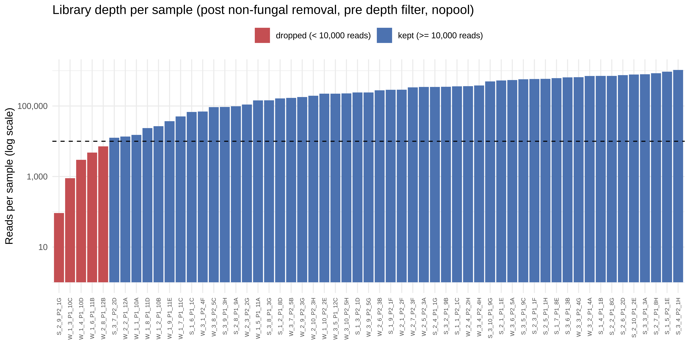
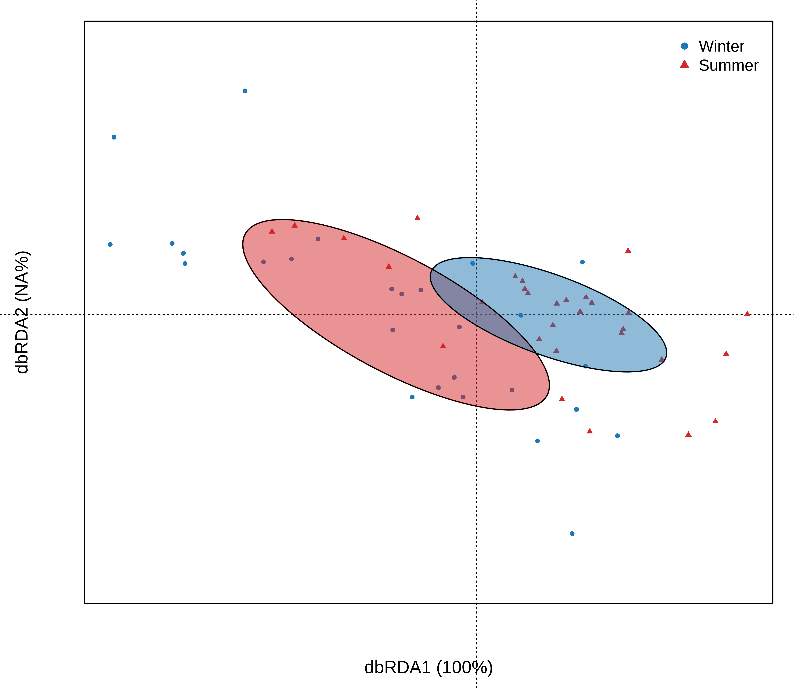
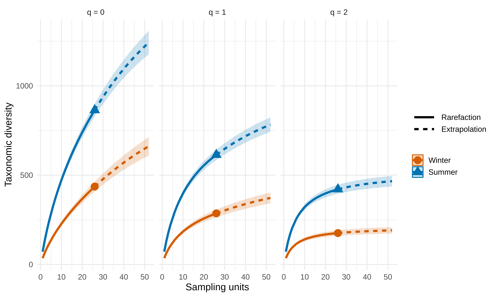
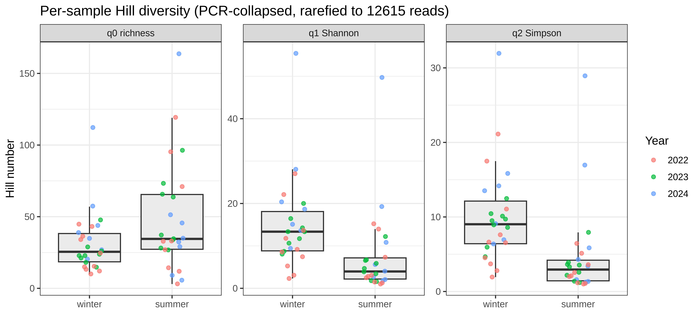

```{r}
#| include: false
if (knitr::is_html_output()) {
  knitr::opts_chunk$set(echo = TRUE)
}
```

## Overview and reproducibility

This document compiles methodological details, supplementary analyses, and reproducibility outputs supporting the main manuscript. It tests three preregistered hypotheses about the fungal community of willow ptarmigan dung across a seasonal contrast (winter vs. summer) replicated over three years (2022–2024):

-   **H1** — seasonal compositional turnover of the dung mycobiome, reproducible across years.
-   **H2** — higher summer alpha diversity, tracking the greater richness of the summer diet.
-   **H3** — some fungal OTUs covary tightly with specific diet plants (ingested), others diffusely (coprophilous/environmental); exploratory interest in taxonomically unresolved "dark taxa" and in *Sporormiella*/Sordariales as a herbivore-presence proxy.

Computationally intensive steps (DADA2 denoising, LULU curation, iNEXT3D diversity estimation, GLLVM and Bayesian model fitting, phylogenetic community-structure null models) were executed on a remote Ubuntu-based computing environment. Their outputs (figures, tables, and selected model objects) are integrated here as static results, with the generating code shown in collapsible drop-downs in the HTML version.

All figures (PNG) and result tables (CSV) are stored within the project repository under `Supplementary/figures/` and `Supplementary/tables/` using relative paths. Rendering this document therefore requires cloning the repository and opening the `.qmd` file from the `Supplementary/` directory.

::: callout-note
## Status of this appendix

The analyses in **Sections 2–5** are finalized: they were regenerated end-to-end from the corrected canonical dataset and independently checked. **Sections 6–9** (GLLVM, Bayesian diet-tracking, phylogenetic community structure, functional guilds) are placeholders for analyses that are computed but not yet finalized for the manuscript; each is flagged as such and will be integrated after review.
:::

**Data availability.**

Repository: [Ptarmigan_fungi](https://github.com/Ssangulo/Ptarmigan_fungi)\
Sequence data: ENA accession number *(to be assigned)*\
Metadata: `Data_S1_metadata.csv` *(field/season/year/individual keys)*

If viewing the PDF version of this Appendix, note that the HTML version exposes all code to reproduce these results through drop-downs.

------------------------------------------------------------------------

## Section 0: Setup {.unnumbered}

Output directory paths and shared aesthetic constants used throughout this document. All packages are loaded locally within each code section.

```{r setup}
#| eval: false
#| echo: !expr knitr::is_html_output()
#| code-fold: true

# Output folders used by table/figure chunks (relative to this .qmd)
out_fig_dir <- "figures"
out_tab_dir <- "tables"

# Season palette (Wong 2011, colorblind-safe): winter = cold blue, summer = warm orange
season_colors <- c(winter = "#0072B2", summer = "#D55E00")
season_labels <- c(winter = "Winter",  summer = "Summer")
season_levels <- c("Winter", "Summer")

# Season label mapping (lowercase raw -> display), used for all Season groupings
labs_map  <- c(winter = "Winter", summer = "Summer")
lvl_order <- c("Winter", "Summer")

# Shared base theme — main figures use a classic theme at base_size 12
# base_theme <- theme_classic(base_size = 12) + theme(...)
```

------------------------------------------------------------------------

## Section 1: Data and analysis objects {.unnumbered}

All downstream analyses draw on a small set of canonical phyloseq objects produced by `4_data_prep.R` and saved in `eco_analysis.RData` on the analysis server. Computationally intensive analyses were executed remotely; their outputs are stored under `tables/` and `figures/` and loaded/embedded as needed.

```{r load-objects}
#| eval: false
#| echo: !expr knitr::is_html_output()
#| code-fold: true

load("eco_analysis.RData")  # produced by 4_data_prep.R

# alldat        : named list (nopool / pool / pspool). Primary analysis object.
#                 PCR replicates COLLAPSED by summing; non-fungal OTUs removed;
#                 taxonomy cleaned; depth filter >= 10,000 reads/sample.
#                 alldat$nopool = 52 samples (canonical object for PERMANOVA,
#                 dbRDA, iNEXT3D, dominance).
# alldat.rfy    : same as alldat but rarefied to the minimum depth (12,615 reads);
#                 used where even sampling effort is required (per-sample hillR).
# alldat_full   : one row per PCR replicate (never collapsed), pass-through depth
#                 threshold; for GLLVM / mixed-model work where PCR replicate is an
#                 explicit random effect (read-count offset, not rarefaction).
#
# The non-pooled (independent per-sample) DADA2 inference strategy ("nopool") is
# primary throughout, matching the numbered pipeline scripts.
```

## Section 2: Bioinformatics summary and study design

### 2.1 Study site and sampling design

Willow ptarmigan (*Lagopus lagopus*) faecal samples were collected at Lifjellet (Lierne municipality, Trøndelag, Norway) across a seasonal contrast — **winter** (March, snow-covered, browse-dominated diet) versus **summer** (June, green forage available) — replicated over three years (2022, 2023, 2024). The design is a Season × Year factorial, with repeated sampling of individually identifiable birds (microsatellite-confirmed where possible). Approximately 60 dung samples passed processing, of which \~31 have paired plant ITS2 diet data used for the H2 diet-richness mechanism (Section 7).

Each biological dung sample was amplified in two independent PCR replicates. DNA extraction, ITS2 amplification, demultiplexing (sabre), primer trimming (cutadapt), denoising (DADA2, non-pooled inference), and post-clustering curation (LULU) followed the workflow in `Scripts/1_demultiplexing.R`–`Scripts/3_taxonomic_assignment.R`; taxonomy was assigned against the UNITE reference (naïve Bayes, `minBoot = 80`). Negative, no-template, and extraction-blank controls were sequenced alongside samples and used for contaminant removal in `Scripts/4_data_prep.R`.

**Table S1**: Season × Year sampling design *(placeholder — final per-cell sample counts to be inserted from the metadata table).*

|                    | 2022 | 2023 | 2024 | Total |
|--------------------|------|------|------|-------|
| **Winter (March)** | –    | –    | –    | –     |
| **Summer (June)**  | –    | –    | –    | –     |
| **Total**          | –    | –    | –    | –     |

### 2.2 Read and OTU tracking through the pipeline

This section reports read and OTU retention through each processing step for the primary `nopool` strategy. Raw-FASTQ and post-demultiplexing (sabre) counts were not logged during the original run and are not reconstructed here (this would require rescanning \~39 GB of raw FASTQ for a check of secondary interest); the earliest quantified checkpoint is reads entering DADA2's quality filter, immediately after cutadapt primer trimming. For the first five rows, "Samples / wells" reflects PCR-well count before replicate collapsing (226 wells ≈ 113 samples × 2 PCR replicates, including a handful of control/blank wells later dropped); from the collapsing step onward it reflects biological dung samples.

```{r tab-tracking}
#| echo: false
library(knitr)
library(dplyr)

trk <- read.csv("tables/report_read_otu_tracking.csv", check.names = FALSE)
trk <- trk[trk$strategy == "nopool", ]

step_labels <- c(
  "post_cutadapt_input_to_filter"            = "Post-cutadapt (input to DADA2 quality filter)",
  "post_quality_filter"                       = "Post quality filter (filterAndTrim)",
  "post_merge_denoise"                        = "Post denoise + merge pairs (pre-chimera ASVs)",
  "post_chimera_removal"                      = "Post chimera removal (ASVs)",
  "post_LULU_curation"                        = "Post LULU curation (OTUs)",
  "pcr_collapsed_decontaminated_taxassigned"  = "PCR replicates collapsed, decontaminated, taxonomy assigned",
  "non_fungal_OTU_removal"                    = "Post non-fungal OTU removal (PlutoF)",
  "depth_filter_final (>=10,000 reads)"       = "Final analysis set (depth filter >= 10,000 reads/sample)"
)

first_reads <- trk$total_reads[1]
trk_out <- data.frame(
  `Pipeline step`        = step_labels[as.character(trk$step)],
  `Samples / wells`      = trk$n_samples,
  `OTUs (ASVs)`          = ifelse(is.na(trk$n_taxa), "—", format(trk$n_taxa, big.mark = ",")),
  `Total reads`          = format(round(trk$total_reads), big.mark = ","),
  `% of starting reads`  = sprintf("%.1f%%", 100 * trk$total_reads / first_reads),
  check.names = FALSE, row.names = NULL
)

kable(trk_out,
      caption = "Table S2. Reads and OTUs retained at each processing step (nopool strategy).")
```

**Figure S1**: Per-sample sequencing depth after non-fungal OTU removal, before the depth filter (57 samples). Five samples (four winter, one summer) fall below the 10,000-read cutoff and are excluded from the analysis-ready dataset (52 samples).



```{r}
#| eval: false
#| echo: !expr knitr::is_html_output()
#| code-fold: true
#| code-summary: "Code used to build the read/OTU tracking table and library-depth figure (report_prep_readtracking.R, executed on server)"

library(phyloseq)
library(dplyr)
library(ggplot2)

# ---- Post-cutadapt / filter / merge / chimera / LULU counts, read from the
#      untouched script-2 workspace (nothing is rerun) --------------------------
e <- new.env(); load("merged_ITS.RData", envir = e)
out_df <- e$out_df
reads_postcutadapt <- sum(out_df$reads.in)
reads_postfilter   <- sum(out_df$reads.out)

dims_of <- function(m) data.frame(n_samples = nrow(m), n_taxa = ncol(m), total_reads = sum(m))

step_merge <- dplyr::bind_rows(
  data.frame(step = "post_merge_denoise", strategy = "nopool", dims_of(e$merged_seqtab)),
  data.frame(step = "post_merge_denoise", strategy = "pool",   dims_of(e$merged_seqtabPP)),
  data.frame(step = "post_merge_denoise", strategy = "pspool", dims_of(e$merged_seqtabpsPP)))
step_chimera <- dplyr::bind_rows(
  data.frame(step = "post_chimera_removal", strategy = "nopool", dims_of(e$merged_seqtab.nochim)),
  data.frame(step = "post_chimera_removal", strategy = "pool",   dims_of(e$merged_seqtabPP.nochim)),
  data.frame(step = "post_chimera_removal", strategy = "pspool", dims_of(e$merged_seqtabpsPP.nochim)))
step_lulu <- dplyr::bind_rows(
  data.frame(step = "post_LULU_curation", strategy = "nopool", dims_of(e$nopool.lulu)),
  data.frame(step = "post_LULU_curation", strategy = "pool",   dims_of(e$pool.lulu)),
  data.frame(step = "post_LULU_curation", strategy = "pspool", dims_of(e$pspool.lulu)))

n_pcr_wells <- length(unique(sub("r[12]$", "", rownames(out_df))))
step_filter  <- dplyr::bind_rows(lapply(c("nopool","pool","pspool"), function(s)
  data.frame(step = "post_cutadapt_input_to_filter", strategy = s,
             n_samples = n_pcr_wells, n_taxa = NA, total_reads = reads_postcutadapt)))
step_qfilter <- dplyr::bind_rows(lapply(c("nopool","pool","pspool"), function(s)
  data.frame(step = "post_quality_filter", strategy = s,
             n_samples = n_pcr_wells, n_taxa = NA, total_reads = reads_postfilter)))

# ---- PCR-collapsed / decontaminated -> non-fungal removal -> depth filter,
#      from the freshly-regenerated comparison table (4_data_prep.R Section 8) --
cmp <- read.csv("phyloseq_comparison_summary.csv", stringsAsFactors = FALSE)
cmp <- cmp[cmp$object %in% c("nopool","pool","pspool"), ]
relabel <- function(df, label) data.frame(step = label, strategy = df$object,
  n_samples = df$n_samples, n_taxa = df$n_taxa, total_reads = df$total_reads)

tracking <- dplyr::bind_rows(
  step_filter, step_qfilter, step_merge, step_chimera, step_lulu,
  relabel(cmp[cmp$step == "initial", ],             "pcr_collapsed_decontaminated_taxassigned"),
  relabel(cmp[cmp$step == "post_PlutoF_filter", ],  "non_fungal_OTU_removal"),
  relabel(cmp[cmp$step == "post_depth_filter", ],   "depth_filter_final (>=10,000 reads)"))
write.csv(tracking, "report_read_otu_tracking.csv", row.names = FALSE)

# ---- Library-depth figure: 57-sample post-non-fungal-removal depths, with the
#      10,000-read threshold and dropped samples marked --------------------------
load("eco_analysis.RData")  # nonfungal_ids_by_strategy, nopoolps.dada2
keep_taxa <- setdiff(taxa_names(nopoolps.dada2), nonfungal_ids_by_strategy$nopool)
ps_pp <- prune_taxa(keep_taxa, nopoolps.dada2)

depth_df <- data.frame(sample = sample_names(ps_pp), depth = sample_sums(ps_pp))
depth_df$Season <- as.data.frame(sample_data(ps_pp))$Season
depth_df$status <- ifelse(depth_df$depth >= 10000, "kept (>= 10,000 reads)", "dropped (< 10,000 reads)")

ggplot(depth_df, aes(reorder(sample, depth), depth, fill = status)) +
  geom_col() +
  geom_hline(yintercept = 10000, linetype = "dashed") +
  scale_y_log10(labels = scales::comma) +
  scale_fill_manual(values = c("kept (>= 10,000 reads)" = "#4C72B0",
                               "dropped (< 10,000 reads)" = "#C44E52")) +
  labs(x = NULL, y = "Reads per sample (log scale)", fill = NULL) +
  theme_minimal(base_size = 11) +
  theme(axis.text.x = element_text(angle = 90, hjust = 1, vjust = 0.5, size = 6),
        legend.position = "top")
```

## Section 3: Taxonomic overview

### 3.1 Community composition across ranks

Per-sample relative read abundance at four taxonomic ranks, with samples grouped and ordered by Season (and Year). Bars are seriated within each Season for readability. These panels use script 5's PCR-collapsed object (57 samples, no depth filter); the qualitative pattern is unaffected by the depth filter used elsewhere.


**Figure S2**: Phylum-level composition per sample, grouped by Season.


**Figure S3**: Class-level composition per sample, grouped by Season.


**Figure S4**: Order-level composition per sample, grouped by Season.


**Figure S5**: Genus-level composition per sample, grouped by Season. Many summer bars are dominated end-to-end by a single genus (*Thelebolus*, *Sporormiella*, or *Coniochaeta*), consistent with the dominance analysis in Section 5, whereas winter bars are more evenly patchworked across genera.

### 3.2 Coprophilous (dung-specialist) genera

The canonical tax table was screened against a standard list of coprophilous, spore-dispersed genera — *Sordaria, Podospora, Cercophora, Chaetomium, Schizothecium, Preussia, Sporormiella, Delitschia, Pilobolus, Ascobolus, Coprinopsis, Saccobolus, Sporormia*. Only ***Sporormiella*** (multiple OTUs) and a single trace ***Coprinopsis*** OTU were detected; none of the other genera appear in this dataset. Per-OTU winter/summer mean read shares and occurrences (number of samples per season, of 26 each) are shown below.

```{r tab-copro}
#| echo: false
library(knitr)
copro <- read.csv("tables/report_coprophilous_by_season_v2.csv", check.names = FALSE)
kable(copro, digits = 3,
      caption = "Table S3. Coprophilous-genus OTUs: mean read share (%) and occurrence per Season (canonical object, 52 samples; 26 winter / 26 summer).")
```

Total per-sample coprophilous read share is **higher in summer** than winter (Wilcoxon p = 0.006) — the opposite of a naïve "more herbivore-dung fungi in the cold season" expectation, and consistent with *Sporormiella* (OTU636) appearing among summer's top dominant OTUs (Section 5). Provenance code for this table is shared with the dominance analysis and shown in Section 5.

### 3.3 Taxonomic assignment success by rank *(placeholder)*

::: callout-warning
**To be finalized.** A per-rank summary of the percentage of reads and OTUs with confident taxonomic assignment, broken down by Season, is available as `tables/tax_assignment_summary_season.xlsx` but has not yet been vetted for the manuscript. A rendered Table S4 (Phylum → Species assignment rates) will be inserted here once confirmed.
:::

## Section 4: Community composition — H1 {.page-break-before}

H1 predicts seasonal compositional turnover of the dung mycobiome that is reproducible across years. Ordination and tests use **robust Aitchison distance** on the canonical depth-filtered object (`alldat$nopool`, 52 samples). Three complementary analyses are reported: an unconstrained PCoA (visualization), a PERMANOVA with beta-dispersion check (Season × Year), and a distance-to-Season-centroid linear model (does the turnover magnitude itself depend on year?).

### 4.1 Ordination


**Figure S6**: PCoA on robust Aitchison distances (unconstrained), canonical object, coloured by Season and shaped by Year. Crosses mark Season centroids; thin segments connect each sample to its Season centroid.

A constrained (dbRDA) view of the same contrast, conditioned on the collapsed design, is provided as a support panel:



**Figure S7**: Distance-based redundancy analysis (robust Aitchison) constrained by Season, canonical/collapsed object.

### 4.2 PERMANOVA and beta-dispersion

```{r tab-permanova}
#| echo: false
library(knitr)
perm <- read.csv("tables/report_permanova.csv", check.names = FALSE)
perm <- perm[, c("term", "Df", "SumOfSqs", "R2", "F", "Pr(>F)")]
names(perm) <- c("Term", "Df", "SumOfSqs", "R2", "F", "Pr(>F)")
kable(perm, digits = 3,
      caption = "Table S5. PERMANOVA (adonis2) on robust Aitchison distances, Season x Year, by terms.")
```

```{r tab-betadisper}
#| echo: false
library(knitr)
bd <- read.csv("tables/report_betadisper.csv", check.names = FALSE)
bd <- bd[bd$term == "Groups", c("grouping", "Df", "Sum Sq", "Mean Sq", "F", "Pr(>F)")]
names(bd) <- c("Grouping", "Df", "Sum Sq", "Mean Sq", "F", "Pr(>F)")
kable(bd, digits = 3,
      caption = "Table S6. Beta-dispersion (permutest of distance-to-centroid homogeneity) for Season and Year.")
```

### 4.3 Distance-to-Season-centroid (consistency across years)

```{r tab-centroid}
#| echo: false
library(knitr)
cen <- read.csv("tables/report_centroid_lm.csv", check.names = FALSE)
cen <- cen[cen$term != "Residuals", ]
names(cen) <- c("Term", "Df", "Sum Sq", "Mean Sq", "F value", "Pr(>F)")
kable(cen, digits = 3,
      caption = "Table S7. Linear model of each sample's distance to its Season centroid (robust CLR space) ~ Season * Year.")
```

::: {.callout-note appearance="minimal"}
**H1 interpretation.** Season is a significant predictor of community composition (PERMANOVA R² = 0.11, F = 6.10, p = 0.001) with **no** Season × Year interaction (p ≈ 0.95) — the seasonal effect is consistent across all three years, as H1 predicts. The distance-to-centroid model agrees: Season affects how far a sample sits from its own seasonal centroid (p \< 0.001) with no Season × Year interaction (p = 0.79), so the turnover pattern is reproducible year to year. **Caveat:** beta-dispersion is significantly higher for summer than winter samples (F = 15.3, p = 0.001) — part of the PERMANOVA R² reflects this difference in within-group spread rather than a pure centroid shift (Anderson 2001). This previews Section 5's finding that summer communities are individually more dominance-skewed and heterogeneous.
:::

```{r}
#| eval: false
#| echo: !expr knitr::is_html_output()
#| code-fold: true
#| code-summary: "Code used to generate the PCoA, PERMANOVA, beta-dispersion, and centroid tables (report_prep_permanova.R, executed on server)"

library(phyloseq); library(vegan); library(ggplot2); library(dplyr)
load("eco_analysis.RData")
ps <- alldat$nopool  # canonical, 52 samples, >= 10,000 reads

otu_mat <- as(otu_table(ps), "matrix"); if (taxa_are_rows(ps)) otu_mat <- t(otu_mat)

# ---- Unconstrained PCoA on robust Aitchison distances ----
d_ait <- vegdist(otu_mat, method = "robust.aitchison")
attr(d_ait, "Labels") <- rownames(otu_mat)   # vegdist drops Labels for robust.aitchison
ord   <- capscale(d_ait ~ 1)
eig   <- pmax(ord$CA$eig, 0)
ax1p  <- round(100 * eig[1] / sum(eig), 1); ax2p <- round(100 * eig[2] / sum(eig), 1)

sc <- as.data.frame(scores(ord, display = "sites", choices = 1:2, scaling = 1))
colnames(sc)[1:2] <- c("Axis1", "Axis2"); sc$sample <- rownames(sc)
meta_p <- as.data.frame(sample_data(ps)); meta_p$sample <- rownames(meta_p)
sc$Season <- droplevels(factor(meta_p$Season[match(sc$sample, meta_p$sample)]))
sc$Year   <- droplevels(factor(meta_p$Year[match(sc$sample, meta_p$sample)]))
cent <- aggregate(cbind(Axis1, Axis2) ~ Season, sc, mean); names(cent) <- c("Season","cX","cY")
sc <- merge(sc, cent, by = "Season")

ggplot(sc, aes(Axis1, Axis2, colour = Season, shape = Year)) +
  geom_segment(aes(xend = cX, yend = cY), alpha = 0.5, linewidth = 0.3, show.legend = FALSE) +
  geom_point(size = 3) +
  geom_point(data = cent, aes(cX, cY, colour = Season), inherit.aes = FALSE,
             size = 3, shape = 4, stroke = 1) +
  coord_equal() +
  xlab(paste0("PCoA1 (", ax1p, "%)")) + ylab(paste0("PCoA2 (", ax2p, "%)")) +
  theme_classic(base_size = 12)

# ---- PERMANOVA + beta-dispersion (Season x Year) ----
sampledf <- data.frame(sample_data(ps))
dists <- vegdist(otu_mat, method = "robust.aitchison")
perm  <- adonis2(dists ~ Season * Year, by = "terms", data = sampledf)
write.csv(cbind(as.data.frame(perm), term = rownames(perm)), "report_permanova.csv", row.names = FALSE)

beta_s <- betadisper(dists, factor(sampledf$Season)); pt_s <- permutest(beta_s)
beta_y <- betadisper(dists, factor(sampledf$Year));   pt_y <- permutest(beta_y)
write.csv(dplyr::bind_rows(
  data.frame(grouping = "Season", term = rownames(pt_s$tab), pt_s$tab, check.names = FALSE),
  data.frame(grouping = "Year",   term = rownames(pt_y$tab), pt_y$tab, check.names = FALSE)),
  "report_betadisper.csv", row.names = FALSE)

# ---- Distance-to-Season-centroid (robust CLR space) ~ Season * Year ----
rclr <- decostand(otu_mat, "rclr", MARGIN = 1)
dimnames(rclr) <- dimnames(otu_mat)   # vegan's rclr imputation path drops dimnames
meta <- data.frame(sample_data(ps), check.names = FALSE)
centroids <- rowsum(rclr, meta$Season) / as.vector(table(meta$Season))
euclid <- function(x, y) sqrt(sum((x - y)^2))
meta$dist_centroid <- vapply(seq_len(nrow(rclr)),
  function(k) euclid(rclr[k, ], centroids[meta$Season[k], ]), numeric(1))
mod <- lm(dist_centroid ~ Season * Year, data = meta)
write.csv(cbind(term = rownames(anova(mod)), anova(mod)), "report_centroid_lm.csv", row.names = FALSE)
```

## Section 5: Diversity — H2 {.page-break-before}

H2 predicts higher summer alpha diversity, tracking the richer summer diet. Two Hill-number approaches are presented together **deliberately**, because they appear to disagree in an informative way: coverage-based iNEXT3D (which pools samples within a Season and asks about the Season's total species pool) versus per-sample hillR (which asks about diversity within a single sample and rewards evenness). The disagreement is resolved by the dominance analysis in 5.3.

### 5.1 iNEXT3D: coverage-based taxonomic diversity



**Figure S8**: iNEXT3D coverage-based rarefaction/extrapolation of taxonomic Hill numbers (q = 0, 1, 2), samples pooled within each Season (incidence data, nboot = 500). Summer exceeds winter at every q.

```{r tab-inext}
#| echo: false
library(knitr)
inx <- read.csv("tables/H2_iNEXT3D_TD_asymptotic.csv", check.names = FALSE)
kable(inx, digits = 2,
      caption = "Table S8. iNEXT3D asymptotic taxonomic-diversity estimates by Season (Hill q = 0, 1, 2; observed and asymptotic, with s.e. and 95% CI).")
```

### 5.2 Per-sample Hill diversity and mixed model



**Figure S9**: Per-sample Hill numbers (PCR-collapsed object, rarefied to the minimum sample depth). Summer \> winter at q0 (richness) but winter ≥ summer at q1/q2 (Shannon/Simpson) — a richness–evenness crossover.

The Season main effect is tested with a frequentist mixed model fitted at the PCR-replicate level, with PCR replicate (and, where estimable, Year and individual bird) as random intercepts. The `re_structure` column records the random-effects structure that actually converged for each Hill order.

```{r tab-lmm}
#| echo: false
library(knitr)
lmm <- read.csv("tables/H2_lmm_season_effect.csv", check.names = FALSE)
kable(lmm, digits = 3,
      caption = "Table S9. Mixed-model Season effect (summer minus winter) on per-replicate Hill diversity, with 95% CI and p, for q = 0, 1, 2.")
```

### 5.3 Why the two metrics disagree: dominance and evenness

The crossover is not an artifact. iNEXT3D pools a Season's samples and rewards the total species list (summer's samples collectively contain more species, so summer wins at every q). Per-sample q1/q2 instead downweight rare taxa and reward *within-sample evenness* — and individual summer samples are far more dominance-skewed than winter ones, so a single summer sample's effective diversity is often lower even though its raw species list is longer.

```{r tab-dominance}
#| echo: false
library(knitr)
dom <- read.csv("tables/report_dominance_summary.csv", check.names = FALSE)
names(dom) <- c("Season", "n", "Mean richness", "Mean top-1 OTU share (%)",
                "Mean Pielou J", "Wilcoxon p (richness)",
                "Wilcoxon p (top-1 share)", "Wilcoxon p (evenness J)")
kable(dom, digits = 3,
      caption = "Table S10. Per-sample richness, top-1-OTU dominance, and Pielou evenness by Season, with Wilcoxon tests (canonical object, 52 samples).")
```

Concretely: a summer sample's single most abundant OTU accounts for **56%** of its reads on average (vs **25%** in winter, p \< 0.001), and Pielou evenness is correspondingly much lower (J = 0.38 summer vs 0.72 winter, p \< 0.001). Summer gains many rare taxa (the long tail iNEXT3D detects) on top of one or two OTUs that dominate the read count — richness rises, evenness collapses, and q1/q2 track evenness more than richness.

### 5.4 Which OTUs dominate each Season?

```{r tab-top5}
#| echo: false
library(knitr)
top5 <- read.csv("tables/report_top5_otu_by_season.csv", check.names = FALSE)
clean_tax <- function(v) ifelse(is.na(v) | v == "", "—", sub("^[a-z]__", "", v))
top5$Season  <- tools::toTitleCase(top5$Season)
top5$Order   <- clean_tax(top5$Order)
top5$Genus   <- clean_tax(top5$Genus)
top5$Species <- clean_tax(top5$Species)
top5 <- top5[, c("Season", "OTU", "mean_pct_share", "Order", "Genus", "Species")]
names(top5) <- c("Season", "OTU", "Mean % share (within-season)", "Order", "Genus", "Species")
kable(top5, digits = 2,
      caption = "Table S11. Top-5 dominant OTUs per Season by mean within-season read share, with taxonomy.")
```

Summer's dominance is driven by three strongly season-skewed OTUs: **OTU1 (*Thelebolus*)** averages 24.9% of summer reads (15/26 summer samples vs 5/26 winter at 3.2%), **OTU1225 (*Coniochaeta*)** is essentially summer-only (10.1% vs 0.2%), and **OTU636 (*Sporormiella* cf. *intermedia*)** — a coprophilous taxon — is also summer-skewed (9.0% vs 2.5%). Winter's own top OTU, **OTU1369**, is a "dark taxon" (unclassified below Class, Dothideomycetes), present in 20/26 winter samples but only 3/26 summer, at 11.2% mean winter share. This dark, winter-associated OTU is a candidate for the H3 dark-taxa exploration and revises the original "stable cold-adapted *Thelebolus*–*Sporormiella* core" framing: those recognizable coprophilous genera are part of the **summer**-inflated, activity-tracking tail, not a season-independent core.

```{r}
#| eval: false
#| echo: !expr knitr::is_html_output()
#| code-fold: true
#| code-summary: "Code for iNEXT3D + per-sample hillR + mixed model (report_prep_partA_diversity.R) and dominance/top-5/coprophilous (report_prep_dominance.R), executed on server"

## ---------- iNEXT3D coverage-based TD by Season ----------
library(phyloseq); library(iNEXT.3D); library(hillR)
library(lme4); library(lmerTest); library(dplyr); library(tidyr); library(ggplot2)
load("eco_analysis.RData")

ps  <- alldat$nopool
sd  <- as.data.frame(sample_data(ps))
OTU <- as(otu_table(ps), "matrix"); if (!taxa_are_rows(ps)) OTU <- t(OTU)

inc_by_season <- lapply(split(rownames(sd), sd$Season), function(samps){
  M <- OTU[, colnames(OTU) %in% samps, drop = FALSE]; M[M > 0] <- 1L
  storage.mode(M) <- "numeric"; M })
set.seed(1)
out_TD <- iNEXT3D(inc_by_season, diversity = "TD", q = c(0,1,2),
                  datatype = "incidence_raw", nboot = 500)
write.csv(as.data.frame(out_TD$TDAsyEst), "H2_iNEXT3D_TD_asymptotic.csv", row.names = FALSE)
ggiNEXT3D(out_TD, type = 1, facet.var = "Order.q") + theme_minimal(base_size = 14)

## ---------- Per-PCR-replicate hillR + frequentist mixed model ----------
# alldat_full[[1]] = one row per PCR replicate; apply the canonical 10,000-read
# floor at the replicate level, then rarefy to the minimum retained depth.
ps_pcr <- prune_samples(sample_sums(alldat_full[[1]]) >= 10000, alldat_full[[1]])
ps_pcr <- prune_taxa(taxa_sums(ps_pcr) > 0, ps_pcr)
set.seed(1)
ps_pcr_rar <- rarefy_even_depth(ps_pcr, min(sample_sums(ps_pcr)),
                                replace = FALSE, rngseed = 1, verbose = FALSE)
m  <- as(otu_table(ps_pcr_rar), "matrix"); if (taxa_are_rows(ps_pcr_rar)) m <- t(m)
md <- as.data.frame(sample_data(ps_pcr_rar))
md$Season <- factor(md$Season, levels = c("winter","summer")); md$Year <- factor(md$Year)
md$indivID_glm      <- droplevels(factor(ifelse(is.na(md$indivID) | md$indivID == "",
                                                paste0("unk_", md$sample), md$indivID)))
md$pcr_replicate_id <- droplevels(factor(md$sample))
hill_pcr <- data.frame(q0 = hillR::hill_taxa(m, 0), q1 = hillR::hill_taxa(m, 1),
                       q2 = hillR::hill_taxa(m, 2),
                       Season = md$Season, Year = md$Year,
                       indivID_glm = md$indivID_glm, pcr_replicate_id = md$pcr_replicate_id)

# Fit one model per q; drop random terms if singular, report what converged.
fit_h2_lmm <- function(dat, qcol) {
  ladder <- list(
    "Season + (1|Year) + (1|indivID_glm) + (1|pcr_replicate_id)",
    "Season + (1|Year) + (1|pcr_replicate_id)",
    "Season + (1|pcr_replicate_id)")
  for (rhs in ladder) {
    fit <- tryCatch(lmerTest::lmer(as.formula(paste(qcol, "~", rhs)), data = dat),
                    error = function(e) NULL)
    if (!is.null(fit) && !lme4::isSingular(fit)) break
  }
  if (is.null(fit) || lme4::isSingular(fit))
    fit <- lm(as.formula(paste(qcol, "~ Season")), data = dat)
  co <- summary(fit)$coefficients
  est <- co["Seasonsummer","Estimate"]; se <- co["Seasonsummer","Std. Error"]
  pv  <- if ("Pr(>|t|)" %in% colnames(co)) co["Seasonsummer","Pr(>|t|)"] else NA
  data.frame(metric = qcol, summer_minus_winter = round(est,3),
             lwr = round(est-1.96*se,3), upr = round(est+1.96*se,3), p = round(pv,4))
}
write.csv(dplyr::bind_rows(lapply(c("q0","q1","q2"), function(q) fit_h2_lmm(hill_pcr, q))),
          "H2_lmm_season_effect.csv", row.names = FALSE)

## ---------- Dominance / evenness, top-5 OTUs, coprophilous share ----------
library(phyloseq); library(dplyr)
ps <- alldat$nopool
otu_mat <- as(otu_table(ps), "matrix"); if (!taxa_are_rows(ps)) otu_mat <- t(otu_mat)  # taxa x samples
sd  <- as.data.frame(sample_data(ps))
rel <- sweep(otu_mat, 2, colSums(otu_mat), "/")

pielou_J <- function(p) { p <- p[p > 0]; (-sum(p*log(p))) / log(length(p)) }
dom <- data.frame(sample = colnames(otu_mat), Season = sd$Season,
                  richness = colSums(otu_mat > 0),
                  top1_prop = apply(rel, 2, max),
                  pielou_J  = apply(rel, 2, pielou_J))
dom %>% group_by(Season) %>%
  summarise(n = n(), mean_richness = round(mean(richness),1),
            mean_top1_prop_pct = round(100*mean(top1_prop),1),
            mean_pielou_J = round(mean(pielou_J),2)) # + Wilcoxon tests -> report_dominance_summary.csv

tax <- as.data.frame(as(tax_table(ps), "matrix"))
seasons <- levels(factor(sd$Season))
top5 <- dplyr::bind_rows(lapply(seasons, function(s){
  shares <- rowMeans(rel[, rownames(sd)[sd$Season == s], drop = FALSE])
  ids <- names(sort(shares, decreasing = TRUE))[1:5]
  data.frame(Season = s, OTU = ids, mean_pct_share = round(100*shares[ids],2),
             tax[ids, c("Phylum","Class","Order","Family","Genus","Species")]) }))
write.csv(top5, "report_top5_otu_by_season.csv", row.names = FALSE)

# Coprophilous-genus screen (COPRO_GENERA list lifted from confirmatory_analysis.R)
COPRO_GENERA <- c("Sordaria","Podospora","Cercophora","Chaetomium","Schizothecium",
                  "Preussia","Sporormiella","Delitschia","Pilobolus","Ascobolus",
                  "Coprinopsis","Saccobolus","Sporormia")
strip_pref <- function(x){ x <- sub("^[a-z]__","",x); x[x=="" | grepl("unidentified",x,TRUE)] <- NA; x }
genus_clean <- strip_pref(tax$Genus)
copro_otus  <- rownames(tax)[!is.na(genus_clean) & genus_clean %in% COPRO_GENERA]
# per-OTU winter/summer mean share + occurrences -> report_coprophilous_by_season(_v2).csv
```

## Section 6: Lineage-specific responses — GLLVM *(placeholder)* {.page-break-before}

::: callout-warning
**To be integrated.** Generalized linear latent-variable models (GLLVM, negative-binomial) of OTU-level responses to Season, with individual bird and PCR replicate as random effects and a read-count offset, were fitted on the server (`Scripts/7_gllvm.R`; fitted objects `models/fit_nb_2.rds`, `models/fit_nb_2_2.rds`). A genus-level response heatmap and the residual-ordination/diagnostics will be inserted here (Figure S-GLLVM, Table S-GLLVM) once finalized.
:::

## Section 7: Diet-tracking and Bayesian mechanism — H2/H3 *(placeholder)* {.page-break-before}

::: callout-warning
**To be integrated.** For the \~31 samples with paired plant ITS2 diet data, the H2 mechanism (fungal Hill diversity \~ plant/diet richness + Season, with Year and individual random effects) was fitted as a Bayesian model (brms); provisional outputs are `models/H2_diet_richness_matched_data.csv`, `models/H2_mechanism_brms_summary.csv`, and figures `plots/H2_diet_richness_fit.png`, `plots/H2_brms_diet_richness_ppc.png`. The H3 OTU–plant covariation analysis (ingested vs. coprophilous/diffuse association) will also live here. Both are pending final review before inclusion.
:::

## Section 8: Phylogenetic community structure — supplementary *(placeholder)* {.page-break-before}

::: callout-important
**Regenerate before use.** Phylogenetic supplementary analyses (NRI/NTI, βNTI, weighted/unweighted UniFrac PERMANOVA; outputs prefixed `models/PhyloSupp_*` and `plots/PhyloSupp_*`) were last computed **before** the depth-filter fix to the canonical dataset and therefore reflect the earlier, superseded object. They must be re-run against the corrected `alldat`/`alldat.rfy` before any values are quoted here. This section is a structural placeholder only.
:::

## Section 9: Functional guilds — FUNGuild *(placeholder)* {.page-break-before}

::: callout-warning
**To be integrated.** Functional-guild assignment (e.g. FUNGuild / FungalTraits) and per-Season guild read-abundance summaries are scripted in `Scripts/8_functional_guilds.R`. A guild-composition figure and summary table will be inserted here once the guild annotation is finalized.
:::

------------------------------------------------------------------------

::: {.callout-note appearance="minimal"}
Sections 2–5 were regenerated end-to-end from the corrected canonical dataset (`4_data_prep.R`), which fixed a depth-filter bug in a previously saved workspace (three sub-10,000-read samples had been retained and rarefaction depth had silently collapsed to 2,975 reads). All finalized figures and tables use the corrected 52-sample canonical object (`alldat$nopool`), except the Section 3 taxonomic barplots, which use script 5's 57-sample unfiltered PCR-collapsed object as noted. Sections 6–9 are placeholders for analyses awaiting final review.
:::
