```{r}
#| include: false
# THIS FILE RENDERS TWO WAYS.
#
#   submission version (default)   ->  Appendix_HTML.html
#     cd Scripts_server/Supplementary
#     conda run -n r_env quarto render Supplementary_Appendix.qmd --to html
#
#   documentation version          ->  Appendix_documentation.html
#     conda run -n r_env quarto render Supplementary_Appendix.qmd --to html \
#       --profile docs --output Appendix_documentation.html
#
# Anything wrapped like this appears ONLY in the documentation version:
#
#   :::: {.content-visible when-profile="docs"}
#   ...paragraphs, callouts, tables, code chunks...
#   ::::
#
# Conventions, so this stays easy to hand-edit:
#   * Always open the wrapper with FOUR colons, even with nothing nested
#     inside it. Pandoc closes the innermost open div on ANY line of three
#     or more colons, so a normal ::: callout can then be pasted straight in
#     without counting fences.
#   * Every section ends with an empty "Documentation notes" block. Move a
#     paragraph in there to keep it out of the submitted appendix.
#   * For a clause rather than a whole paragraph, use an inline span:
#     [only in the docs build]{.content-visible when-profile="docs"}
#   * Chunks inside a hidden block still EXECUTE; only their output is
#     dropped. Hiding something does not make the render faster.
#
# Check after editing: a mis-counted fence does not fail the build, it
# renders as literal ":::" in the HTML. Search the output for ':::'.

if (knitr::is_html_output()) {
  knitr::opts_chunk$set(echo = TRUE)
}
```

## Overview and reproducibility

This document compiles methodological details, supplementary analyses, and reproducibility outputs supporting the main manuscript.

::: {.content-visible when-profile="docs"}

It tests three preregistered hypotheses about the fungal community of willow ptarmigan dung across a seasonal contrast (winter, March vs. summer, June) replicated over three years (2022–2024):

-   **H1** — The dung fungal community differs in composition between the winter and summer timeblocks, and the magnitude of this seasonal shift is consistent across the three sampling years (2022–2024).
-   **H2** — Fungal alpha diversity is higher in summer than winter. On the diet-matched subset, per-sample fungal alpha diversity increases with per-sample dietary plant richness, consistent with diet acting as the dominant propagule source for the dung fungal community.
-   **H3** — On the diet-matched subset, individual fungal OTUs differ in *how specifically* they covary with the diet-plant community. Fungi tightly covarying with particular plant taxa are interpreted as likely ingested dietary passengers; taxonomically recognised coprophilous taxa (e.g. Sordariales) are expected to show diffuse, non-specific associations, consistent with their non-host-specific spore dispersal. Tight single-plant covariation is treated as the strong, interpretable signal.

Two exploratory aims accompany the preregistered hypotheses and are kept conceptually distinct from them:

-   **E1** — Identify fungal OTUs lacking a confident UNITE assignment that occur at non-trivial abundance ("dark taxa"); see Section 3.4.
-   **E2** — Document the occurrence and relative abundance of *Sporormiella*-type and other Sordariales taxa used in palynological reconstructions, to provide a modern avian reference point for a herbivore-presence proxy currently calibrated almost entirely on mammals; see Section 3.2. Note that E2 (a herbivore-presence proxy) is distinct from H3 (plant–fungus covariation) and from E1 (dark taxa).
:::

Computationally intensive steps (DADA2 denoising, LULU curation, iNEXT3D diversity estimation, GLLVM and Bayesian model fitting, phylogenetic community-structure null models) were executed on a remote Ubuntu-based computing environment. Their outputs (figures, tables, and selected model objects) are integrated here as static results, with the generating code shown in collapsible drop-downs in the HTML version.

All figures (PNG) and result tables (CSV) are stored within the project repository under `Supplementary/figures/` and `Supplementary/tables/` using relative paths. Rendering this document therefore requires cloning the repository and opening the `.qmd` file from the `Supplementary/` directory.

::: {.content-visible when-profile="docs"}
<!-- project status; not part of the submitted appendix -->

::: callout-note
## Status of this appendix

The analyses in **Sections 2–5** are finalized: they were regenerated end-to-end from the corrected canonical dataset and independently checked. **Section 6** (GLLVM, OTU-resolved H1) is integrated, with one flagged caveat — its fitted models predate the depth-filter correction (see the callout there). **Sections 7.1** (the Bayesian diet-richness mechanism for H2) and **7.2** (H3 OTU–plant covariation) are integrated. **Section 8** (functional guilds) is integrated and was regenerated from the corrected canonical dataset. **Section 9** (HMSC joint species distribution model) is integrated. **Section 10** collects the main-text figures and holds the authoritative build code for each; it is being populated as the main text is written.

**Correction of 2026-08-05 (affects a headline result).** The Section 4.2 PERMANOVA previously fitted `Year` as a numeric covariate rather than a factor, which tested only a linear trend across 2022–2024 and reported *no* Season × Year interaction. With `Year` correctly fitted as a factor the interaction is **significant** (R² = 0.10, p = 0.011): seasonal turnover is real and directionally consistent, but its magnitude differs among years. The Season main effect is unchanged. See the "Supersedes" note in Section 4.2, the new Table S5b, and Figure 2.
:::
:::

**Data availability.**

Repository: [Ptarmigan_fungi](https://github.com/Ssangulo/Ptarmigan_fungi)\
Sequence data: ENA accession number *(to be assigned)*\
Metadata: `Data_S1_metadata.csv` *(field/season/year/individual keys)*

If viewing the PDF version of this Appendix, note that the HTML version exposes all code to reproduce these results through drop-downs.

------------------------------------------------------------------------

::: {.content-visible when-profile="docs"}
#### Documentation notes — front matter {.unnumbered}

*Documentation build only; omitted from the submitted appendix. Move any paragraph, callout or table here that belongs in the full record rather than in the supplement.*
:::

## Section 0: Setup {.unnumbered}

Output directory paths and shared aesthetic constants used throughout this document. All packages are loaded locally within each code section.

```{r setup}
#| eval: false
#| echo: !expr knitr::is_html_output()
#| code-fold: true

# Output folders used by table/figure chunks (relative to this .qmd)
out_fig_dir <- "figures"
out_tab_dir <- "tables"

# Season palette (Wong 2011, colorblind-safe): winter = cold blue, summer = warm orange
season_colors <- c(winter = "#0072B2", summer = "#D55E00")
season_labels <- c(winter = "Winter",  summer = "Summer")
season_levels <- c("Winter", "Summer")

# Season label mapping (lowercase raw -> display), used for all Season groupings
labs_map  <- c(winter = "Winter", summer = "Summer")
lvl_order <- c("Winter", "Summer")

# Shared base theme — main figures use a classic theme at base_size 12
# base_theme <- theme_classic(base_size = 12) + theme(...)
```

------------------------------------------------------------------------

## Section 1: Data and analysis objects {.unnumbered}

All downstream analyses draw on a small set of canonical phyloseq objects produced by `4_data_prep.R` and saved in `eco_analysis.RData` on the analysis server. Computationally intensive analyses were executed remotely; their outputs are stored under `tables/` and `figures/` and loaded/embedded as needed.

```{r load-objects}
#| eval: false
#| echo: !expr knitr::is_html_output()
#| code-fold: true

load("eco_analysis.RData")  # produced by 4_data_prep.R

# alldat        : named list (nopool / pool / pspool). Primary analysis object.
#                 PCR replicates COLLAPSED by summing; non-fungal OTUs removed;
#                 taxonomy cleaned; depth filter >= 10,000 reads/sample.
#                 alldat$nopool = 52 samples (canonical object for PERMANOVA,
#                 iNEXT3D, dominance).
# alldat.rfy    : same as alldat but rarefied to the minimum depth (12,615 reads);
#                 used where even sampling effort is required (per-sample hillR).
# alldat_full   : one row per PCR replicate (never collapsed), pass-through depth
#                 threshold; for GLLVM / mixed-model work where PCR replicate is an
#                 explicit random effect (read-count offset, not rarefaction).
#
# The non-pooled (independent per-sample) DADA2 inference strategy ("nopool") is
# primary throughout, matching the numbered pipeline scripts.
```

## Section 2: Bioinformatics summary and study design

### 2.1 Study site and sampling design

Willow ptarmigan (*Lagopus lagopus*) faecal samples were collected at Lifjellet (Lierne municipality, Trøndelag, Norway) across a seasonal contrast: winter (March, snow-covered, browse-dominated diet) versus summer (June, green forage available) — replicated over three years (2022, 2023, 2024). The design is a Season × Year factorial, with repeated sampling of individually identifiable birds (microsatellite-confirmed where possible). Approximately 60 dung samples passed processing, of which \~31 have paired plant ITS2 diet data used for the H2 diet-richness mechanism (Section 7).

Each biological dung sample was amplified in two independent PCR replicates. DNA extraction, ITS2 amplification, demultiplexing (sabre), primer trimming (cutadapt), denoising (DADA2, non-pooled inference), and post-clustering curation (LULU) followed the workflow in `Scripts/1_demultiplexing.R`–`Scripts/3_taxonomic_assignment.R`; taxonomy was assigned against the UNITE reference (naïve Bayes, `minBoot = 80`). Negative, no-template, and extraction-blank controls were sequenced alongside samples and used for contaminant removal in `Scripts/4_data_prep.R`.

```{r tab-design}
#| echo: !expr knitr::is_html_output()
#| code-fold: true
#| code-summary: "Code for the Season x Year design table"
library(knitr)
# Counted from the canonical per-sample table so the design cannot drift from the
# object every downstream analysis uses (52 samples, PCR replicates summed).
des <- read.csv("tables/guild_composition_per_sample.csv", check.names = FALSE)
stopifnot(nrow(des) == 52, !anyNA(des$Season), !anyNA(des$Year))

tab <- table(factor(des$Season, levels = c("Winter", "Summer")), des$Year)
out <- cbind(as.data.frame.matrix(addmargins(tab, 2)))
names(out)[ncol(out)] <- "Total"
out <- cbind(Season = c("Winter (March)", "Summer (June)"), out)
out <- rbind(out, c("Total", colSums(out[, -1, drop = FALSE])))

kable(out, row.names = FALSE, align = c("l", rep("r", ncol(out) - 1)),
      caption = "Table S1. Season x Year sampling design of the final analysis set: biological dung samples retained after PCR-replicate collapsing, decontamination, non-fungal OTU removal and the 10,000-read depth filter. Each sample was amplified in two independent PCR replicates. Five of the 57 samples entering the depth filter were dropped by it (Figure S1, Table S2).")
```

### 2.2 Read and OTU tracking through the pipeline

This section reports read and OTU retention through each processing step for the primary `nopool` strategy.

```{r tab-tracking}
#| echo: false
library(knitr)
library(dplyr)

trk <- read.csv("tables/report_read_otu_tracking.csv", check.names = FALSE)
trk <- trk[trk$strategy == "nopool", ]

step_labels <- c(
  "post_cutadapt_input_to_filter"            = "Post-cutadapt (input to DADA2 quality filter)",
  "post_quality_filter"                       = "Post quality filter (filterAndTrim)",
  "post_merge_denoise"                        = "Post denoise + merge pairs (pre-chimera ASVs)",
  "post_chimera_removal"                      = "Post chimera removal (ASVs)",
  "post_LULU_curation"                        = "Post LULU curation (OTUs)",
  "pcr_collapsed_decontaminated_taxassigned"  = "PCR replicates collapsed, decontaminated, taxonomy assigned",
  "non_fungal_OTU_removal"                    = "Post non-fungal OTU removal (PlutoF)",
  "depth_filter_final (>=10,000 reads)"       = "Final analysis set (depth filter >= 10,000 reads/sample)"
)

first_reads <- trk$total_reads[1]
trk_out <- data.frame(
  `Pipeline step`        = step_labels[as.character(trk$step)],
  `Samples / wells`      = trk$n_samples,
  `OTUs (ASVs)`          = ifelse(is.na(trk$n_taxa), "—", format(trk$n_taxa, big.mark = ",")),
  `Total reads`          = format(round(trk$total_reads), big.mark = ","),
  `% of starting reads`  = sprintf("%.1f%%", 100 * trk$total_reads / first_reads),
  check.names = FALSE, row.names = NULL
)

kable(trk_out,
      caption = "Table S2. Reads and OTUs retained at each processing step (nopool strategy).")
```

**Figure S1**: Per-sample sequencing depth after non-fungal OTU removal, before the depth filter (57 samples). Five samples (four winter, one summer) fall below the 10,000-read cutoff and are excluded from the analysis-ready dataset (52 samples).

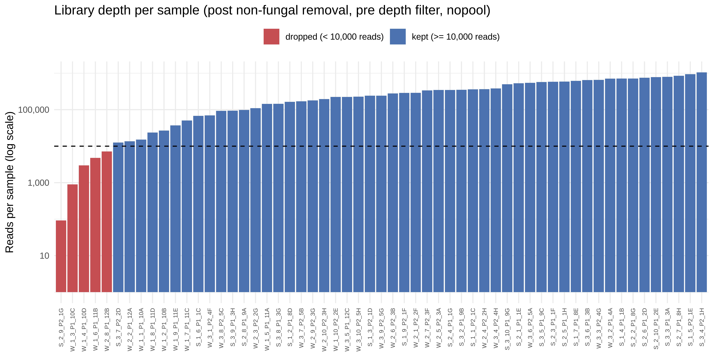

```{r}
#| eval: false
#| echo: !expr knitr::is_html_output()
#| code-fold: true
#| code-summary: "Code used to build the read/OTU tracking table and library-depth figure (report_prep_readtracking.R, executed on server)"

library(phyloseq)
library(dplyr)
library(ggplot2)

# ---- Post-cutadapt / filter / merge / chimera / LULU counts, read from the
#      untouched script-2 workspace (nothing is rerun) --------------------------
e <- new.env(); load("merged_ITS.RData", envir = e)
out_df <- e$out_df
reads_postcutadapt <- sum(out_df$reads.in)
reads_postfilter   <- sum(out_df$reads.out)

dims_of <- function(m) data.frame(n_samples = nrow(m), n_taxa = ncol(m), total_reads = sum(m))

step_merge <- dplyr::bind_rows(
  data.frame(step = "post_merge_denoise", strategy = "nopool", dims_of(e$merged_seqtab)),
  data.frame(step = "post_merge_denoise", strategy = "pool",   dims_of(e$merged_seqtabPP)),
  data.frame(step = "post_merge_denoise", strategy = "pspool", dims_of(e$merged_seqtabpsPP)))
step_chimera <- dplyr::bind_rows(
  data.frame(step = "post_chimera_removal", strategy = "nopool", dims_of(e$merged_seqtab.nochim)),
  data.frame(step = "post_chimera_removal", strategy = "pool",   dims_of(e$merged_seqtabPP.nochim)),
  data.frame(step = "post_chimera_removal", strategy = "pspool", dims_of(e$merged_seqtabpsPP.nochim)))
step_lulu <- dplyr::bind_rows(
  data.frame(step = "post_LULU_curation", strategy = "nopool", dims_of(e$nopool.lulu)),
  data.frame(step = "post_LULU_curation", strategy = "pool",   dims_of(e$pool.lulu)),
  data.frame(step = "post_LULU_curation", strategy = "pspool", dims_of(e$pspool.lulu)))

n_pcr_wells <- length(unique(sub("r[12]$", "", rownames(out_df))))
step_filter  <- dplyr::bind_rows(lapply(c("nopool","pool","pspool"), function(s)
  data.frame(step = "post_cutadapt_input_to_filter", strategy = s,
             n_samples = n_pcr_wells, n_taxa = NA, total_reads = reads_postcutadapt)))
step_qfilter <- dplyr::bind_rows(lapply(c("nopool","pool","pspool"), function(s)
  data.frame(step = "post_quality_filter", strategy = s,
             n_samples = n_pcr_wells, n_taxa = NA, total_reads = reads_postfilter)))

# ---- PCR-collapsed / decontaminated -> non-fungal removal -> depth filter,
#      from the freshly-regenerated comparison table (4_data_prep.R Section 8) --
cmp <- read.csv("phyloseq_comparison_summary.csv", stringsAsFactors = FALSE)
cmp <- cmp[cmp$object %in% c("nopool","pool","pspool"), ]
relabel <- function(df, label) data.frame(step = label, strategy = df$object,
  n_samples = df$n_samples, n_taxa = df$n_taxa, total_reads = df$total_reads)

tracking <- dplyr::bind_rows(
  step_filter, step_qfilter, step_merge, step_chimera, step_lulu,
  relabel(cmp[cmp$step == "initial", ],             "pcr_collapsed_decontaminated_taxassigned"),
  relabel(cmp[cmp$step == "post_PlutoF_filter", ],  "non_fungal_OTU_removal"),
  relabel(cmp[cmp$step == "post_depth_filter", ],   "depth_filter_final (>=10,000 reads)"))
write.csv(tracking, "report_read_otu_tracking.csv", row.names = FALSE)

# ---- Library-depth figure: 57-sample post-non-fungal-removal depths, with the
#      10,000-read threshold and dropped samples marked --------------------------
load("eco_analysis.RData")  # nonfungal_ids_by_strategy, nopoolps.dada2
keep_taxa <- setdiff(taxa_names(nopoolps.dada2), nonfungal_ids_by_strategy$nopool)
ps_pp <- prune_taxa(keep_taxa, nopoolps.dada2)

depth_df <- data.frame(sample = sample_names(ps_pp), depth = sample_sums(ps_pp))
depth_df$Season <- as.data.frame(sample_data(ps_pp))$Season
depth_df$status <- ifelse(depth_df$depth >= 10000, "kept (>= 10,000 reads)", "dropped (< 10,000 reads)")

ggplot(depth_df, aes(reorder(sample, depth), depth, fill = status)) +
  geom_col() +
  geom_hline(yintercept = 10000, linetype = "dashed") +
  scale_y_log10(labels = scales::comma) +
  scale_fill_manual(values = c("kept (>= 10,000 reads)" = "#4C72B0",
                               "dropped (< 10,000 reads)" = "#C44E52")) +
  labs(x = NULL, y = "Reads per sample (log scale)", fill = NULL) +
  theme_minimal(base_size = 11) +
  theme(axis.text.x = element_text(angle = 90, hjust = 1, vjust = 0.5, size = 6),
        legend.position = "top")
```

::: {.content-visible when-profile="docs"}
#### Documentation notes — Section 2 {.unnumbered}

*Documentation build only; omitted from the submitted appendix. Move any paragraph, callout or table here that belongs in the full record rather than in the supplement.*
:::

## Section 3: Taxonomic overview

### 3.1 Community composition across ranks

Per-sample relative read abundance at four taxonomic ranks, with samples grouped and ordered by Season (and Year).


**Figure S2**: Phylum-level composition per sample, grouped by Season.


**Figure S3**: Class-level composition per sample, grouped by Season.


**Figure S4**: Order-level composition per sample, grouped by Season.


**Figure S5**: Genus-level composition per sample, grouped by Season. Many summer bars are dominated end-to-end by a single genus (*Thelebolus*, *Sporormiella*, or *Coniochaeta*), consistent with the dominance analysis in Section 5, whereas winter bars are more evenly patchworked across genera.

### 3.2 Coprophilous (dung-specialist) genera (E2)

This subsection addresses exploratory aim **E2**: documenting the occurrence and relative abundance of *Sporormiella*-type and other Sordariales taxa used in palynological herbivore-presence reconstructions, to provide a modern avian reference point for a proxy currently calibrated almost entirely on mammalian dung.

The canonical tax table was screened against a standard list of coprophilous genera: *Sordaria, Podospora, Cercophora, Chaetomium, Schizothecium, Preussia, Sporormiella, Delitschia, Pilobolus, Ascobolus, Coprinopsis, Saccobolus, Sporormia*. Only ***Sporormiella*** (multiple OTUs) and a single trace ***Coprinopsis*** OTU were detected; none of the other genera appear in this dataset. Per-OTU winter/summer mean read shares and occurrences (number of samples per season, of 26 each) are shown below.

```{r tab-copro}
#| echo: false
library(knitr)
copro <- read.csv("tables/report_coprophilous_by_season_v2.csv", check.names = FALSE)
kable(copro, digits = 3,
      caption = "Table S3. Coprophilous-genus OTUs: mean read share (%) and occurrence per Season (canonical object, 52 samples; 26 winter / 26 summer).")
```

Total per-sample coprophilous read share is **higher in summer** than winter (Wilcoxon p = 0.006). Code for this table is shared with the dominance analysis and shown in Section 5.

::: {.content-visible when-profile="docs"}
<!-- placeholder subsection; not yet vetted for the manuscript -->

### 3.3 Taxonomic assignment success by rank *(placeholder)*

::: callout-warning
**To be finalized.** A per-rank summary of the percentage of reads and OTUs with confident taxonomic assignment, broken down by Season, is available as `tables/tax_assignment_summary_season.xlsx` but has not yet been vetted for the manuscript. A rendered Table S4 (Phylum → Species assignment rates) will be inserted here once confirmed.
:::
:::

### 3.4 Dark taxa and UNITE Species Hypothesis characterisation (E1)

::: {.content-visible when-profile="docs"}
<!-- exploratory-status hedge -->

::: callout-warning
**Exploratory (E1); not yet definitive.** This subsection runs the authoritative UNITE `sh_matching` pipeline (v2.0.4, the service behind PlutoF) as a *complementary lens* on the taxonomically unresolved fraction of the community. It **does not modify the canonical taxonomy** used everywhere else in this appendix — Species Hypothesis (SH) matching and the DADA2/UNITE naïve-Bayes classifier answer different questions (which SH cluster and how novel, versus which confident Linnaean name) and are kept separate by design. Novelty calls and new-SH assignments here are preliminary and pending validation for the manuscript.
:::
:::

Nearly half of the retained fungal OTUs are **"dark taxa"**: 493 of 1129 (43.7%), accounting for 35.4% of reads that the naïve-Bayes classifier leaves without a confident genus. These are not spread evenly across the design: in the dominance analysis (Section 5.4), winter samples are markedly dark-taxa dominated, with dark taxa making up on average 51.3% of winter reads (a far smaller share in summer), and winter's single most persistent OTU (OTU1369) is itself a dark taxon. To make this unresolved winter community interpretable, every OTU's ITS2 sequence was matched against the UNITE SH reference set, which places each sequence into an existing species hypothesis or forms a new (candidate) one, independent of whether a Linnaean name is available.

```{r tab-e1-summary}
#| echo: false
library(knitr)
s <- read.csv("tables/E1_SH_assignment_summary.csv", check.names = FALSE)
e1_tab <- data.frame(
  Category = c("Dark OTUs (no confident genus)",
               " placeable to an existing named SH",
               " novel — forms a new species hypothesis",
               " no match to any UNITE SH (>20% divergent)",
               " excluded by ITSx (chimeric / non-ITS)"),
  `Dark OTUs` = c(s$n_dark, s$placeable_existing_SH, s$novel_new_SH,
                  s$no_SH_match, s$excluded_nonITS),
  check.names = FALSE)
kable(e1_tab,
      caption = sprintf("Table S-E1a. UNITE Species Hypothesis placement of the dark-taxa OTUs (no confident genus in the canonical taxonomy). Median best-hit similarity to UNITE = %.2f%%; %d dark OTUs gained a finer lineage (family or deeper) from the SH consensus.", s$median_similarity, s$gained_finer_lineage))
```

**Most dark taxa are close to known references, and a live-database cross-check further shrinks the genuinely-novel fraction.** Against the local reference, of the 493 dark OTUs 143 were placeable to an existing named UNITE SH, 247 formed new (candidate) species hypotheses, and 90 had no SH match; 13 were dropped by ITSx. The novel and no-match sequences were then re-run through the PlutoF web service, whose reference database is larger and more current: this reclassified 79 formerly-novel OTUs across the community — 19 of them dark — as matches to existing named SHs (21 of the 79 resolving to species, and 11 of the 19 dark ones gaining a genus). Table S-E1a reflects this combined result: 162 placeable, 228 candidate-novel, 90 no-match. Each placeable OTU resolves to a stable SH page (`https://unite.ut.ee/sh/<code>`) carrying the taxon name and its DOI. The best-hit similarity distribution (Figure S-E1a) shows the dark fraction is bimodal — a spike near 100% (OTUs essentially identical to a reference but withheld a genus by the conservative `minBoot = 80` threshold) plus a real tail of divergent, candidate-novel lineages.

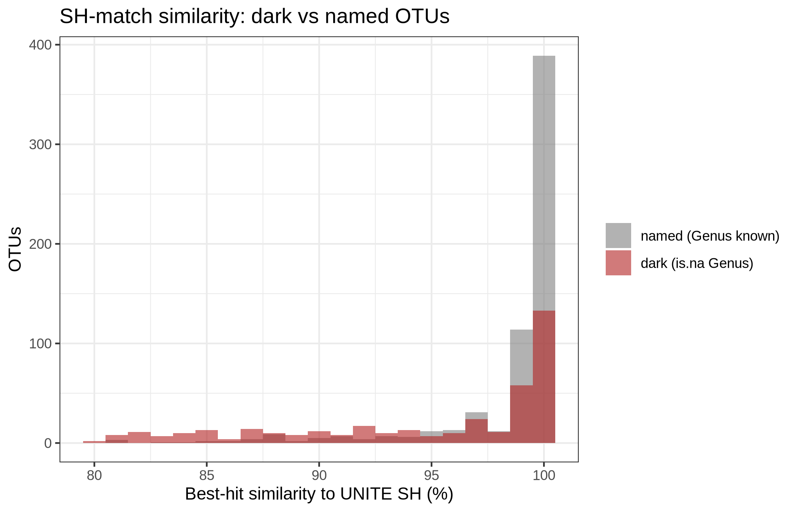

**Figure S-E1a**: Best-hit similarity to the nearest UNITE Species Hypothesis, dark (no confident genus, red) versus named (grey) OTUs.

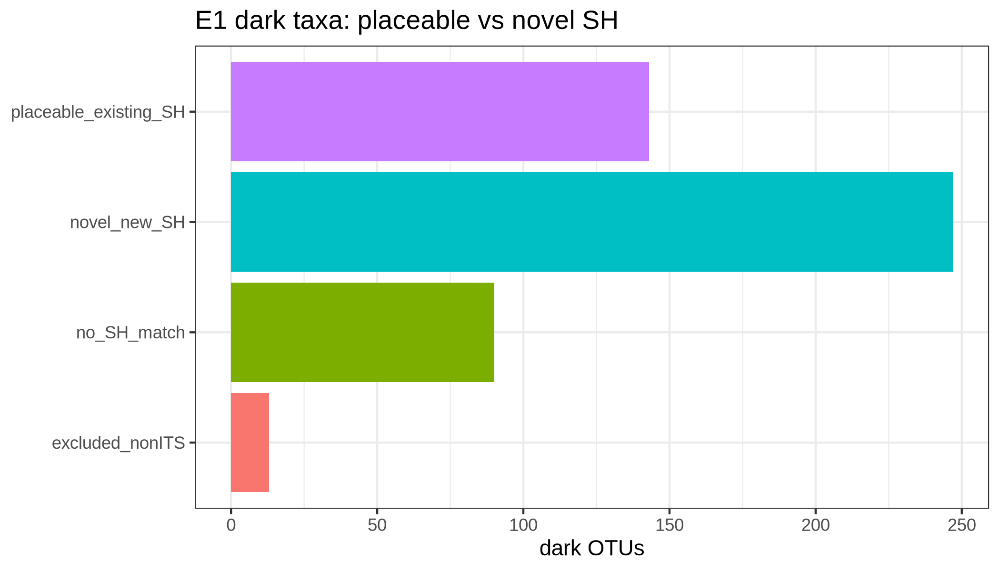

**Figure S-E1b**: Dark-taxa OTUs by SH placement category (placeable to an existing SH, novel/new SH, no SH match, or ITSx-excluded).

SH matching directly addresses the "winter = dark taxa" caveat: 34.6% of the winter dark-read burden is placeable to an existing UNITE SH, while the remainder forms candidate new SHs. Winter's dominant dark OTU, OTU1369, is genuinely novel: a candidate new SH only 85.4% similar to any reference, resolving no further than class Dothideomycetes.

**Toward permanent, citable identifiers.** Placeable taxa already carry citable UNITE SH identifiers (resolvable SH pages with DOIs). The candidate novel taxa are being registered: their representative ITS2 sequences are being deposited in a public archive (ENA) and imprinted as new SHs via PlutoF, which mints permanent DOIs — converting short-lived study detections into citable candidate species hypotheses (*registration in progress*; sequences in `models/E1_novel_taxa_for_plutof.fasta`).

```{r tab-e1-winter}
#| echo: false
library(knitr)
library(dplyr)
w <- read.csv("tables/E1_winter_dominant_dark_taxa_SH.csv", check.names = FALSE)
w_disp <- w %>%
  transmute(
    OTU = OTU_ID,
    Class = sub("^c__", "", Class),
    `SH placement` = ifelse(!is.na(SH_URL), SH_code,
                     ifelse(SH_class == "novel_new_SH", "novel SH",
                     ifelse(SH_class == "no_SH_match", "no SH match", "excluded (ITSx)"))),
    `% id` = similarity_percentage,
    `Winter (n/26)` = paste0(winter_occ, "/", winter_n),
    `Winter %` = round(100 * winter_mean_share, 1),
    `Summer %` = round(100 * summer_mean_share, 1)) %>%
  head(12)
kable(w_disp, digits = 1,
      caption = "Table S-E1b. Top winter-abundant dark taxa and their UNITE SH placement. 'Winter %'/'Summer %' = mean per-sample read share within each season (26 samples each). Placeable SH codes resolve at https://unite.ut.ee/sh/<code>.")
```

::: {.content-visible when-profile="docs"}
#### Documentation notes — Section 3 {.unnumbered}

for section 3.1; Bars are seriated within each Season for readability. These panels use script 5's PCR-collapsed object (57 samples, no depth filter); the qualitative pattern is unaffected by the depth filter used elsewhere. These four panels are retained here in full because they are a different object and a different question from the main text: all four ranks, all 57 samples, no depth filter. The main-text genus panel (Fig. 1A, Section 10.1) shows the genus rank only, on the canonical depth-filtered 52-sample object, and on the same sample axis as the functional guilds.

section 3.4: Figures S-E1a and S-E1b are the same two quantities as main-text **Fig. 4A–B** (Section 10.4), redrawn there to the main-figure specification — S-E1a on a square-root axis normalised within each group, so the divergent tail is legible beside the near-100% spike, and S-E1b with counts and percentages labelled. They are retained here as the plain versions. Main-text **Fig. 4C** additionally plots Table S-E1b, which has no supplementary figure of its own.

::: {.callout-note appearance="minimal"}
**Caveats.** (i) OTU320, previously listed among winter's dark dominants, is an ITSx-flagged chimeric/broken sequence and is dropped. (ii) On the PlutoF re-run, a reference-coverage heuristic flagged 248 of the resubmitted OTUs as putatively chimeric, but the *same* sequences passed cleanly in the local run and the flagged set is not the most-divergent one (median \~97% identity), so this flag is recorded (`plutof_chimera_flag`) but treated as unreliable and **not** used to exclude OTUs, pending scrutiny.
:::
:::

## Section 4: Community composition — H1 {.page-break-before}

H1 predicts seasonal compositional turnover of the dung mycobiome that is reproducible across years. Ordination and tests use **robust Aitchison distance** on the canonical depth-filtered object (`alldat$nopool`, 52 samples). Four complementary analyses are reported: an unconstrained PCoA (visualization), a PERMANOVA with beta-dispersion check (Season × Year), a per-year breakdown of the seasonal contrast, and a distance-to-Season-centroid linear model (does within-season heterogeneity itself depend on year?).

### 4.1 Ordination


**Figure S6**: PCoA on robust Aitchison distances (unconstrained), canonical object, coloured by Season and shaped by Year. Crosses mark Season centroids; thin segments connect each sample to its Season centroid.

This is the same ordination as main-text **Fig. 2A** (Section 10.2).

::: {.content-visible when-profile="docs"}
**Reading the axis percentages.** The percentages on the PCoA axes are far larger than is usual for a microbiome ordination, and they must not be read as "the plot captures 89% of the community variation". They follow from how `vegan` constructs robust Aitchison distances. `decostand(x, "rclr")` treats zero counts as missing rather than as observed zeros and, whenever any are present — always true of an OTU table — completes the matrix with a **rank-3 OptSpace approximation** (`vegan:::.calc_rclr`, argument `ropt = 3`). The robust CLR matrix from which the distance is computed therefore has rank 3 *by construction*, and the resulting PCoA has exactly three non-zero eigenvalues rather than the 51 that 52 samples would otherwise allow. PCoA1 and PCoA2 take 58.0% and 31.3% of that three-dimensional reconstruction and PCoA3 the remaining 10.7%, so the two plotted axes cover most of a space that had already been truncated to three dimensions before the ordination began. The same table under a full-rank Aitchison distance (CLR after a pseudocount) gives the ordinary figures instead: 13.7% and 9.5%, or 23.2% for the two axes together. **The percentages describe the display, not an effect size.** Every inferential statement about H1 comes from the PERMANOVA of Section 4.2, and none of it depends on them.

**Why 58% on the first axis and 11% for Season are not in conflict.** The axis percentages and the PERMANOVA R² of Section 4.2 are computed from the same distance matrix and the same total inertia, but they answer different questions and are not comparable as effect sizes. A principal coordinate is *fitted* to absorb as much variance as possible along a single direction, with no reference to any grouping, and is therefore the largest share obtainable; Season is a fixed, externally specified two-group split, which has no reason to align with that direction. Decomposed axis by axis, Season accounts for 15.3% of the variance along PCoA1, 4.0% along PCoA2 and 10.3% along PCoA3 — that is 8.9%, 1.2% and 1.1% of the total, summing to the 11.2% that `adonis2()` reports for the Season term. A dominant first axis that is mostly *not* seasonal is the expected result rather than a contradiction: most of what separates these samples is something other than season.
:::

### 4.2 PERMANOVA and beta-dispersion

```{r tab-permanova}
#| echo: false
library(knitr)
perm <- read.csv("tables/report_permanova.csv", check.names = FALSE)
perm <- perm[, c("term", "Df", "SumOfSqs", "R2", "F", "Pr(>F)")]
names(perm) <- c("Term", "Df", "SumOfSqs", "R2", "F", "Pr(>F)")
kable(perm, digits = 3,
      caption = "Table S5. PERMANOVA (adonis2) on robust Aitchison distances, Season x Year, by terms. Year is fitted as a FACTOR (2 df), so the interaction tests genuine year-to-year differences in the seasonal contrast rather than a linear trend across the three years.")
```

Because the Season × Year term is significant, the seasonal contrast is also tested separately within each year:

```{r tab-permanova-by-year}
#| echo: false
library(knitr)
py <- read.csv("tables/report_permanova_by_year.csv", check.names = FALSE)
kable(data.frame(
  Year               = py$Year,
  `n (W/S)`          = paste0(py$n_winter, "/", py$n_summer),
  `R²`               = round(py$R2, 3),
  F                  = round(py$F, 2),
  `p`                = py$p_value,
  `Centroid distance`= round(py$centroid_distance, 1),
  `Spread W`         = round(py$dispersion_winter, 1),
  `Spread S`         = round(py$dispersion_summer, 1),
  check.names = FALSE),
  row.names = FALSE,
  caption = "Table S5b. Season effect tested within each year separately (PERMANOVA on robust Aitchison distances). 'Centroid distance' is the Euclidean distance between the winter and summer centroids in robust-CLR space that year — the magnitude of the seasonal shift. 'Spread' is the mean distance to the cell's own centroid.")
```

```{r tab-betadisper}
#| echo: false
library(knitr)
bd <- read.csv("tables/report_betadisper.csv", check.names = FALSE)
bd <- bd[bd$term == "Groups", c("grouping", "Df", "Sum Sq", "Mean Sq", "F", "Pr(>F)")]
names(bd) <- c("Grouping", "Df", "Sum Sq", "Mean Sq", "F", "Pr(>F)")
kable(bd, digits = 3,
      caption = "Table S6. Beta-dispersion (permutest of distance-to-centroid homogeneity) for Season and Year.")
```

### 4.3 Distance-to-Season-centroid (consistency across years)

```{r tab-centroid}
#| echo: false
library(knitr)
cen <- read.csv("tables/report_centroid_lm.csv", check.names = FALSE)
cen <- cen[cen$term != "Residuals", ]
names(cen) <- c("Term", "Df", "Sum Sq", "Mean Sq", "F value", "Pr(>F)")
kable(cen, digits = 3,
      caption = "Table S7. Linear model of each sample's distance to its Season centroid (robust CLR space) ~ Season * Year.")
```

Main-text **Fig. 2B** (Section 10.2) plots the distances behind this table, split by Season and Year; it reads its p-values from `tables/report_centroid_lm.csv`, so the figure and Table S7 are guaranteed to agree.

::: {.callout-note when-profile="docs" appearance="minimal"}
**H1 interpretation — the two clauses separate.** Season is a significant predictor of community composition (PERMANOVA R² = 0.11, F = 6.92, p = 0.002), so the **first clause of H1 (seasonal turnover exists) is supported**. The **second clause (magnitude consistent across years) is not**: the Season × Year interaction is significant and substantial (R² = 0.10, F = 3.20, p = 0.011), meaning the size of the seasonal contrast genuinely differs between years.

Table S5b localises that interaction. The seasonal shift is strong in **2023** (R² = 0.24, p = 0.005; between-season centroid distance 35.7), much weaker in **2024** (R² = 0.14, p = 0.127; distance 10.3) and effectively absent in **2022** (R² = 0.02, p = 0.789; distance 6.9) — though this last figure is the one part of the breakdown that is sensitive to the distance measure, see caveat (iii) below. The *direction* of the shift is the same in all three years — it is the *magnitude* that varies, dominated by an unusually well-separated 2023. This is exactly the pattern the functional-guild analysis finds independently (Section 8.3: dung-saprotroph share summer versus winter is significant in 2023, marginal in 2024 and not significant in 2022).

The interaction is a difference in *location*, not merely in spread: the distance-to-Season-centroid model (Table S7) finds a strong Season effect on within-season spread (p \< 0.001) but **no** Season × Year interaction in that spread (p = 0.79). In other words, summer communities are consistently more heterogeneous than winter ones in every year, while how far apart the two seasons sit changes from year to year.

**Caveats.** (i) Beta-dispersion is significantly higher for summer than winter samples (F = 15.3, p = 0.002; Table S6), so part of the PERMANOVA R² reflects this difference in within-group spread rather than a pure centroid shift (Anderson 2001); this previews Section 5's finding that summer communities are individually more dominance-skewed. (ii) With three years and 15–19 samples per year, a single atypical year moves the interaction substantially; the per-year tests in Table S5b are correspondingly low-powered (no year has more than 10 samples per season). The safe reading is *"seasonal turnover is real and directionally consistent, but its magnitude is not established as constant across years"* rather than a positive claim about year-specific ecology.

(iii) The distance itself carries an assumption, and one specific claim above depends on it. As set out in Section 4.1, `vegan`'s robust Aitchison distance is computed from a rank-3 completion of the robust CLR matrix, so this PERMANOVA — like the ordination — is run on a three-dimensional reconstruction of the community rather than on its full dimensionality. Refitting the identical `Season * Year` model on full-rank distances gives the same qualitative verdict with smaller effect sizes:

```{r tab-permanova-sens}
#| echo: false
library(knitr)
sn <- read.csv("tables/report_permanova_sensitivity.csv", check.names = FALSE)
kable(data.frame(
  Distance            = sn$distance,
  Rank                = sn$rank,
  `Season R²`         = round(sn$season_R2, 3),
  `Season p`          = sn$season_p,
  `Year R²`           = round(sn$year_R2, 3),
  `Year p`            = sn$year_p,
  `Season × Year R²`  = round(sn$interaction_R2, 3),
  `Season × Year p`   = sn$interaction_p,
  check.names = FALSE),
  row.names = FALSE,
  caption = "Table S7b. Sensitivity of the H1 PERMANOVA to the distance measure. All four rows are adonis2(d ~ Season * Year, by = 'terms') on the same canonical 52-sample object, 999 permutations, seed 20260805. 'Rank' is the number of non-negligible positive eigenvalues the distance admits: robust Aitchison is capped at 3 by vegan's rclr completion, the others are full-rank. The first row is the one reported in Table S5.")
```

The per-year breakdown is exposed to the same choice, and more sharply:

```{r tab-permanova-sens-year}
#| echo: false
#| warning: false
library(knitr); library(tidyr)
sy <- read.csv("tables/report_permanova_sensitivity_by_year.csv", check.names = FALSE)
sy$cell <- sprintf("%.3f (p = %.3f)", sy$R2, sy$p_value)
wide <- pivot_wider(sy[, c("distance", "Year", "cell")], names_from = Year, values_from = cell)
names(wide)[1] <- "Distance"
kable(wide, row.names = FALSE,
      caption = "Table S7c. Season effect within each year, under each distance measure (R² with permutation p). Same models as Table S5b, refitted on each distance. The robust-Aitchison row is the identical test to Table S5b; its p-values differ in the third decimal (0.775 / 0.009 / 0.116 here against 0.789 / 0.005 / 0.127 there) only because each cell here is seeded independently, so the two draw different permutation sets. R² values are exact and match.")
```

Both H1 verdicts are robust to the choice of distance — Season is significant at p ≤ 0.002 under every measure and the Season × Year interaction at p ≤ 0.011 — but the reported R² values sit at the optimistic end of their range: the Season term is better read as 0.07–0.11 and the interaction as 0.05–0.10 rather than as precise variance shares. The Year main effect is the one term whose *significance* changes (p = 0.309 under robust Aitchison, p = 0.004–0.027 under the full-rank measures), which is a further reason not to lean on it.

**One statement in this section needs qualifying.** The per-year breakdown's finding that 2022 shows essentially no seasonal shift (R² = 0.02, p = 0.789) is an artefact of the rank-3 distance. Under all three full-rank measures the 2022 contrast is modest but unambiguously present (R² = 0.09–0.10, p ≤ 0.010; Table S7c). What survives every distance is the *ordering* — 2023 strongest (R² = 0.21–0.24), then 2024, then 2022 — and it is the size of the gap, not its direction, that the rank-3 distance exaggerates. The defensible reading is that the seasonal shift occurred in **all three years and was largest in 2023**, rather than that it was absent in 2022. Section 8.3's independent guild result should be read the same way: it shares this ranking, but its non-significant 2022 cell is a question of power, not of a missing effect.

::: {.content-visible when-profile="docs"}
<!-- records a correction to an earlier draft -->

::: callout-important
**Supersedes.** Earlier versions of this section reported no Season × Year interaction (p ≈ 0.95). That came from an error in `working/report_prep_permanova.R`, where `Year` was passed to `adonis2()` straight from `sample_data()` and so entered the model as a **numeric covariate (1 df)**, testing only a linear trend across 2022–2024 rather than the factorial interaction. `Year` is now fitted as a factor (2 df), as it always was in the distance-to-centroid model of Section 4.3. The Season main effect is essentially unchanged (R² = 0.112 in both); only the Year and Season × Year terms are affected. Corrected 2026-08-05; the same fix was applied to `Scripts/5_community_composition.R`, whose PERMANOVA is print-only.
:::
:::
:::

```{r}
#| eval: false
#| echo: !expr knitr::is_html_output()
#| code-fold: true
#| code-summary: "Code used to generate the PCoA, PERMANOVA, beta-dispersion, and centroid tables (report_prep_permanova.R, executed on server)"

library(phyloseq); library(vegan); library(ggplot2); library(dplyr)
load("eco_analysis.RData")
ps <- alldat$nopool  # canonical, 52 samples, >= 10,000 reads

otu_mat <- as(otu_table(ps), "matrix"); if (taxa_are_rows(ps)) otu_mat <- t(otu_mat)

# ---- Unconstrained PCoA on robust Aitchison distances ----
d_ait <- vegdist(otu_mat, method = "robust.aitchison")
attr(d_ait, "Labels") <- rownames(otu_mat)   # vegdist drops Labels for robust.aitchison
ord   <- capscale(d_ait ~ 1)
# NB: rank 3, not 51 -- vegan's rclr completes the matrix at rank 3 (Section 4.1),
# so these percentages are shares of a 3-D reconstruction, not of the full data.
eig   <- pmax(ord$CA$eig, 0)
ax1p  <- round(100 * eig[1] / sum(eig), 1); ax2p <- round(100 * eig[2] / sum(eig), 1)

sc <- as.data.frame(scores(ord, display = "sites", choices = 1:2, scaling = 1))
colnames(sc)[1:2] <- c("Axis1", "Axis2"); sc$sample <- rownames(sc)
meta_p <- as.data.frame(sample_data(ps)); meta_p$sample <- rownames(meta_p)
sc$Season <- droplevels(factor(meta_p$Season[match(sc$sample, meta_p$sample)]))
sc$Year   <- droplevels(factor(meta_p$Year[match(sc$sample, meta_p$sample)]))
cent <- aggregate(cbind(Axis1, Axis2) ~ Season, sc, mean); names(cent) <- c("Season","cX","cY")
sc <- merge(sc, cent, by = "Season")

ggplot(sc, aes(Axis1, Axis2, colour = Season, shape = Year)) +
  geom_segment(aes(xend = cX, yend = cY), alpha = 0.5, linewidth = 0.3, show.legend = FALSE) +
  geom_point(size = 3) +
  geom_point(data = cent, aes(cX, cY, colour = Season), inherit.aes = FALSE,
             size = 3, shape = 4, stroke = 1) +
  coord_equal() +
  xlab(paste0("PCoA1 (", ax1p, "%)")) + ylab(paste0("PCoA2 (", ax2p, "%)")) +
  theme_classic(base_size = 12)

# ---- PERMANOVA + beta-dispersion (Season x Year) ----
sampledf <- data.frame(sample_data(ps))
dists <- vegdist(otu_mat, method = "robust.aitchison")
perm  <- adonis2(dists ~ Season * Year, by = "terms", data = sampledf)
write.csv(cbind(as.data.frame(perm), term = rownames(perm)), "report_permanova.csv", row.names = FALSE)

beta_s <- betadisper(dists, factor(sampledf$Season)); pt_s <- permutest(beta_s)
beta_y <- betadisper(dists, factor(sampledf$Year));   pt_y <- permutest(beta_y)
write.csv(dplyr::bind_rows(
  data.frame(grouping = "Season", term = rownames(pt_s$tab), pt_s$tab, check.names = FALSE),
  data.frame(grouping = "Year",   term = rownames(pt_y$tab), pt_y$tab, check.names = FALSE)),
  "report_betadisper.csv", row.names = FALSE)

# ---- Distance-to-Season-centroid (robust CLR space) ~ Season * Year ----
rclr <- decostand(otu_mat, "rclr", MARGIN = 1)
dimnames(rclr) <- dimnames(otu_mat)   # vegan's rclr imputation path drops dimnames
meta <- data.frame(sample_data(ps), check.names = FALSE)
centroids <- rowsum(rclr, meta$Season) / as.vector(table(meta$Season))
euclid <- function(x, y) sqrt(sum((x - y)^2))
meta$dist_centroid <- vapply(seq_len(nrow(rclr)),
  function(k) euclid(rclr[k, ], centroids[meta$Season[k], ]), numeric(1))
mod <- lm(dist_centroid ~ Season * Year, data = meta)
write.csv(cbind(term = rownames(anova(mod)), anova(mod)), "report_centroid_lm.csv", row.names = FALSE)
```

::: {.content-visible when-profile="docs"}
#### Documentation notes — Section 4 {.unnumbered}

*Documentation build only; omitted from the submitted appendix.*
:::

## Section 5: Diversity — H2 {.page-break-before}

H2 predicts higher summer alpha diversity, tracking the richer summer diet. Two Hill-number approaches are presented together deliberately, because they appear to disagree in an informative way: coverage-based iNEXT3D (which pools samples within a Season and asks about the Season's total species pool) versus per-sample hillR (which asks about diversity within a single sample and rewards evenness). The disagreement is resolved by the dominance analysis in 5.3.

### 5.1 iNEXT3D: coverage-based taxonomic diversity

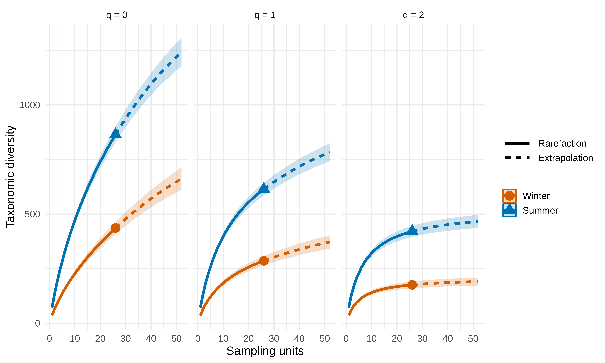

**Figure S7**: iNEXT3D coverage-based rarefaction/extrapolation of taxonomic Hill numbers (q = 0, 1, 2), samples pooled within each Season (incidence data, nboot = 500). Summer exceeds winter at every q.

```{r tab-inext}
#| echo: false
library(knitr)
inx <- read.csv("tables/H2_iNEXT3D_TD_asymptotic.csv", check.names = FALSE)
kable(inx, digits = 2,
      caption = "Table S8. iNEXT3D asymptotic taxonomic-diversity estimates by Season (Hill q = 0, 1, 2; observed and asymptotic, with s.e. and 95% CI).")
```

The asymptotic estimates in Table S8 are plotted as main-text **Fig. 3A** (Section 10.3).

### 5.2 Per-sample Hill diversity and mixed model

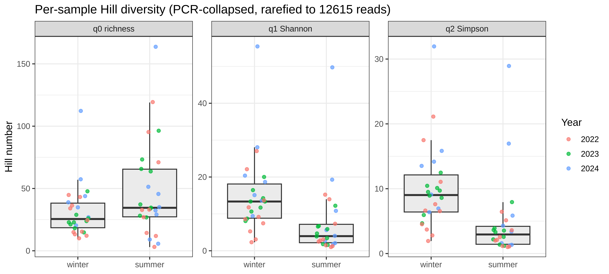

**Figure S8**: Per-sample Hill numbers (PCR-collapsed object, rarefied to the minimum sample depth). Summer \> winter at q0 (richness) but winter ≥ summer at q1/q2 (Shannon/Simpson) — a richness–evenness crossover.

This is the same quantity as main-text **Fig. 3B** (Section 10.3), which redraws it to the main-figure specification: annotated with the Table S9 contrasts below, and stacked beneath the pooled estimates of Fig. 3A on a shared set of facet columns. Figure S8 is retained here as the plain, unannotated view.

The Season main effect is tested with a frequentist mixed model fitted at the PCR-replicate level, with PCR replicate (and, where estimable, Year and individual bird) as random intercepts. The `re_structure` column records the random-effects structure that actually converged for each Hill order.

```{r tab-lmm}
#| echo: false
library(knitr)
lmm <- read.csv("tables/H2_lmm_season_effect.csv", check.names = FALSE)
kable(lmm, digits = 3,
      caption = "Table S9. Mixed-model Season effect (summer minus winter) on per-replicate Hill diversity, with 95% CI and p, for q = 0, 1, 2.")
```

### 5.3 Why the two metrics disagree: dominance and evenness

The crossover is not an artifact. iNEXT3D pools a Season's samples and rewards the total species list (summer's samples collectively contain more species, so summer wins at every q). Per-sample q1/q2 instead downweight rare taxa and reward *within-sample evenness* — and individual summer samples are far more dominance-skewed than winter ones, so a single summer sample's effective diversity is often lower even though its raw species list is longer.

```{r tab-dominance}
#| echo: false
library(knitr)
dom <- read.csv("tables/report_dominance_summary.csv", check.names = FALSE)
names(dom) <- c("Season", "n", "Mean richness", "Mean top-1 OTU share (%)",
                "Mean Pielou J", "Wilcoxon p (richness)",
                "Wilcoxon p (top-1 share)", "Wilcoxon p (evenness J)")
kable(dom, digits = 3,
      caption = "Table S10. Per-sample richness, top-1-OTU dominance, and Pielou evenness by Season, with Wilcoxon tests (canonical object, 52 samples).")
```

Concretely: a summer sample's single most abundant OTU accounts for **56%** of its reads on average (vs **25%** in winter, p \< 0.001), and Pielou evenness is correspondingly much lower (J = 0.38 summer vs 0.72 winter, p \< 0.001). Summer gains many rare taxa (the long tail iNEXT3D detects) on top of one or two OTUs that dominate the read count — richness rises, evenness collapses, and q1/q2 track evenness more than richness.

### 5.4 Which OTUs dominate each Season?

```{r tab-top5}
#| echo: false
library(knitr)
top5 <- read.csv("tables/report_top5_otu_by_season.csv", check.names = FALSE)
clean_tax <- function(v) ifelse(is.na(v) | v == "", "—", sub("^[a-z]__", "", v))
top5$Season  <- tools::toTitleCase(top5$Season)
top5$Order   <- clean_tax(top5$Order)
top5$Genus   <- clean_tax(top5$Genus)
top5$Species <- clean_tax(top5$Species)
top5 <- top5[, c("Season", "OTU", "mean_pct_share", "Order", "Genus", "Species")]
names(top5) <- c("Season", "OTU", "Mean % share (within-season)", "Order", "Genus", "Species")
kable(top5, digits = 2,
      caption = "Table S11. Top-5 dominant OTUs per Season by mean within-season read share, with taxonomy.")
```

Summer's dominance is driven by three strongly season-skewed OTUs: **OTU1 (*Thelebolus*)** averages 24.9% of summer reads (15/26 summer samples vs 5/26 winter at 3.2%), **OTU1225 (*Coniochaeta*)** is essentially summer-only (10.1% vs 0.2%), and **OTU636 (*Sporormiella* cf. *intermedia*)** is also summer-skewed (9.0% vs 2.5%). Winter's own top OTU, **OTU1369**, is a "dark taxon" (unclassified below Class, Dothideomycetes), present in 20/26 winter samples but only 3/26 summer, at 11.2% mean winter share.

```{r}
#| eval: false
#| echo: !expr knitr::is_html_output()
#| code-fold: true
#| code-summary: "Code for iNEXT3D + per-sample hillR + mixed model (report_prep_partA_diversity.R) and dominance/top-5/coprophilous (report_prep_dominance.R), executed on server"

## ---------- iNEXT3D coverage-based TD by Season ----------
library(phyloseq); library(iNEXT.3D); library(hillR)
library(lme4); library(lmerTest); library(dplyr); library(tidyr); library(ggplot2)
load("eco_analysis.RData")

ps  <- alldat$nopool
sd  <- as.data.frame(sample_data(ps))
OTU <- as(otu_table(ps), "matrix"); if (!taxa_are_rows(ps)) OTU <- t(OTU)

inc_by_season <- lapply(split(rownames(sd), sd$Season), function(samps){
  M <- OTU[, colnames(OTU) %in% samps, drop = FALSE]; M[M > 0] <- 1L
  storage.mode(M) <- "numeric"; M })
set.seed(1)
out_TD <- iNEXT3D(inc_by_season, diversity = "TD", q = c(0,1,2),
                  datatype = "incidence_raw", nboot = 500)
write.csv(as.data.frame(out_TD$TDAsyEst), "H2_iNEXT3D_TD_asymptotic.csv", row.names = FALSE)
ggiNEXT3D(out_TD, type = 1, facet.var = "Order.q") + theme_minimal(base_size = 14)

## ---------- Per-PCR-replicate hillR + frequentist mixed model ----------
# alldat_full[[1]] = one row per PCR replicate; apply the canonical 10,000-read
# floor at the replicate level, then rarefy to the minimum retained depth.
ps_pcr <- prune_samples(sample_sums(alldat_full[[1]]) >= 10000, alldat_full[[1]])
ps_pcr <- prune_taxa(taxa_sums(ps_pcr) > 0, ps_pcr)
set.seed(1)
ps_pcr_rar <- rarefy_even_depth(ps_pcr, min(sample_sums(ps_pcr)),
                                replace = FALSE, rngseed = 1, verbose = FALSE)
m  <- as(otu_table(ps_pcr_rar), "matrix"); if (taxa_are_rows(ps_pcr_rar)) m <- t(m)
md <- as.data.frame(sample_data(ps_pcr_rar))
md$Season <- factor(md$Season, levels = c("winter","summer")); md$Year <- factor(md$Year)
md$indivID_glm      <- droplevels(factor(ifelse(is.na(md$indivID) | md$indivID == "",
                                                paste0("unk_", md$sample), md$indivID)))
md$pcr_replicate_id <- droplevels(factor(md$sample))
hill_pcr <- data.frame(q0 = hillR::hill_taxa(m, 0), q1 = hillR::hill_taxa(m, 1),
                       q2 = hillR::hill_taxa(m, 2),
                       Season = md$Season, Year = md$Year,
                       indivID_glm = md$indivID_glm, pcr_replicate_id = md$pcr_replicate_id)

# Fit one model per q; drop random terms if singular, report what converged.
fit_h2_lmm <- function(dat, qcol) {
  ladder <- list(
    "Season + (1|Year) + (1|indivID_glm) + (1|pcr_replicate_id)",
    "Season + (1|Year) + (1|pcr_replicate_id)",
    "Season + (1|pcr_replicate_id)")
  for (rhs in ladder) {
    fit <- tryCatch(lmerTest::lmer(as.formula(paste(qcol, "~", rhs)), data = dat),
                    error = function(e) NULL)
    if (!is.null(fit) && !lme4::isSingular(fit)) break
  }
  if (is.null(fit) || lme4::isSingular(fit))
    fit <- lm(as.formula(paste(qcol, "~ Season")), data = dat)
  co <- summary(fit)$coefficients
  est <- co["Seasonsummer","Estimate"]; se <- co["Seasonsummer","Std. Error"]
  pv  <- if ("Pr(>|t|)" %in% colnames(co)) co["Seasonsummer","Pr(>|t|)"] else NA
  data.frame(metric = qcol, summer_minus_winter = round(est,3),
             lwr = round(est-1.96*se,3), upr = round(est+1.96*se,3), p = round(pv,4))
}
write.csv(dplyr::bind_rows(lapply(c("q0","q1","q2"), function(q) fit_h2_lmm(hill_pcr, q))),
          "H2_lmm_season_effect.csv", row.names = FALSE)

## ---------- Dominance / evenness, top-5 OTUs, coprophilous share ----------
library(phyloseq); library(dplyr)
ps <- alldat$nopool
otu_mat <- as(otu_table(ps), "matrix"); if (!taxa_are_rows(ps)) otu_mat <- t(otu_mat)  # taxa x samples
sd  <- as.data.frame(sample_data(ps))
rel <- sweep(otu_mat, 2, colSums(otu_mat), "/")

pielou_J <- function(p) { p <- p[p > 0]; (-sum(p*log(p))) / log(length(p)) }
dom <- data.frame(sample = colnames(otu_mat), Season = sd$Season,
                  richness = colSums(otu_mat > 0),
                  top1_prop = apply(rel, 2, max),
                  pielou_J  = apply(rel, 2, pielou_J))
dom %>% group_by(Season) %>%
  summarise(n = n(), mean_richness = round(mean(richness),1),
            mean_top1_prop_pct = round(100*mean(top1_prop),1),
            mean_pielou_J = round(mean(pielou_J),2)) # + Wilcoxon tests -> report_dominance_summary.csv

tax <- as.data.frame(as(tax_table(ps), "matrix"))
seasons <- levels(factor(sd$Season))
top5 <- dplyr::bind_rows(lapply(seasons, function(s){
  shares <- rowMeans(rel[, rownames(sd)[sd$Season == s], drop = FALSE])
  ids <- names(sort(shares, decreasing = TRUE))[1:5]
  data.frame(Season = s, OTU = ids, mean_pct_share = round(100*shares[ids],2),
             tax[ids, c("Phylum","Class","Order","Family","Genus","Species")]) }))
write.csv(top5, "report_top5_otu_by_season.csv", row.names = FALSE)

# Coprophilous-genus screen (COPRO_GENERA list lifted from confirmatory_analysis.R)
COPRO_GENERA <- c("Sordaria","Podospora","Cercophora","Chaetomium","Schizothecium",
                  "Preussia","Sporormiella","Delitschia","Pilobolus","Ascobolus",
                  "Coprinopsis","Saccobolus","Sporormia")
strip_pref <- function(x){ x <- sub("^[a-z]__","",x); x[x=="" | grepl("unidentified",x,TRUE)] <- NA; x }
genus_clean <- strip_pref(tax$Genus)
copro_otus  <- rownames(tax)[!is.na(genus_clean) & genus_clean %in% COPRO_GENERA]
# per-OTU winter/summer mean share + occurrences -> report_coprophilous_by_season(_v2).csv
```

::: {.content-visible when-profile="docs"}
#### Documentation notes — Section 5 {.unnumbered}

This dark, winter-associated OTU is an **E1** dark taxon (Section 3.4) — and, being winter-persistent, a candidate to carry into the deferred H3 plant-covariation analysis downstream — and it revises the original "stable cold-adapted *Thelebolus*–*Sporormiella* core" framing: those recognizable coprophilous genera are part of the summer-inflated, activity-tracking tail, not a season-independent core.
:::

## Section 6: Lineage-specific seasonal responses — GLLVM (H1, OTU-resolved) {.page-break-before}

Sections 4 and 5 establish that the community shifts between seasons (H1) and that summer samples gain a long rare tail while becoming more dominance-skewed (H2). This section resolves H1 to the level of individual OTUs. We fit a generalized linear latent-variable model (GLLVM, negative-binomial) of per-OTU counts as a function of Season (winter as reference), with a library-size offset and random intercepts for individual bird and PCR replicate; the model is fitted on the full-complexity, one-row-per-PCR-replicate object (`Scripts/7_gllvm.R`, objects `models/fit_nb_2.rds` and `models/fit_nb_2_2.rds`). It answers which lineages drive the turnover — each with its own model uncertainty — and, through its latent variables, describes the residual co-occurrence that remains after Season is accounted for.

::: {.content-visible when-profile="docs"}
<!-- SEE NOTE: a real scientific limitation, not a status note — you may want one plain sentence of this to survive into the submitted version -->

::: callout-warning
**Fitted on the pre-depth-fix object.** These fits were built on the full-complexity object as it stood *before* the July depth-filter correction: 57 samples (114 PCR-replicate rows) and 327 filtered OTUs, versus the 52-sample / 278-OTU canonical object used everywhere else in this appendix. The library-size offset, per-OTU abundance weights, and the Poisson baseline in Table S-GLLVMa are all reconstructed from that same pre-fix object so the section is internally consistent. The five extra samples and larger OTU set do not change the direction or rank of any result below, but exact coefficients will move slightly when the models are refitted on the corrected object — treat the numbers as robust in sign and rank, provisional in the last digit.
:::
:::

### 6.1 Model choice

```{r tab-gllvm-aic}
#| echo: false
library(knitr)
mc <- read.csv("tables/gllvm_model_comparison.csv", stringsAsFactors = FALSE)
mc$logLik <- signif(mc$logLik, 4); mc$AIC <- signif(mc$AIC, 5); mc$dAIC <- signif(mc$dAIC, 4)
kable(mc[, c("model", "logLik", "AIC", "dAIC")],
      col.names = c("Model", "logLik", "AIC", "ΔAIC"),
      caption = "Table S-GLLVMa. GLLVM model comparison on the same 327-OTU / 114-row response matrix. The negative-binomial fits are dramatically better than the Poisson baseline (strong overdispersion), and two latent variables are preferred over one (ΔAIC ≈ 723). fit_nb_2_2 is the reported model.")
```

The negative-binomial family is strongly favoured over Poisson (the Poisson log-likelihood is worse by \~5 orders of magnitude, the signature of severe count overdispersion), and two latent variables outperform one by ΔAIC ≈ 723. We therefore report `fit_nb_2_2` (negative-binomial, two latent variables).

### 6.2 Which OTUs drive the seasonal turnover

For every OTU we extract the Season coefficient (β on the GLLVM log scale; positive = higher in summer) together with the model's own Wald 95% CI, and flag significance at a Benjamini–Hochberg FDR of 5%.

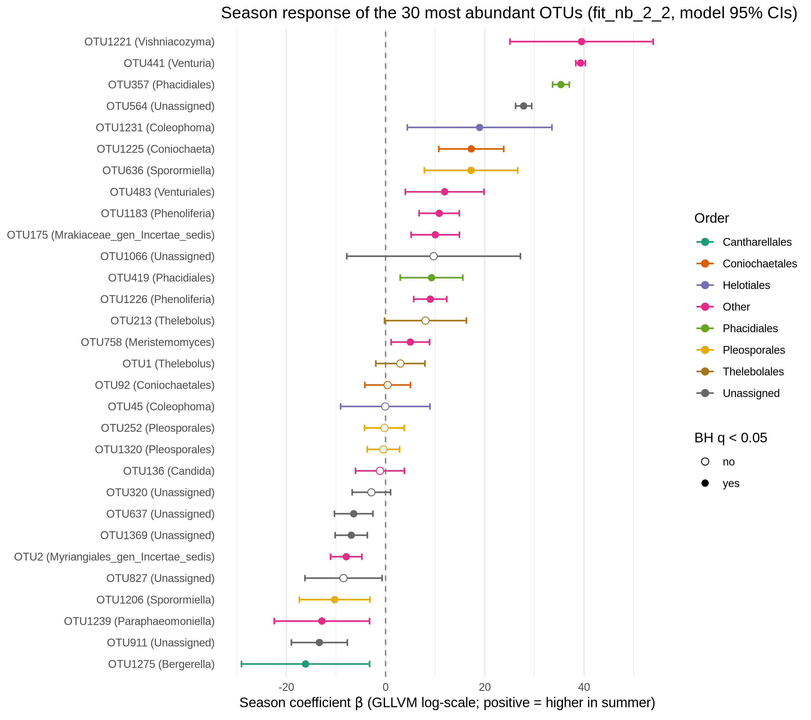

**Figure S-GLLVMa**: Season response of the 30 most abundant OTUs, each with its model 95% CI, coloured by Order; filled points are significant at BH q \< 0.05. Of the 327 modelled OTUs, 209 are significant, and the turnover is strongly asymmetric: 166 OTUs are enriched in summer versus 43 in winter. A further 134 OTUs are near-complete "on/off" seasonal switches (essentially absent in one season); these have real but non-interpretable point estimates (β in the hundreds, or exploding CIs) and are flagged (`separation`) and excluded both from this panel and from Table S-GLLVMb, which reports only well-estimated OTUs; they are retained in the full per-OTU table (`tables/gllvm_perOTU_season_coef.csv`).

```{r tab-gllvm-otu}
#| echo: false
suppressMessages(library(dplyr)); library(knitr)
oc  <- read.csv("tables/gllvm_perOTU_season_coef.csv", stringsAsFactors = FALSE)
well <- oc %>% filter(!separation, sig)
fmt <- function(df) df %>% transmute(OTU = taxon, Genus, Order,
                                     beta = round(beta_season, 2),
                                     `95% CI` = sprintf("[%.1f, %.1f]", ci_lo, ci_hi),
                                     `BH q` = signif(p_adj, 2))
kable(well %>% arrange(desc(beta_season)) %>% slice_head(n = 8) %>% fmt(),
      caption = "Table S-GLLVMb(i). Most strongly summer-enriched well-estimated OTUs (BH q < 0.05).")
kable(well %>% arrange(beta_season) %>% slice_head(n = 8) %>% fmt(),
      caption = "Table S-GLLVMb(ii). Most strongly winter-enriched well-estimated OTUs (BH q < 0.05). Full per-OTU table: tables/gllvm_perOTU_season_coef.csv.")
```

Two results connect directly to the dominance analysis (Section 5.4). The coprophilous taxa that dominate summer read share behave differently under the model: OTU636 (*Sporormiella*, β ≈ 17.2) and OTU1225 (*Coniochaeta*, β ≈ 17.3) are both significantly summer-enriched, but OTU1 (*Thelebolus*, β ≈ 3.0) is not significant (95% CI crosses zero) — its large summer read share is carried by a few samples and high among-individual variance rather than a model-robust per-OTU shift. On the winter side, the dark taxon OTU1369 (class Dothideomycetes) is significantly winter-enriched (β ≈ −6.9): the GLLVM independently corroborates the dominance/E1 finding that winter's persistent OTU is a taxonomically unresolved lineage.

Aggregating to genus gives the broader pattern:


**Figure S-GLLVMc**: Genus-level seasonal response. (A) Heatmap of the abundance-weighted mean β per genus; (B) the same as a point-range plot with bootstrapped 95% CIs. Warm = summer-enriched, cool = winter-enriched.

```{r tab-gllvm-genus}
#| echo: false
suppressMessages(library(dplyr)); library(knitr)
gt <- read.csv("tables/genus_table_season.csv", stringsAsFactors = FALSE)
gt %>% transmute(Order, Genus, n_OTUs,
                 `total reads` = round(total_w_abund),
                 `median beta` = round(median_beta_season, 1),
                 `weighted-mean beta` = round(w_mean_beta_season, 1)) %>%
  arrange(desc(`weighted-mean beta`)) %>%
  kable(caption = "Table S-GLLVMc. Genus-level seasonal responses (β = summer vs winter, GLLVM log scale) for genera passing the abundance/effect-size thresholds. Full detail in models/genus_table_season.csv.")
```

### 6.3 Residual co-occurrence beyond Season

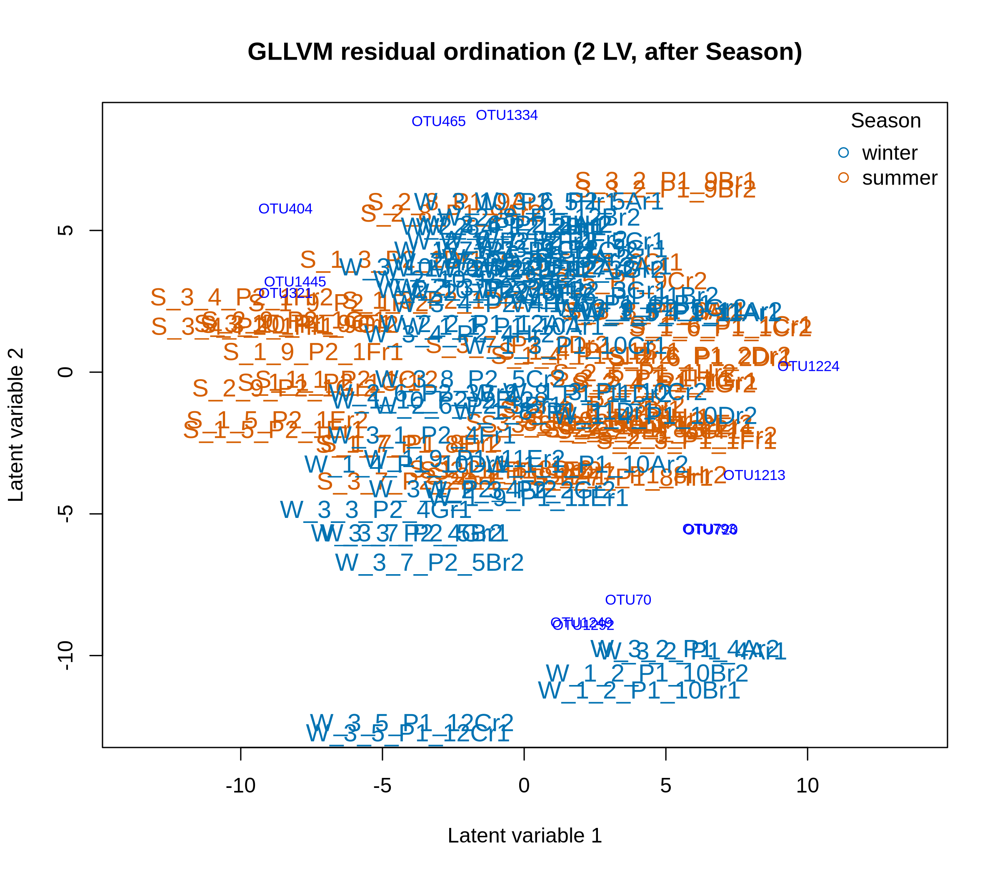

**Figure S-GLLVMb**: Model-based ordination on the two latent variables of `fit_nb_2_2` — the residual OTU co-occurrence structure that remains *after* Season and the random effects are accounted for. Sites are coloured by Season; the eight strongest species loadings are labelled. This is the model-based counterpart to the unconstrained robust-Aitchison PCoA in Section 4.1: because Season is already in the model as a fixed effect, the two seasons overlap substantially here, confirming that Season captures a coherent axis of the community rather than all of its covariation. A small set of winter sites separates along the second latent variable (winter scores are \~3.4× as variable as summer ones on that axis, Fligner–Killeen p = 0.013; seven of the eight most extreme sites are winter). This is specific to that axis and is not a statement about which season is more heterogeneous overall — on the first latent variable summer is the more variable season, and Section 4.2 finds ummer significantly the more dispersed in total composition (mean distance to centroid 24.8 versus 13.6, p = 0.002).

::: {.content-visible when-profile="docs"}
#### Documentation notes — Section 6 {.unnumbered}

*Documentation build only; omitted from the submitted appendix. Move any paragraph, callout or table here that belongs in the full record rather than in the supplement.*
:::

## Section 7: Diet-tracking and Bayesian models — H2 and H3 {.page-break-before}

### 7.1 Diet richness and fungal diversity — Bayesian mechanism (H2)

Section 5 established the coarse prediction of H2: summer communities are richer than winter ones, in step with the richer summer diet. Here we test the finer mechanism directly, on the subset of samples for which we have paired plant ITS2 diet data (**n = 27** dung samples): does an individual sample's fungal diversity track the richness of its own dietary plant community? Fungal Hill diversity is modelled as a function of standardised plant (diet) richness, adjusting for Season, in a Bayesian linear model (brms). H2's mechanism is supported if the plant-richness slope is positive with posterior probability P(slope \> 0) \> 0.95.

The preregistration specified Year and individual bird as random intercepts. At this matched sample size that structure is unidentifiable — 27 of the 27 samples are distinct individuals and Year spans only three levels — and the random-effects model does not converge. We therefore report two complementary, cleanly-converged fixed-effect models that bracket the estimate: a **Season-adjusted** model (`plant_richness + Season + Year`, Year as a fixed effect) and a more parsimonious **drop-Year** model (`plant_richness + Season`). Both use weakly-informative standardised priors (slope \~ Normal(0, 1)).

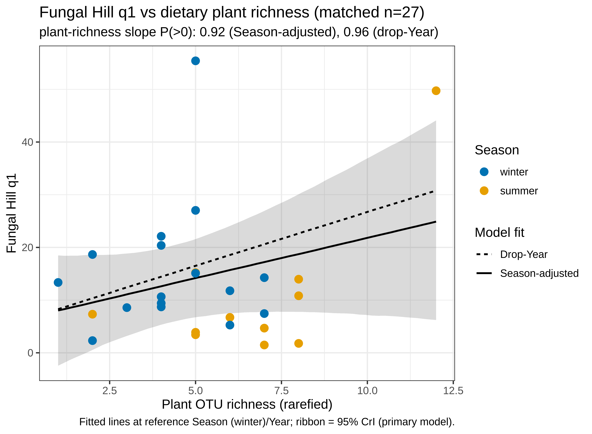

**Figure S9**: Per-sample fungal Hill q1 diversity against rarefied dietary plant richness (n = 27 matched samples), coloured by Season. Both model fits are shown — Season-adjusted (solid) and drop-Year (dashed) — with the 95% credible ribbon for the primary Season-adjusted model. Fitted lines are drawn at the reference Season/Year; the quantity of interest is the common positive slope.

```{r tab-h2mech-compare}
#| echo: false
library(knitr)
mc <- read.csv("tables/H2_mechanism_model_comparison.csv", check.names = FALSE)
mc_disp <- data.frame(
  Model       = mc$model,
  Structure   = mc$formula,
  `Slope (median)` = round(mc$median, 3),
  `95% CrI`   = sprintf("[%.2f, %.2f]", mc$lwr95, mc$upr95),
  `P(slope>0)`= round(mc$P_gt0, 3),
  Divergences = mc$divergences,
  `Clears 0.95?` = ifelse(mc$supported, "yes", "no"),
  check.names = FALSE)
kable(mc_disp,
      caption = "Table S12. H2-mechanism: the two complementary Bayesian models of fungal Hill q1 diversity vs. dietary plant richness (standardised slope). Both converge cleanly (0 divergences, Rhat < 1.01) and place the diet-richness slope positive.")
```

Both models place the diet-richness slope firmly positive (medians +0.28 and +0.38 standard deviations of fungal diversity per standard deviation of plant richness), with posterior support of **P(slope \> 0) = 0.92** (Season-adjusted) and **0.96** (drop-Year). The drop-Year model clears the preregistered 0.95 threshold; the Season-adjusted model sits just below it. The direction of the effect is therefore consistent, and the weight of posterior evidence favours the predicted positive diet-richness → fungal-diversity relationship.

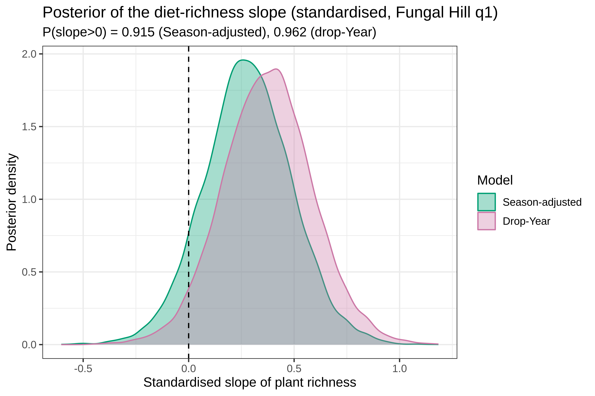

**Figure S10**: Posterior distribution of the standardised diet-richness slope for both models. The mass of both posteriors lies to the right of zero (dashed line).

The signal is consistent across the choice of Hill order: refitting with richness (q0) and Simpson-equivalent (q2) diversity as the outcome gives positive slopes throughout, with P(slope \> 0) between 0.89 and 0.96 (Table S13). No specification reverses the direction.

```{r tab-h2mech-sens}
#| echo: false
library(knitr)
sn <- read.csv("tables/H2_mechanism_sensitivity.csv", check.names = FALSE)
sn_disp <- data.frame(
  `Hill order` = sn$metric,
  Model        = sn$model,
  `Slope (median)` = round(sn$median, 3),
  `95% CrI`    = sprintf("[%.2f, %.2f]", sn$lwr95, sn$upr95),
  `P(slope>0)` = round(sn$P_gt0, 3),
  check.names = FALSE)
kable(sn_disp,
      caption = "Table S13. Sensitivity of the diet-richness slope to Hill order (q0 richness, q1 Shannon, q2 Simpson) under both model structures. All twelve estimates are positive.")
```

::: {.content-visible when-profile="docs"}
**Ecological interpretation.** Dietary plant richness is markedly higher in summer than winter, so most of the diet–diversity relationship is expressed through the *seasonal* contrast — which is exactly the diet-driven mechanism H2 proposes: the seasonal diet shift is the dominant axis of variation in propagule supply, and summer's richer plant intake is accompanied by a richer fungal community. Within a single season the diet-richness gradient is short (only a few plant OTUs separate one sample from another), so the per-sample effect is correspondingly modest.

Consistent with a modest, gradient-limited signal at this sample size, the estimate is carried by the samples at the extremes of the diet-richness range: a single leave-one-out omission moves the slope within the ranges in Table S14, and rank (Spearman) correlations within each Season are close to zero — the parametric slope reflects the between-season spread of the gradient more than fine within-season covariation. The honest reading is therefore a **weak, directionally-consistent signal**: fungal diversity does tend to rise with dietary plant richness, primarily at the seasonal scale, but the per-sample effect is not resolved decisively at n = 27 and is a clear target for a larger diet-matched sample.
:::

The honest reading is a directionally-consistent signal: fungal diversity does tend to rise with dietary plant richness, primarily at the seasonal scale, but the per-sample effect is not resolved decisively at n = 27 and is a clear target for a larger diet-matched sample.

```{r tab-h2mech-robust}
#| echo: false
library(knitr)
rb <- read.csv("tables/H2_mechanism_robustness.csv", check.names = FALSE)
names(rb) <- c("Check", "Group", "Quantity", "Value")
kable(rb,
      caption = "Table S14. Robustness of the diet-richness slope: leave-one-out influence (frequentist slope, its range across single-sample omissions, and the most influential sample) and within/between-Season Spearman rank correlations.")
```

### 7.2 OTU–plant covariation (H3) - H3 not supported - still working 

Section 7.1 asked whether overall fungal diversity tracks overall diet richness. H3 is finer-grained and taxon-resolved: does each fungal OTU covary with particular diet-plant taxa, and — the preregistered contrast — do recognised coprophilous taxa show the diffuse, non-specific plant associations expected of dung specialists dispersed independently of any host plant, while other taxa may show the tight, single-plant covariation that would flag a likely ingested endophyte passenger? Inference is strictly forward-directional: a tight single-plant association is read as evidence of a likely ingested passenger; a diffuse or absent association is not read as evidence of gut/dung residency.

**Model.** We fit a single hierarchical joint negative-binomial model (brms) to the diet-matched subset. To retain as many matched samples as possible we use the PCR-replicate-level, minimally depth-filtered object (mirroring the GLLVM of Section 6) rather than the collapsed, 10,000-read-filtered object of Sections 4–5; this recovers three additional low-depth winter dung samples that carry paired plant data, raising the matched subset to **n = 30 biological samples (60 PCR-replicate libraries; 19 winter, 11 summer)**. Each fungal OTU count is modelled with a per-replicate log-library-size offset (so shallow libraries are accommodated, not discarded), the six dominant diet-plant genera (rCLR-transformed, standardised) as predictors, Season and Year as population-level covariates, per-OTU varying intercepts and plant slopes (the partial-pooling "joint model"), and a per-OTU biological-sample random effect so the two PCR replicates of a sample are treated as replication rather than independent samples. This substitutes a sample random effect for the preregistered "individual" one (unidentifiable here — nearly every sample is a distinct bird), for the same reason as Section 7.1. Forty-six OTUs present in ≥5 of the 30 samples are modelled. For each OTU we summarise the specificity of its plant coefficients with a Herfindahl–Hirschman index (HHI) of the \|plant slopes\| — ≈1/6 = 0.17 if covariation is spread evenly across all six genera, up to 1 if concentrated on a single plant — and flag a resolved single-plant association when the 90% credible interval of the OTU's strongest plant slope excludes zero. The preregistered contrast compares specificity between FUNGuild-flagged coprophilous OTUs and plant-associated (endophyte/phyllosphere/plant-saprotroph) OTUs. The model converged cleanly (maximum R̂ = 1.004, no divergent transitions).


**Figure S11**: Posterior-median covariation of each modelled fungal OTU (rows, ordered by specificity and grouped by FUNGuild guild class) with each dominant diet-plant genus (columns), on the log (negative-binomial) scale; red = positive, blue = negative. The three recognised coprophilous taxa (*Thelebolus*, *Coniochaeta*, *Sporormiella*) covary *positively* and strongly with *Vaccinium*, whereas most other OTUs covary negatively with it.

```{r tab-h3-spec}
#| echo: false
library(knitr)
si <- read.csv("tables/H3_specificity_index.csv", check.names = FALSE)
si_disp <- head(si, 12)
kable(data.frame(
  OTU            = si_disp$OTU_ID,
  Genus          = ifelse(is.na(si_disp$Genus), "—", si_disp$Genus),
  `Prev. (/30)`  = si_disp$prevalence,
  Specificity    = round(si_disp$specificity_HHI, 2),
  `Top plant`    = si_disp$dominant_plant,
  `Top slope [90% CrI]` = sprintf("%.2f [%.2f, %.2f]", si_disp$dom_slope_med,
                                  si_disp$dom_slope_lwr90, si_disp$dom_slope_upr90),
  Resolved       = ifelse(si_disp$resolved_single_plant, "yes", "—"),
  Guild          = si_disp$guild_group,
  check.names = FALSE),
  caption = "Table S15. The twelve most plant-specific fungal OTUs (of 46 modelled), ranked by the Herfindahl specificity of their plant coefficients. Only OTU1 (Thelebolus) reaches a resolved single-plant association (its Vaccinium slope's 90% CrI excludes zero). Diffuse baseline (six genera) = 0.17.")
```

**Result.** For almost every OTU the plant covariation is too weak to resolve at this sample size: of the 46 OTUs, **only one — OTU1 (*Thelebolus*) — shows a resolved single-plant association** (a strong positive *Vaccinium* slope, median +2.30 on the log scale, 90% CrI \[0.18, 4.62\]). This single tight association runs *opposite* to the preregistered expectation: *Thelebolus* is a recognised coprophilous dung specialist, not a phyllosphere/endophyte passenger. More generally, the three coprophilous taxa are the *most* plant-concentrated OTUs in the dataset, not the least (Figure S12): the coprophilous group has a higher median specificity than the plant-associated group (0.38 vs 0.30) — the reverse of the predicted "coprophilous = more diffuse" pattern. The contrast is not supported in either direction under uncertainty: a one-sided Wilcoxon test of the preregistered direction gives p = 0.72, and propagating the full posterior, P(coprophilous more diffuse) = 0.36. The genus-list sensitivity grouping (coprophilous = *Thelebolus*/*Sporormiella*/*Coniochaeta*) tells the same story (0.51 vs 0.30).

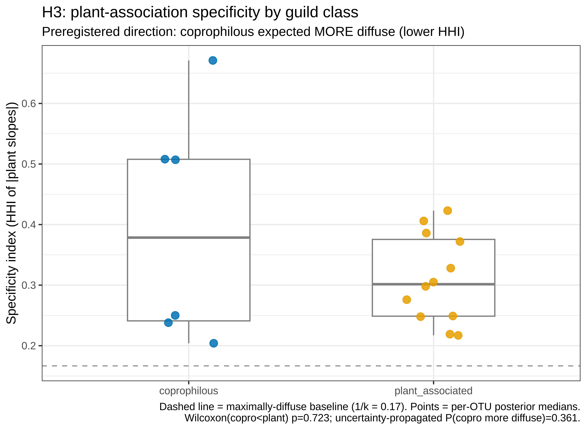

**Figure S12**: Per-OTU plant-association specificity (Herfindahl index) by FUNGuild guild class. Contrary to the preregistered prediction, coprophilous OTUs are if anything *more* plant-concentrated than plant-associated ones. Dashed line = maximally-diffuse baseline (1/6).

```{r tab-h3-contrast}
#| echo: false
library(knitr)
ct <- read.csv("tables/H3_specificity_contrast.csv", check.names = FALSE)
kable(data.frame(
  Grouping                    = ct$grouping,
  `n copro`                   = ct$n_coprophilous,
  `n plant-assoc`             = ct$n_plant_assoc,
  `Copro HHI`                 = round(ct$copro_spec_med, 2),
  `Plant-assoc HHI`           = round(ct$plant_spec_med, 2),
  `Wilcoxon p (copro<plant)`  = round(ct$wilcox_p_copro_lower, 2),
  `P(copro more diffuse)`     = round(ct$P_copro_lower, 2),
  check.names = FALSE),
  caption = "Table S16. Preregistered coprophilous-vs-plant-associated specificity contrast (FUNGuild primary grouping; COPRO_GENERA genus list as sensitivity). Neither grouping supports the predicted 'coprophilous more diffuse' direction. The full per-OTU × plant coefficient table is provided as tables/H3_perOTU_plant_coef.csv (Table S17).")
```

**Interpretation.** H3, as preregistered, is **not supported**: taxonomically recognised coprophilous taxa do *not* show more diffuse plant associations than other taxa — if anything the reverse. The single interpretable plant signal is a *Vaccinium*–*Thelebolus* covariation, and its ecology is the opposite of the "ingested passenger" reading H3 was built to detect: *Thelebolus* is a dung specialist, and *Vaccinium* (with *Empetrum*) is the winter browse of ptarmigan at this site. Because Season is already a covariate this is a within-season-adjusted association, but the residual gradient is short; the most parsimonious reading is that the winter-browse plants and the persistent dung-fungal core co-vary as parallel seasonal signatures of the same samples, not that *Thelebolus* is carried into the gut on *Vaccinium* tissue. This dovetails with Section 6, where *Thelebolus* (OTU1) was the one coprophile *without* a clean seasonal differential-abundance signal, and with the E2 documentation in Section 3.2.

**Limitation.** Even at n = 30 the diet is dominated by a few plant genera (*Betula* near-ubiquitous, then *Vaccinium*/*Empetrum*), so specificity can be assessed over only \~6 genera and the coprophilous group is small (6 OTUs). We therefore report H3 as a directional, exploratory result rather than a decisive test — and, consistent with the forward-directional inference rule, the absence of tight single-plant passenger signatures is **not** evidence that the dung mycobiome is gut-resident. A larger, more diet-even matched sample is the necessary next step.

### 7.3 OTU–plant covariation — GLLVM cross-check (H3)

To check that the H3 verdict of Section 7.2 is not an artefact of one modelling framework, we repeat the analysis with a generalised linear latent-variable model (GLLVM) — the same model-based framework used for the OTU-resolved H1 in Section 6, now with the diet-plant predictors added. Everything about the data is held identical to the Bayesian model: the same PCR-replicate-level matched subset (**n = 30 biological samples, 60 libraries; 46 OTUs present in ≥5 samples**), the same six standardised diet-plant genera (rCLR-transformed), the same per-library log-size offset, and the same specificity index and preregistered coprophilous-vs-plant-associated contrast. Only the estimator differs, which is the point: agreement across two very different fitting machineries is stronger evidence than either alone.

**Model.** Each OTU's counts are modelled with a negative-binomial GLLVM (`gllvm`), with Season and Year as community covariates, a per-OTU (species-specific) *fixed* slope for each plant genus, a biological-sample random row effect (so the two PCR replicates of a sample count as replication, not independent samples), and the log-library-size offset. We fit 0, 1 and 2 residual latent variables and select by AIC; here **num.lv = 0** is preferred — beyond the sample random effect the latent variables capture no further residual co-occurrence (so, unlike Section 6, there is no residual ordination to show). One difference from the Bayesian model is forced by the software: the natural partial-pooling analog (`gllvm`'s `randomX` species-specific *random* slopes) is silently dropped on this dataset, returning no plant-slope parameters at all. We therefore estimate the plant slopes as *fixed* per-OTU coefficients with Wald standard errors — an **unpooled** frequentist estimate that brackets the Bayesian *pooled* one from the other side. Rare on/off OTUs push their fixed coefficients toward ±∞ (near-separation); as in Section 6 these are flagged (16 of 46 OTUs) and excluded from the specificity ranking, contrast and plots, leaving **30 well-estimated OTUs**. Specificity is the same Herfindahl index of the \|plant slopes\|; a *resolved single-plant association* here means the 90 % Wald interval of an OTU's strongest plant slope excludes zero.

```{r tab-h3g-aic}
#| echo: false
library(knitr)
mc <- read.csv("tables/gllvm_H3_model_comparison.csv", check.names = FALSE)
kable(data.frame(
  Model    = mc$model,
  `num.lv` = mc$num_lv,
  Plants   = ifelse(mc$plants, "yes", "no"),
  logLik   = round(mc$logLik, 1),
  AIC      = round(mc$AIC, 1),
  dAIC     = round(mc$dAIC, 1),
  check.names = FALSE),
  caption = "Table S18. GLLVM H3 model comparison (AIC). Latent variables add nothing beyond the sample random effect (num.lv = 0 preferred among the plant models), and — notably — the null model with no plant predictors is itself AIC-preferred over the plant models (dAIC ≈ 117): the per-OTU plant slopes do not improve fit enough to justify their parameters, an independent echo of the 'too weak to resolve' result of Section 7.2.")
```


**Figure S13**: Per-OTU fixed plant slopes (GLLVM, log scale; red = positive, blue = negative) for the 30 well-estimated OTUs, rows ordered by specificity and grouped by FUNGuild guild class — the frequentist counterpart of Figure S11. As in the Bayesian model, the coprophilous taxa covary *positively* with *Vaccinium* rather than diffusely.

```{r tab-h3g-spec}
#| echo: false
suppressMessages(library(dplyr)); library(knitr)
si <- read.csv("tables/gllvm_H3_specificity_index.csv", check.names = FALSE)
si_disp <- si %>% filter(!separation) %>% head(12)
kable(data.frame(
  OTU            = si_disp$OTU_ID,
  Genus          = ifelse(is.na(si_disp$Genus), "—", si_disp$Genus),
  `Prev. (/30)`  = si_disp$prevalence,
  Specificity    = round(si_disp$specificity_HHI, 2),
  `Top plant`    = si_disp$dominant_plant,
  `Top slope [90% CI]` = sprintf("%.2f [%.2f, %.2f]", si_disp$dom_slope_med,
                                 si_disp$dom_slope_lwr90, si_disp$dom_slope_upr90),
  Resolved       = ifelse(si_disp$resolved_single_plant, "yes", "—"),
  Guild          = si_disp$guild_group,
  check.names = FALSE),
  caption = "Table S19. The twelve most plant-specific well-estimated OTUs under the GLLVM, ranked by Herfindahl specificity. Without the Bayesian model's shrinkage the unpooled Wald intervals resolve many more single-plant slopes; the strongest resolved coprophilous signal is Sporormiella (OTU636) with Vaccinium. Diffuse baseline (six genera) = 0.17.")
```

**Result.** The GLLVM reaches the **same verdict as the Bayesian model — H3 is not supported** — and does so through instructively different intermediate numbers. Because the fixed-slope estimator applies no shrinkage, its Wald intervals resolve **15 of the 30** well-estimated OTUs to a single-plant association (versus 1 of 46 under the pooled Bayesian model). But those resolved associations are spread across guilds rather than concentrated in the non-coprophilous taxa H3 predicts, so they do *not* produce the specificity difference the hypothesis requires. On the preregistered contrast the coprophilous group is **not** resolvably more diffuse than the plant-associated group: median specificity 0.21 (coprophilous) vs 0.24 (plant-associated), one-sided Wilcoxon p = 0.42, and propagating the Wald uncertainty P(coprophilous more diffuse) = 0.64 — straddling the no-difference value of 0.5. The genus-list sensitivity grouping runs the other way (0.25 vs 0.24, p = 0.81). And, as above, AIC prefers the plant-free null model outright. The strongest resolved coprophilous signal is again a *positive Vaccinium* slope — here *Sporormiella* (OTU636, +12.3, 90 % CI \[6.7, 17.8\]), the *Sporormiella* counterpart of the Bayesian model's *Vaccinium*–*Thelebolus* signal — the opposite of the diffuse, passenger-free pattern H3 expects of a dung specialist.

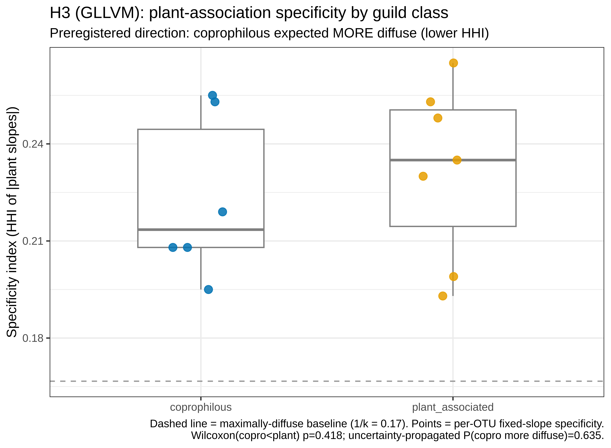

**Figure S14**: Per-OTU GLLVM specificity by FUNGuild guild class (frequentist counterpart of Figure S12). Coprophilous OTUs are not resolvably more diffuse than plant-associated ones. Dashed line = maximally-diffuse baseline (1/6).

```{r tab-h3g-contrast}
#| echo: false
library(knitr)
ct <- read.csv("tables/gllvm_H3_specificity_contrast.csv", check.names = FALSE)
kable(data.frame(
  Grouping                    = ct$grouping,
  `n copro`                   = ct$n_coprophilous,
  `n plant-assoc`             = ct$n_plant_assoc,
  `Copro HHI`                 = round(ct$copro_spec_med, 2),
  `Plant-assoc HHI`           = round(ct$plant_spec_med, 2),
  `Wilcoxon p (copro<plant)`  = round(ct$wilcox_p_copro_lower, 2),
  `P(copro more diffuse)`     = round(ct$P_copro_lower, 2),
  check.names = FALSE),
  caption = "Table S20. GLLVM coprophilous-vs-plant-associated specificity contrast (FUNGuild primary; COPRO_GENERA genus list as sensitivity), the frequentist counterpart of Table S16. Neither grouping supports the predicted 'coprophilous more diffuse' direction. The full per-OTU × plant coefficient table (with Wald z, p and BH-q) is provided as tables/gllvm_H3_perOTU_plant_coef.csv.")
```

**Interpretation.** Two independent frameworks — a partial-pooling Bayesian joint model and an unpooled frequentist GLLVM — give the same answer: recognised coprophilous taxa are **not** more diffuse in their plant associations than other taxa, so H3 as preregistered is not supported, and the one robust piece of ecology (a positive coprophile–*Vaccinium* covariation, *Thelebolus* under one model, *Sporormiella* under the other) is the reverse of the ingested-passenger signature the test was built to detect. The two models disagree only on how many single-plant slopes count as "resolved," and that gap is exactly the expected footprint of shrinkage — the pooled model is conservative, the unpooled one liberal — not an ecological disagreement. Consistent with the forward-directional inference rule, neither the sparse Bayesian resolutions nor the plentiful GLLVM ones are read as evidence about gut residency; the honest reading remains that these winter-browse plants and the persistent dung-fungal core co-vary as parallel seasonal signatures, and that a larger, more diet-even matched sample is needed to test single-taxon passenger transport directly.

::: {.content-visible when-profile="docs"}
#### Documentation notes — Section 7 {.unnumbered}

*Documentation build only; omitted from the submitted appendix. Move any paragraph, callout or table here that belongs in the full record rather than in the supplement.*
:::

## Section 8: Functional guilds — FUNGuild {.page-break-before}

Sections 3–6 characterise the seasonal shift *taxonomically* — which lineages turn over between winter and summer. This section asks what that community **does**: each OTU is assigned to a functional guild, and the guild composition of the dung mycobiome is compared across seasons. It is the descriptive counterpart to Section 9, which puts the same trait → season link inside a joint species distribution model. The two are deliberately built on the **same classification rule** so their results are directly comparable, but they differ in scope: Section 8 works on read shares across **all 1129 OTUs** of the canonical 52-sample object (no prevalence filter, because this is a description of where the reads go), whereas Section 9 models the 226 OTUs that pass its prevalence threshold. All results here are produced by `Scripts/8_functional_guilds.R`.

### 8.1 Guild assignment and the classification rule

Guild annotation uses **FUNGuild** (Nguyen et al. 2016), run through its command-line tool against each OTU's own taxonomy string, so that assignments are made at the finest rank available per OTU (species, genus, family or order) rather than by a single-rank lookup. **693 of the 1129 canonical OTUs (61.4%) receive a guild call** at a usable confidence ranking; the remaining 436 return no assignment — either because no matching taxonomy record exists in the FUNGuild database or because the match carries no ranked guild.

FUNGuild returns compound guild strings rather than a single label — for example `|Dung Saprotroph|-Endophyte-Plant Saprotroph-Undefined Saprotroph`. OTUs are collapsed to a single class by a priority rule (first match wins): dung saprotroph → plant-associated → pathotroph, with anything else falling to *other assigned* or *unassigned* (no FUNGuild call at all). Coprophily takes precedence deliberately: it is the guild the study is about, and it would otherwise be absorbed into a generic saprotroph category. An OTU counts as a dung saprotroph if FUNGuild lists `Dung Saprotroph` **or** its genus is one of the recognised coprophilous genera used throughout this appendix (Section 3.2). This is the identical rule used for the Section-10 guild trait.

```{r tab-guild-crosswalk}
#| echo: false
library(knitr)
cw <- read.csv("tables/guild_scheme_crosswalk.csv", stringsAsFactors = FALSE)
lv <- c("Dung saprotroph", "Plant-associated", "Pathotroph",
        "Other assigned", "Unassigned / dark")
cw <- cw[order(match(cw$guild_display, lv)), ]
kable(data.frame(
  `Guild (Section 8)`      = cw$guild_display,
  `Class (Section 9)`     = cw$guild_class,
  `n OTUs`                 = cw$n_OTUs,
  Note                     = cw$note,
  check.names = FALSE),
  row.names = FALSE,
  caption = "Table S-GUILDa. Crosswalk between the Section 8 display guilds and the Section 9 model trait, with OTU counts (1129 canonical OTUs). The two schemes are the same priority rule; they differ only in that Section 9's `other` class is split here according to whether the OTU carries a FUNGuild annotation at all.")
```

### 8.2 Guild composition shifts sharply between seasons

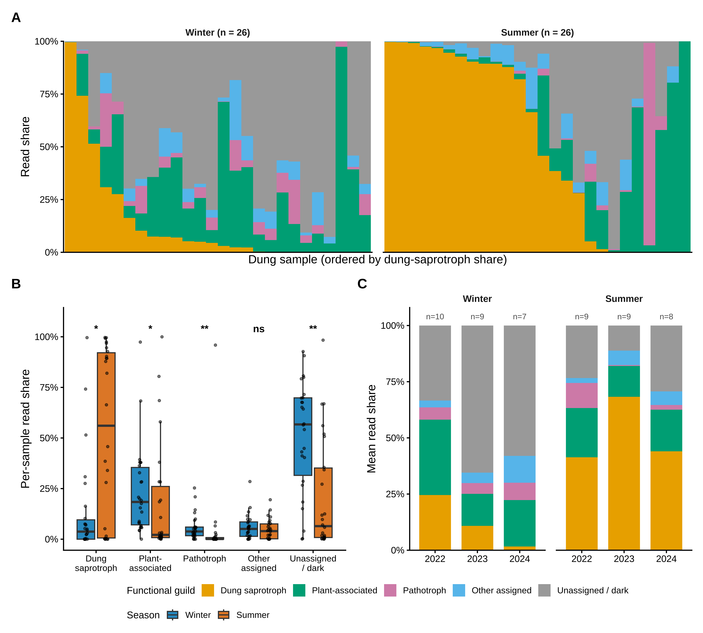

**Figure S-GUILDa**: Functional-guild composition of the dung mycobiome. **(A)** Per-sample guild read share, one stacked bar per dung sample, faceted by season and ordered within each season by dung-saprotroph share. **(B)** Per-sample read share by guild and season; boxes show the median and interquartile range, points are individual samples, and marks give the Benjamini–Hochberg-adjusted Wilcoxon rank-sum result (\* q \< 0.05, \*\* q \< 0.01, ns = not significant). **(C)** Mean guild read share by season and year, showing that the shift recurs in all three years. Colours are the Okabe–Ito colourblind-safe palette throughout.

Panels **(A)** and **(B)** here are the same object, rule and test as main-text **Fig. 1B–C** (Section 10.1) — the same result, not a second analysis. This figure is retained because panel **(C)**, the Season × Year consistency check of Section 8.3, has no main-text counterpart.

The seasonal contrast is large and concerns primarily two of the five guilds. **Dung saprotrophs rise from 13.6% of winter reads to 51.5% in summer**, while the **unassigned/dark fraction falls from 51.1% to 21.0%** — that is, roughly half of a typical winter sample consists of reads that FUNGuild cannot place at all, whereas a typical summer sample is dominated by recognised coprophilous fungi. Equivalently, the proportion of reads landing on a guild-annotated OTU rises from **49% in winter to 79% in summer**.

```{r tab-guild-season}
#| echo: false
library(knitr)
g <- read.csv("tables/guild_season_readshare.csv", stringsAsFactors = FALSE)
pc <- function(x) sprintf("%.1f", 100 * x)
kable(data.frame(
  Guild            = g$Guild,
  `Summer mean %`  = pc(g$mean_summer),
  `Winter mean %`  = pc(g$mean_winter),
  `Summer median %`= pc(g$median_summer),
  `Winter median %`= pc(g$median_winter),
  `Detected (S/W)` = paste0(g$prevalence_summer, "/", g$prevalence_winter),
  `p`              = signif(g$p_value, 2),
  `q (BH)`         = ifelse(is.na(g$q_value), "—", signif(g$q_value, 2)),
  check.names = FALSE),
  row.names = FALSE,
  caption = "Table S-GUILDb. Per-sample guild read shares by season (26 samples per season), with Wilcoxon rank-sum tests and Benjamini–Hochberg adjustment across the five guilds. 'Detected' gives the number of samples in which the guild occurs at all. The final row is a robustness check, not part of the BH family: it restricts the dung-saprotroph guild to OTUs matching a recognised coprophilous genus, discarding those assigned on the FUNGuild string alone.")
```

**The dung-saprotroph result does not depend on how generously that guild is defined.** The rule counts an OTU as coprophilous if FUNGuild lists `Dung Saprotroph` *or* its genus is a recognised coprophilous genus. Restricting it to the genus criterion alone drops 24 of the 37 OTUs and still gives **45.7% summer versus 8.5% winter** (p = 0.00094; final row of Table S-GUILDb). The signal is concentrated in a few abundant taxa — OTU1 (*Thelebolus*), OTU636 (*Sporormiella*) and OTU1225 (*Coniochaeta*) are the three largest contributors — which is consistent with the dominance analysis of Section 5.4 and with the differential-abundance results of Section 6, where *Sporormiella* OTU636 and *Coniochaeta* OTU1225 are both significantly summer-elevated.

### 8.3 The guild shift recurs in all three years

```{r tab-guild-year}
#| echo: false
library(knitr)
sy <- read.csv("tables/guild_season_year_readshare.csv", stringsAsFactors = FALSE)
lv <- c("Dung saprotroph", "Plant-associated", "Pathotroph",
        "Other assigned", "Unassigned / dark")
cells <- c("Winter 2022","Winter 2023","Winter 2024","Summer 2022","Summer 2023","Summer 2024")
sy$cell <- factor(paste(sy$Season, sy$Year), levels = cells)
mat <- tapply(sy$mean_share, list(factor(sy$Guild, levels = lv), sy$cell),
              function(z) z[1])
kable(cbind(Guild = lv, as.data.frame(round(100 * mat, 1), check.names = FALSE)),
      row.names = FALSE,
      caption = "Table S-GUILDc. Mean per-sample guild read share (%) by season and year. Cell sizes: winter 10/9/7 and summer 9/9/8 samples for 2022/2023/2024.")
```

Panel C of Figure S-GUILDa and Table S-GUILDc show the same ordering in every year: **the dung-saprotroph share is higher in summer than in winter in 2022, 2023 and 2024** (41.3% vs 24.5%, 68.3% vs 10.9%, and 44.0% vs 1.7% respectively). Within-year tests are significant for 2023 (q = 0.027) and marginal for 2024 (q = 0.053) but not for 2022 (q = 0.74), where two unusually coprophile-rich winter samples raise the winter mean and its variance. The direction is therefore consistent across all three years while the magnitude varies. This is the functional-guild analogue of the H1 result in Section 4.2, and the two agree closely: the compositional Season × Year interaction is significant there (p = 0.011), and the per-year breakdown ranks the years in the same order as the guild data — 2023 strongest, 2024 intermediate, 2022 weakest (Table S5b). Given three years and modest per-cell sample sizes, the safe reading is that the seasonal shift is directionally reproducible but of year-varying magnitude, not that it has a constant effect size.

::: {.callout-note when-profile="docs"}
**Interpretation and caveats.**

**What this adds.** The guild layer reproduces the seasonal signal independently of taxonomy and gives it a functional reading: summer dung supports an actively coprophilous community, winter dung does not. Section 9 tests the same link within a joint model and reaches a concordant conclusion — guild predicts seasonal *occurrence*, with dung saprotrophs more likely to occur in summer (posterior support 0.96) — so the descriptive and model-based views agree.

**Relation to the dark taxa (E1).** The winter unassigned share here (51.1%) closely tracks the dark-taxa share reported in Section 3.4 (51.3% of winter reads), but the two are **not the same set**: "unassigned" here means no FUNGuild annotation (436 OTUs), while "dark" in Section 3.4 means no confident genus in the canonical taxonomy (493 OTUs). They share 390 OTUs, and 103 OTUs lack a genus yet still receive a FUNGuild call at family or order level. The definitions coincide in winter but diverge in summer (21.0% unassigned versus 31.2% dark), so the two figures should not be used interchangeably. Section 3.4 establishes that a substantial part of this winter fraction is genuinely novel rather than merely absent from reference databases; the functional consequence is that **winter guild composition is the least well characterised part of this dataset**, and its apparent depletion of coprophiles is partly a statement about annotation coverage.

**Limitations.** (i) Read share is not biomass: PCR and copy-number biases mean these proportions describe sequence abundance, not fungal abundance. (ii) FUNGuild assignments are database-derived and inherit its taxonomic and geographic biases; assignments made at family or order level are necessarily coarser than species-level ones, and confidence rankings (Table S-GUILDb does not stratify by them) are `Probable` for the majority of assigned OTUs. (iii) The compositional constraint discussed above means that a guild's decline in relative terms need not imply any absolute decline. (iv) A guild label describes an ecological capability inferred from relatives, not a verified activity in this substrate.

**Supersedes.** The preliminary guild percentages previously recorded in this section were an interim workspace check that predated the finalized script; they were not reproducible from any committed code. The values above are produced by `Scripts/8_functional_guilds.R` and are reproducible from the staged CSVs in `tables/`.
:::

::: {.content-visible when-profile="docs"}
Section 9's residual `other` class mixes OTUs that *do* carry a FUNGuild call with 46 that have a taxonomic genus but **no** guild annotation at all; the latter carry roughly a tenth of winter reads. That conflation is harmless for a model trait but misleading in a read-share figure, so the two are separated here into **Other assigned** and folded into **Unassigned / dark** respectively. Table S-GUILDa reconciles the two schemes.

**Why FUNGuild and not FungalTraits.** Both annotation sources were built and compared. `fungaltraits_otu` (genus-level lookup via the `fungaltraits` package) covers 195 of 1129 OTUs (17%) and is a **strict subset** of the FUNGuild annotation (700 OTUs, 62%) — it contributes no unique coverage. On the 195 OTUs both annotate they agree on the exact `Guild` string only 37% of the time (49% on trophic mode), because collapsing to one record per genus discards the species-level resolution FUNGuild's per-OTU run retains. FUNGuild is therefore used as the sole guild source; FungalTraits is retained only as a coarse sensitivity check, and guild calls are never merged between the two for the same OTU.

**Means and medians tell different parts of this story, and both are reported.** For the plant-associated and pathotroph guilds the seasonal *means* are nearly identical (18.0% vs 23.4%, and 4.7% vs 5.8%) while the *medians* differ several-fold (2.1% vs 18.4%, and 0.1% vs 3.8%). The rank-based tests follow the medians and are significant for both. The reason is compositional rather than ecological: because dung saprotrophs occupy so much of a typical summer sample, every other guild is compressed toward zero in most summer samples, while a small number of summer samples in which coprophiles are absent carry large plant-associated or pathotroph fractions and pull the summer means back up. These guilds are better described as **relatively displaced in summer** than as absolute winter specialists — a limitation inherent to read shares, which are constrained to sum to one.
:::

## Section 9: Joint species distribution model — HMSC (H1 synthesis) {.page-break-before}

Sections 4–6 treat the seasonal signal one lens at a time: community dissimilarity (H1), per-sample diversity (H2), and per-OTU differential abundance (GLLVM). This section brings them into a single hierarchical model. We fit a joint species distribution model (HMSC — Hierarchical Modelling of Species Communities; `Scripts/10_hmsc.R`) that simultaneously (i) partitions each OTU's variance among Season, Year, and the nested sampling structure; (ii) asks whether an OTU's functional guild predicts how it responds to Season (the trait → environment link); (iii) recovers each OTU's seasonal niche for a like-for-like cross-check against the Section-6 GLLVM; (iv) estimates the residual co-occurrence left once Season, Year and traits are accounted for; and (v) tests for phylogenetic signal in seasonal niches. It is the model-based synthesis of the H1 story, fitted directly on the corrected canonical data (unlike the Section-6 GLLVM, which predates the depth-filter fix).

### 9.1 Model, design, and what is (and isn't) trustworthy

The model is fitted on the one-row-per-PCR-replicate object (`alldat_full$nopool`; 109 replicate rows from 55 biological dung samples), retaining the **226 OTUs present in ≥ 5 replicates** — the same prevalence rule used for the GLLVM/H3 analyses. Two response formulations are fitted in parallel: a **CLR-transformed abundance** model (Gaussian; CLR is the compositional normalisation in place of a library-size offset) and a **presence/absence** model (probit). Fixed effects are **Season** (winter as reference) **+ Year**; the species trait is the five-level functional **guild** class derived from FUNGuild (dung saprotroph, plant-associated, pathotroph, dark/unassigned, other — assigned by the priority rule in `Scripts/10_hmsc.R`, counts below). Random effects are latent factors at two levels: **biological sample** (the dung dropping, grouping its two PCR replicates) and **PCR replicate**.

```{r tab-hmsc-guild}
#| echo: false
library(knitr)
og <- read.csv("tables/hmsc_otu_guild.csv", stringsAsFactors = FALSE)
gt <- as.data.frame(table(factor(og$guild_class,
        levels = c("dung_saprotroph","plant_associated","pathotroph","dark_unassigned","other"))))
kable(data.frame(`Guild group` = gt$Var1, `n OTUs` = gt$Freq, check.names = FALSE),
      caption = "Table S-HMSCa. Functional-guild composition of the 226 modelled OTUs. FUNGuild returns a compound guild string per OTU; these are resolved to one class by the hierarchical priority rule in `Scripts/10_hmsc.R`, shared verbatim with Section 8. Dark/unassigned and 'other' together dominate the count — the modest coprophilous set (14 OTUs) nonetheless carries the strongest seasonal signal (Section 9.3–10.4).")
```

An **individual-bird** random level was deliberately **not** included. Microsatellite genotyping succeeded for only a handful of repeat birds, so a bird level (with unidentified droppings entered as singletons) would have \~51 units against 55 biological samples — effectively one-to-one with the sample level, confounding the two sets of latent factors. In the three-level version this stopped the CLR community-level parameters from converging and made the variance partition unstable; dropping it (leaving sample + PCR, mirroring the GLLVM's `(1 | Sample_ID_field)`) resolved both. Each model was fitted with four chains (1000 samples, thinning 50, 25,000 transient iterations).

```{r tab-hmsc-conv}
#| echo: false
library(knitr)
cv <- read.csv("tables/hmsc_convergence_psrf.csv", stringsAsFactors = FALSE)
lab <- c(clr = "CLR (abundance)", pa = "Probit (occurrence)", clr_phylo = "CLR + phylogeny")
kable(data.frame(
  Model = lab[cv$model],
  `Beta PSRF (median)` = cv$beta_psrf_med,
  `Beta % < 1.1` = cv$beta_pct_below_1.1,
  `Gamma PSRF (median)` = cv$gamma_psrf_med,
  `Gamma PSRF (max)` = cv$gamma_psrf_max,
  check.names = FALSE),
  row.names = FALSE,
  caption = "Table S-HMSCb. Gelman–Rubin convergence (potential scale reduction factor, PSRF) for the per-OTU niches (Beta) and the trait → response link (Gamma). The probit and phylogenetic models converge well; the CLR-Gaussian community-level Gamma does not (median 1.46). We therefore read the guild → Season inference (Section 9.3) from the probit model, and use the CLR model only for the variance partition and per-OTU niches, where it is well behaved.")
```

::: callout-note
**How to read the two response models.** Convergence is honest and not uniform. The **probit (occurrence)** model converges cleanly throughout (Beta median PSRF ≈ 1.01, 99.6% of Beta parameters below 1.1; Gamma median ≈ 1.01) and is the model we trust for the **guild → Season** statement. The **CLR (abundance)** model's per-OTU niches (Beta) and variance partition are well behaved and used as such, but its community-level **Gamma did not converge** (median PSRF ≈ 1.46) — so we do *not* quote CLR guild-response coefficients. This is the expected behaviour of a Gaussian JSDM with latent factors on a small, sparse compositional dataset, and it is why the two formulations are reported side by side rather than one alone.
:::

### 9.2 Variance partitioning: a reproducible seasonal axis within large individual heterogeneity

For every OTU the model decomposes the explained variance in CLR abundance into contributions from Season, Year, and the two random levels. Averaged across OTUs, **Season and Year together account for \~20% of per-OTU variance** (Season \~11%, Year \~8%), with the remainder carried by among-sample (biological dropping) and among-replicate structure.

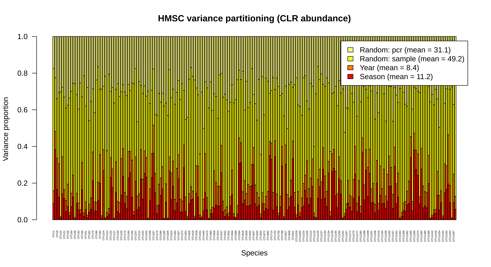

**Figure S-HMSCa**: Per-OTU variance partitioning (CLR abundance). Each vertical bar is one OTU; colours give the proportion of that OTU's variance attributable to Season, Year, the biological-sample random level, and the PCR-replicate random level. The Season + Year share is modest but pervasive across the community; individual-dropping heterogeneity (sample level) is the single largest component.

```{r tab-hmsc-vp}
#| echo: false
library(knitr)
vp <- read.csv("tables/hmsc_variance_partition.csv", check.names = FALSE)
comp <- c("Season","Year","Random: sample","Random: pcr")
cw  <- colMeans(vp[, comp])
byg <- aggregate(vp[, comp], list(Guild = vp$guild), mean)
tabb <- rbind(data.frame(Guild = "all OTUs (community mean)", t(cw), check.names = FALSE), byg)
tabb[, comp] <- round(tabb[, comp] * 100, 1)
kable(tabb, row.names = FALSE,
      col.names = c("Guild group", "Season %", "Year %", "Sample %", "PCR %"),
      caption = "Table S-HMSCc. Mean percentage of per-OTU variance attributed to each component, community-wide and by guild. The Season share is consistent across guilds and, at the community level (~11%), closely matches the Season effect size from the PERMANOVA in Section 4.2 (R² = 0.11) — two very different models converging on the same magnitude of seasonal turnover.")
```

The ecological reading is deliberately two-sided but coherent. The **seasonal axis is real and reproducible** — its community-mean magnitude (\~11%) independently recovers the PERMANOVA R² of 0.11 from Section 4.2 — yet at the level of an individual OTU it is *modest relative to how much dung communities differ from one dropping to the next*. In other words, HMSC formalises what the ordination and dominance analyses already suggested: season shifts the community in a consistent direction, on top of large individual-level variability. This decomposition, broken down by guild exactly as in Table S-HMSCc, is Figure 5B of the main text (Section 10.5).

### 9.3 Guild predicts seasonal occurrence — the coprophilous summer signature, formalised

The trait → environment matrix (Gamma) asks whether an OTU's guild predicts its seasonal response. Read from the well-converged probit model, it does. Relative to the winter reference, **dung saprotrophs are markedly more likely to occur in summer** (the reference-guild Season effect is positive with posterior support 0.96), and the yeast-rich "other" group shows the same direction (support 0.83); **pathotrophs lean the opposite way**, toward winter (support 0.85 in the negative direction). Plant-associated and dark/unassigned taxa show no clear guild-level seasonal preference.

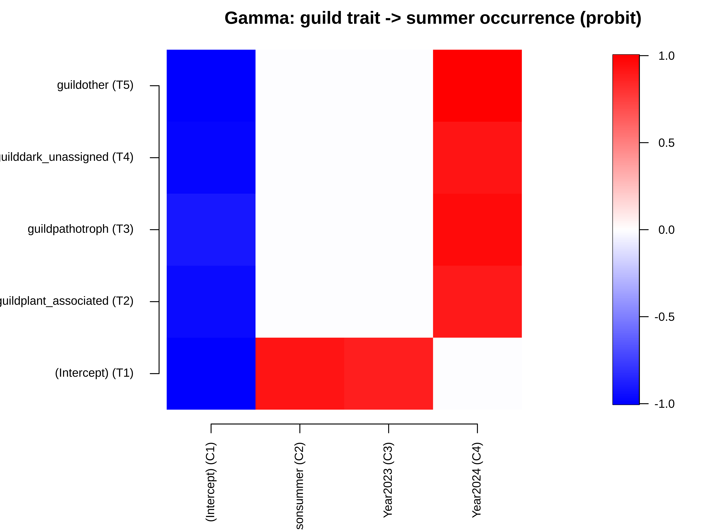

**Figure S-HMSCb**: Trait → environment link (Gamma) from the probit occurrence model. Cells show the posterior support for each guild's response to Season and Year; the dung-saprotroph summer signal and the guild-structured Year (2024) shift are the supported effects. Red = positive (summer / higher), blue = negative.

```{r tab-hmsc-gamma}
#| echo: false
library(knitr)
g <- read.csv("tables/hmsc_probit_gamma_CrI.csv", stringsAsFactors = FALSE)
g <- g[g$covariate == "Seasonsummer", ]
g$trait <- sub("^guild", "", g$trait)
g$trait[g$trait == "(Intercept)"] <- "dung saprotroph (reference)"
kable(data.frame(
  `Guild (trait)` = g$trait,
  `Gamma (summer)` = round(g$mean, 2),
  `95% CrI` = sprintf("[%.2f, %.2f]", g$CrI_2.5, g$CrI_97.5),
  `Support P(>0)` = round(g$support, 2),
  check.names = FALSE),
  row.names = FALSE,
  caption = "Table S-HMSCd. Probit Gamma — guild trait → probability of summer occurrence. The reference row is the dung-saprotroph guild's own Season effect; the other rows are deviations from it. Support is the posterior probability that the coefficient exceeds zero (values near 1 = summer, near 0 = winter).")
```

This is the guild-level counterpart to the taxonomic and dominance results (Sections 3.2, 5.4): the recognised coprophilous fungi — *Sporormiella*, *Thelebolus*, *Coniochaeta* — are not a fixed cold-adapted core but a **summer-occurring dung guild**, consistent with the richer, more fungal-propagule-laden summer diet. HMSC states that pattern as a trait effect estimated across all 226 OTUs at once, rather than genus by genus.

### 9.4 Per-OTU seasonal niches, and agreement with the GLLVM

Extracting each OTU's Season coefficient (Beta) from the CLR model recovers the same lineages at the individual level. The **most strongly summer-shifted OTUs are exactly the coprophilous dung saprotrophs** — *Sporormiella* (OTU636), *Thelebolus* (OTU1) and *Coniochaeta* (OTU1225) — while the **most strongly winter-shifted OTUs are dark/unassigned taxa**, led by OTU1369, the same taxonomically unresolved Dothideomycete that anchors winter dominance in Sections 5.4 and the E1 dark-taxa analysis (Section 3.4).

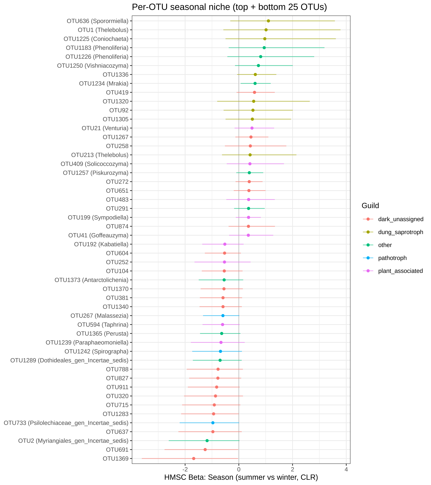

**Figure S-HMSCc**: Per-OTU seasonal niche (HMSC CLR Beta on Season; positive = summer), for the 25 most summer- and 25 most winter-shifted OTUs, coloured by guild, with 95% credible intervals. The summer extreme is dominated by dung saprotrophs (warm) and yeasts; the winter extreme by dark/unassigned taxa.

```{r tab-hmsc-beta}
#| echo: false
suppressMessages(library(dplyr)); library(knitr)
b <- read.csv("tables/hmsc_beta_season.csv", stringsAsFactors = FALSE)
fmt <- function(d) d %>% transmute(
  OTU = OTU_ID, Genus = ifelse(is.na(Genus), "—", Genus), Guild = guild,
  Beta = round(beta_season_mean, 2),
  `95% CrI` = sprintf("[%.2f, %.2f]", beta_season_CrI2.5, beta_season_CrI97.5),
  Support = round(beta_season_support, 2))
kable(b %>% arrange(desc(beta_season_mean)) %>% slice_head(n = 6) %>% fmt(), row.names = FALSE,
      caption = "Table S-HMSCe(i). Most strongly summer-shifted OTUs (HMSC CLR Beta on Season).")
kable(b %>% arrange(beta_season_mean) %>% slice_head(n = 6) %>% fmt(), row.names = FALSE,
      caption = "Table S-HMSCe(ii). Most strongly winter-shifted OTUs. Wide credible intervals on the summer coprophiles reflect the abundance model's larger uncertainty; direction and support are nonetheless consistent. Full table: tables/hmsc_beta_season.csv.")
```

The same per-OTU niche estimated on the **occurrence** scale — the probit model, whose Beta parameters are the ones that converge cleanly (Table S-HMSCb) — is considerably sharper: 55 of the 226 OTUs have a Season coefficient whose 95% credible interval excludes zero, against 4 in the abundance model. The two formulations rank the community's seasonal responses consistently (Spearman ρ = 0.82), and their per-OTU estimates aggregate to the guild-level Gamma of Section 9.3 to within 0.04, so nothing here contradicts the results above. What the occurrence scale does change is *which* taxa sit at the summer extreme. In abundance the coprophiles lead outright; in occurrence the shift is community-wide (157 of 226 OTUs point towards summer, median +0.70) and the extreme is occupied by cold-adapted basidiomycete yeasts — *Vishniacozyma*, *Mrakia*, *Piskurozyma*, *Phenoliferia* — with *Sporormiella* (OTU636) the only dung saprotroph in the top 25 and the mean dung-saprotroph rank falling to 125 of 226 (from 54 in abundance). The distinction is ecologically substantive rather than a modelling artefact: coprophilous fungi are what summer dung is largely *made of* in read share, but they are not the taxa that most reliably *appear* in summer. The winter extreme is unchanged and, if anything, more strongly resolved — dark/unassigned taxa and pathotrophs, with OTU1369 the most winter-shifted OTU in the community (β = −2.25, 95% CrI \[−3.53, −1.08\]). Both scales are carried forward: Figure 5A in Section 10.5 plots this occurrence-scale niche, while the abundance-scale table above remains the one comparable with the GLLVM below.

```{r tab-hmsc-beta-probit}
#| echo: false
suppressMessages(library(dplyr)); library(knitr)
bp <- read.csv("tables/hmsc_probit_beta_season.csv", stringsAsFactors = FALSE)
fmtp <- function(d) d %>% transmute(
  OTU = OTU_ID, Genus = ifelse(is.na(Genus), "—", Genus), Guild = guild,
  Beta = round(beta_season_mean, 2),
  `95% CrI` = sprintf("[%.2f, %.2f]", beta_season_CrI2.5, beta_season_CrI97.5),
  Support = round(beta_season_support, 3))
kable(bp %>% arrange(desc(beta_season_mean)) %>% slice_head(n = 6) %>% fmtp(), row.names = FALSE,
      caption = "Table S-HMSCe(iii). Most strongly summer- and winter-shifted OTUs on the occurrence scale (HMSC probit Beta on Season; positive = more likely to occur in summer). Unlike the abundance model, these intervals are mostly resolved — 55 of 226 OTUs exclude zero. Full table: tables/hmsc_probit_beta_season.csv.")
kable(bp %>% arrange(beta_season_mean) %>% slice_head(n = 6) %>% fmtp(), row.names = FALSE,
      caption = "Table S-HMSCe(iv). Most strongly winter-shifted OTUs, occurrence scale. Support is the posterior probability that the coefficient exceeds zero.")
```

Because the GLLVM (Section 6) is an independent model — negative-binomial counts rather than CLR abundance, a different random-effect structure, and fitted on a different OTU snapshot — the two provide a genuine cross-method check. Their per-OTU Season coefficients agree well.

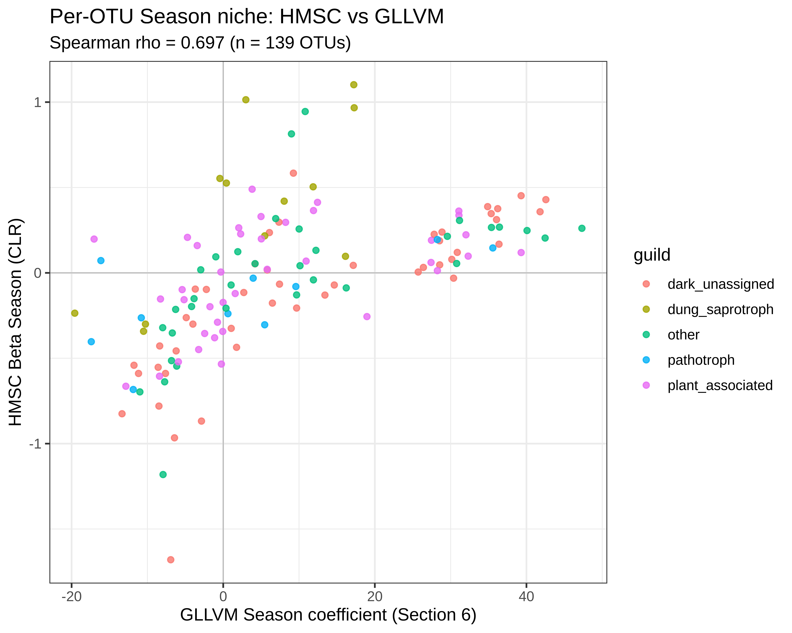

**Figure S-HMSCd**: HMSC (CLR Beta) versus GLLVM Season coefficient, one point per shared OTU (n = 139 after excluding the GLLVM's on/off near-separation OTUs, whose ±10³ coefficients are not comparable), coloured by guild. The two independent joint models rank the OTUs' seasonal responses consistently (**Spearman ρ = 0.70**), a strong convergent-validity result for H1 at OTU resolution.

### 9.5 Residual co-occurrence beyond Season

The biological-sample latent factors capture the co-occurrence structure that remains once Season, Year and guild are accounted for — pairs of OTUs that rise and fall together across droppings for reasons the fixed effects do not explain.


**Figure S-HMSCe**: Residual OTU–OTU association matrix (biological-sample level), showing only associations supported at ≥ 0.95 posterior probability and restricted to OTUs with at least one such association, ordered by hierarchical clustering. Red = positive residual co-occurrence, blue = negative. Blocks of positively associated OTUs indicate sub-communities that track together beyond the seasonal signal — candidate co-dispersed or co-sourced groups for follow-up.

### 9.6 Phylogenetic signal in seasonal niches

Adding the OTU phylogeny to the CLR model estimates rho, the degree to which closely related fungi share environmental niches. The signal is substantial and well-identified.

```{r tab-hmsc-rho}
#| echo: false
library(knitr)
rh <- read.csv("tables/hmsc_rho_phylo.csv", stringsAsFactors = FALSE)
kable(data.frame(
  `ρ (median)` = round(rh$median, 2),
  `95% CrI` = sprintf("[%.2f, %.2f]", rh$CrI_2.5, rh$CrI_97.5),
  `P(ρ>0)` = rh$P_gt0, ESS = rh$ess, PSRF = round(rh$psrf, 2),
  check.names = FALSE),
  row.names = FALSE,
  caption = "Table S-HMSCf. Phylogenetic signal parameter ρ from the phylogeny-augmented CLR model. Adding the phylogeny leaves the per-OTU niches and trait link essentially unchanged (Beta / Gamma correlation with the main model ≈ 0.94 / 0.90), so ρ is a genuine additional signal rather than a re-description of the fixed effects.")
```

With **ρ ≈ 0.72 (95% CrI \[0.60, 0.80\], P(ρ \> 0) = 1)**, seasonal niches are **phylogenetically conserved**: related lineages tend to shift together between winter and summer. This dovetails with the guild result — because guild is itself partly phylogenetically structured, the coprophilous summer signature is echoed as a broader phylogenetic pattern. It is reported as a secondary, exploratory result (the phylogeny-augmented model is a supplementary variant), but it is a clean, non-trivial one.

### 9.7 What the model predicts — and its honest limit

Finally, HMSC quantifies how much of the community it actually explains, in-sample versus out-of-sample (two-fold cross-validation, with folds split by biological sample so PCR replicates never leak across folds).

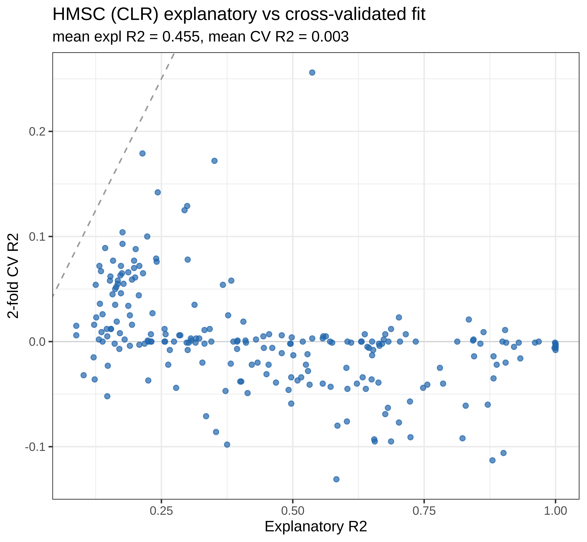

**Figure S-HMSCf**: Explanatory (in-sample) versus two-fold cross-validated per-OTU R² for the CLR model. Points lie far below the 1:1 line: the model fits the observed communities well but does not predict held-out droppings.

```{r tab-hmsc-r2}
#| echo: false
library(knitr)
r2 <- read.csv("tables/hmsc_predictive_R2_summary.csv", stringsAsFactors = FALSE)
lab <- c(clr = "CLR (abundance)", pa = "Probit (occurrence)")
kable(data.frame(
  Model = lab[r2$model],
  `Explanatory R²` = round(r2$mean_expl_R2, 3),
  `2-fold CV R²` = ifelse(is.na(r2$mean_cv_R2), "—", round(r2$mean_cv_R2, 3)),
  check.names = FALSE),
  row.names = FALSE,
  caption = "Table S-HMSCg. Community-mean explanatory vs cross-validated fit. Explanatory R² is moderate; cross-validated R² is near zero.")
```

The explanatory fit is moderate (community-mean R² ≈ 0.46 for the abundance model) but **cross-validated R² is near zero** — the model does not predict the fungal community of a dropping it has not seen. Far from undercutting the story, this is the quantitative statement of it: the seasonal and guild effects documented above are **real and directional but small against the dominant, idiosyncratic variation among individual droppings**. A ptarmigan's dung mycobiome is shaped by season in a reproducible way, yet remains largely individual — which is exactly what a transient, diet- and propagule-sourced community should look like, and a useful caution for anyone hoping to read season directly off a single sample.

**In summary**, HMSC does not overturn any earlier result; it unifies them and adds two things the single-lens analyses could not: a variance decomposition that sizes the seasonal signal against individual heterogeneity (and independently recovers the PERMANOVA effect size), and a formal trait- and phylogeny-level account of *why* the seasonal turnover looks the way it does — a summer-occurring coprophilous dung guild, phylogenetically conserved, riding on top of large among-individual variability.

::: {.content-visible when-profile="docs"}
#### Documentation notes — Section 9 {.unnumbered}

*Documentation build only; omitted from the submitted appendix. Move any paragraph, callout or table here that belongs in the full record rather than in the supplement.*
:::

## Section 10: Main-test figures {.page-break-before}

::: {.content-visible when-profile="docs"}
Sections 2–9 document the analyses in full. This section collects the figures that appear in the **main manuscript**, which present a deliberately reduced selection of those results for a general readership. It exists so that every main-text figure has exactly one authoritative definition.

**How this section works.**

-   Each main figure appears **once**, embedded from `figures/main/`, with its **full build code in the collapsible drop-down** beneath it (HTML version).
-   Every figure is written in three formats to the same stem: **`.png` and `.jpg` at 600 dpi** (raster, for whichever a submission system demands) and **`.pdf`** (vector, for print). The appendix embeds the PNG.
-   That code chunk **is the source of truth** for the figure. There is no parallel copy in `Scripts/`; nothing else generates these files.
-   The chunks are `eval: false`, so rendering this appendix never rebuilds a figure. To rebuild one after editing its chunk, run the runner from the `Supplementary/` directory:

``` bash
conda run -n r_env Rscript build_main_figure.R fig1-build
```

-   Each figure carries a one-line **provenance cross-reference** naming the thematic sections its inputs come from.
-   The thematic sections keep their own supplementary version of a plot only where it is genuinely different (a different object, more ranks, unfiltered); where it would be the same object, they cross-reference here instead.

**File-naming rule.** Supplementary figure files begin with `S`; main-text figure files are `Fig<N>_<slug>` and live in `figures/main/`. (One legacy exception is pending: `figures/Fig1_guild_season.png` is the *supplementary* Figure S-GUILDa of Section 8 and is scheduled for renaming.)
:::

### 10.1 Figure 1 — Composition and function of the dung mycobiome

*Provenance: Fig. 1A uses the genus-level composition of Section 3.1; Fig. 1B–C the guild assignments of Section 8.2. All three panels are computed on the canonical 52-sample object (`alldat$nopool`), and A and B share one sample axis.*

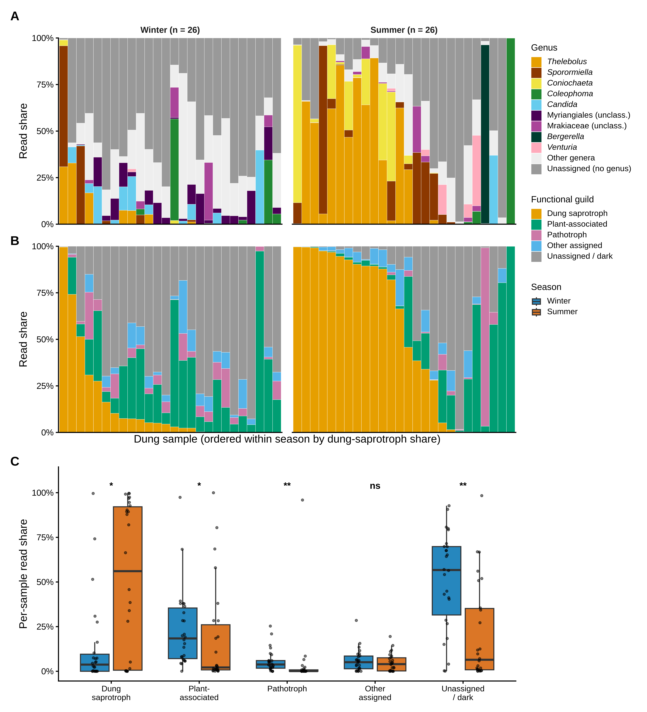

**Figure 1**: Composition and function of the willow ptarmigan dung mycobiome across seasons. **(A)** Per-sample genus-level read share — the nine most abundant genera, all remaining named genera pooled as *Other genera*, and reads on OTUs with no confident genus assignment as *Unassigned*. **(B)** Per-sample functional-guild read share for the **same 52 samples in the same order**, so each column is the same dropping in both panels; samples are ordered within each season by descending dung-saprotroph share. **(C)** Per-sample guild read share by season; boxes show the median and interquartile range, points are individual samples, and marks give the Benjamini–Hochberg-adjusted Wilcoxon rank-sum result across the five guilds (\* q \< 0.05, \*\* q \< 0.01, ns = not significant). *Thelebolus* in (A) and the dung-saprotroph guild in (B) intentionally share one colour — *Thelebolus* is that guild's dominant member — as do the two grey "no assignment" bands.

Read down a column and the two descriptions line up: the summer samples that are almost entirely dung saprotrophs in (B) are the samples dominated end-to-end by *Thelebolus*, *Sporormiella* and *Coniochaeta* in (A), while winter samples are a patchwork of many low-abundance genera sitting under a large unassigned fraction. The seasonal contrast is therefore the same result seen taxonomically and functionally: dung saprotrophs rise from 13.6% of winter reads to 51.5% in summer, and the unassigned fraction falls from 51.1% to 21.0% (panel C; Section 8.2). Panel A also makes the interpretive limit visible — roughly half of a typical winter sample is reads that carry no genus at all, which is the subject of the dark-taxa analysis in Section 3.4.

```{r fig1-build}
#| eval: false
#| echo: !expr knitr::is_html_output()
#| code-fold: true
#| code-summary: "Full build code for Figure 1 — the source of truth for figures/main/Fig1_composition_function.{png,pdf}"

# Figure 1 -- Composition and function of the dung mycobiome.
# Canonical object alldat$nopool (52 samples). Panels A and B share one sample
# axis; panel C tests the guild shares behind panel B.
# Rebuild:  conda run -n r_env Rscript build_main_figure.R fig1-build

suppressPackageStartupMessages({
  library(phyloseq); library(ggplot2); library(patchwork)
})

rdata <- if (file.exists("eco_analysis.RData")) "eco_analysis.RData" else
         "/home/daniel/Ptarmigan/trimmed/mergedPlates/eco_analysis.RData"
load(rdata)
stopifnot(exists("alldat"), exists("funguild_otu"))   # funguild_otu <- 8_functional_guilds.R

out_dir <- "figures/main"
dir.create(out_dir, showWarnings = FALSE, recursive = TRUE)
grDevices::pdf(NULL)                                  # headless: no X11 fallback

# ---- data ------------------------------------------------------------------
ps  <- alldat$nopool                                  # 52 samples, PCR reps summed
m   <- as(otu_table(ps), "matrix"); if (taxa_are_rows(ps)) m <- t(m)   # samples x taxa
rel <- m / rowSums(m)
stopifnot(all(abs(rowSums(rel) - 1) < 1e-10))

md     <- data.frame(as(sample_data(ps), "data.frame"), stringsAsFactors = FALSE)
Season <- factor(c(winter = "Winter", summer = "Summer")[md$Season],
                 levels = c("Winter", "Summer"))
stopifnot(!anyNA(Season), identical(rownames(rel), rownames(m)))

strip_rank <- function(x) sub("^[a-z]__", "", x)      # "g__Sporormiella" -> "Sporormiella"
tax <- data.frame(as(tax_table(ps), "matrix"), stringsAsFactors = FALSE)
gen <- strip_rank(tax$Genus[match(colnames(m), rownames(tax))])
gen <- ifelse(gen %in% c("", "NA"), NA, gen)

# ---- panel A categories: top genera + Other + Unassigned -------------------
N_GENERA  <- 9                                        # see the palette note below
by_genus  <- t(rowsum(t(rel), group = ifelse(is.na(gen), ".unassigned", gen)))
named     <- setdiff(colnames(by_genus), ".unassigned")
top       <- names(sort(colMeans(by_genus[, named, drop = FALSE]),
                        decreasing = TRUE))[seq_len(N_GENERA)]
tidy_gen  <- function(x) sub("_gen_Incertae_sedis", " (unclass.)", x)

GEN_LEVELS <- c(tidy_gen(top), "Other genera", "Unassigned (no genus)")
gen_cat    <- ifelse(is.na(gen), "Unassigned (no genus)",
              ifelse(gen %in% top, tidy_gen(gen), "Other genera"))
gen_share  <- t(rowsum(t(rel), group = gen_cat))[, GEN_LEVELS, drop = FALSE]
stopifnot(all(abs(rowSums(gen_share) - 1) < 1e-10))

# ---- panel B categories: FUNGuild guilds -----------------------------------
# Rule verbatim from 8_functional_guilds.R (itself from 10_hmsc.R), so Figure 1,
# appendix Section 8 and Section 9 classify OTUs identically.
COPRO_GENERA <- c("Sordaria","Podospora","Cercophora","Chaetomium","Schizothecium",
                  "Preussia","Delitschia","Pilobolus","Ascobolus","Saccobolus",
                  "Sporormiella","Coprinopsis","Thelebolus","Coniochaeta")
guild_str <- funguild_otu$Guild[match(colnames(m), funguild_otu$OTU_ID)]
is_copro  <- (!is.na(guild_str) & grepl("Dung Saprotroph", guild_str)) |
             (!is.na(gen)       & gen %in% COPRO_GENERA)
is_plant  <- !is_copro & !is.na(guild_str) &
             grepl("Endophyte|Plant Saprotroph|Plant Pathogen|Epiphyte", guild_str)
is_patho  <- !is_copro & !is_plant & !is.na(guild_str) & grepl("Pathogen|Parasite", guild_str)

GUILD_LEVELS <- c("Dung saprotroph", "Plant-associated", "Pathotroph",
                  "Other assigned", "Unassigned / dark")
guild_cat <- ifelse(is_copro, "Dung saprotroph",
             ifelse(is_plant, "Plant-associated",
             ifelse(is_patho, "Pathotroph",
             ifelse(!is.na(guild_str), "Other assigned", "Unassigned / dark"))))
guild_share <- t(rowsum(t(rel), group = guild_cat))[, GUILD_LEVELS, drop = FALSE]
stopifnot(all(abs(rowSums(guild_share) - 1) < 1e-10))

# ---- shared sample order: descending dung-saprotroph share within season ----
ord <- rownames(rel)[order(Season, -guild_share[, "Dung saprotroph"])]

to_long <- function(mat, levels) data.frame(
  SampleID = factor(rep(rownames(mat), times = ncol(mat)), levels = ord),
  Season   = rep(Season, times = ncol(mat)),
  Category = factor(rep(colnames(mat), each = nrow(mat)), levels = levels),
  share    = as.vector(mat), stringsAsFactors = FALSE)
genL <- to_long(gen_share, GEN_LEVELS); guiL <- to_long(guild_share, GUILD_LEVELS)
stopifnot(identical(levels(genL$SampleID), levels(guiL$SampleID)))

# ---- palettes --------------------------------------------------------------
# Guilds and Season keep the repo's Okabe-Ito assignments (8_functional_guilds.R).
# The genus scale is a separate colourblind-checked set, validated on ALL pairs
# (worst CVD dE 7.4, worst normal-vision dE 15.6) -- which is why nine genera and
# not more: a tenth hue pushes the normal-vision floor below the readable
# threshold. The thin white segment borders supply the secondary encoding that a
# CVD dE in the 6-8 band requires. Thelebolus deliberately reuses the
# dung-saprotroph orange -- it IS panel B's dominant dung saprotroph -- and grey
# #999999 likewise carries "no assignment" in both panels.
genus_cols <- setNames(
  c("#E69F00", "#8C3800", "#F0E442", "#228833", "#66CCEE",
    "#4B0055", "#AA4499", "#003D30", "#FFAABB", "#EEEEEE", "#999999"), GEN_LEVELS)
guild_cols <- c("Dung saprotroph" = "#E69F00", "Plant-associated" = "#009E73",
                "Pathotroph" = "#CC79A7", "Other assigned" = "#56B4E9",
                "Unassigned / dark" = "#999999")
season_cols <- c(Winter = "#0072B2", Summer = "#D55E00")

italicise <- function(x) ifelse(grepl("unclass\\.|^Other |^Unassigned", x), x,
                                paste0("*", x, "*"))
base_theme <- theme_classic(base_size = 12) +
  theme(strip.background = element_blank(),
        strip.text       = element_text(face = "bold"),
        plot.tag         = element_text(face = "bold", size = 14),
        panel.spacing    = unit(0.8, "lines"),
        legend.key.size  = unit(0.42, "cm"),
        legend.title     = element_text(size = 10),
        legend.text      = ggtext::element_markdown(size = 9))
n_lab <- setNames(paste0(levels(Season), " (n = ", table(Season), ")"), levels(Season))

stacked <- function(dat, cols, title, labels = names(cols)) {
  ggplot(dat, aes(SampleID, share, fill = Category)) +
    geom_col(width = 1, colour = "white", linewidth = 0.12,
             position = position_stack(reverse = TRUE)) +
    facet_grid(~ Season, scales = "free_x", space = "free_x",
               labeller = labeller(Season = n_lab)) +
    scale_fill_manual(values = cols, labels = labels, name = title) +
    scale_y_continuous(labels = scales::percent, expand = c(0, 0)) +
    base_theme +
    theme(axis.text.x = element_blank(), axis.ticks.x = element_blank())
}

# ---- panels A and B --------------------------------------------------------
pA <- stacked(genL, genus_cols, "Genus", italicise(GEN_LEVELS)) +
  labs(x = NULL, y = "Read share") +
  guides(fill = guide_legend(ncol = 1, order = 1))
# B repeats A's sample axis exactly, so its facet strips are dropped as redundant.
pB <- stacked(guiL, guild_cols, "Functional guild") +
  labs(x = "Dung sample (ordered within season by dung-saprotroph share)",
       y = "Read share") +
  guides(fill = guide_legend(ncol = 1, order = 2)) +
  theme(strip.text = element_blank())

# ---- panel C: guild read share by season, BH-adjusted Wilcoxon -------------
season_stats <- do.call(rbind, lapply(GUILD_LEVELS, function(g) {
  wt <- suppressWarnings(wilcox.test(guild_share[Season == "Summer", g],
                                     guild_share[Season == "Winter", g]))
  data.frame(Guild = g, p_value = wt$p.value, stringsAsFactors = FALSE)
}))
season_stats$q_value <- p.adjust(season_stats$p_value, method = "BH")
sig_lab <- function(q) ifelse(q < 0.001, "***", ifelse(q < 0.01, "**",
                       ifelse(q < 0.05, "*", "ns")))
ann <- data.frame(Category = factor(GUILD_LEVELS, levels = GUILD_LEVELS),
                  y = 1.04, lab = sig_lab(season_stats$q_value))
wrap_lab <- setNames(c("Dung\nsaprotroph", "Plant-\nassociated", "Pathotroph",
                       "Other\nassigned", "Unassigned\n/ dark"), GUILD_LEVELS)

pC <- ggplot(guiL, aes(Category, share, fill = Season)) +
  geom_boxplot(outlier.shape = NA, width = 0.65, alpha = 0.85,
               position = position_dodge(width = 0.75)) +
  geom_point(position = position_jitterdodge(jitter.width = 0.12, dodge.width = 0.75),
             size = 0.9, alpha = 0.5, show.legend = FALSE) +
  geom_text(data = ann, aes(Category, y, label = lab), inherit.aes = FALSE,
            size = 3.6, fontface = "bold") +
  scale_fill_manual(values = season_cols, name = "Season") +
  scale_x_discrete(labels = wrap_lab) +
  scale_y_continuous(labels = scales::percent, limits = c(0, 1.09),
                     breaks = seq(0, 1, 0.25)) +
  labs(x = NULL, y = "Per-sample read share") +
  base_theme +
  theme(axis.text.x = element_text(size = 9)) +
  guides(fill = guide_legend(ncol = 1, order = 3))

# ---- assemble and write ----------------------------------------------------
fig1 <- (pA / pB / pC) +
  plot_layout(heights = c(1, 1, 1.15), guides = "collect") +
  plot_annotation(tag_levels = "A") &
  theme(legend.position = "right", legend.justification = "top")

# Every main figure is written three ways: PNG and JPG (600 dpi raster, for
# submission systems that demand one or the other) and PDF (vector, for print).
save_fig <- function(stem, obj, width, height, res = 600) {
  one <- function(open_dev) { open_dev(); on.exit(grDevices::dev.off()); print(obj) }
  one(function() grDevices::png(paste0(stem, ".png"), width = width, height = height,
                                units = "in", res = res))
  one(function() grDevices::jpeg(paste0(stem, ".jpg"), width = width, height = height,
                                 units = "in", res = res, quality = 95))
  pdf_dev <- if (capabilities("cairo")) grDevices::cairo_pdf else grDevices::pdf
  one(function() pdf_dev(paste0(stem, ".pdf"), width = width, height = height))
}
save_fig(file.path(out_dir, "Fig1_composition_function"), fig1, 10, 11)

cat(sprintf("Top %d genera (mean per-sample read share, %%):\n", N_GENERA))
print(round(100 * colMeans(gen_share), 2))
cat("\nGuild read share by season (mean %) and BH q:\n")
print(data.frame(Guild  = GUILD_LEVELS,
                 summer = round(100 * colMeans(guild_share[Season == "Summer", ]), 1),
                 winter = round(100 * colMeans(guild_share[Season == "Winter", ]), 1),
                 q      = signif(season_stats$q_value, 3)), row.names = FALSE)
```

### 10.2 Figure 2 — Seasonal turnover and its year-to-year variation (H1)

*Provenance: Fig. 2A is the ordination of Section 4.1; Fig. 2B the distance-to-Season-centroid model of Section 4.3. Test statistics are read from the committed `tables/report_permanova.csv` and `tables/report_centroid_lm.csv`, so the figure cannot drift from Section 4.*

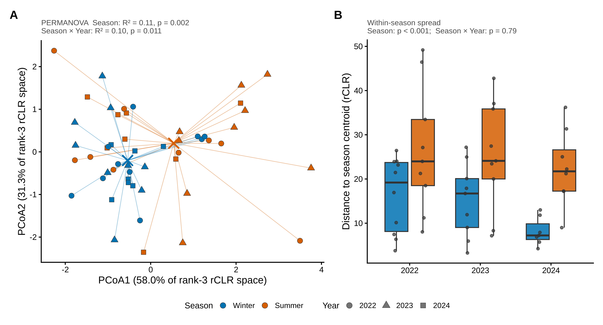

**Figure 2**: Winter and summer dung mycobiomes differ in composition, and the size of that difference varies among years. **(A)** Unconstrained principal coordinates analysis of robust Aitchison distances among the 52 canonical samples, coloured by season and shaped by year. Thin lines join each sample to its season centroid (×). **(B)** Distance of each sample to its own season centroid in robust-CLR space, split by season and year; boxes show the median and interquartile range and points are individual samples. Subtitles give the PERMANOVA terms (A) and the ANOVA terms of the `distance ~ Season × Year` model of within-season spread (B).

Winter and summer communities separate along the first ordination axis: Season explains 11% of compositional variance (PERMANOVA p = 0.002; Table S5). The seasonal contrast is not, however, of constant size — the Season × Year interaction is significant (R² = 0.10, p = 0.011), and the per-year tests in Table S5b place almost all of the separation in 2023 (R² = 0.24, p = 0.005) with 2022 showing essentially none (R² = 0.02, p = 0.789 — a figure that is itself sensitive to the distance measure, see Section 4.2 caveat iii). Panel B shows that this is a difference in *where* the seasons sit rather than in how tightly each clusters: summer samples are consistently further from their own centroid than winter samples in every year (Season p \< 0.001), with no Season × Year interaction in that spread (p = 0.79). Two caveats belong with this figure and are treated in Section 4.2: summer samples are significantly more dispersed than winter ones, so part of the PERMANOVA R² reflects spread rather than location alone (Anderson 2001), and the axis percentages are inflated because `vegan`'s robust Aitchison distance is built from a rank-3 completion of the robust CLR matrix, so panel A plots two of only three available dimensions (Section 4.1).

```{r fig2-build}
#| eval: false
#| echo: !expr knitr::is_html_output()
#| code-fold: true
#| code-summary: "Full build code for Figure 2 — the source of truth for figures/main/Fig2_seasonal_turnover.{png,jpg,pdf}"

# Figure 2 -- Seasonal turnover and its year-to-year variation (H1).
# Both panels reuse the Section 4 analysis verbatim (working/report_prep_permanova.R):
# panel A the unconstrained robust-Aitchison PCoA, panel B the distance-to-
# Season-centroid in rCLR space. Test statistics are READ from the committed
# tables/ CSVs so the figure and Section 4 can never drift apart.
# Rebuild:  conda run -n r_env Rscript build_main_figure.R fig2-build

suppressPackageStartupMessages({
  library(phyloseq); library(vegan); library(ggplot2); library(patchwork)
})

rdata <- if (file.exists("eco_analysis.RData")) "eco_analysis.RData" else
         "/home/daniel/Ptarmigan/trimmed/mergedPlates/eco_analysis.RData"
load(rdata)
tab_dir <- if (dir.exists("tables")) "tables" else
           "/home/daniel/Ptarmigan/Scripts_server/Supplementary/tables"
out_dir <- "figures/main"
dir.create(out_dir, showWarnings = FALSE, recursive = TRUE)
grDevices::pdf(NULL)                                  # headless: no X11 fallback

season_cols <- c(Winter = "#0072B2", Summer = "#D55E00")   # repo standard
# Fillable shapes (21/24/22, not 16/17/15) so BOTH panels map Season to `fill`
# and the two panels can share one Season key.
year_shapes <- c(`2022` = 21, `2023` = 24, `2024` = 22)
base_theme  <- theme_classic(base_size = 12) +
  theme(plot.tag        = element_text(face = "bold", size = 14),
        plot.subtitle   = element_text(size = 9, colour = "grey30"),
        legend.key.size = unit(0.42, "cm"),
        legend.title    = element_text(size = 10),
        legend.text     = element_text(size = 9))

# ---- data ------------------------------------------------------------------
ps      <- alldat$nopool                              # canonical, 52 samples
otu_mat <- as(otu_table(ps), "matrix"); if (taxa_are_rows(ps)) otu_mat <- t(otu_mat)
meta    <- data.frame(sample_data(ps), stringsAsFactors = FALSE, check.names = FALSE)
stopifnot(identical(rownames(otu_mat), rownames(meta)))
Season  <- factor(c(winter = "Winter", summer = "Summer")[meta$Season],
                  levels = c("Winter", "Summer"))
Year    <- factor(meta$Year)
stopifnot(!anyNA(Season), !anyNA(Year))

# ---- panel A: unconstrained PCoA on robust Aitchison distances -------------
d_ait <- vegdist(otu_mat, method = "robust.aitchison")
attr(d_ait, "Labels") <- rownames(otu_mat)   # vegdist drops Labels for robust.aitchison
ord   <- capscale(d_ait ~ 1)
# Defensive only: this distance yields exactly 3 positive eigenvalues and no
# negative ones, because vegan's rclr completes the matrix at rank 3 (Section 4.1).
eig   <- pmax(ord$CA$eig, 0)
ax1p  <- round(100 * eig[1] / sum(eig), 1); ax2p <- round(100 * eig[2] / sum(eig), 1)

sc <- as.data.frame(scores(ord, display = "sites", choices = 1:2, scaling = 1))
colnames(sc)[1:2] <- c("Axis1", "Axis2")
sc$Season <- Season[match(rownames(sc), rownames(meta))]
sc$Year   <- Year[match(rownames(sc), rownames(meta))]
cent <- aggregate(cbind(Axis1, Axis2) ~ Season, data = sc, FUN = mean)
names(cent) <- c("Season", "cX", "cY")
sc <- merge(sc, cent, by = "Season")

perm <- read.csv(file.path(tab_dir, "report_permanova.csv"), check.names = FALSE)
pr   <- perm[perm$term == "Season", ]
pi   <- perm[perm$term == "Season:Year", ]
by_y <- read.csv(file.path(tab_dir, "report_permanova_by_year.csv"), check.names = FALSE)

pA <- ggplot(sc, aes(Axis1, Axis2)) +
  geom_segment(aes(xend = cX, yend = cY, colour = Season),
               alpha = 0.4, linewidth = 0.3, show.legend = FALSE) +
  geom_point(aes(fill = Season, shape = Year), size = 2.8,
             colour = "grey25", stroke = 0.3) +
  geom_point(data = cent, aes(cX, cY, colour = Season), inherit.aes = FALSE,
             size = 4.5, shape = 4, stroke = 1.4, show.legend = FALSE) +
  scale_fill_manual(values = season_cols) +
  scale_colour_manual(values = season_cols, guide = "none") +
  scale_shape_manual(values = year_shapes) +
  coord_equal() +
  labs(x = paste0("PCoA1 (", ax1p, "%)"), y = paste0("PCoA2 (", ax2p, "%)"),
       subtitle = sprintf("PERMANOVA  Season: R² = %.2f, p = %.3f\nSeason × Year: R² = %.2f, p = %.3f",
                          pr$R2, pr$`Pr(>F)`, pi$R2, pi$`Pr(>F)`)) +
  base_theme +
  guides(fill  = guide_legend(order = 1, override.aes = list(shape = 21, size = 3)),
         shape = guide_legend(order = 2, override.aes = list(fill = "grey45", size = 3)))

# ---- panel B: distance to Season centroid, by Season x Year ----------------
rclr <- decostand(otu_mat, "rclr", MARGIN = 1)
dimnames(rclr) <- dimnames(otu_mat)          # vegan's rclr path drops dimnames
centroids <- rowsum(rclr, group = meta$Season) / as.vector(table(meta$Season))
euclid <- function(x, y) sqrt(sum((x - y)^2))
dcent <- data.frame(
  Season = Season, Year = Year,
  dist   = vapply(seq_len(nrow(rclr)),
                  function(k) euclid(rclr[k, ], centroids[meta$Season[k], ]), numeric(1)))

lmres <- read.csv(file.path(tab_dir, "report_centroid_lm.csv"), check.names = FALSE)
pfmt  <- function(p) if (p < 0.001) "p < 0.001" else sprintf("p = %.2f", p)
p_sea <- lmres$`Pr(>F)`[lmres$term == "Season"]
p_int <- lmres$`Pr(>F)`[lmres$term == "Season:Year"]

pB <- ggplot(dcent, aes(Year, dist, fill = Season)) +
  geom_boxplot(outlier.shape = NA, width = 0.65, alpha = 0.85,
               position = position_dodge(width = 0.75)) +
  geom_point(position = position_jitterdodge(jitter.width = 0.15, dodge.width = 0.75),
             size = 1.3, alpha = 0.7, colour = "grey20") +
  scale_fill_manual(values = season_cols) +
  labs(x = NULL, y = "Distance to season centroid (rCLR)",
       subtitle = sprintf("Within-season spread\nSeason: %s;  Season × Year: %s",
                          pfmt(p_sea), pfmt(p_int))) +
  base_theme +
  # Panel A already carries the Season key; a second one would not merge with it
  # (different key glyph) and would just be printed twice.
  guides(fill = "none")

# ---- assemble and write ----------------------------------------------------
fig2 <- (pA | pB) +
  plot_layout(widths = c(1.25, 1), guides = "collect") +
  plot_annotation(tag_levels = "A") &
  theme(legend.position = "bottom", legend.box = "horizontal")

# Every main figure is written three ways: PNG and JPG (600 dpi raster, for
# submission systems that demand one or the other) and PDF (vector, for print).
save_fig <- function(stem, obj, width, height, res = 600) {
  one <- function(open_dev) { open_dev(); on.exit(grDevices::dev.off()); print(obj) }
  one(function() grDevices::png(paste0(stem, ".png"), width = width, height = height,
                                units = "in", res = res))
  one(function() grDevices::jpeg(paste0(stem, ".jpg"), width = width, height = height,
                                 units = "in", res = res, quality = 95))
  pdf_dev <- if (capabilities("cairo")) grDevices::cairo_pdf else grDevices::pdf
  one(function() pdf_dev(paste0(stem, ".pdf"), width = width, height = height))
}
save_fig(file.path(out_dir, "Fig2_seasonal_turnover"), fig2, 10, 5.4)

cat(sprintf("PCoA axes: %.1f%% / %.1f%%\n", ax1p, ax2p))
cat(sprintf("PERMANOVA Season R2 = %.3f, p = %.3f\n", pr$R2, pr$`Pr(>F)`))
cat("Mean distance to season centroid:\n")
print(round(tapply(dcent$dist, list(dcent$Season, dcent$Year), mean), 1))
```

### 10.3 Figure 3 — Richness rises, evenness collapses (H2)

*Provenance: Fig. 3A is the coverage-based iNEXT3D analysis of Section 5.1 (Table S8); Fig. 3B the per-sample Hill numbers of Section 5.2 (Figure S8), annotated with the mixed-model contrasts of Table S9; Fig. 3C the dominance and evenness metrics of Section 5.3 (Table S10); Fig. 3D the top-5 dominant OTUs of Section 5.4 (Table S11), coloured by the guild rule of Section 8.1. Panels B–D are computed on the canonical 52-sample object (`alldat$nopool`, rarefied for B); panel A's estimates and every test statistic are read from the committed `tables/` CSVs, so the figure cannot drift from Section 5.*

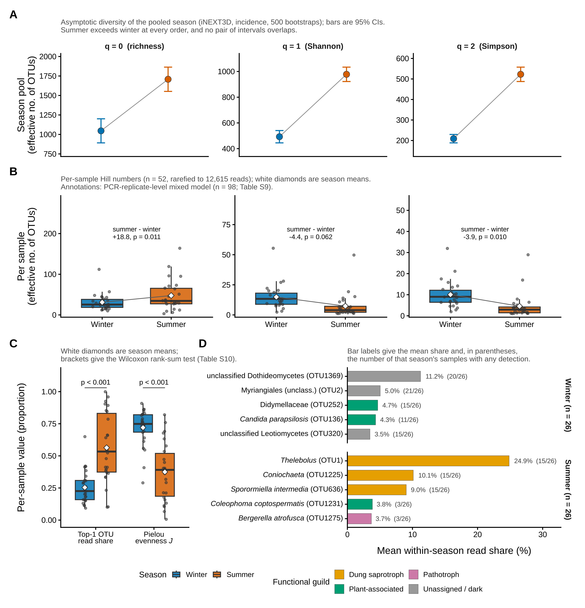

**Figure 3**: Summer dung mycobiomes hold more fungal OTUs than winter ones, yet each individual dropping is far less even. **(A)** Asymptotic taxonomic diversity of each season's pooled sample set (iNEXT3D, incidence data, 500 bootstraps) at Hill orders q = 0, 1 and 2; points are the asymptotic estimate, bars are 95% confidence intervals, and the grey segment joins the two seasons within an order. Summer exceeds winter at every order, with no pair of intervals overlapping. **(B)** Per-sample Hill numbers for the same 52 samples, rarefied to a common depth of 12,615 reads, drawn in the same three columns against the same season axis so that the two rows can be read against one another; boxes show the median and interquartile range, points are individual samples, white diamonds are season means, and the grey segment joins those means. The slope that rises in all three columns of (A) rises only at q = 0 here and falls at q = 1 and q = 2 — that reversal is the crossover. Annotations give the season contrast (summer minus winter) with its p-value from the mixed models of Table S9, which are fitted at the **PCR-replicate level (n = 98)** whereas the plotted points are per-sample (n = 52) — the same pairing used for Figure S8 and Table S9 in Section 5.2. Both rows scale y freely within each column, because the three Hill orders differ by an order of magnitude. **(C)** The mechanism: per-sample top-1-OTU read share and Pielou evenness *J*, both on a 0–1 scale, with symbols as in (B) and brackets giving the Wilcoxon rank-sum result (Table S10). **(D)** The identity of the dominants — the five OTUs with the highest mean within-season read share in each season, coloured by functional guild under the rule of Section 8.1. Bar labels give that mean share and, in parentheses, the number of the season's 26 samples in which the OTU was detected at all. Taxa are named at the finest confidently assigned rank, so an OTU with no genus appears under its family, or as *unclassified* plus its order or class. *Candida parapsilosis* is coloured plant-associated because its compound FUNGuild string contains `Epiphyte`; the rule is applied unchanged rather than special-cased, so that Figures 1 and 3 and Sections 8–10 classify every OTU identically.

Panels A and B put the same question to two scales and get opposite answers, and that disagreement is the result rather than a problem with it. Pooled across a season, summer is the richer assemblage at every Hill order — an estimated 1,708 OTUs against winter's 1,046 at q = 0, and the gap survives abundance weighting (978 vs 493 at q = 1; 523 vs 209 at q = 2) with no overlapping confidence intervals. Within a single dropping the ordering reverses as soon as abundance enters: summer leads at q = 0 (47.7 vs 31.1 effective OTUs; +18.8 in the replicate-level model, p = 0.011) but falls behind at q = 1 (7.4 vs 14.9) and significantly so at q = 2 (4.6 vs 10.1; −3.9, p = 0.010). Panel C locates the reversal in dominance rather than in the species lists: an average summer sample gives 56% of its reads to a single OTU against 25% in winter, and Pielou evenness falls from 0.72 to 0.38 (both p \< 0.001). Summer droppings are simultaneously longer-tailed and far more top-heavy, which is precisely the combination that lifts q = 0 while depressing q = 1 and q = 2. Panel D names the taxa responsible, and they are the ones a coprophilous account predicts: *Thelebolus*, *Coniochaeta* and *Sporormiella intermedia* together take 44% of summer reads and are all dung saprotrophs, whereas winter's leading OTUs are mostly unclassified below class and carry no guild call at all — among them OTU1369, an unclassified Dothideomycete that is winter's most abundant OTU and is present in 20 of 26 winter samples, and which is taken up as a dark taxon in Section 3.4. Two caveats travel with the figure. The contrasts annotating (B) are fitted at the PCR-replicate level while the points are per-sample, so they test the same seasonal effect on the nested replicate data rather than on the plotted values themselves (Section 5.2). And the shares in (D) are seasonal averages, not universals — *Thelebolus* reaches its 24.9% mean while being detected in only 15 of the 26 summer droppings.

```{r fig3-build}
#| eval: false
#| echo: !expr knitr::is_html_output()
#| code-fold: true
#| code-summary: "Full build code for Figure 3 — the source of truth for figures/main/Fig3_richness_evenness_crossover.{png,jpg,pdf}"

# Figure 3 -- Richness rises, evenness collapses (H2).
# Panels A and B share one grammar (Season on x, diversity on y, faceted by Hill
# order) and one set of facet strips, so the crossover is a single visual event:
# the same three columns, with the Winter->Summer slope flipping between rows.
# C then gives the mechanism (dominance) and D the identity of the dominants.
# Per-sample quantities are recomputed from the canonical objects (Fig. 1
# precedent); every pooled estimate and test statistic is READ from a committed
# tables/ CSV (Fig. 2 precedent), with guards asserting the two agree.
# Rebuild:  conda run -n r_env Rscript build_main_figure.R fig3-build

suppressPackageStartupMessages({
  library(phyloseq); library(ggplot2); library(patchwork)
})

rdata <- if (file.exists("eco_analysis.RData")) "eco_analysis.RData" else
         "/home/daniel/Ptarmigan/trimmed/mergedPlates/eco_analysis.RData"
load(rdata)
stopifnot(exists("alldat"), exists("alldat.rfy"), exists("alldat_full"),
          exists("funguild_otu"))                 # funguild_otu <- 8_functional_guilds.R
tab_dir <- if (dir.exists("tables")) "tables" else
           "/home/daniel/Ptarmigan/Scripts_server/Supplementary/tables"
out_dir <- "figures/main"
dir.create(out_dir, showWarnings = FALSE, recursive = TRUE)
grDevices::pdf(NULL)                                 # headless: no X11 fallback

# ---- shared style ----------------------------------------------------------
# Season and guild palettes are the repo standard (8_functional_guilds.R), so one
# colour means one thing across Fig. 1, Fig. 2 and Fig. 3.
season_cols  <- c(Winter = "#0072B2", Summer = "#D55E00")
guild_cols   <- c("Dung saprotroph" = "#E69F00", "Plant-associated" = "#009E73",
                  "Pathotroph" = "#CC79A7", "Other assigned" = "#56B4E9",
                  "Unassigned / dark" = "#999999")
GUILD_LEVELS <- names(guild_cols)

# The one facet vocabulary shared by panels A and B. A carries the strips; B
# repeats the columns beneath it and blanks them, exactly as Fig. 1B does.
Q_LEVELS <- c("q = 0  (richness)", "q = 1  (Shannon)", "q = 2  (Simpson)")

base_theme <- theme_classic(base_size = 12) +
  theme(strip.background = element_blank(),
        strip.text       = element_text(face = "bold"),
        plot.tag         = element_text(face = "bold", size = 14),
        plot.subtitle    = element_text(size = 9, colour = "grey30"),
        panel.spacing    = unit(0.8, "lines"),
        legend.key.size  = unit(0.42, "cm"),
        legend.title     = element_text(size = 10),
        legend.text      = element_text(size = 9))

# All in-plot text is ASCII. save_fig() falls back to grDevices::pdf when cairo
# is unavailable, and that device silently substitutes a dot for a Unicode minus
# or delta -- a corrupted PDF that would not fail the build.
pfmt <- function(p) ifelse(is.na(p), "p = NA",
                    ifelse(p < 0.001, "p < 0.001", sprintf("p = %.3f", p)))
to_season <- function(x) factor(c(winter = "Winter", summer = "Summer")[as.character(x)],
                                levels = c("Winter", "Summer"))

# ============================================================================
# Panel A -- season-pool diversity (Section 5.1, Table S8)
# ============================================================================
# Read, never recomputed: iNEXT3D with nboot = 500 is expensive and its estimates
# are already committed. Pooling samples within a Season asks about the Season's
# whole species pool, which is the question q0/q1/q2 answer in the same direction.
asy <- read.csv(file.path(tab_dir, "H2_iNEXT3D_TD_asymptotic.csv"), check.names = FALSE)
qmap <- setNames(Q_LEVELS, c("Species richness", "Shannon diversity", "Simpson diversity"))
stopifnot(all(asy$qTD %in% names(qmap)), setequal(asy$Assemblage, c("Summer", "Winter")))
asy$q      <- factor(unname(qmap[asy$qTD]), levels = Q_LEVELS)
asy$Season <- factor(asy$Assemblage, levels = c("Winter", "Summer"))

pick  <- function(sea) { d <- asy[asy$Season == sea, ]
                         d[match(Q_LEVELS, as.character(d$q)), ] }
A_sum <- pick("Summer"); A_win <- pick("Winter")
# The panel's whole claim in one line: summer above winter at every order, with
# 95% CIs that do not overlap. If that ever stops being true, the build stops.
stopifnot(all(A_sum$qTD.LCL > A_win$qTD.UCL))

pA <- ggplot(asy, aes(Season, TD_asy)) +
  geom_line(aes(group = 1), colour = "grey55", linewidth = 0.4) +
  geom_errorbar(aes(ymin = qTD.LCL, ymax = qTD.UCL, colour = Season),
                width = 0.12, linewidth = 0.6, show.legend = FALSE) +
  geom_point(aes(fill = Season), shape = 21, size = 3.4,
             colour = "grey25", stroke = 0.4, show.legend = FALSE) +
  facet_wrap(~ q, nrow = 1, scales = "free_y") +
  scale_fill_manual(values = season_cols) +
  scale_colour_manual(values = season_cols) +
  scale_y_continuous(expand = expansion(mult = c(0.18, 0.18))) +
  labs(x = NULL, y = "Season pool\n(effective no. of OTUs)",
       subtitle = "Asymptotic diversity of the pooled season (iNEXT3D, incidence, 500 bootstraps); bars are 95% CIs.\nSummer exceeds winter at every order, and no pair of intervals overlaps.") +
  base_theme +
  # A's x axis is identical to B's directly below, so only B prints it.
  theme(axis.text.x = element_blank(), axis.ticks.x = element_blank()) +
  guides(fill = "none", colour = "none")

# ============================================================================
# Panel B -- per-sample diversity (Section 5.2, Fig. S9 + Table S9)
# ============================================================================
# alldat.rfy$nopool is ALREADY rarefied to a common depth, so hill_taxa() here is
# deterministic and no seed is involved; the guard makes that testable.
ps_rfy <- alldat.rfy$nopool
m_rfy  <- as(otu_table(ps_rfy), "matrix")
if (taxa_are_rows(ps_rfy)) m_rfy <- t(m_rfy)         # hillR wants sites x species
stopifnot(nsamples(ps_rfy) == 52L, length(unique(rowSums(m_rfy))) == 1L)
rfy_depth <- unique(rowSums(m_rfy))

md_rfy <- data.frame(as(sample_data(ps_rfy), "data.frame"), stringsAsFactors = FALSE)
stopifnot(identical(rownames(m_rfy), rownames(md_rfy)))
season_rfy <- to_season(md_rfy$Season); stopifnot(!anyNA(season_rfy))

hill <- data.frame(Season = season_rfy,
                   q0 = hillR::hill_taxa(m_rfy, q = 0),
                   q1 = hillR::hill_taxa(m_rfy, q = 1),
                   q2 = hillR::hill_taxa(m_rfy, q = 2))
hill_long <- data.frame(
  Season = rep(hill$Season, times = 3),
  q      = factor(rep(Q_LEVELS, each = nrow(hill)), levels = Q_LEVELS),
  value  = c(hill$q0, hill$q1, hill$q2))

# IMPORTANT -- the two levels differ, deliberately. The points are PER SAMPLE
# (n = 52, PCR replicates summed); the annotated contrast is the mixed model of
# Table S9, fitted at the PCR-REPLICATE level because that is where the replicate
# random intercept is estimable. Section 5.2 pairs Fig. S9 and Table S9 the same
# way and the caption says so. The guard is the safety net: if the two levels
# ever stopped telling the same story, their season differences would disagree
# in sign and the build would stop.
n_pcr <- sum(sample_sums(alldat_full[[1]]) >= 10000)   # Section 5.2 depth filter,
                                                       # reproduced without refitting
lmm <- read.csv(file.path(tab_dir, "H2_lmm_season_effect.csv"), check.names = FALSE)
stopifnot(setequal(lmm$metric, c("q0", "q1", "q2")))
lmm <- lmm[match(c("q0", "q1", "q2"), lmm$metric), ]
obs_diff <- vapply(c("q0", "q1", "q2"), function(q)
  mean(hill[[q]][hill$Season == "Summer"]) - mean(hill[[q]][hill$Season == "Winter"]),
  numeric(1))
stopifnot(all(sign(obs_diff) == sign(lmm$summer_minus_winter)))

# Boxes show medians, but Section 5.3's text quotes MEANS -- so the means are
# drawn, and the segment joining them is what makes the slope flip legible
# against panel A directly above.
meanB <- aggregate(value ~ q + Season, hill_long, mean)
y_top <- as.numeric(tapply(hill_long$value, hill_long$q, max)[Q_LEVELS])
ann_B <- data.frame(q     = factor(Q_LEVELS, levels = Q_LEVELS),
                    value = y_top * 1.32,
                    lab   = sprintf("summer - winter\n%+.1f, %s",
                                    lmm$summer_minus_winter, pfmt(lmm$p)))

# seed = on the jitter: save_fig() prints the object once per device, and an
# unseeded jitter would place the points differently in the PNG, the JPG and the
# PDF -- three subtly different figures from one build.
pB <- ggplot(hill_long, aes(Season, value)) +
  geom_boxplot(aes(fill = Season), outlier.shape = NA, width = 0.6, alpha = 0.85) +
  geom_point(position = position_jitter(width = 0.14, height = 0, seed = 1),
             size = 1.1, alpha = 0.55, colour = "grey20") +
  geom_line(data = meanB, aes(group = 1), colour = "grey35", linewidth = 0.4) +
  geom_point(data = meanB, shape = 23, size = 2.4, stroke = 0.5,
             fill = "white", colour = "grey15") +
  geom_text(data = ann_B, aes(x = 1.5, label = lab), inherit.aes = TRUE,
            size = 2.9, lineheight = 0.95, vjust = 1) +
  facet_wrap(~ q, nrow = 1, scales = "free_y") +
  scale_fill_manual(values = season_cols) +
  # Linear, not log: a Hill number is an effective number of OTUs and is meant to
  # be read off the axis. free_y absorbs the 164-vs-32 range difference instead.
  scale_y_continuous(expand = expansion(mult = c(0.04, 0.36))) +
  labs(x = NULL, y = "Per sample\n(effective no. of OTUs)",
       subtitle = sprintf("Per-sample Hill numbers (n = %d, rarefied to %s reads); white diamonds are season means.\nAnnotations: PCR-replicate-level mixed model (n = %d; Table S9).",
                          nrow(hill), format(rfy_depth, big.mark = ","), n_pcr)) +
  base_theme +
  # B repeats A's facet columns exactly, so its strips are dropped as redundant.
  theme(strip.text = element_blank()) +
  guides(fill = guide_legend(order = 1))

# ============================================================================
# Panel C -- dominance and evenness, the mechanism (Section 5.3, Table S10)
# ============================================================================
ps  <- alldat$nopool                                 # canonical, raw counts
m   <- as(otu_table(ps), "matrix")
if (!taxa_are_rows(ps)) m <- t(m)                    # taxa x samples, as 5.3 uses
rel <- sweep(m, 2, colSums(m), "/")
stopifnot(all(abs(colSums(rel) - 1) < 1e-10))
md  <- data.frame(as(sample_data(ps), "data.frame"), stringsAsFactors = FALSE)
stopifnot(identical(colnames(rel), rownames(md)),
          setequal(colnames(rel), rownames(m_rfy)))  # B and C/D are the same 52 birds
season_c <- to_season(md$Season)

pielou_J <- function(p) { p <- p[p > 0]; -sum(p * log(p)) / log(length(p)) }
dom <- data.frame(Season    = season_c,
                  top1_prop = apply(rel, 2, max),
                  pielou_J  = apply(rel, 2, pielou_J))

# Drift guard: the recomputed means must reproduce committed Table S10 exactly at
# the precision the CSV stores (1 dp for the percentage, 2 dp for J).
dom_csv <- read.csv(file.path(tab_dir, "report_dominance_summary.csv"), check.names = FALSE)
dom_csv <- dom_csv[match(c("winter", "summer"), dom_csv$Season), ]
obs_top1 <- tapply(dom$top1_prop, dom$Season, mean)
obs_J    <- tapply(dom$pielou_J,  dom$Season, mean)
stopifnot(max(abs(round(100 * as.numeric(obs_top1[c("Winter","Summer")]), 1) -
                  dom_csv$mean_top1_prop_pct)) < 1e-8,
          max(abs(round(as.numeric(obs_J[c("Winter","Summer")]), 2) -
                  dom_csv$mean_pielou_J)) < 1e-8)
p_top1 <- unique(dom_csv$wilcox_p_top1_prop); p_J <- unique(dom_csv$wilcox_p_pielou_J)
stopifnot(length(p_top1) == 1L, length(p_J) == 1L)

# Both metrics live on 0-1, so one shared axis works and the mechanism reads as a
# single picture: the seasons swap sides between the two metric groups.
# <br> not \n: these labels are rendered by element_markdown, which honours HTML
# breaks. Wrapped because the two names collide at this panel's width.
M_LEVELS <- c("Top-1 OTU<br>read share", "Pielou<br>evenness *J*")
dom_long <- data.frame(
  Season = rep(dom$Season, times = 2),
  Metric = factor(rep(M_LEVELS, each = nrow(dom)), levels = M_LEVELS),
  value  = c(dom$top1_prop, dom$pielou_J))
meanC <- aggregate(value ~ Metric + Season, dom_long, mean)
brk   <- data.frame(Metric = factor(M_LEVELS, levels = M_LEVELS),
                    lab    = pfmt(c(p_top1, p_J)),
                    xmid   = seq_along(M_LEVELS))
brk$xmin <- brk$xmid - 0.19; brk$xmax <- brk$xmid + 0.19  # dodge(0.75) box centres

pC <- ggplot(dom_long, aes(Metric, value, fill = Season)) +
  geom_boxplot(outlier.shape = NA, width = 0.65, alpha = 0.85,
               position = position_dodge(width = 0.75)) +
  geom_point(position = position_jitterdodge(jitter.width = 0.12, dodge.width = 0.75,
                                             seed = 1),
             size = 1.1, alpha = 0.55, colour = "grey20", show.legend = FALSE) +
  geom_point(data = meanC, aes(group = Season), inherit.aes = TRUE,
             position = position_dodge(width = 0.75), shape = 23, size = 2.3,
             stroke = 0.5, fill = "white", colour = "grey15", show.legend = FALSE) +
  geom_segment(data = brk, aes(x = xmin, xend = xmax, y = 1.03, yend = 1.03),
               inherit.aes = FALSE, linewidth = 0.3) +
  geom_text(data = brk, aes(x = xmid, y = 1.055, label = lab), inherit.aes = FALSE,
            size = 3, vjust = 0) +
  scale_fill_manual(values = season_cols) +
  scale_y_continuous(limits = c(0, 1.13), breaks = seq(0, 1, 0.25)) +
  labs(x = NULL, y = "Per-sample value (proportion)",
       subtitle = "White diamonds are season means;\nbrackets give the Wilcoxon rank-sum test (Table S10).") +
  base_theme +
  # The x labels carry markdown (*J*); without element_markdown the asterisks
  # print literally, and this theme() must come after base_theme to win.
  theme(axis.text.x = ggtext::element_markdown(size = 9)) +
  guides(fill = "none")

# ============================================================================
# Panel D -- who the dominants are (Section 5.4, Table S11), by guild
# ============================================================================
top5 <- do.call(rbind, lapply(levels(season_c), function(s) {
  cols   <- colnames(rel)[season_c == s]
  shares <- rowMeans(rel[, cols, drop = FALSE])      # mean WITHIN-season share
  ids    <- names(sort(shares, decreasing = TRUE))[1:5]
  data.frame(Season = s, OTU = ids, share = 100 * shares[ids],
             n_detect = rowSums(rel[ids, cols, drop = FALSE] > 0),
             n_season = length(cols), stringsAsFactors = FALSE, row.names = NULL)
}))
top5$Season <- factor(top5$Season, levels = c("Winter", "Summer"))

# Drift guard: same OTUs, same order, same shares as committed Table S11.
t5_csv <- read.csv(file.path(tab_dir, "report_top5_otu_by_season.csv"),
                   stringsAsFactors = FALSE)
t5_csv$Season <- to_season(t5_csv$Season)
t5_csv <- t5_csv[order(t5_csv$Season, -t5_csv$mean_pct_share), ]
chk    <- top5[order(top5$Season, -top5$share), ]
stopifnot(identical(paste(chk$Season, chk$OTU), paste(t5_csv$Season, t5_csv$OTU)),
          max(abs(round(chk$share, 2) - t5_csv$mean_pct_share)) < 1e-8)

# UNITE taxonomy carries rank prefixes ("g__Thelebolus") and, at species level, a
# trailing hypothesis index ("intermedia 1"). Labels fall back down the ranks
# until something is assigned: a family name stands alone unambiguously, an order
# or class does not and is prefixed "unclassified". Markdown asterisks italicise
# real Latin names only -- never a rank name, never an Incertae sedis placeholder.
tax <- data.frame(as(tax_table(ps), "matrix"), stringsAsFactors = FALSE)
strip_rank <- function(x) sub("^[a-z]__", "", x)
clean_rank <- function(x) { x <- strip_rank(x)
  x[is.na(x) | x == "" | x == "NA" | grepl("unidentified", x, ignore.case = TRUE)] <- NA_character_
  x }
otu_label <- function(otu) {
  rk <- lapply(c("Genus", "Species", "Family", "Order", "Class"),
               function(r) clean_rank(tax[otu, r]))
  names(rk) <- c("Genus", "Species", "Family", "Order", "Class")
  incertae <- function(x) !is.na(x) && grepl("Incertae_sedis", x)
  nm <-
    if (!is.na(rk$Genus) && !incertae(rk$Genus)) {
      if (!is.na(rk$Species))
        paste0("*", rk$Genus, " ", sub("[ _]+[0-9]+$", "", rk$Species), "*")
      else paste0("*", rk$Genus, "*")
    } else if (incertae(rk$Genus))                      sub("_gen_Incertae_sedis", " (unclass.)", rk$Genus)
      else if (!is.na(rk$Family) && !incertae(rk$Family)) rk$Family
      else if (!is.na(rk$Order))                        paste("unclassified", rk$Order)
      else if (!is.na(rk$Class))                        paste("unclassified", rk$Class)
      else                                              "unclassified fungus"
  paste0(nm, " (", otu, ")")
}
top5$label <- unname(vapply(top5$OTU, otu_label, character(1)))
stopifnot(!anyDuplicated(top5$label))

# Guild rule VERBATIM from the Fig. 1 chunk (itself from 8_functional_guilds.R),
# including its genus cleaning, so Fig. 1, Fig. 3, Section 8 and Section 9 all
# classify an OTU identically. One consequence is visible here: FUNGuild returns
# a compound string for Candida parapsilosis containing "Epiphyte", so the
# priority rule lands OTU136 in Plant-associated. That is an artifact of compound
# FUNGuild strings, not a claim about the taxon -- but the rule is applied
# unchanged rather than special-cased, because cross-section consistency is worth
# more than one prettier label.
COPRO_GENERA <- c("Sordaria","Podospora","Cercophora","Chaetomium","Schizothecium",
                  "Preussia","Delitschia","Pilobolus","Ascobolus","Saccobolus",
                  "Sporormiella","Coprinopsis","Thelebolus","Coniochaeta")
gen       <- strip_rank(tax$Genus[match(top5$OTU, rownames(tax))])
gen       <- ifelse(gen %in% c("", "NA"), NA, gen)
guild_str <- funguild_otu$Guild[match(top5$OTU, funguild_otu$OTU_ID)]
is_copro  <- (!is.na(guild_str) & grepl("Dung Saprotroph", guild_str)) |
             (!is.na(gen)       & gen %in% COPRO_GENERA)
is_plant  <- !is_copro & !is.na(guild_str) &
             grepl("Endophyte|Plant Saprotroph|Plant Pathogen|Epiphyte", guild_str)
is_patho  <- !is_copro & !is_plant & !is.na(guild_str) & grepl("Pathogen|Parasite", guild_str)
top5$Guild <- factor(
  ifelse(is_copro, "Dung saprotroph",
  ifelse(is_plant, "Plant-associated",
  ifelse(is_patho, "Pathotroph",
  ifelse(!is.na(guild_str), "Other assigned", "Unassigned / dark")))),
  levels = GUILD_LEVELS)

# The two seasons' top-5 sets are disjoint, so one global factor ordered
# (Season, share) gives each facet its own descending bars under free_y.
top5 <- top5[order(top5$Season, top5$share), ]
top5$label <- factor(top5$label, levels = top5$label)
n_lab <- setNames(sprintf("%s (n = %d)", levels(season_c), as.integer(table(season_c))),
                  levels(season_c))

pD <- ggplot(top5, aes(share, label, fill = Guild)) +
  geom_col(width = 0.72, colour = "grey30", linewidth = 0.15) +
  geom_text(aes(label = sprintf("%.1f%%  (%d/%d)", share, n_detect, n_season)),
            hjust = -0.12, size = 2.8, colour = "grey25") +
  facet_grid(Season ~ ., scales = "free_y", space = "free_y",
             labeller = labeller(Season = n_lab)) +
  # drop = TRUE: "Other assigned" has no member among these ten OTUs and a key
  # with no bar is noise; the level ORDER stays the repo-canonical one.
  scale_fill_manual(values = guild_cols, name = "Functional guild", drop = TRUE) +
  scale_x_continuous(expand = expansion(mult = c(0, 0.32))) +
  labs(x = "Mean within-season read share (%)", y = NULL,
       subtitle = "Bar labels give the mean share and, in parentheses,\nthe number of that season's samples with any detection.") +
  base_theme +
  theme(axis.text.y = ggtext::element_markdown(size = 9)) +
  guides(fill = guide_legend(order = 2, nrow = 2))

# ---- assemble and write ----------------------------------------------------
# An explicit design grid, not nested `/` and `|`: patchwork FLATTENS a chain of
# `/`, so (pA / pB) / (pC | pD) silently becomes a three-row layout and errors.
# The grid also guarantees what panel A and B depend on -- one shared column
# geometry, so their facet columns line up and the slope flip reads vertically.
# D gets five of the eight columns because its taxon labels are up to 38 chars.
design <- "
AAAAAAAA
BBBBBBBB
CCCDDDDD
"
fig3 <- pA + pB + pC + pD +
  plot_layout(design = design, heights = c(1, 1.18, 1.55), guides = "collect") +
  plot_annotation(tag_levels = "A") &
  theme(legend.position = "bottom", legend.box = "horizontal")

# Every main figure is written three ways: PNG and JPG (600 dpi raster, for
# submission systems that demand one or the other) and PDF (vector, for print).
save_fig <- function(stem, obj, width, height, res = 600) {
  one <- function(open_dev) { open_dev(); on.exit(grDevices::dev.off()); print(obj) }
  one(function() grDevices::png(paste0(stem, ".png"), width = width, height = height,
                                units = "in", res = res))
  one(function() grDevices::jpeg(paste0(stem, ".jpg"), width = width, height = height,
                                 units = "in", res = res, quality = 95))
  pdf_dev <- if (capabilities("cairo")) grDevices::cairo_pdf else grDevices::pdf
  one(function() pdf_dev(paste0(stem, ".pdf"), width = width, height = height))
}
save_fig(file.path(out_dir, "Fig3_richness_evenness_crossover"), fig3, 10, 10.4)

# ---- console summary -------------------------------------------------------
cat("Season-pool asymptotic diversity (Table S8):\n")
print(data.frame(q = Q_LEVELS,
                 summer = sprintf("%.0f [%.0f, %.0f]", A_sum$TD_asy, A_sum$qTD.LCL, A_sum$qTD.UCL),
                 winter = sprintf("%.0f [%.0f, %.0f]", A_win$TD_asy, A_win$qTD.LCL, A_win$qTD.UCL)),
      row.names = FALSE)
hill_means <- aggregate(cbind(q0, q1, q2) ~ Season, hill, mean)
hill_means[-1] <- round(hill_means[-1], 2)
cat(sprintf("\nPer-sample Hill means (n = %d, rarefied to %d reads):\n", nrow(hill), rfy_depth))
print(hill_means, row.names = FALSE)
cat(sprintf("\nReplicate-level LMM, summer - winter (n = %d; Table S9):\n", n_pcr))
print(data.frame(metric = lmm$metric, delta = lmm$summer_minus_winter,
                 lwr = lmm$lwr, upr = lmm$upr, p = lmm$p), row.names = FALSE)
cat(sprintf("\nTop-1 OTU read share: summer %.1f%% vs winter %.1f%%  (%s)\n",
            100 * obs_top1[["Summer"]], 100 * obs_top1[["Winter"]], pfmt(p_top1)))
cat(sprintf("Pielou evenness J   : summer %.2f  vs winter %.2f   (%s)\n",
            obs_J[["Summer"]], obs_J[["Winter"]], pfmt(p_J)))
cat("\nTop-5 OTUs per season (mean within-season read share):\n")
print(data.frame(Season = chk$Season, OTU = chk$OTU, share_pct = round(chk$share, 2),
                 detected = sprintf("%d/%d", chk$n_detect, chk$n_season),
                 guild = as.character(top5$Guild[match(chk$OTU, top5$OTU)])),
      row.names = FALSE)
```

### 10.4 Figure 4 — Dark and partly novel lineages dominate winter dung (E1)

*Provenance: all three panels come from Section 3.4. Fig. 4A and 4B are the main-text versions of Figures S-E1a and S-E1b; Fig. 4C plots Table S-E1b. Every value is read from the committed `tables/` CSVs written by `9_dark_taxa_SH_matching.R` — nothing is recomputed from sequence data, because the Species Hypothesis assignment is an external pipeline step (a containerised run of the TU-NHM `sh_matching` workflow against the UNITE reference).*

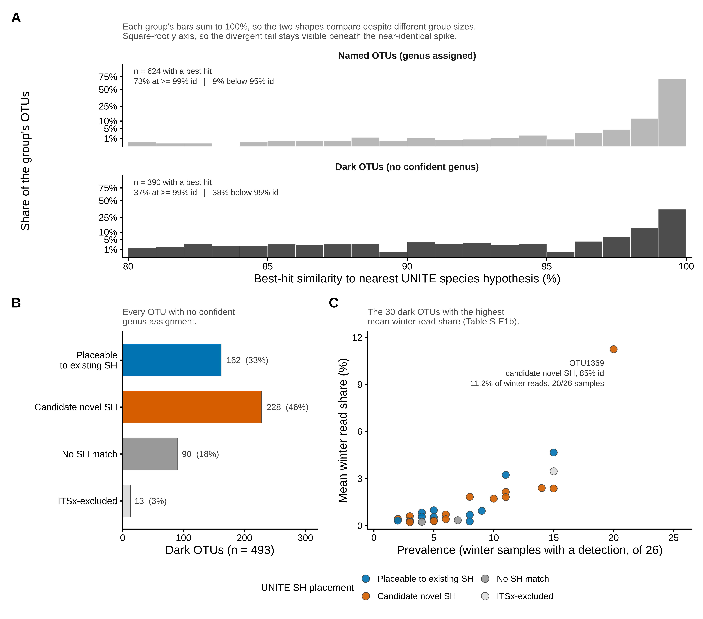

**Figure 4**: Winter dung is dominated by fungal lineages that carry no confident genus, a substantial fraction of which are genuinely novel. **(A)** Best-hit similarity of each OTU to its nearest UNITE Species Hypothesis, split into OTUs with no confident genus assignment ("dark"; n = 390 with a best hit) and those with one ("named"; n = 624). Each group's bars sum to 100% so the two shapes can be compared despite the different group sizes, and the y axis is square-root scaled so the divergent tail stays visible beneath the near-identical spike. The dark distribution is bimodal: 37% of dark OTUs sit at ≥ 99% identity to a reference — essentially known sequences whose genus was withheld by the conservative `minBoot = 80` threshold — while 38% fall below 95%, a genuinely divergent tail. The named distribution has the same spike (73% at ≥ 99%) but almost no tail (9% below 95%). OTUs with no best hit at all (103 dark, 12 named) cannot appear here; they are the "no SH match" and "ITSx-excluded" categories of (B). **(B)** UNITE Species Hypothesis placement of all 493 dark OTUs. **(C)** The 30 dark OTUs with the highest mean winter read share (Table S-E1b), plotted as prevalence — the number of the 26 winter samples with any detection — against that mean share, coloured as in (B). OTU1369 is labelled: it is winter's single most abundant OTU at 11.2% of winter reads and is present in 20 of 26 winter droppings, yet its best UNITE hit is only 85% similar, so it forms a candidate new Species Hypothesis rather than matching anything named.

Roughly half of a typical winter dropping is reads that the canonical taxonomy cannot name (Section 3.4), and panel A shows that this single label covers two different problems. A little over a third of dark OTUs are near-identical to a UNITE reference and are dark only because `minBoot = 80` declines to commit to a genus at that bootstrap — a cost of conservatism, and one that Species Hypothesis matching largely recovers. But a comparable fraction sits below 95% identity, where no threshold adjustment would help, and 228 of the 493 dark OTUs (46%) form candidate new Species Hypotheses rather than matching an existing one (panel B). The winter-abundant end of that distribution is what matters for this study: panel C shows that the dark OTUs carrying real winter read share are predominantly candidate-novel rather than placeable, and the most extreme of them, OTU1369, is simultaneously the most abundant and among the most prevalent OTUs in winter dung while being only 85% similar to its nearest named relative. Two caveats travel with the figure. "Candidate novel" is a statement about the reference database rather than a taxonomic claim: these are unimprinted clusters awaiting public sequence deposition and PlutoF registration (Section 3.4), so none of them yet carries a permanent identifier. And the 13 ITSx-excluded OTUs in (B) — among them OTU320, winter's third most abundant dark OTU — are flagged by the pipeline as chimeric or non-ITS; they are retained in (C) only because they remain in the abundance table, and should not be read as biological entities.

```{r fig4-build}
#| eval: false
#| echo: !expr knitr::is_html_output()
#| code-fold: true
#| code-summary: "Full build code for Figure 4 — the source of truth for figures/main/Fig4_dark_taxa_SH.{png,jpg,pdf}"

# Figure 4 -- Winter dung is dominated by unclassified, partly novel lineages (E1).
# Every quantity here is READ from committed tables/ CSVs written by
# 9_dark_taxa_SH_matching.R; nothing is recomputed from sequence data, because the
# SH assignment itself is the expensive external step (a Singularity run of the
# TU-NHM sh_matching pipeline against the UNITE reference, ~90 min).
#   A  tables/dark_taxa_SH_matching.csv        (per-OTU similarity x is_dark)
#   B  tables/E1_SH_assignment_summary.csv     (the 493 dark OTUs' placement)
#   C  tables/E1_winter_dominant_dark_taxa_SH.csv (top 30 by winter read share)
# Guards below assert B and C are consistent with the per-OTU table in A.
# Rebuild:  conda run -n r_env Rscript build_main_figure.R fig4-build

suppressPackageStartupMessages({
  library(ggplot2); library(patchwork)
})

tab_dir <- if (dir.exists("tables")) "tables" else
           "/home/daniel/Ptarmigan/Scripts_server/Supplementary/tables"
out_dir <- "figures/main"
dir.create(out_dir, showWarnings = FALSE, recursive = TRUE)
grDevices::pdf(NULL)                                 # headless: no X11 fallback

# ---- shared style ----------------------------------------------------------
# ONE colour dimension in this figure: SH placement, used by both B and C. Panel
# A compares two groups of OTUs, not two placements, so it is deliberately
# monochrome -- the darker fill is the dark taxa. That keeps every coloured mark
# in the figure meaning exactly one thing.
SH_LEVELS <- c("Placeable to existing SH", "Candidate novel SH",
               "No SH match", "ITSx-excluded")
sh_cols <- c("Placeable to existing SH" = "#0072B2",   # resolved
             "Candidate novel SH"       = "#D55E00",   # the novel signal
             "No SH match"              = "#999999",   # grey = no information,
             "ITSx-excluded"            = "#DDDDDD")   # as elsewhere in the repo
group_cols <- c("Named OTUs (genus assigned)"    = "#B8B8B8",
                "Dark OTUs (no confident genus)" = "#4D4D4D")

base_theme <- theme_classic(base_size = 12) +
  theme(strip.background = element_blank(),
        strip.text       = element_text(face = "bold"),
        plot.tag         = element_text(face = "bold", size = 14),
        plot.subtitle    = element_text(size = 9, colour = "grey30"),
        panel.spacing    = unit(0.8, "lines"),
        legend.key.size  = unit(0.42, "cm"),
        legend.title     = element_text(size = 10),
        legend.text      = element_text(size = 9))

# All in-plot text is ASCII: save_fig() falls back to grDevices::pdf when cairo is
# unavailable, and that device silently substitutes a dot for a Unicode glyph.
sh_class_map <- c(placeable_existing_SH = "Placeable to existing SH",
                  novel_new_SH          = "Candidate novel SH",
                  no_SH_match           = "No SH match",
                  excluded_nonITS       = "ITSx-excluded")

# ============================================================================
# Panel A -- best-hit similarity, dark vs named OTUs
# ============================================================================
sh <- read.csv(file.path(tab_dir, "dark_taxa_SH_matching.csv"), stringsAsFactors = FALSE)
stopifnot(is.logical(sh$is_dark), !anyNA(sh$is_dark), nrow(sh) == 1129L,
          all(sh$SH_class %in% names(sh_class_map)))

G_LEVELS <- c("Named OTUs (genus assigned)", "Dark OTUs (no confident genus)")
sh$group <- factor(ifelse(sh$is_dark, G_LEVELS[2], G_LEVELS[1]), levels = G_LEVELS)

# An OTU has a similarity only if the pipeline found a best hit at all: the
# no-match and ITSx-excluded OTUs of panel B have none by construction, so they
# cannot appear here. The caption says so, and these counts are printed below.
sim <- sh[!is.na(sh$similarity_percentage), ]
n_nosim <- table(sh$group[is.na(sh$similarity_percentage)])[G_LEVELS]
stopifnot(min(sim$similarity_percentage) >= 80, max(sim$similarity_percentage) <= 100)

# The histogram is precomputed rather than left to stat_bin, so the normalisation
# is explicit: each group's bars sum to 1, which is what lets a 390-OTU group be
# compared with a 624-OTU one. Bins are 1% wide over the pipeline's 80-100% range.
brks <- seq(80, 100, by = 1)
sim$bin <- cut(sim$similarity_percentage, breaks = brks, include.lowest = TRUE)
hist_df <- as.data.frame(table(group = sim$group, bin = sim$bin),
                         responseName = "n", stringsAsFactors = FALSE)
hist_df$group <- factor(hist_df$group, levels = G_LEVELS)
hist_df$prop  <- ave(hist_df$n, hist_df$group, FUN = function(x) x / sum(x))
hist_df$mid   <- brks[-length(brks)][as.integer(factor(hist_df$bin, levels = levels(sim$bin)))] + 0.5
stopifnot(all(abs(tapply(hist_df$prop, hist_df$group, sum) - 1) < 1e-10))

# The two numbers that ARE the argument, per group: the near-identical spike and
# the divergent tail. Printed into the panel so the reader does not have to
# estimate them off the bars.
shape_lab <- do.call(rbind, lapply(G_LEVELS, function(g) {
  v <- sim$similarity_percentage[sim$group == g]
  data.frame(group = factor(g, levels = G_LEVELS),
             lab = sprintf("n = %d with a best hit\n%.0f%% at >= 99%% id   |   %.0f%% below 95%% id",
                           length(v), 100 * mean(v >= 99), 100 * mean(v < 95)),
             stringsAsFactors = FALSE)
}))

pA <- ggplot(hist_df, aes(mid, prop, fill = group)) +
  geom_col(width = 1, colour = "white", linewidth = 0.15) +
  geom_text(data = shape_lab, aes(x = 80.2, y = Inf, label = lab), inherit.aes = FALSE,
            hjust = 0, vjust = 1.25, size = 2.9, lineheight = 1.05, colour = "grey20") +
  facet_wrap(~ group, ncol = 1) +
  scale_fill_manual(values = group_cols) +
  scale_x_continuous(breaks = seq(80, 100, 5), expand = expansion(mult = c(0.01, 0.01))) +
  # Square-root y: the (99,100] bin alone holds 69% of named and 37% of dark
  # OTUs, and on a linear axis it flattens the divergent tail -- the half of the
  # argument that a linear axis would hide -- into the baseline.
  scale_y_sqrt(labels = scales::percent,
               breaks = c(0.01, 0.05, 0.10, 0.25, 0.50, 0.75),
               expand = expansion(mult = c(0, 0.22))) +
  labs(x = "Best-hit similarity to nearest UNITE species hypothesis (%)",
       y = "Share of the group's OTUs",
       subtitle = "Each group's bars sum to 100%, so the two shapes compare despite different group sizes.\nSquare-root y axis, so the divergent tail stays visible beneath the near-identical spike.") +
  base_theme +
  # The facet strips already name the two groups; a colour key would repeat them.
  guides(fill = "none")

# ============================================================================
# Panel B -- where the 493 dark OTUs land
# ============================================================================
asum <- read.csv(file.path(tab_dir, "E1_SH_assignment_summary.csv"), check.names = FALSE)
stopifnot(nrow(asum) == 1L)
bdf <- data.frame(
  cat = factor(unname(sh_class_map[c("placeable_existing_SH", "novel_new_SH",
                                     "no_SH_match", "excluded_nonITS")]),
               levels = SH_LEVELS),
  n   = c(asum$placeable_existing_SH, asum$novel_new_SH,
          asum$no_SH_match, asum$excluded_nonITS))
# Drift guard: the committed summary must still agree with the per-OTU table.
tab_dark <- table(factor(unname(sh_class_map[sh$SH_class[sh$is_dark]]), levels = SH_LEVELS))
stopifnot(sum(bdf$n) == asum$n_dark, asum$n_dark == sum(sh$is_dark),
          identical(as.integer(tab_dark[SH_LEVELS]), as.integer(bdf$n)))
bdf$pct <- 100 * bdf$n / asum$n_dark
bdf$cat <- factor(bdf$cat, levels = rev(SH_LEVELS))   # first category at the top

pB <- ggplot(bdf, aes(n, cat, fill = cat)) +
  geom_col(width = 0.68, colour = "grey30", linewidth = 0.15) +
  geom_text(aes(label = sprintf("%d  (%.0f%%)", n, pct)), hjust = -0.12,
            size = 3.1, colour = "grey25") +
  scale_fill_manual(values = sh_cols, name = "UNITE SH placement", drop = FALSE) +
  scale_x_continuous(expand = expansion(mult = c(0, 0.40))) +
  scale_y_discrete(labels = function(x) sub(" to existing SH", "\nto existing SH", x)) +
  labs(x = sprintf("Dark OTUs (n = %d)", asum$n_dark), y = NULL,
       subtitle = "Every OTU with no confident\ngenus assignment.") +
  base_theme +
  guides(fill = "none")

# ============================================================================
# Panel C -- the winter-abundant dark OTUs
# ============================================================================
# The committed top-30-by-winter-read-share table, so the panel's membership is a
# published definition rather than a threshold invented for the figure.
wd <- read.csv(file.path(tab_dir, "E1_winter_dominant_dark_taxa_SH.csv"),
               stringsAsFactors = FALSE)
stopifnot(nrow(wd) == 30L, all(wd$winter_n == 26L), all(wd$OTU_ID %in% sh$OTU_ID))
wd$cat <- factor(unname(sh_class_map[wd$SH_class]), levels = SH_LEVELS)
wd$share_pct <- 100 * wd$winter_mean_share
# Drift guard: this table must be the top 30 of the per-OTU table it came from.
top30 <- sh$OTU_ID[sh$is_dark][order(-sh$winter_mean_share[sh$is_dark])][1:30]
stopifnot(setequal(wd$OTU_ID, top30))

lab <- wd[wd$OTU_ID == "OTU1369", ]
stopifnot(nrow(lab) == 1L, lab$winter_occ == 20L)     # agrees with Fig. 3D
lab$txt <- sprintf("OTU1369\ncandidate novel SH, %.0f%% id\n%.1f%% of winter reads, %d/%d samples",
                   lab$similarity_percentage, lab$share_pct, lab$winter_occ, lab$winter_n)

pC <- ggplot(wd, aes(winter_occ, share_pct, fill = cat)) +
  geom_point(shape = 21, size = 3.2, colour = "grey25", stroke = 0.4, alpha = 0.9) +
  # Hung below-left of the marker rather than centred on it, so the point stays
  # visibly a data point instead of reading as punctuation inside the text.
  geom_text(data = lab, aes(label = txt), inherit.aes = FALSE,
            x = lab$winter_occ - 0.8, y = lab$share_pct - 0.7, hjust = 1, vjust = 1,
            size = 2.9, lineheight = 1.05, colour = "grey20") +
  scale_fill_manual(values = sh_cols, name = "UNITE SH placement", drop = FALSE) +
  scale_x_continuous(limits = c(0, 26), breaks = seq(0, 25, 5),
                     expand = expansion(mult = c(0.02, 0.02))) +
  scale_y_continuous(expand = expansion(mult = c(0.04, 0.10))) +
  labs(x = sprintf("Prevalence (winter samples with a detection, of %d)", wd$winter_n[1]),
       y = "Mean winter read share (%)",
       subtitle = "The 30 dark OTUs with the highest\nmean winter read share (Table S-E1b).") +
  base_theme +
  guides(fill = guide_legend(order = 1, nrow = 2, override.aes = list(size = 3.4)))

# ---- assemble and write ----------------------------------------------------
# Explicit design grid rather than nested `/` and `|`: patchwork FLATTENS a chain
# of `/`, so (pA) / (pB | pC) would silently become a three-row layout.
design <- "
AAAAAAAA
BBBCCCCC
"
fig4 <- pA + pB + pC +
  plot_layout(design = design, heights = c(1, 1.02), guides = "collect") +
  plot_annotation(tag_levels = "A") &
  theme(legend.position = "bottom", legend.box = "horizontal")

# Every main figure is written three ways: PNG and JPG (600 dpi raster, for
# submission systems that demand one or the other) and PDF (vector, for print).
save_fig <- function(stem, obj, width, height, res = 600) {
  one <- function(open_dev) { open_dev(); on.exit(grDevices::dev.off()); print(obj) }
  one(function() grDevices::png(paste0(stem, ".png"), width = width, height = height,
                                units = "in", res = res))
  one(function() grDevices::jpeg(paste0(stem, ".jpg"), width = width, height = height,
                                 units = "in", res = res, quality = 95))
  pdf_dev <- if (capabilities("cairo")) grDevices::cairo_pdf else grDevices::pdf
  one(function() pdf_dev(paste0(stem, ".pdf"), width = width, height = height))
}
save_fig(file.path(out_dir, "Fig4_dark_taxa_SH"), fig4, 10, 8.8)

# ---- console summary -------------------------------------------------------
cat("Best-hit similarity, by group:\n")
print(data.frame(group = G_LEVELS,
                 n_with_hit = as.integer(table(sim$group)[G_LEVELS]),
                 no_best_hit = as.integer(n_nosim),
                 median_id = round(as.numeric(tapply(sim$similarity_percentage, sim$group, median)[G_LEVELS]), 2),
                 pct_ge99 = round(100 * as.numeric(tapply(sim$similarity_percentage, sim$group,
                                                          function(x) mean(x >= 99))[G_LEVELS]), 1),
                 pct_lt95 = round(100 * as.numeric(tapply(sim$similarity_percentage, sim$group,
                                                          function(x) mean(x < 95))[G_LEVELS]), 1)),
      row.names = FALSE)
cat(sprintf("\nDark OTUs (n = %d) by SH placement:\n", asum$n_dark))
print(data.frame(placement = as.character(bdf$cat), n = bdf$n, pct = round(bdf$pct, 1)),
      row.names = FALSE)
cat("\nTop 10 winter-abundant dark OTUs:\n")
o <- order(-wd$share_pct)[1:10]
print(data.frame(OTU = wd$OTU_ID[o], class = sub("^c__", "", wd$Class[o]),
                 winter_pct = round(wd$share_pct[o], 2),
                 prevalence = sprintf("%d/%d", wd$winter_occ[o], wd$winter_n[o]),
                 id = wd$similarity_percentage[o],
                 placement = as.character(wd$cat[o])), row.names = FALSE)
```

### 10.5 Figure 5 — A reproducible seasonal axis inside large among-individual variation (HMSC synthesis)

*Provenance: Fig. 5A is the occurrence-scale per-OTU niche of Section 9.4 (Table S-HMSCe(iii)), with the guild means that reproduce the trait → environment link of Section 9.3 (Table S-HMSCd); Fig. 5B is the variance partition of Section 9.2 (Table S-HMSCc). Both panels read the committed `tables/hmsc_*.csv` written by `10_hmsc.R`, so the figure cannot drift from Section 9.*

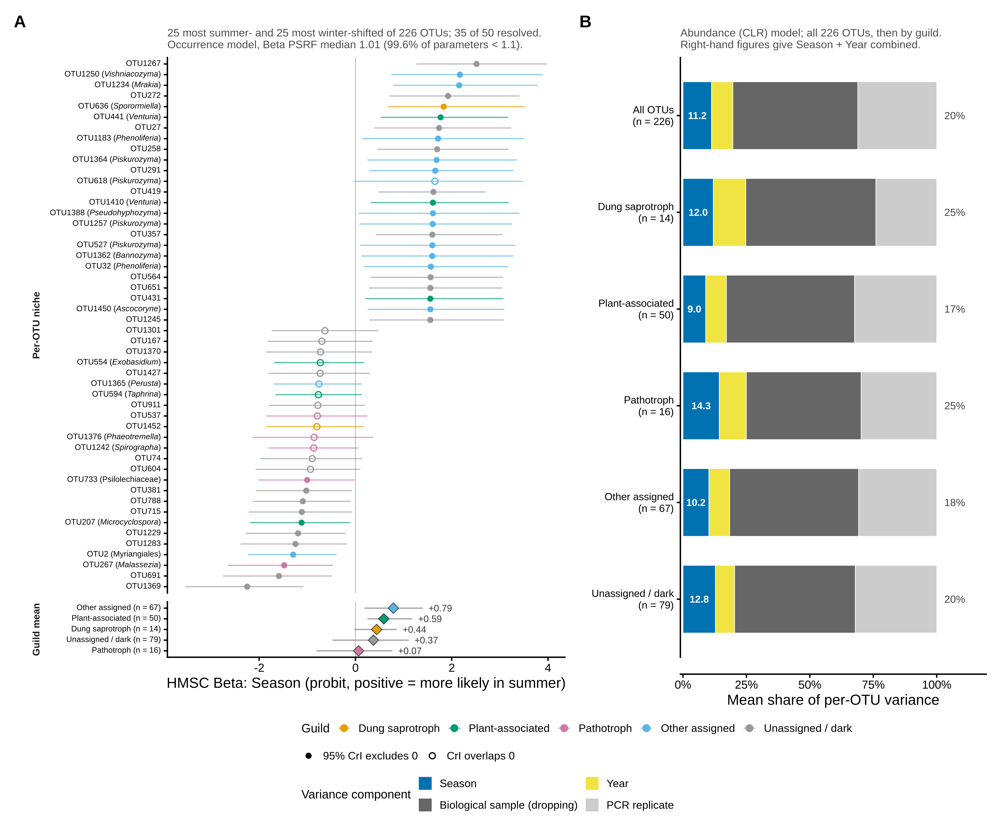

**Figure 5**: A joint species distribution model resolves a consistent seasonal axis at OTU level while showing how small it is against variation among individual droppings. **(A)** Per-OTU Season coefficient from the presence/absence (probit) HMSC model — positive = more likely to occur in summer — for the 25 most summer- and 25 most winter-shifted of the 226 modelled OTUs, coloured by functional guild, with 95% credible intervals; filled points are the 35 of these 50 whose interval excludes zero. The lower block gives each guild's mean of the per-OTU estimates (diamond) with the interquartile range, over all OTUs in that guild rather than only the 50 plotted; these means reproduce the trait-level Gamma coefficients of Table S-HMSCd to within 0.04. **(B)** Mean share of per-OTU variance in CLR abundance attributed to Season, Year, the biological-sample random level and the PCR-replicate random level, for all 226 OTUs and within each guild (Table S-HMSCc). Panel A comes from the occurrence formulation and panel B from the abundance formulation, following the division of labour set out in Section 9.1: the probit model is the one whose per-OTU niches converge cleanly (Beta median PSRF 1.01, 99.6% of parameters below 1.1), while the variance partition is well behaved in the CLR model. The five guild classes are the model's trait and differ slightly from the display split used in Figure 1 — 46 OTUs carrying a genus but no FUNGuild call sit in "Other assigned" here and in "Unassigned / dark" there (`tables/guild_scheme_crosswalk.csv`, Section 8.1).

Panel A makes the seasonal signal concrete at the level of individual lineages, and it is sharper in occurrence than in abundance: 55 of 226 OTUs have a Season coefficient whose 95% credible interval excludes zero, against 4 in the abundance model. The direction is overwhelmingly one-way — 157 of 226 OTUs shift towards summer, with a community median of +0.70 — so summer dung does not merely contain different fungi, it contains more kinds of fungi that are reliably present. The winter extreme is the familiar one: dark, taxonomically unresolved lineages (14 of the 25 most winter-shifted) together with pathotrophs, led by OTU1369, the most winter-shifted OTU in the community and the same unclassified Dothideomycete that dominates winter read share in Figure 4. The summer extreme, however, is *not* led by the coprophilous fungi. It is dominated by cold-adapted basidiomycete yeasts — *Vishniacozyma*, *Mrakia*, *Piskurozyma*, *Phenoliferia* — and by dark taxa, with *Sporormiella* (OTU636) the only dung saprotroph among the top 25. This is a real distinction rather than a contradiction of Figure 1: the coprophiles are what summer dung is *made of* in read share, but they are not what most reliably *appears* in summer, and the guild means in the lower block of panel A show the same ordering as the trait model (yeast-rich "other" +0.79, plant-associated +0.59, dung saprotroph +0.44, dark +0.37, pathotroph +0.07 — the only guild with no summer tendency). Panel B then supplies the scale that keeps all of this in proportion. Season and Year together account for about 20% of per-OTU variance (Season 11.2%, Year 8.4%), and the Season share is remarkably even across guilds (9.0% for plant-associated taxa to 14.3% for pathotrophs), while roughly half of the variance sits among biological samples — one dropping to the next — and a further third among PCR replicates of the same dropping. The community-mean Season share independently recovers the PERMANOVA R² of 0.11 from Section 4 with a completely different model. Taken together the two panels state the study's central quantitative claim in one place: seasonal turnover is real, directional, and reproducible across methods, yet it is modest beside the idiosyncrasy of individual birds — which is why the model explains the samples it has seen (R² ≈ 0.46) but cannot predict one it has not (Section 9.7).

```{r fig5-build}
#| eval: false
#| echo: !expr knitr::is_html_output()
#| code-fold: true
#| code-summary: "Full build code for Figure 5 — the source of truth for figures/main/Fig5_hmsc_synthesis.{png,jpg,pdf}"

# Figure 5 -- HMSC synthesis: per-OTU seasonal niche + variance partition.
# Every number is READ from the committed tables/ CSVs written by 10_hmsc.R; no
# model is loaded or refitted here (the fits are ~200 MB each and the figure
# needs only their posterior summaries).
#   A  tables/hmsc_probit_beta_season.csv  (per-OTU Season Beta, probit/occurrence)
#      tables/hmsc_probit_gamma_CrI.csv    (trait-level Gamma -- used as a GUARD)
#      tables/hmsc_convergence_psrf.csv    (printed into the panel subtitle)
#   B  tables/hmsc_variance_partition.csv  (per-OTU variance components, CLR)
# Panel A is the occurrence model and panel B the abundance model, per the
# division of labour in Section 9.1: only the probit Beta converges cleanly,
# only the CLR model yields the variance partition.
# Rebuild:  conda run -n r_env Rscript build_main_figure.R fig5-build

suppressPackageStartupMessages({
  library(ggplot2); library(patchwork); library(ggtext)
})

tab_dir <- if (dir.exists("tables")) "tables" else
           "/home/daniel/Ptarmigan/Scripts_server/Supplementary/tables"
out_dir <- "figures/main"
dir.create(out_dir, showWarnings = FALSE, recursive = TRUE)
grDevices::pdf(NULL)                                 # headless: no X11 fallback

# ---- shared style ----------------------------------------------------------
# Guild colours are Figure 1's, so a guild is the same colour in every main
# figure. The model's five-level trait is NOT identical to Figure 1's display
# split (46 OTUs move between "Other assigned" and "Unassigned / dark"); the
# caption says so and tables/guild_scheme_crosswalk.csv reconciles them.
GUILD_LEVELS <- c("Dung saprotroph", "Plant-associated", "Pathotroph",
                  "Other assigned", "Unassigned / dark")
guild_cols <- c("Dung saprotroph" = "#E69F00", "Plant-associated" = "#009E73",
                "Pathotroph" = "#CC79A7", "Other assigned" = "#56B4E9",
                "Unassigned / dark" = "#999999")
guild_map <- c(dung_saprotroph = "Dung saprotroph", plant_associated = "Plant-associated",
               pathotroph = "Pathotroph", other = "Other assigned",
               dark_unassigned = "Unassigned / dark")
# Variance components deliberately share NO colour with the guild scale, and
# split fixed (coloured) from random (grey): the visual point of panel B is how
# little of the bar is coloured.
VP_LEVELS <- c("Season", "Year", "Random: sample", "Random: pcr")   # CSV column names
# Displayed names: the CSV's terse "Random: pcr" is fine in a supplementary
# table but a main-text key has to say what the level actually is.
vp_display <- c("Season" = "Season", "Year" = "Year",
                "Random: sample" = "Biological sample (dropping)",
                "Random: pcr"    = "PCR replicate")
vp_cols <- c("Season" = "#0072B2", "Year" = "#F0E442",
             "Biological sample (dropping)" = "#666666", "PCR replicate" = "#CCCCCC")

base_theme <- theme_classic(base_size = 12) +
  theme(strip.background = element_blank(),
        strip.text.y     = element_text(face = "bold", size = 8.5, angle = 0),
        plot.tag         = element_text(face = "bold", size = 14),
        plot.subtitle    = element_text(size = 9, colour = "grey30"),
        panel.spacing    = unit(0.5, "lines"),
        legend.key.size  = unit(0.42, "cm"),
        legend.title     = element_text(size = 10),
        legend.text      = element_text(size = 9))

# All in-plot text is ASCII: save_fig() falls back to grDevices::pdf when cairo
# is unavailable, and that device silently substitutes a dot for a Unicode glyph.
# (The markdown asterisks below are ggtext italics markup, and are ASCII.)

# ============================================================================
# Panel A -- per-OTU seasonal niche (probit), plus guild means
# ============================================================================
b <- read.csv(file.path(tab_dir, "hmsc_probit_beta_season.csv"), stringsAsFactors = FALSE)
stopifnot(nrow(b) == 226L, !anyNA(b$beta_season_mean), !anyNA(b$beta_season_CrI2.5),
          setequal(b$guild, names(guild_map)))
b$Guild <- factor(unname(guild_map[b$guild]), levels = GUILD_LEVELS)
b <- b[order(-b$beta_season_mean), ]

# The 25 most summer- and 25 most winter-shifted OTUs.
sel <- rbind(head(b, 25), tail(b, 25))
stopifnot(nrow(sel) == 50L, !any(duplicated(sel$OTU_ID)))

# Row labels: genus in italics via ggtext, but only where "Genus" really is a
# genus -- Incertae sedis placeholders are family-level and are not italicised.
lab_of <- function(otu, gen) {
  ifelse(is.na(gen), otu,
  ifelse(grepl("Incertae", gen, fixed = TRUE),
         paste0(otu, " (", sub("_gen_Incertae_sedis", "", gen), ")"),
         paste0(otu, " (*", gen, "*)")))
}
sel$lab <- lab_of(sel$OTU_ID, sel$Genus)
stopifnot(!any(duplicated(sel$lab)))
# Support is one-sided P(beta > 0); a two-sided 95% CrI excluding zero is the
# stricter statement, so THAT is what the filled points mark.
sel$resolved <- factor(ifelse(sel$beta_season_CrI2.5 > 0 | sel$beta_season_CrI97.5 < 0,
                              "95% CrI excludes 0", "CrI overlaps 0"),
                       levels = c("95% CrI excludes 0", "CrI overlaps 0"))

# Guild means over ALL OTUs of that guild (not just the 50 plotted), with the
# IQR of the same per-OTU estimates as a spread -- a summary of the points
# above, NOT a credible interval, which is why it is drawn as a plain segment.
gm <- do.call(rbind, lapply(GUILD_LEVELS, function(g) {
  v <- b$beta_season_mean[b$Guild == g]
  data.frame(Guild = factor(g, levels = GUILD_LEVELS), n = length(v),
             mean = mean(v), q25 = quantile(v, 0.25), q75 = quantile(v, 0.75),
             stringsAsFactors = FALSE)
}))
gm$lab <- sprintf("%s (n = %d)", as.character(gm$Guild), gm$n)

# Drift guard: these guild means must reproduce the trait-level Gamma of
# Table S-HMSCd (reference guild = dung saprotroph, other rows are deviations
# from it). They are not algebraically identical -- Gamma is a hierarchical
# mean, not the arithmetic mean of Beta -- so the tolerance is loose enough to
# allow shrinkage but tight enough to catch a mismatched table.
gam <- read.csv(file.path(tab_dir, "hmsc_probit_gamma_CrI.csv"), stringsAsFactors = FALSE)
gam <- gam[gam$covariate == "Seasonsummer", ]
gref <- gam$mean[gam$trait == "(Intercept)"]
gimp <- setNames(c(gref, gref + gam$mean[match(paste0("guild", names(guild_map)[-1]), gam$trait)]),
                 unname(guild_map))
stopifnot(!anyNA(gimp[as.character(gm$Guild)]),
          max(abs(gm$mean - gimp[as.character(gm$Guild)])) < 0.10)

# One plot, two blocks: facet_grid with free space gives the guild block a
# height proportional to its 5 rows and keeps ONE shared x axis and one tag.
BLOCKS <- c("Per-OTU niche", "Guild mean")   # short: the lower block is only 5 rows tall
otu_df <- data.frame(lab = sel$lab, Guild = sel$Guild, resolved = sel$resolved,
                     est = sel$beta_season_mean,
                     lo = sel$beta_season_CrI2.5, hi = sel$beta_season_CrI97.5,
                     block = factor(BLOCKS[1], levels = BLOCKS))
gm_df  <- data.frame(lab = gm$lab, Guild = gm$Guild, est = gm$mean,
                     lo = gm$q25, hi = gm$q75,
                     block = factor(BLOCKS[2], levels = BLOCKS))
lvl <- c(gm_df$lab[order(gm_df$est)], otu_df$lab[order(otu_df$est)])
otu_df$lab <- factor(otu_df$lab, levels = lvl)
gm_df$lab  <- factor(gm_df$lab,  levels = lvl)

conv <- read.csv(file.path(tab_dir, "hmsc_convergence_psrf.csv"), stringsAsFactors = FALSE)
cpa  <- conv[conv$model == "pa", ]
stopifnot(nrow(cpa) == 1L)
n_res <- sum(sel$resolved == "95% CrI excludes 0")

pA <- ggplot(otu_df, aes(est, lab, colour = Guild)) +
  geom_vline(xintercept = 0, linewidth = 0.3, colour = "grey70") +
  # geom_segment rather than geom_errorbarh: the latter is deprecated in
  # ggplot2 4.0 and its replacement's argument names differ between versions.
  geom_segment(aes(x = lo, xend = hi, y = lab, yend = lab), linewidth = 0.4, alpha = 0.75) +
  geom_point(aes(shape = resolved), size = 1.9, stroke = 0.7) +
  # guild block: IQR segment behind, mean diamond on top, value printed
  geom_segment(data = gm_df, aes(x = lo, xend = hi, y = lab, yend = lab),
               inherit.aes = FALSE, colour = "grey65", linewidth = 0.5) +
  geom_point(data = gm_df, aes(est, lab, fill = Guild), inherit.aes = FALSE,
             shape = 23, size = 3, colour = "grey20", stroke = 0.4) +
  # Value printed to the RIGHT of the IQR, not above the diamond: the five guild
  # means sit within 0.7 of each other, so a label above one row lands on the next.
  geom_text(data = gm_df, aes(hi, lab, label = sprintf("%+.2f", est)), inherit.aes = FALSE,
            hjust = 0, nudge_x = 0.12, size = 2.7, colour = "grey20") +
  facet_grid(rows = vars(block), scales = "free_y", space = "free_y", switch = "y") +
  scale_colour_manual(values = guild_cols, name = "Guild", drop = FALSE) +
  scale_fill_manual(values = guild_cols, guide = "none", drop = FALSE) +
  scale_shape_manual(values = c("95% CrI excludes 0" = 16, "CrI overlaps 0" = 1),
                     name = NULL, drop = FALSE) +
  labs(x = "HMSC Beta: Season (probit, positive = more likely in summer)", y = NULL,
       subtitle = sprintf(paste0("25 most summer- and 25 most winter-shifted of 226 OTUs; %d of 50 resolved.\n",
                                 "Occurrence model, Beta PSRF median %.2f (%.1f%% of parameters < 1.1)."),
                          n_res, cpa$beta_psrf_med, cpa$beta_pct_below_1.1)) +
  base_theme +
  theme(axis.text.y = element_markdown(size = 6.6),
        strip.placement = "outside",
        strip.text.y.left = element_text(angle = 90, face = "bold", size = 8)) +
  guides(colour = guide_legend(order = 1, override.aes = list(shape = 16, size = 2.6)),
         shape  = guide_legend(order = 2))

# ============================================================================
# Panel B -- variance partition (CLR), community-wide and by guild
# ============================================================================
vp <- read.csv(file.path(tab_dir, "hmsc_variance_partition.csv"), check.names = FALSE)
# Components are stored rounded to 4 dp, so a row sums to 1 only to within the
# rounding error of four values -- hence 1e-3 rather than machine tolerance.
stopifnot(nrow(vp) == 226L, setequal(vp$OTU_ID, b$OTU_ID),
          all(VP_LEVELS %in% names(vp)),
          max(abs(rowSums(vp[, VP_LEVELS]) - 1)) < 1e-3)
vp$Guild <- factor(unname(guild_map[vp$guild]), levels = GUILD_LEVELS)

grp_mean <- function(d, label) data.frame(
  grp = label, n = nrow(d),
  t(colMeans(d[, VP_LEVELS])), check.names = FALSE)
vpm <- rbind(grp_mean(vp, "All OTUs"),
             do.call(rbind, lapply(GUILD_LEVELS,
                                   function(g) grp_mean(vp[vp$Guild == g, ], g))))
vpm$lab <- sprintf("%s (n = %d)", vpm$grp, vpm$n)
# Drift guard: the community-mean Season share is quoted as ~11% in Section 9.2
# and Table S-HMSCc, and matched against the PERMANOVA R2 of 0.11 in Section 4.
stopifnot(abs(100 * vpm$Season[vpm$grp == "All OTUs"] - 11.2) < 0.15)

vpL <- data.frame(
  lab  = factor(rep(vpm$lab, times = length(VP_LEVELS)), levels = rev(vpm$lab)),
  comp = factor(rep(unname(vp_display[VP_LEVELS]), each = nrow(vpm)),
                levels = unname(vp_display[VP_LEVELS])),
  pct  = 100 * unlist(vpm[, VP_LEVELS], use.names = FALSE))
# Season is the one segment whose exact value the reader needs; print it inside.
seaslab <- vpL[vpL$comp == "Season", ]
seaslab$mid <- seaslab$pct / 2
fixedlab <- data.frame(lab = factor(vpm$lab, levels = rev(vpm$lab)),
                       txt = sprintf("%.0f%%", 100 * (vpm$Season + vpm$Year)))

pB <- ggplot(vpL, aes(pct, lab, fill = comp)) +
  geom_col(width = 0.7, colour = "white", linewidth = 0.25,
           position = position_stack(reverse = TRUE)) +
  geom_text(data = seaslab, aes(mid, lab, label = sprintf("%.1f", pct)), inherit.aes = FALSE,
            size = 2.9, colour = "white", fontface = "bold") +
  geom_text(data = fixedlab, aes(103, lab, label = txt), inherit.aes = FALSE,
            hjust = 0, size = 3, colour = "grey25") +
  scale_fill_manual(values = vp_cols, name = "Variance component") +
  scale_x_continuous(breaks = seq(0, 100, 25), expand = expansion(mult = c(0.01, 0.16)),
                     labels = function(x) paste0(x, "%")) +
  scale_y_discrete(labels = function(x) sub(" \\(n = ", "\n(n = ", x)) +
  labs(x = "Mean share of per-OTU variance", y = NULL,
       subtitle = "Abundance (CLR) model; all 226 OTUs, then by guild.\nRight-hand figures give Season + Year combined.") +
  base_theme +
  theme(axis.text.y = element_text(size = 8.5, lineheight = 0.95)) +
  guides(fill = guide_legend(nrow = 2, byrow = TRUE))

# ---- assemble and write ----------------------------------------------------
fig5 <- (pA | pB) +
  plot_layout(widths = c(1.3, 1), guides = "collect") +
  plot_annotation(tag_levels = "A") &
  # Three collected keys (guild, support, variance component) do not fit on one
  # row at this width -- side by side they overflow the device and are clipped.
  theme(legend.position = "bottom", legend.box = "vertical",
        legend.box.just = "left", legend.margin = margin(t = 0, b = 0))

# Every main figure is written three ways: PNG and JPG (600 dpi raster, for
# submission systems that demand one or the other) and PDF (vector, for print).
save_fig <- function(stem, obj, width, height, res = 600) {
  one <- function(open_dev) { open_dev(); on.exit(grDevices::dev.off()); print(obj) }
  one(function() grDevices::png(paste0(stem, ".png"), width = width, height = height,
                                units = "in", res = res))
  one(function() grDevices::jpeg(paste0(stem, ".jpg"), width = width, height = height,
                                 units = "in", res = res, quality = 95))
  pdf_dev <- if (capabilities("cairo")) grDevices::cairo_pdf else grDevices::pdf
  one(function() pdf_dev(paste0(stem, ".pdf"), width = width, height = height))
}
save_fig(file.path(out_dir, "Fig5_hmsc_synthesis"), fig5, 11.5, 9.5)

# ---- console summary -------------------------------------------------------
cat(sprintf("Per-OTU Season Beta (probit): %d of %d OTUs with a 95%% CrI excluding 0; %d of the 50 plotted.\n",
            sum(b$beta_season_CrI2.5 > 0 | b$beta_season_CrI97.5 < 0), nrow(b), n_res))
cat(sprintf("Community shift: median %+.2f, %d of %d OTUs positive.\n",
            median(b$beta_season_mean), sum(b$beta_season_mean > 0), nrow(b)))
cat("\nGuild means vs the trait-level Gamma (Table S-HMSCd):\n")
print(data.frame(guild = as.character(gm$Guild), n = gm$n,
                 mean_beta = round(gm$mean, 3),
                 gamma_implied = round(unname(gimp[as.character(gm$Guild)]), 3),
                 IQR = sprintf("[%.2f, %.2f]", gm$q25, gm$q75)), row.names = FALSE)
cat("\nExtremes of panel A:\n")
print(data.frame(end = c(rep("summer", 3), rep("winter", 3)),
                 OTU = c(head(sel$OTU_ID, 3), rev(tail(sel$OTU_ID, 3))),
                 guild = as.character(c(head(sel$Guild, 3), rev(tail(sel$Guild, 3)))),
                 beta = round(c(head(sel$beta_season_mean, 3), rev(tail(sel$beta_season_mean, 3))), 2)),
      row.names = FALSE)
cat("\nGuild composition of the 25 summer- / 25 winter-shifted rows:\n")
print(table(guild = sel$Guild, end = rep(c("summer25", "winter25"), each = 25)))
cat("\nVariance partition (mean % per OTU):\n")
print(data.frame(group = vpm$lab, round(100 * vpm[, VP_LEVELS], 1), check.names = FALSE),
      row.names = FALSE)
```

::: {.content-visible when-profile="docs"}
#### Documentation notes — Section 10 {.unnumbered}

*Documentation build only; omitted from the submitted appendix. Move any paragraph, callout or table here that belongs in the full record rather than in the supplement.*
:::

------------------------------------------------------------------------

::: {.content-visible when-profile="docs"}
<!-- project status; not part of the submitted appendix -->

::: {.callout-note appearance="minimal"}
Sections 2–5 were regenerated end-to-end from the corrected canonical dataset (`4_data_prep.R`), which fixed a depth-filter bug in a previously saved workspace (three sub-10,000-read samples had been retained and rarefaction depth had silently collapsed to 2,975 reads). All finalized figures and tables use the corrected 52-sample canonical object (`alldat$nopool`), except the Section 3 taxonomic barplots, which use script 5's 57-sample unfiltered PCR-collapsed object as noted. Sections 6, 7.1–7.3, 9 (functional guilds), 10 (HMSC) and 11 (main-text figures) are integrated;
:::
:::
