```{r}
#| include: false
# THIS FILE RENDERS TWO WAYS.
#
#   submission version (default)   ->  Appendix_HTML.html
#     cd Scripts_server/Supplementary
#     conda run -n r_env quarto render Supplementary_Appendix.qmd --to html
#
#   documentation version          ->  Appendix_documentation.html
#     conda run -n r_env quarto render Supplementary_Appendix.qmd --to html \
#       --profile docs --output Appendix_documentation.html
#
# Anything wrapped like this appears ONLY in the documentation version:
#
#   :::: {.content-visible when-profile="docs"}
#   ...paragraphs, callouts, tables, code chunks...
#   ::::
#
# Conventions, so this stays easy to hand-edit:
#   * Always open the wrapper with FOUR colons, even with nothing nested
#     inside it. Pandoc closes the innermost open div on ANY line of three
#     or more colons, so a normal ::: callout can then be pasted straight in
#     without counting fences.
#   * Every section ends with an empty "Documentation notes" block. Move a
#     paragraph in there to keep it out of the submitted appendix.
#   * For a clause rather than a whole paragraph, use an inline span:
#     [only in the docs build]{.content-visible when-profile="docs"}
#   * Chunks inside a hidden block still EXECUTE; only their output is
#     dropped. Hiding something does not make the render faster.
#
# Check after editing: a mis-counted fence does not fail the build, it
# renders as literal ":::" in the HTML. Search the output for ':::'.

if (knitr::is_html_output()) {
  knitr::opts_chunk$set(echo = TRUE)
}
```

## Overview and reproducibility

This document compiles methodological details, supplementary analyses, and reproducibility outputs supporting the main manuscript.

::: {.content-visible when-profile="docs"}

It tests three preregistered hypotheses about the fungal community of willow ptarmigan dung across a seasonal contrast (winter, March vs. summer, June) replicated over three years (2022–2024):

-   **H1** — The dung fungal community differs in composition between the winter and summer timeblocks, and the magnitude of this seasonal shift is consistent across the three sampling years (2022–2024).
-   **H2** — Fungal alpha diversity is higher in summer than winter. On the diet-matched subset, per-sample fungal alpha diversity increases with per-sample dietary plant richness, consistent with diet acting as the dominant propagule source for the dung fungal community.
-   **H3** — On the diet-matched subset, individual fungal OTUs differ in *how specifically* they covary with the diet-plant community. Fungi tightly covarying with particular plant taxa are interpreted as likely ingested dietary passengers; taxonomically recognised coprophilous taxa (e.g. Sordariales) are expected to show diffuse, non-specific associations, consistent with their non-host-specific spore dispersal. Tight single-plant covariation is treated as the strong, interpretable signal.

Two exploratory aims accompany the preregistered hypotheses and are kept conceptually distinct from them:

-   **E1** — Identify fungal OTUs lacking a confident UNITE assignment that occur at non-trivial abundance ("dark taxa"); see Section 3.4.
-   **E2** — Document the occurrence and relative abundance of *Sporormiella*-type and other Sordariales taxa used in palynological reconstructions, to provide a modern avian reference point for a herbivore-presence proxy currently calibrated almost entirely on mammals; see Section 3.2. Note that E2 (a herbivore-presence proxy) is distinct from H3 (plant–fungus covariation) and from E1 (dark taxa).
:::

Computationally intensive steps (DADA2 denoising, LULU curation, iNEXT3D diversity estimation, GLLVM and Bayesian model fitting, phylogenetic community-structure null models) were executed on a remote Ubuntu-based computing environment. Their outputs (figures, tables, and selected model objects) are integrated here as static results, with the generating code shown in collapsible drop-downs in the HTML version.

All figures (PNG) and result tables (CSV) are stored within the project repository under `Supplementary/figures/` and `Supplementary/tables/` using relative paths. Rendering this document therefore requires cloning the repository and opening the `.qmd` file from the `Supplementary/` directory.

::: {.content-visible when-profile="docs"}
<!-- project status; not part of the submitted appendix -->

::: callout-note
## Status of this appendix

The analyses in **Sections 2–5** are finalized: they were regenerated end-to-end from the corrected canonical dataset and independently checked. **Section 6** (GLLVM, OTU-resolved H1) is integrated, with one flagged caveat — its fitted models predate the depth-filter correction (see the callout there). **Sections 7.1** (the Bayesian diet-richness mechanism for H2) and **7.2** (H3 OTU–plant covariation) are integrated. **Section 8** (functional guilds) is integrated and was regenerated from the corrected canonical dataset. **Section 9** (HMSC joint species distribution model) is integrated. **Section 10** collects the main-text figures and holds the authoritative build code for each; it is being populated as the main text is written.

**Correction of 2026-08-05 (affects a headline result).** The Section 4.2 PERMANOVA previously fitted `Year` as a numeric covariate rather than a factor, which tested only a linear trend across 2022–2024 and reported *no* Season × Year interaction. With `Year` correctly fitted as a factor the interaction is **significant** (R² = 0.10, p = 0.011): seasonal turnover is real and directionally consistent, but its magnitude differs among years. The Season main effect is unchanged. See the "Supersedes" note in Section 4.2, the new Table S5b, and Figure 2.
:::
:::

**Data availability.**

Repository: [Ptarmigan_fungi](https://github.com/Ssangulo/Ptarmigan_fungi)\
Sequence data: ENA accession number *(to be assigned)*\
Metadata: `Data_S1_metadata.csv` *(field/season/year/individual keys)*

If viewing the PDF version of this Appendix, note that the HTML version exposes all code to reproduce these results through drop-downs.

------------------------------------------------------------------------

::: {.content-visible when-profile="docs"}
#### Documentation notes — front matter {.unnumbered}

*Documentation build only; omitted from the submitted appendix. Move any paragraph, callout or table here that belongs in the full record rather than in the supplement.*
:::

## Section 0: Setup {.unnumbered}

Output directory paths and shared aesthetic constants used throughout this document. All packages are loaded locally within each code section.

```{r setup}
#| eval: false
#| echo: !expr knitr::is_html_output()
#| code-fold: true

# Output folders used by table/figure chunks (relative to this .qmd)
out_fig_dir <- "figures"
out_tab_dir <- "tables"

# Season palette (Wong 2011, colorblind-safe): winter = cold blue, summer = warm orange
season_colors <- c(winter = "#0072B2", summer = "#D55E00")
season_labels <- c(winter = "Winter",  summer = "Summer")
season_levels <- c("Winter", "Summer")

# Season label mapping (lowercase raw -> display), used for all Season groupings
labs_map  <- c(winter = "Winter", summer = "Summer")
lvl_order <- c("Winter", "Summer")

# Shared base theme — main figures use a classic theme at base_size 12
# base_theme <- theme_classic(base_size = 12) + theme(...)
```

------------------------------------------------------------------------

## Section 1: Data and analysis objects {.unnumbered}

All downstream analyses draw on a small set of canonical phyloseq objects produced by `4_data_prep.R` and saved in `eco_analysis.RData` on the analysis server. Computationally intensive analyses were executed remotely; their outputs are stored under `tables/` and `figures/` and loaded/embedded as needed.

```{r load-objects}
#| eval: false
#| echo: !expr knitr::is_html_output()
#| code-fold: true

load("eco_analysis.RData")  # produced by 4_data_prep.R

# alldat        : named list (nopool / pool / pspool). Primary analysis object.
#                 PCR replicates COLLAPSED by summing; non-fungal OTUs removed;
#                 taxonomy cleaned; depth filter >= 10,000 reads/sample.
#                 alldat$nopool = 52 samples (canonical object for PERMANOVA,
#                 iNEXT3D, dominance).
# alldat.rfy    : same as alldat but rarefied to the minimum depth (12,615 reads).
#                 Retained as a cross-check: per-sample Hill numbers are now
#                 size-standardised to that same depth analytically by iNEXT.3D
#                 from the raw counts, rather than read off one rarefaction draw.
# alldat_full   : one row per PCR replicate (never collapsed), pass-through depth
#                 threshold; for GLLVM / mixed-model work where PCR replicate is an
#                 explicit random effect (read-count offset, not rarefaction).
#
# The non-pooled (independent per-sample) DADA2 inference strategy ("nopool") is
# primary throughout, matching the numbered pipeline scripts.
```

## Section 2: Bioinformatics summary and study design

### 2.1 Study site and sampling design

Willow ptarmigan (*Lagopus lagopus*) faecal samples were collected at Lifjellet (Lierne municipality, Trøndelag, Norway) across a seasonal contrast: winter (March, snow-covered, browse-dominated diet) versus summer (June, green forage available) — replicated over three years (2022, 2023, 2024). The design is a Season × Year factorial, with repeated sampling of individually identifiable birds (microsatellite-confirmed where possible). Approximately 60 dung samples passed processing, of which \~31 have paired plant ITS2 diet data used for the H2 diet-richness mechanism (Section 7).

Each biological dung sample was amplified in two independent PCR replicates. DNA extraction, ITS2 amplification, demultiplexing (sabre), primer trimming (cutadapt), denoising (DADA2, non-pooled inference), and post-clustering curation (LULU) followed the workflow in `Scripts/1_demultiplexing.R`–`Scripts/3_taxonomic_assignment.R`; taxonomy was assigned against the UNITE reference (naïve Bayes, `minBoot = 80`). Negative, no-template, and extraction-blank controls were sequenced alongside samples and used for contaminant removal in `Scripts/4_data_prep.R`.

```{r tab-design}
#| echo: !expr knitr::is_html_output()
#| code-fold: true
#| code-summary: "Code for the Season x Year design table"
library(knitr)
# Counted from the canonical per-sample table so the design cannot drift from the
# object every downstream analysis uses (52 samples, PCR replicates summed).
des <- read.csv("tables/guild_composition_per_sample.csv", check.names = FALSE)
stopifnot(nrow(des) == 52, !anyNA(des$Season), !anyNA(des$Year))

tab <- table(factor(des$Season, levels = c("Winter", "Summer")), des$Year)
out <- cbind(as.data.frame.matrix(addmargins(tab, 2)))
names(out)[ncol(out)] <- "Total"
out <- cbind(Season = c("Winter (March)", "Summer (June)"), out)
out <- rbind(out, c("Total", colSums(out[, -1, drop = FALSE])))

kable(out, row.names = FALSE, align = c("l", rep("r", ncol(out) - 1)),
      caption = "Table S1. Season x Year sampling design of the final analysis set: biological dung samples retained after PCR-replicate collapsing, decontamination, non-fungal OTU removal and the 10,000-read depth filter. Each sample was amplified in two independent PCR replicates. Five of the 57 samples entering the depth filter were dropped by it (Figure S1, Table S2).")
```

### 2.2 Read and OTU tracking through the pipeline

This section reports read and OTU retention through each processing step for the primary `nopool` strategy.

```{r tab-tracking}
#| echo: false
library(knitr)
library(dplyr)

trk <- read.csv("tables/report_read_otu_tracking.csv", check.names = FALSE)
trk <- trk[trk$strategy == "nopool", ]

step_labels <- c(
  "post_cutadapt_input_to_filter"            = "Post-cutadapt (input to DADA2 quality filter)",
  "post_quality_filter"                       = "Post quality filter (filterAndTrim)",
  "post_merge_denoise"                        = "Post denoise + merge pairs (pre-chimera ASVs)",
  "post_chimera_removal"                      = "Post chimera removal (ASVs)",
  "post_LULU_curation"                        = "Post LULU curation (OTUs)",
  "pcr_collapsed_decontaminated_taxassigned"  = "PCR replicates collapsed, decontaminated, taxonomy assigned",
  "non_fungal_OTU_removal"                    = "Post non-fungal OTU removal (PlutoF)",
  "depth_filter_final (>=10,000 reads)"       = "Final analysis set (depth filter >= 10,000 reads/sample)"
)

first_reads <- trk$total_reads[1]
trk_out <- data.frame(
  `Pipeline step`        = step_labels[as.character(trk$step)],
  `Samples / wells`      = trk$n_samples,
  `OTUs (ASVs)`          = ifelse(is.na(trk$n_taxa), "—", format(trk$n_taxa, big.mark = ",")),
  `Total reads`          = format(round(trk$total_reads), big.mark = ","),
  `% of starting reads`  = sprintf("%.1f%%", 100 * trk$total_reads / first_reads),
  check.names = FALSE, row.names = NULL
)

kable(trk_out,
      caption = "Table S2. Reads and OTUs retained at each processing step (nopool strategy).")
```

**Figure S1**: Per-sample sequencing depth after non-fungal OTU removal, before the depth filter (57 samples). Five samples (four winter, one summer) fall below the 10,000-read cutoff and are excluded from the analysis-ready dataset (52 samples).

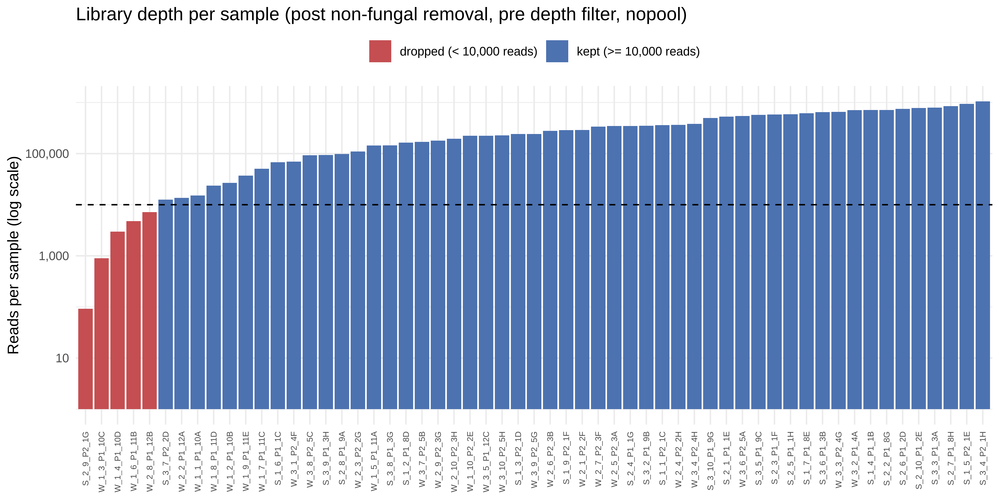

```{r sec2-build}
#| eval: false
#| echo: !expr knitr::is_html_output()
#| code-fold: true
#| code-summary: "Full code for Table S2 and Figure S1 — the source of truth for the read/OTU tracking table and library-depth figure"

# ---------------------------------------------------------------------------
# Table S2 (read/OTU tracking) and Figure S1 (library depth).
#
# This chunk is the source of truth for both: there is no parallel script.
# Nothing is re-run here -- every count is read from workspaces the pipeline
# already wrote. Raw-fastq and post-demultiplexing counts (script 1) are out of
# scope: no counts were logged for that step and recovering them means
# rescanning ~39 GB of FASTQ. The earliest quantified checkpoint is therefore
# "post-cutadapt reads entering DADA2 quality filtering".
#
# Sources (all read-only):
#   merged_ITS.RData                 2_DADA2_lulu.R, saved after LULU curation
#   phyloseq_comparison_summary.csv  4_data_prep.R Section 8
#   eco_analysis.RData               4_data_prep.R
# ---------------------------------------------------------------------------
library(phyloseq)
library(dplyr)
library(ggplot2)

# Data live outside the repo; set this to the directory holding the workspaces.
data_dir <- "/home/daniel/Ptarmigan/trimmed/mergedPlates"
tab_dir  <- "tables"; fig_dir <- "figures"   # relative to this .qmd

grDevices::pdf(NULL)                          # headless: no X11 fallback
save_png <- function(obj, filename, width, height, dpi = 800) {
  png(file.path(fig_dir, filename), width = width, height = height,
      units = "in", res = dpi)
  print(obj); dev.off()
}

# ---- Scripts 1-2: post-cutadapt / filter / merge / chimera / LULU ----------
e <- new.env(); load(file.path(data_dir, "merged_ITS.RData"), envir = e)
out_df <- e$out_df
reads_postcutadapt <- sum(out_df$reads.in)
reads_postfilter   <- sum(out_df$reads.out)

dims_of <- function(m) data.frame(n_samples = nrow(m), n_taxa = ncol(m),
                                  total_reads = sum(m))

step_merge <- dplyr::bind_rows(
  data.frame(step = "post_merge_denoise", strategy = "nopool", dims_of(e$merged_seqtab)),
  data.frame(step = "post_merge_denoise", strategy = "pool",   dims_of(e$merged_seqtabPP)),
  data.frame(step = "post_merge_denoise", strategy = "pspool", dims_of(e$merged_seqtabpsPP)))
step_chimera <- dplyr::bind_rows(
  data.frame(step = "post_chimera_removal", strategy = "nopool", dims_of(e$merged_seqtab.nochim)),
  data.frame(step = "post_chimera_removal", strategy = "pool",   dims_of(e$merged_seqtabPP.nochim)),
  data.frame(step = "post_chimera_removal", strategy = "pspool", dims_of(e$merged_seqtabpsPP.nochim)))
step_lulu <- dplyr::bind_rows(
  data.frame(step = "post_LULU_curation", strategy = "nopool", dims_of(e$nopool.lulu)),
  data.frame(step = "post_LULU_curation", strategy = "pool",   dims_of(e$pool.lulu)),
  data.frame(step = "post_LULU_curation", strategy = "pspool", dims_of(e$pspool.lulu)))

# Sample count at the pre-DADA2 steps is the number of PCR wells: out_df rows
# are per read-direction (r1/r2), so strip that suffix before counting.
n_pcr_wells <- length(unique(sub("r[12]$", "", rownames(out_df))))
step_filter <- dplyr::bind_rows(lapply(c("nopool","pool","pspool"), function(s)
  data.frame(step = "post_cutadapt_input_to_filter", strategy = s,
             n_samples = n_pcr_wells, n_taxa = NA, total_reads = reads_postcutadapt)))
step_qfilter <- dplyr::bind_rows(lapply(c("nopool","pool","pspool"), function(s)
  data.frame(step = "post_quality_filter", strategy = s,
             n_samples = n_pcr_wells, n_taxa = NA, total_reads = reads_postfilter)))

rm(e); gc()

# ---- Scripts 3-4: PCR-collapsed/decontaminated -> non-fungal removal ->
#      depth filter, from 4_data_prep.R Section 8's comparison table ---------
cmp <- read.csv(file.path(data_dir, "phyloseq_comparison_summary.csv"),
                stringsAsFactors = FALSE)
cmp <- cmp[cmp$object %in% c("nopool","pool","pspool"), ]
relabel <- function(df, label)
  data.frame(step = label, strategy = df$object, n_samples = df$n_samples,
             n_taxa = df$n_taxa, total_reads = df$total_reads,
             stringsAsFactors = FALSE)

tracking <- dplyr::bind_rows(
  step_filter, step_qfilter, step_merge, step_chimera, step_lulu,
  relabel(cmp[cmp$step == "initial", ],            "pcr_collapsed_decontaminated_taxassigned"),
  relabel(cmp[cmp$step == "post_PlutoF_filter", ], "non_fungal_OTU_removal"),
  relabel(cmp[cmp$step == "post_depth_filter", ],  "depth_filter_final (>=10,000 reads)")) %>%
  mutate(n_samples   = as.numeric(n_samples),
         n_taxa      = as.numeric(n_taxa),
         total_reads = as.numeric(total_reads)) %>%
  mutate(step = factor(step, levels = c(
    "post_cutadapt_input_to_filter", "post_quality_filter", "post_merge_denoise",
    "post_chimera_removal", "post_LULU_curation",
    "pcr_collapsed_decontaminated_taxassigned", "non_fungal_OTU_removal",
    "depth_filter_final (>=10,000 reads)"))) %>%
  arrange(step, strategy)

write.csv(tracking, file.path(tab_dir, "report_read_otu_tracking.csv"), row.names = FALSE)

# ---- Figure S1: per-sample depth at the post-non-fungal-removal checkpoint --
# That intermediate object is not saved in its own right, but is reconstructed
# exactly from two objects that are: the 57-sample pre-removal phyloseq and the
# already-computed non-fungal OTU id list.
load(file.path(data_dir, "eco_analysis.RData"))   # nopoolps.dada2, nonfungal_ids_by_strategy
ps_pp <- prune_taxa(setdiff(taxa_names(nopoolps.dada2),
                            nonfungal_ids_by_strategy$nopool), nopoolps.dada2)

depth_df <- data.frame(sample = sample_names(ps_pp), depth = sample_sums(ps_pp))
depth_df$Season <- as.data.frame(sample_data(ps_pp))$Season
depth_df$status <- ifelse(depth_df$depth >= 10000,
                          "kept (>= 10,000 reads)", "dropped (< 10,000 reads)")

p_depth <- ggplot(depth_df, aes(reorder(sample, depth), depth, fill = status)) +
  geom_col() +
  geom_hline(yintercept = 10000, linetype = "dashed", colour = "black") +
  scale_y_log10(labels = scales::comma) +
  scale_fill_manual(values = c("kept (>= 10,000 reads)"    = "#4C72B0",
                               "dropped (< 10,000 reads)"  = "#C44E52")) +
  labs(x = NULL, y = "Reads per sample (log scale)",
       title = "Library depth per sample (post non-fungal removal, pre depth filter, nopool)",
       fill = NULL) +
  theme_minimal(base_size = 11) +
  theme(axis.text.x = element_text(angle = 90, hjust = 1, vjust = 0.5, size = 6),
        legend.position = "top")

save_png(p_depth, "report_library_depth.png", width = 10, height = 5)

cat(sprintf("%d samples, %d dropped (<10,000 reads): %s\n",
            nrow(depth_df), sum(depth_df$status != "kept (>= 10,000 reads)"),
            paste(depth_df$sample[depth_df$status != "kept (>= 10,000 reads)"],
                  collapse = ", ")))
```

::: {.content-visible when-profile="docs"}
#### Documentation notes — Section 2 {.unnumbered}

*Documentation build only; omitted from the submitted appendix. Move any paragraph, callout or table here that belongs in the full record rather than in the supplement.*
:::

## Section 3: Taxonomic overview

### 3.1 Community composition across ranks

Per-sample relative read abundance at four taxonomic ranks, with samples grouped and ordered by Season (and Year).


**Figure S2**: Phylum-level composition per sample, grouped by Season.


**Figure S3**: Class-level composition per sample, grouped by Season.


**Figure S4**: Order-level composition per sample, grouped by Season.


**Figure S5**: Genus-level composition per sample, grouped by Season. Many summer bars are dominated end-to-end by a single genus (*Thelebolus*, *Sporormiella*, or *Coniochaeta*), consistent with the dominance analysis in Section 5, whereas winter bars are more evenly patchworked across genera.

### 3.2 Coprophilous (dung-specialist) genera (E2)

This subsection addresses exploratory aim **E2**: documenting the occurrence and relative abundance of *Sporormiella*-type and other Sordariales taxa used in palynological herbivore-presence reconstructions, to provide a modern avian reference point for a proxy currently calibrated almost entirely on mammalian dung.

The canonical tax table was screened against a list of coprophilous genera comprising the standard palynological set — *Sordaria, Podospora, Cercophora, Chaetomium, Schizothecium, Preussia, Sporormiella, Delitschia, Pilobolus, Ascobolus, Coprinopsis, Saccobolus, Sporormia* — extended with four further dung-associated genera recovered here: *Thelebolus, Coniochaeta, Psathyrella* and *Stropharia*. This is the list used throughout this subsection, for both Table S3 and the read-share test below.

Six of the seventeen genera were detected, across 17 OTUs: ***Sporormiella*** (7 OTUs), ***Thelebolus*** (4), ***Psathyrella*** (2), ***Stropharia*** (2), and single OTUs of ***Coniochaeta*** and ***Coprinopsis***. The eleven remaining genera — including *Sordaria*, *Podospora* and *Cercophora*, the taxa most often counted in palynological work — do not appear in this dataset at all. Per-OTU winter/summer mean read shares and occurrences (number of samples per season, of 26 each) are shown below.

```{r tab-copro}
#| echo: false
library(knitr)
copro <- read.csv("tables/report_coprophilous_by_season_v2.csv", check.names = FALSE)
kable(copro, digits = 3,
      caption = "Table S3. Coprophilous-genus OTUs: mean read share (%) and occurrence per Season (canonical object, 52 samples; 26 winter / 26 summer).")
```

Total per-sample coprophilous read share is **markedly higher in summer** than winter — 45.7% versus 8.7% of reads on average (medians 47.5% and 0.02%; Wilcoxon rank-sum p = 0.0012). The contrast is carried by *Thelebolus*, *Coniochaeta* and *Sporormiella*, the three summer-dominant OTUs of Section 5.4; *Psathyrella*, *Stropharia* and *Coprinopsis* occur only at trace level. Code for this table is shared with the dominance analysis and shown in Section 5.

::: {.content-visible when-profile="docs"}
<!-- placeholder subsection; not yet vetted for the manuscript -->

### 3.3 Taxonomic assignment success by rank *(placeholder)*

::: callout-warning
**To be finalized.** A per-rank summary of the percentage of reads and OTUs with confident taxonomic assignment, broken down by Season, is available as `tables/tax_assignment_summary_season.xlsx` but has not yet been vetted for the manuscript. A rendered Table S4 (Phylum → Species assignment rates) will be inserted here once confirmed.
:::
:::

### 3.4 Dark taxa and UNITE Species Hypothesis characterisation (E1)

::: {.content-visible when-profile="docs"}
<!-- exploratory-status hedge -->

::: callout-warning
**Exploratory (E1); not yet definitive.** This subsection runs the authoritative UNITE `sh_matching` pipeline (v2.0.4, the service behind PlutoF) as a *complementary lens* on the taxonomically unresolved fraction of the community. It **does not modify the canonical taxonomy** used everywhere else in this appendix — Species Hypothesis (SH) matching and the DADA2/UNITE naïve-Bayes classifier answer different questions (which SH cluster and how novel, versus which confident Linnaean name) and are kept separate by design. Novelty calls and new-SH assignments here are preliminary and pending validation for the manuscript.
:::
:::

Nearly half of the retained fungal OTUs are **"dark taxa"**: 493 of 1129 (43.7%), accounting for 35.4% of reads that the naïve-Bayes classifier leaves without a confident genus. These are not spread evenly across the design: in the dominance analysis (Section 5.4), winter samples are markedly dark-taxa dominated, with dark taxa making up on average 51.3% of winter reads (a far smaller share in summer), and winter's single most persistent OTU (OTU1369) is itself a dark taxon. To make this unresolved winter community interpretable, every OTU's ITS2 sequence was matched against the UNITE SH reference set, which places each sequence into an existing species hypothesis or forms a new (candidate) one, independent of whether a Linnaean name is available.

```{r tab-e1-summary}
#| echo: false
library(knitr)
s <- read.csv("tables/E1_SH_assignment_summary.csv", check.names = FALSE)
e1_tab <- data.frame(
  Category = c("Dark OTUs (no confident genus)",
               " placeable to an existing named SH",
               " novel — forms a new species hypothesis",
               " no reference within 80% identity",
               " filtered before matching (QC)"),
  `Dark OTUs` = c(s$n_dark, s$placeable_existing_SH, s$novel_new_SH,
                  s$no_SH_match, s$excluded_nonITS),
  check.names = FALSE)
kable(e1_tab,
      caption = sprintf("Table S-E1a. UNITE Species Hypothesis placement of the dark-taxa OTUs (no confident genus in the canonical taxonomy). Median best-hit similarity to UNITE = %.2f%%; %d dark OTUs gained a finer lineage (family or deeper) from the SH consensus. The last three rows are all non-placements: rows 3 and 4 differ only in whether a UNITE relative exists at 80%% identity, and row 5 covers sequences dropped by quality control before the matching step ran (see the caveats below for what that QC actually is). Main-text Fig. 5A merges rows 4 and 5.", s$median_similarity, s$gained_finer_lineage))
```

**Most dark taxa are close to known references, and a live-database cross-check further shrinks the genuinely-novel fraction.** Against the local reference, of the 493 dark OTUs 143 were placeable to an existing named UNITE SH, 247 formed new (candidate) species hypotheses, and 90 had no reference within 80% identity; 13 were dropped by quality control before matching. The novel and no-match sequences were then re-run through the PlutoF web service, whose reference database is larger and more current: this reclassified 79 formerly-novel OTUs across the community — 19 of them dark — as matches to existing named SHs (21 of the 79 resolving to species, and 11 of the 19 dark ones gaining a genus). Table S-E1a reflects this combined result: 162 placeable, 228 candidate-novel, 90 with no reference within 80%. It is worth being explicit that the last two are the same kind of outcome — neither sits inside an existing named SH — and that the 90 are the *most* divergent candidates rather than sequences that failed to analyse. The pipeline is designed to cluster them de novo into their own new Species Hypotheses, but in v2.0.4 the no-hits branch of `run_pipeline.sh` invokes the hits parsers (`parse_matches_sh.pl`) rather than `parse_matches_1.pl`, so the de-novo table (`matches_1_out_*.csv`) is never written and these OTUs reach `9_dark_taxa_SH_matching.R` as an absence rather than a status. Taken together, 331 of the 493 dark OTUs (67%) are candidate-novel in one form or the other. Each placeable OTU resolves to a stable SH page (`https://unite.ut.ee/sh/<code>`) carrying the taxon name and its DOI. The best-hit similarity distribution (Figure S-E1a) shows the dark fraction is bimodal — a spike near 100% (OTUs essentially identical to a reference but withheld a genus by the conservative `minBoot = 80` threshold) plus a real tail of divergent, candidate-novel lineages.

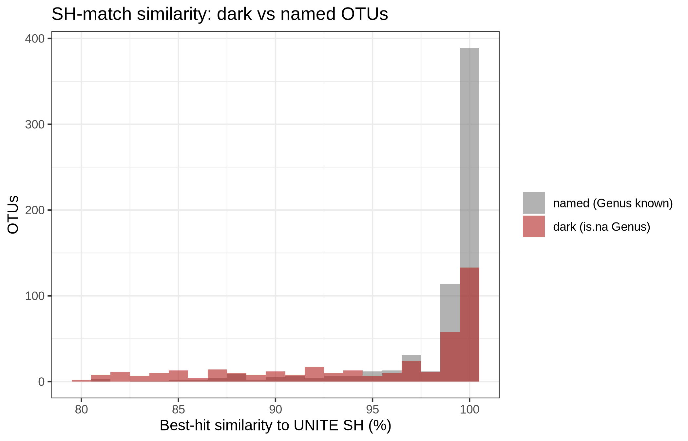

**Figure S-E1a**: Best-hit similarity to the nearest UNITE Species Hypothesis, dark (no confident genus, red) versus named (grey) OTUs.

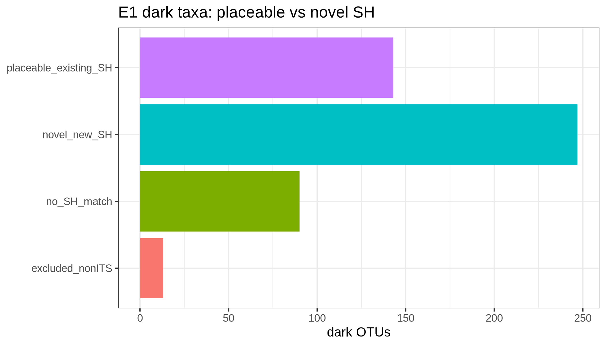

**Figure S-E1b**: Dark-taxa OTUs by SH placement category (placeable to an existing SH, novel/new SH, no reference within 80% identity, or filtered before matching). All four categories are kept separate here; main-text Fig. 5A merges the last two. Category names in the underlying `SH_class` column are unchanged (`no_SH_match`, `excluded_nonITS`).

SH matching directly addresses the "winter = dark taxa" caveat: 34.6% of the winter dark-read burden is placeable to an existing UNITE SH (mean of the per-sample ratio), while the remainder is candidate-novel. Expressed as shares of *all* winter reads rather than of the dark fraction — the form main-text Fig. 5B plots — the dark 51.3% divides into 15.8% placeable, 29.2% candidate-novel and 6.2% with no reference within 80% identity; the corresponding summer figures are 21.5%, 7.2% and 2.5% of a 31.2% dark fraction. Winter's dominant dark OTU, OTU1369, is genuinely novel: a candidate new SH only 85.4% similar to any reference, resolving no further than class Dothideomycetes.

**Toward permanent, citable identifiers.** Placeable taxa already carry citable UNITE SH identifiers (resolvable SH pages with DOIs). The candidate novel taxa are being registered: their representative ITS2 sequences are being deposited in a public archive (ENA) and imprinted as new SHs via PlutoF, which mints permanent DOIs — converting short-lived study detections into citable candidate species hypotheses (*registration in progress*; sequences in `models/E1_novel_taxa_for_plutof.fasta`).

```{r tab-e1-winter}
#| echo: false
library(knitr)
library(dplyr)
w <- read.csv("tables/E1_winter_dominant_dark_taxa_SH.csv", check.names = FALSE)
w_disp <- w %>%
  transmute(
    OTU = OTU_ID,
    Class = sub("^c__", "", Class),
    `SH placement` = ifelse(!is.na(SH_URL), SH_code,
                     ifelse(SH_class == "novel_new_SH", "novel SH",
                     ifelse(SH_class == "no_SH_match", "no reference <80%", "filtered (QC)"))),
    `% id` = similarity_percentage,
    `Winter (n/26)` = paste0(winter_occ, "/", winter_n),
    `Winter %` = round(100 * winter_mean_share, 1),
    `Summer %` = round(100 * summer_mean_share, 1)) %>%
  head(12)
kable(w_disp, digits = 1,
      caption = "Table S-E1b. Top winter-abundant dark taxa and their UNITE SH placement. 'Winter %'/'Summer %' = mean per-sample read share within each season (26 samples each). Placeable SH codes resolve at https://unite.ut.ee/sh/<code>.")
```

::: {.content-visible when-profile="docs"}
#### Documentation notes — Section 3 {.unnumbered}

for section 3.1; Bars are seriated within each Season for readability. These panels use script 5's PCR-collapsed object (57 samples, no depth filter); the qualitative pattern is unaffected by the depth filter used elsewhere. These four panels are retained here in full because they are a different object and a different question from the main text: all four ranks, all 57 samples, no depth filter. The main-text genus panel (Fig. 1A, Section 10.1) shows the genus rank only, on the canonical depth-filtered 52-sample object, and on the same sample axis as the functional guilds.

section 3.4: Figure S-E1b is the same quantity as main-text **Fig. 5A** (Section 10.5), redrawn there with counts and percentages labelled — and, unlike here, with `no_SH_match` and the pre-matching exclusions merged into one "no reference within 80% id" bar. This section keeps all four categories; only the main figure bundles. Figure S-E1a (best-hit similarity, square-root axis normalised within each group so the divergent tail is legible beside the near-100% spike) was a main-text panel in an earlier version of Fig. 5 and is now supplementary only; Section 10.5 cites it for the bimodality claim. Main-text **Fig. 5C** plots Table S-E1b, which has no supplementary figure of its own, and **Fig. 5B** is the read-weighted seasonal view, built from `tables/E1_SH_readshare_by_sample.csv` (script 9 Section 4b) with no supplementary counterpart.

::: {.callout-note appearance="minimal"}
**Caveats.** (i) "Excluded by ITSx" (`excluded_nonITS`, 21 OTUs across the dataset, 13 of them dark) is a misnomer inherited from the script's own comment. Reading `excluded_1.txt` by reason: **13 are vsearch coverage-chimera calls** (`CHIM`), 6 are ITSx chimeric/broken, 1 is under the 100 bp ITS2 length floor, and 1 is spurious. The 13 come from `exclude_chims.py`, whose rule is `perc_alignment_cov <= 85 AND perc_alignment_cov_target <= 85` — the *same* ≤85% coverage heuristic described in caveat (iii) below and treated there as unreliable, so it deserves the same scepticism here. **OTU320**, winter's third most abundant dark OTU, is one of these 13 — a `CHIM` call, not an ITSx one. (ii) The spurious exclusion is **OTU9**, which `matches_out_02.csv` places cleanly as `present_in SH0655188.10FU` (*Cladosporium herbarum*, with a resolvable SH page); it was flagged only by the "other eukaryotes" ITSx pass, which by construction finds no ITS in a fungal sequence. Because `excl_otus` is the first branch of the `case_when`, that flag wins. This is why the run log reports 554 `present_in` rows but 553 placeable OTUs. OTU9 is not a dark taxon, so no dark-taxa count and no panel of Fig. 5 is affected. (iii) On the PlutoF re-run, a reference-coverage heuristic flagged 248 of the resubmitted OTUs as putatively chimeric, but the *same* sequences passed cleanly in the local run and the flagged set is not the most-divergent one (median \~97% identity), so this flag is recorded (`plutof_chimera_flag`) but treated as unreliable and **not** used to exclude OTUs, pending scrutiny.
:::
:::

## Section 4: Community composition — H1 {.page-break-before}

H1 predicts seasonal compositional turnover of the dung mycobiome that is reproducible across years. Ordination and tests use **robust Aitchison distance** on the canonical depth-filtered object (`alldat$nopool`, 52 samples), as implemented in `vegan` 2.7.2, which completes the robust CLR matrix with a rank-3 OptSpace approximation before computing distances (Section 4.1); Table S7b repeats the tests on four full-rank distances. Four complementary analyses are reported: an unconstrained PCoA (visualization), a PERMANOVA with beta-dispersion check (Season × Year), a per-year breakdown of the seasonal contrast, and a distance-to-Season-centroid linear model (does within-season heterogeneity itself depend on year?).

### 4.1 Ordination


**Figure S6**: PCoA on robust Aitchison distances (unconstrained), canonical object, coloured by Season and shaped by Year. Crosses mark Season centroids; thin segments connect each sample to its Season centroid. The axis percentages are shares of the rank-3 reconstruction from which `vegan` computes this distance, not of the full community variation, which is why the axis titles name that denominator; under a full-rank Aitchison distance (CLR after a pseudocount) the same two axes take **13.7% and 9.5%** (23.2% together), and those are the closer approximation to the variance actually explained. See Section 4.1.

This is the same ordination as main-text **Fig. 2A** (Section 10.2).

::: {.content-visible when-profile="docs"}
**Reading the axis percentages.** The percentages on the PCoA axes are far larger than is usual for a microbiome ordination, and they must not be read as "the plot captures 89% of the community variation". They follow from how `vegan` constructs robust Aitchison distances. `decostand(x, "rclr")` treats zero counts as missing rather than as observed zeros and, whenever any are present — always true of an OTU table — completes the matrix with a **rank-3 OptSpace approximation** (`vegan:::.calc_rclr`, argument `ropt = 3`). The robust CLR matrix from which the distance is computed therefore has rank 3 *by construction*, and the resulting PCoA has exactly three non-zero eigenvalues rather than the 51 that 52 samples would otherwise allow. PCoA1 and PCoA2 take 58.0% and 31.3% of that three-dimensional reconstruction and PCoA3 the remaining 10.7%, so the two plotted axes cover most of a space that had already been truncated to three dimensions before the ordination began. The same table under a full-rank Aitchison distance (CLR after a pseudocount) gives the ordinary figures instead: 13.7% and 9.5%, or 23.2% for the two axes together. **The percentages describe the display, not an effect size.** Every inferential statement about H1 comes from the PERMANOVA of Section 4.2, and none of it depends on them.

**Why 58% on the first axis and 11% for Season are not in conflict.** The axis percentages and the PERMANOVA R² of Section 4.2 are computed from the same distance matrix and the same total inertia, but they answer different questions and are not comparable as effect sizes. A principal coordinate is *fitted* to absorb as much variance as possible along a single direction, with no reference to any grouping, and is therefore the largest share obtainable; Season is a fixed, externally specified two-group split, which has no reason to align with that direction. Decomposed axis by axis, Season accounts for 15.3% of the variance along PCoA1, 4.0% along PCoA2 and 10.3% along PCoA3 — that is 8.9%, 1.2% and 1.1% of the total, summing to the 11.2% that `adonis2()` reports for the Season term. A dominant first axis that is mostly *not* seasonal is the expected result rather than a contradiction: most of what separates these samples is something other than season.
:::

### 4.2 PERMANOVA and beta-dispersion

```{r tab-permanova}
#| echo: false
library(knitr)
perm <- read.csv("tables/report_permanova.csv", check.names = FALSE)
perm <- perm[, c("term", "Df", "SumOfSqs", "R2", "F", "Pr(>F)")]
names(perm) <- c("Term", "Df", "SumOfSqs", "R2", "F", "Pr(>F)")
kable(perm, digits = 3,
      caption = "Table S5. PERMANOVA (adonis2) on robust Aitchison distances, Season x Year, by terms. Year is fitted as a FACTOR (2 df), so the interaction tests genuine year-to-year differences in the seasonal contrast rather than a linear trend across the three years.")
```

Because the Season × Year term is significant, the seasonal contrast is also tested separately within each year:

```{r tab-permanova-by-year}
#| echo: false
library(knitr)
py <- read.csv("tables/report_permanova_by_year.csv", check.names = FALSE)
kable(data.frame(
  Year               = py$Year,
  `n (W/S)`          = paste0(py$n_winter, "/", py$n_summer),
  `R²`               = round(py$R2, 3),
  F                  = round(py$F, 2),
  `p`                = py$p_value,
  `Centroid distance`= round(py$centroid_distance, 1),
  `Spread W`         = round(py$dispersion_winter, 1),
  `Spread S`         = round(py$dispersion_summer, 1),
  check.names = FALSE),
  row.names = FALSE,
  caption = "Table S5b. Season effect tested within each year separately (PERMANOVA on robust Aitchison distances). 'Centroid distance' is the Euclidean distance between the winter and summer centroids in robust-CLR space that year — the magnitude of the seasonal shift. 'Spread' is the mean distance to the cell's own centroid.")
```

```{r tab-betadisper}
#| echo: false
library(knitr)
bd <- read.csv("tables/report_betadisper.csv", check.names = FALSE)
bd <- bd[bd$term == "Groups", c("grouping", "Df", "Sum Sq", "Mean Sq", "F", "Pr(>F)")]
names(bd) <- c("Grouping", "Df", "Sum Sq", "Mean Sq", "F", "Pr(>F)")
kable(bd, digits = 3,
      caption = "Table S6. Beta-dispersion (permutest of distance-to-centroid homogeneity) for Season and Year.")
```

### 4.3 Distance-to-Season-centroid (consistency across years)

```{r tab-centroid}
#| echo: false
library(knitr)
cen <- read.csv("tables/report_centroid_lm.csv", check.names = FALSE)
cen <- cen[cen$term != "Residuals", ]
names(cen) <- c("Term", "Df", "Sum Sq", "Mean Sq", "F value", "Pr(>F)")
kable(cen, digits = 3,
      caption = "Table S7. Linear model of each sample's distance to its Season centroid (robust CLR space) ~ Season * Year.")
```

Main-text **Fig. 2B** (Section 10.2) plots the distances behind this table, split by Season and Year; it reads its p-values from `tables/report_centroid_lm.csv`, so the figure and Table S7 are guaranteed to agree.

::: {.callout-note when-profile="docs" appearance="minimal"}
**H1 interpretation — the two clauses separate.** Season is a significant predictor of community composition (PERMANOVA R² = 0.11, F = 6.92, p = 0.002), so the **first clause of H1 (seasonal turnover exists) is supported**. The **second clause (magnitude consistent across years) is not**: the Season × Year interaction is significant and substantial (R² = 0.10, F = 3.20, p = 0.011), meaning the size of the seasonal contrast differs between years. That interaction is significant under four of the five distance measures of Table S7b but only marginal under the zeros-retained robust CLR (p = 0.061; caveat iii), so the safe reading is that constancy of magnitude is *not established*, rather than that year-to-year differences are proven.

Table S5b localises that interaction. The seasonal shift is strong in **2023** (R² = 0.24, p = 0.005; between-season centroid distance 35.7), much weaker in **2024** (R² = 0.14, p = 0.127; distance 10.3) and effectively absent in **2022** (R² = 0.02, p = 0.789; distance 6.9) — though this last figure is the one part of the breakdown that is sensitive to the distance measure, see caveat (iii) below. The *direction* of the shift is the same in all three years — it is the *magnitude* that varies, dominated by an unusually well-separated 2023. This is exactly the pattern the functional-guild analysis finds independently (Section 8.3: dung-saprotroph share summer versus winter is significant in 2023, marginal in 2024 and not significant in 2022).

The interaction is a difference in *location*, not merely in spread: the distance-to-Season-centroid model (Table S7) finds a strong Season effect on within-season spread (p \< 0.001) but **no** Season × Year interaction in that spread (p = 0.79). In other words, summer communities are consistently more heterogeneous than winter ones in every year, while how far apart the two seasons sit changes from year to year.

**Caveats.** (i) Beta-dispersion is significantly higher for summer than winter samples (F = 15.3, p = 0.002; Table S6), so part of the PERMANOVA R² reflects this difference in within-group spread rather than a pure centroid shift (Anderson 2001); this previews Section 5's finding that summer communities are individually more dominance-skewed. (ii) With three years and 15–19 samples per year, a single atypical year moves the interaction substantially; the per-year tests in Table S5b are correspondingly low-powered (no year has more than 10 samples per season). The safe reading is *"seasonal turnover is real and directionally consistent, but its magnitude is not established as constant across years"* rather than a positive claim about year-specific ecology.

(iii) The distance itself carries an assumption, and one specific claim above depends on it. As set out in Section 4.1, `vegan`'s robust Aitchison distance is computed from a rank-3 completion of the robust CLR matrix, so this PERMANOVA — like the ordination — is run on a three-dimensional reconstruction of the community rather than on its full dimensionality. Refitting the identical `Season * Year` model on full-rank distances gives the same qualitative verdict with smaller effect sizes:

```{r tab-permanova-sens}
#| echo: false
library(knitr)
sn <- read.csv("tables/report_permanova_sensitivity.csv", check.names = FALSE)
kable(data.frame(
  Distance            = sn$distance,
  Rank                = sn$rank,
  `Season R²`         = round(sn$season_R2, 3),
  `Season p`          = sn$season_p,
  `Year R²`           = round(sn$year_R2, 3),
  `Year p`            = sn$year_p,
  `Season × Year R²`  = round(sn$interaction_R2, 3),
  `Season × Year p`   = sn$interaction_p,
  check.names = FALSE),
  row.names = FALSE,
  caption = "Table S7b. Sensitivity of the H1 PERMANOVA to the distance measure. All five rows are adonis2(d ~ Season * Year, by = 'terms') on the same canonical 52-sample object, 999 permutations, seed 20260805. 'Rank' is the number of non-negligible positive eigenvalues the distance admits: robust Aitchison is capped at 3 by vegan's rclr completion, the others are full-rank. 'Robust CLR, zeros retained' is the same robust CLR without that completion (log of the non-zero counts centred on their own mean, zeros left as zeros, as vegan computed it before version 2.7-1). The first row is the one reported in Table S5.")
```

The per-year breakdown is exposed to the same choice, and more sharply:

```{r tab-permanova-sens-year}
#| echo: false
#| warning: false
library(knitr); library(tidyr)
sy <- read.csv("tables/report_permanova_sensitivity_by_year.csv", check.names = FALSE)
sy$cell <- sprintf("%.3f (p = %.3f)", sy$R2, sy$p_value)
wide <- pivot_wider(sy[, c("distance", "Year", "cell")], names_from = Year, values_from = cell)
names(wide)[1] <- "Distance"
kable(wide, row.names = FALSE,
      caption = "Table S7c. Season effect within each year, under each distance measure (R² with permutation p). Same models as Table S5b, refitted on each distance. The robust-Aitchison row is the identical test to Table S5b; its p-values differ in the third decimal (0.775 / 0.009 / 0.116 here against 0.789 / 0.005 / 0.127 there) only because each cell here is seeded independently, so the two draw different permutation sets. R² values are exact and match.")
```

The seasonal effect is robust to the choice of distance — Season is significant at p ≤ 0.002 under all five measures — but its reported R² sits at the top of its range and is better read as 0.055–0.11 than as a precise variance share. The Season × Year interaction is less secure than Table S5 alone suggests: it is significant under four of the five distances (R² = 0.05–0.10, p = 0.002–0.011) but only marginal under the zeros-retained robust CLR (R² = 0.044, p = 0.061), the full-rank member of the same robust-CLR family as the primary distance. The Year main effect changes significance in the opposite direction (p = 0.309 under the rank-3 distance, p = 0.004–0.032 under the full-rank measures), which is a further reason not to lean on it.

**One statement in this section needs qualifying.** The per-year breakdown's finding that 2022 shows essentially no seasonal shift (R² = 0.02, p = 0.789) is an artefact of the rank-3 distance. Under the three conventional full-rank measures (CLR with a pseudocount, Bray–Curtis, Jaccard) the 2022 contrast is modest but present (R² = 0.09–0.10, p ≤ 0.010); under the zeros-retained robust CLR it is of similar size but not resolved (R² = 0.07, p = 0.10), and the same holds for 2024 (R² = 0.09, p = 0.10), leaving only 2023 significant (R² = 0.14, p = 0.001; Table S7c). What survives every distance is the *ordering* — 2023 strongest (R² = 0.14–0.24), then 2024, then 2022 — and it is the size of the gap, not the ordering, that the rank-3 distance exaggerates. The defensible reading is that the seasonal shift was **largest in 2023** and smaller in 2022 and 2024, where it is detected under most but not all distances: the data show neither that it was absent in 2022 nor that its magnitude was constant across years. Section 8.3's independent guild result should be read the same way: it shares this ranking, but its non-significant 2022 cell is a question of power, not of a missing effect.

::: {.content-visible when-profile="docs"}
<!-- records a correction to an earlier draft -->

::: callout-important
**Supersedes.** Earlier versions of this section reported no Season × Year interaction (p ≈ 0.95). That came from an error in the Section 4 analysis code, where `Year` was passed to `adonis2()` straight from `sample_data()` and so entered the model as a **numeric covariate (1 df)**, testing only a linear trend across 2022–2024 rather than the factorial interaction. `Year` is now fitted as a factor (2 df), as it always was in the distance-to-centroid model of Section 4.3. The Season main effect is essentially unchanged (R² = 0.112 in both); only the Year and Season × Year terms are affected. Corrected 2026-08-05; the same fix was applied to `Scripts/5_community_composition.R`, whose PERMANOVA is print-only.
:::
:::
:::

### 4.4 Turnover is compositional, not a shift in dominance

The PERMANOVA of Section 4.2 establishes that the two seasons differ, but not *how*: the same set of taxa redistributed among themselves would produce a significant Season term just as a genuine replacement of membership would. Table S7d separates the two readings in raw detections rather than through a distance, by asking how often the OTUs that shift most between seasons are found in the other season at all.

```{r tab-occupancy}
#| echo: false
library(knitr)
oc <- read.csv("tables/report_season_occupancy.csv", check.names = FALSE)
pct <- function(x) ifelse(x == 0, "0",
                   ifelse(100 * x < 0.01, "<0.01", sprintf("%.2f", 100 * x)))
kable(data.frame(
  `Enriched in`      = oc$direction,
  OTU                = oc$OTU_ID,
  Taxon              = oc$Taxon,
  `Winter detections`= paste0(oc$prev_winter, "/", oc$n_winter),
  `Summer detections`= paste0(oc$prev_summer, "/", oc$n_summer),
  `Winter reads (%)` = pct(oc$share_winter),
  `Summer reads (%)` = pct(oc$share_summer),
  check.names = FALSE),
  row.names = FALSE, align = "lllccrr",
  caption = "Table S7d. Season occupancy of the twenty most seasonally-shifted OTUs, canonical object (alldat$nopool, 26 winter / 26 summer samples). Ranked by the difference in mean within-season relative read share; an OTU must be detected in at least 5 of the 26 samples of the season it is enriched in, so no single-sample bloom can enter the table. 'Detections' is the number of samples in which the OTU has a non-zero count; 'reads' is its mean share of a sample's reads within that season. Taxonomy is the finest confident UNITE rank, with the parent rank given in brackets where no genus was assigned.")
```

The two blocks are close to mutually exclusive. The ten winter-enriched OTUs account for **40.6%** of the reads of an average winter sample but **3.1%** of an average summer one; the ten summer-enriched OTUs account for **54.7%** of summer but **6.1%** of winter. Their cross-season detections are correspondingly sparse — a median of 3.5 of 26 summer samples for the winter-enriched set, and 1 of 26 winter samples for the summer-enriched set — and six of the twenty are never recovered in the opposite season at all. Across the whole object the same pattern holds at the level of bare presence: of 1,129 OTUs, only **171 (15%)** are detected in both seasons, against 265 winter-only and 693 summer-only.

This is corroborated by the distance-based tests, which do not depend on the ranking above. Recomputing the identical `Season * Year` PERMANOVA on presence/absence alone — discarding every abundance — leaves the seasonal effect essentially intact (Jaccard R² = 0.074, p = 0.001; Sørensen R² = 0.113, p = 0.001) against R² = 0.086 for the full-rank abundance-based Aitchison distance. Season explains as much of *who is there* as of *how much of each there is*.

Two qualifications. The blocks are defined by relative read share, so a taxon that is genuinely present but rare in the other season can still appear here as near-absent; the claim these numbers support is that the **dominant membership** of the two seasons is largely disjoint, not that the seasons share no taxa. And the winter-only/summer-only counts above are inflated by rare OTUs seen in a single sample: restricting to OTUs detected in at least five samples of a season leaves 9 winter-only, 51 summer-only and 11 shared, which preserves the asymmetry but on much smaller numbers.


```{r sec4-build}
#| eval: false
#| echo: !expr knitr::is_html_output()
#| code-fold: true
#| code-summary: "Full code for Section 4 — the source of truth for Figure S6 and Tables S5, S5b, S6, S7, S7b, S7c and S7d"

# ---------------------------------------------------------------------------
# Section 4 (H1): PCoA, PERMANOVA, beta-dispersion, per-year breakdown,
# distance-to-centroid model, and the distance-measure sensitivity check.
#
# This chunk is the source of truth for every figure and table in Section 4;
# there is no parallel script. It reruns the Section 3-6 logic of
# 5_community_composition.R against the CANONICAL depth-filtered object
# (alldat$nopool, 52 samples) rather than that script's own unfiltered
# 57-sample object, and captures to CSV the statistics script 5 only prints.
# ---------------------------------------------------------------------------
library(phyloseq); library(vegan); library(ggplot2); library(dplyr)

data_dir <- "/home/daniel/Ptarmigan/trimmed/mergedPlates"   # data live outside the repo
tab_dir  <- "tables"; fig_dir <- "figures"                  # relative to this .qmd
load(file.path(data_dir, "eco_analysis.RData"))

grDevices::pdf(NULL)                                        # headless: no X11 fallback
save_png <- function(obj, filename, width, height, dpi = 800) {
  png(file.path(fig_dir, filename), width = width, height = height,
      units = "in", res = dpi)
  print(obj); dev.off()
}

ps <- alldat$nopool    # canonical: 52 samples, >= 10,000 reads
otu_mat <- as(otu_table(ps), "matrix"); if (taxa_are_rows(ps)) otu_mat <- t(otu_mat)

# ---- Figure S6: unconstrained PCoA on robust Aitchison distances -----------
d_ait <- vegdist(otu_mat, binary = FALSE, method = "robust.aitchison")
attr(d_ait, "Labels") <- rownames(otu_mat)   # vegdist drops Labels for robust.aitchison
ord   <- capscale(d_ait ~ 1)

# NB: rank 3, not 51. vegan's decostand(x, "rclr") treats zeros as missing and
# completes the matrix with a rank-3 OptSpace approximation (vegan:::.calc_rclr,
# ropt = 3), so this distance is Euclidean distance in a 3-D reconstruction and
# the PCoA has exactly three non-zero eigenvalues. There are NO negative
# eigenvalues -- the pmax() is a defensive no-op -- and the axis percentages are
# shares of that reconstruction, not of the full data. See Section 4.1.
eig  <- pmax(ord$CA$eig, 0)
ax1p <- round(100 * eig[1] / sum(eig), 1); ax2p <- round(100 * eig[2] / sum(eig), 1)

sc <- as.data.frame(scores(ord, display = "sites", choices = 1:2, scaling = 1))
colnames(sc)[1:2] <- c("Axis1", "Axis2"); sc$sample <- rownames(sc)
meta_p <- as.data.frame(sample_data(ps)); meta_p$sample <- rownames(meta_p)
sc$Season <- droplevels(factor(meta_p$Season[match(sc$sample, meta_p$sample)]))
sc$Year   <- droplevels(factor(meta_p$Year[match(sc$sample, meta_p$sample)]))
cent <- aggregate(cbind(Axis1, Axis2) ~ Season, data = sc, FUN = mean)
names(cent) <- c("Season", "cX", "cY")
sc <- merge(sc, cent, by = "Season", all.x = TRUE)

gp_ait <- ggplot(sc, aes(Axis1, Axis2, colour = Season, shape = Year)) +
  geom_segment(aes(xend = cX, yend = cY, group = interaction(Season, sample)),
               alpha = 0.5, linewidth = 0.3, show.legend = FALSE) +
  geom_point(size = 3) +
  geom_point(data = cent, aes(x = cX, y = cY, colour = Season), inherit.aes = FALSE,
             size = 3, shape = 4, stroke = 1) +
  coord_equal() +
  # Axis titles name the denominator on purpose: these percentages are shares of
  # the rank-3 rCLR reconstruction, not of the full community variation. Bare
  # "58.0%" reads as an effect size and invites comparison with the 11% Season R2.
  xlab(sprintf("PCoA1 (%.1f%% of rank-3 rCLR space)", ax1p)) +
  ylab(sprintf("PCoA2 (%.1f%% of rank-3 rCLR space)", ax2p)) +
  labs(title = sprintf("Robust Aitchison PCoA (canonical, depth-filtered, n=%d)",
                       nsamples(ps))) +
  guides(colour = guide_legend(title = "Season", order = 1),
         shape  = guide_legend(title = "Year",   order = 2)) +
  theme_classic(base_size = 12)
save_png(gp_ait, "PCoA_Aitchison_Season_canonical.png", width = 12, height = 8)

# ---- Table S5: PERMANOVA (Season x Year) ----------------------------------
sampledf <- data.frame(sample_data(ps))
# Year is stored NUMERIC in sample_data. Left as-is it enters adonis2 as a
# continuous covariate (1 df), so `Season:Year` would test only a linear year
# trend rather than the factorial interaction H1 is about -- and it would
# disagree with the centroid model below, which factors Year. Factor both.
sampledf$Season <- factor(sampledf$Season)
sampledf$Year   <- factor(sampledf$Year)
dists <- vegdist(otu_mat, binary = FALSE, method = "robust.aitchison")

set.seed(20260805)   # permutation p-values -> reproducible committed CSV
perm <- adonis2(dists ~ Season * Year, by = "terms", data = sampledf)
perm_df <- as.data.frame(perm); perm_df$term <- rownames(perm_df)
write.csv(perm_df, file.path(tab_dir, "report_permanova.csv"), row.names = FALSE)

# ---- Table S5b: the seasonal contrast within each year --------------------
# The Season x Year interaction is significant, so report WHERE the shift is
# strong. Also record the between-season centroid distance (the magnitude the
# interaction is about) and the per-cell mean distance to centroid.
rclr_py <- decostand(otu_mat, "rclr", MARGIN = 1)
dimnames(rclr_py) <- dimnames(otu_mat)   # vegan's rclr imputation drops dimnames
bd_cell <- betadisper(dists, interaction(sampledf$Season, sampledf$Year))
per_year <- do.call(rbind, lapply(levels(sampledf$Year), function(y) {
  i  <- sampledf$Year == y
  dy <- vegdist(otu_mat[i, , drop = FALSE], binary = FALSE, method = "robust.aitchison")
  a  <- adonis2(dy ~ Season, data = sampledf[i, , drop = FALSE])
  cw <- colMeans(rclr_py[i & sampledf$Season == "winter", , drop = FALSE])
  cs <- colMeans(rclr_py[i & sampledf$Season == "summer", , drop = FALSE])
  cell <- function(s) mean(bd_cell$distances[sampledf$Year == y & sampledf$Season == s])
  data.frame(Year = y,
             n_winter = sum(i & sampledf$Season == "winter"),
             n_summer = sum(i & sampledf$Season == "summer"),
             R2 = a$R2[1], F = a$F[1], p_value = a$`Pr(>F)`[1],
             centroid_distance = sqrt(sum((cw - cs)^2)),
             dispersion_winter = cell("winter"), dispersion_summer = cell("summer"),
             stringsAsFactors = FALSE)
}))
write.csv(per_year, file.path(tab_dir, "report_permanova_by_year.csv"), row.names = FALSE)

# ---- Table S6: beta-dispersion -------------------------------------------
beta  <- betadisper(dists, factor(sampledf$Season))
beta1 <- betadisper(dists, factor(sampledf$Year))
pt_season <- permutest(beta); pt_year <- permutest(beta1)
write.csv(dplyr::bind_rows(
  data.frame(grouping = "Season", term = rownames(pt_season$tab), pt_season$tab,
             check.names = FALSE),
  data.frame(grouping = "Year",   term = rownames(pt_year$tab),   pt_year$tab,
             check.names = FALSE)),
  file.path(tab_dir, "report_betadisper.csv"), row.names = FALSE)

# ---- Table S7: distance to Season centroid (robust CLR space) ~ Season*Year -
rfyrg2 <- decostand(otu_mat, "rclr", MARGIN = 1)
dimnames(rfyrg2) <- dimnames(otu_mat)
meta <- data.frame(sample_data(ps), stringsAsFactors = FALSE, check.names = FALSE)
stopifnot(identical(rownames(rfyrg2), rownames(meta)))

centroids <- rowsum(rfyrg2, group = meta$Season) / as.vector(table(meta$Season))
euclid <- function(x, y) sqrt(sum((x - y)^2))
meta$dist_centroid <- vapply(seq_len(nrow(rfyrg2)),
  function(k) euclid(rfyrg2[k, ], centroids[meta$Season[k], ]), numeric(1))
meta$Season <- factor(meta$Season); meta$Year <- factor(meta$Year)

mod <- lm(dist_centroid ~ Season * Year, data = meta)
centroid_anova <- anova(mod)
write.csv(data.frame(term = rownames(centroid_anova), centroid_anova, check.names = FALSE),
          file.path(tab_dir, "report_centroid_lm.csv"), row.names = FALSE)

# ---- Tables S7b / S7c: sensitivity to the distance measure -----------------
# Robust Aitchison is computed from a rank-3 completion (see the ordination note
# above), which inflates both the axis percentages and the PERMANOVA R2. Refit
# the identical model on full-rank alternatives so Section 4.2 can state how
# much of the reported effect size depends on that choice.
#
# Placed at the END on purpose: the per-year adonis2 loop above does not reseed,
# so its permutation p-values depend on the RNG stream. Adding work before it
# would silently change already-committed outputs.
# Robust CLR WITHOUT matrix completion: log of the non-zero counts, centred on
# their own row mean, zeros left as zeros. This is what vegan < 2.7-1 computed for
# "rclr" / "robust.aitchison" and what most papers mean by robust Aitchison; from
# 2.7-1 vegan imputes the zeros by default (see Section 4.1). Written out
# explicitly so it does not depend on the installed vegan version.
rclr0 <- function(x) {
  l <- log(x); l[is.infinite(l)] <- NA
  r <- l - rowMeans(l, na.rm = TRUE); r[is.na(r)] <- 0; r
}

# The fifth entry is appended LAST on purpose: each entry reseeds, so adding it
# after the original four leaves their committed rows unchanged.
sens_dists <- list(
  "robust Aitchison (rank-3)"          = vegdist(otu_mat, method = "robust.aitchison"),
  "CLR + pseudocount (true Aitchison)" = dist(decostand(otu_mat + 1, "clr")),
  "Bray-Curtis"                        = vegdist(otu_mat, method = "bray"),
  "Jaccard (presence/absence)"         = vegdist(otu_mat, method = "jaccard", binary = TRUE),
  "robust CLR, zeros retained"         = dist(rclr0(otu_mat)))

# Effective dimensionality: non-negligible positive eigenvalues of the classical
# MDS of each distance. Robust Aitchison returns 3 by construction.
dist_rank <- function(d) sum(cmdscale(d, k = nrow(otu_mat) - 1, eig = TRUE)$eig > 1e-8)

sens <- do.call(rbind, lapply(names(sens_dists), function(nm) {
  d <- sens_dists[[nm]]
  set.seed(20260805)
  a <- adonis2(d ~ Season * Year, by = "terms", data = sampledf)
  data.frame(distance = nm, rank = dist_rank(d),
             season_R2 = a$R2[1], season_F = a$F[1], season_p = a$`Pr(>F)`[1],
             year_R2 = a$R2[2], year_p = a$`Pr(>F)`[2],
             interaction_R2 = a$R2[3], interaction_p = a$`Pr(>F)`[3],
             stringsAsFactors = FALSE)
}))
write.csv(sens, file.path(tab_dir, "report_permanova_sensitivity.csv"), row.names = FALSE)

# Same check on the per-year breakdown: the claim that 2022 shows essentially no
# seasonal shift is the part most exposed to the rank-3 distance.
sens_year <- do.call(rbind, lapply(names(sens_dists), function(nm) {
  do.call(rbind, lapply(levels(sampledf$Year), function(y) {
    i <- sampledf$Year == y
    d <- switch(nm,
      "robust Aitchison (rank-3)"          = vegdist(otu_mat[i, , drop = FALSE], method = "robust.aitchison"),
      "CLR + pseudocount (true Aitchison)" = dist(decostand(otu_mat[i, , drop = FALSE] + 1, "clr")),
      "Bray-Curtis"                        = vegdist(otu_mat[i, , drop = FALSE], method = "bray"),
      "Jaccard (presence/absence)"         = vegdist(otu_mat[i, , drop = FALSE], method = "jaccard", binary = TRUE),
      "robust CLR, zeros retained"         = dist(rclr0(otu_mat[i, , drop = FALSE])))
    set.seed(20260805)
    a <- adonis2(d ~ Season, data = sampledf[i, , drop = FALSE])
    data.frame(distance = nm, Year = y, R2 = a$R2[1], F = a$F[1],
               p_value = a$`Pr(>F)`[1], stringsAsFactors = FALSE)
  }))
}))
write.csv(sens_year, file.path(tab_dir, "report_permanova_sensitivity_by_year.csv"),
          row.names = FALSE)

# ---- Table S7d: season occupancy of the most seasonally-shifted OTUs -------
# Section 4.2 establishes that the seasons differ; it does not distinguish a
# genuine replacement of membership from the same taxa redistributed among
# themselves. This table answers that in raw detections rather than through a
# distance. No RNG is involved, so it is safe at the end of the chunk.
#
# Ranked on the difference in mean within-season relative read share, with a
# floor of 5 detections in the enriched season so a single-sample bloom cannot
# enter the table.
is_w <- sampledf$Season == "winter"; is_s <- sampledf$Season == "summer"
rel  <- sweep(otu_mat, 1, rowSums(otu_mat), "/")

occ <- data.frame(
  OTU_ID       = colnames(otu_mat),
  share_winter = colMeans(rel[is_w, , drop = FALSE]),
  share_summer = colMeans(rel[is_s, , drop = FALSE]),
  prev_winter  = colSums(otu_mat[is_w, , drop = FALSE] > 0),
  prev_summer  = colSums(otu_mat[is_s, , drop = FALSE] > 0),
  n_winter     = sum(is_w), n_summer = sum(is_s),
  stringsAsFactors = FALSE, row.names = NULL)
occ$share_diff <- occ$share_winter - occ$share_summer

# Finest confident rank. UNITE carries rank prefixes ("g__Thelebolus"); strip
# them or the lookup silently fails, and treat "unidentified" as missing.
tx <- as.data.frame(as(tax_table(ps), "matrix"), stringsAsFactors = FALSE)
tx[] <- lapply(tx, function(x) sub("^[a-z]__", "", x))
tx[tx == "unidentified"] <- NA
k <- match(occ$OTU_ID, rownames(as(tax_table(ps), "matrix")))
occ$Taxon <- ifelse(!is.na(tx$Genus[k]), tx$Genus[k],
             ifelse(!is.na(tx$Order[k]), paste0("unassigned (", tx$Order[k], ")"),
             ifelse(!is.na(tx$Class[k]), paste0("unassigned (", tx$Class[k], ")"),
                    "unassigned")))
occ$Class <- tx$Class[k]

top_w <- occ[occ$prev_winter >= 5, ]; top_w <- head(top_w[order(-top_w$share_diff), ], 10)
top_s <- occ[occ$prev_summer >= 5, ]; top_s <- head(top_s[order( top_s$share_diff), ], 10)
write.csv(rbind(cbind(direction = "Winter-enriched", top_w),
                cbind(direction = "Summer-enriched", top_s)),
          file.path(tab_dir, "report_season_occupancy.csv"), row.names = FALSE)

# Community-wide occupancy counts quoted in the Section 4.4 text.
det_w <- colSums(otu_mat[is_w, , drop = FALSE] > 0)
det_s <- colSums(otu_mat[is_s, , drop = FALSE] > 0)
cat(sprintf("Detected both seasons: %d | winter only: %d | summer only: %d\n",
            sum(det_w > 0 & det_s > 0), sum(det_w > 0 & det_s == 0),
            sum(det_s > 0 & det_w == 0)))
cat(sprintf("At >= 5 detections in a season -- winter only %d, summer only %d, both %d\n",
            sum(det_w >= 5 & det_s == 0), sum(det_s >= 5 & det_w == 0),
            sum(det_w >= 5 & det_s >= 5)))

# The Sorensen figure quoted alongside Jaccard in Section 4.4. Same design,
# seed and permutation count as Tables S7b/S7c above.
set.seed(20260805)
a_sor <- adonis2(vegdist(otu_mat, method = "bray", binary = TRUE) ~ Season * Year,
                 by = "terms", data = sampledf)
cat(sprintf("Sorensen (presence/absence): Season R2 = %.3f, p = %.3f\n",
            a_sor$R2[1], a_sor$`Pr(>F)`[1]))
```

::: {.content-visible when-profile="docs"}
#### Documentation notes — Section 4 {.unnumbered}

*Documentation build only; omitted from the submitted appendix.*
:::

## Section 5: Diversity — H2 {.page-break-before}

H2 predicts higher summer alpha diversity, tracking the richer summer diet. Two levels of analysis are presented together deliberately, because they appear to disagree in an informative way: the **pooled-season** estimate of 5.1 (which pools samples within a Season and asks about the Season's total species pool) versus the **per-sample** estimate of 5.2 (which asks about diversity within a single dropping and rewards evenness). Both are computed with iNEXT3D, so the disagreement cannot be an artefact of using two different estimators — 5.1 standardises by coverage across the two pooled incidence sets, 5.2 standardises by size across the 52 individual samples. The disagreement is resolved by the dominance analysis in 5.3.

Per-sample Hill numbers are size-standardised to a common depth of 12,615 reads — the minimum library size — using `iNEXT.3D::estimate3D(base = "size")` on the raw counts. This returns the analytic expectation of the Hill number at that depth, rather than the value observed in one random rarefaction draw, so the estimate is deterministic and uses the full read depth of every sample. Coverage-based standardisation is deliberately **not** used at the per-sample level: estimated sample coverage is ≥ 0.99999 in all 52 samples (exactly 1 in 46 of them, since 43 contain no singleton OTUs at all), which leaves coverage-based and asymptotic estimators either undefined or equal to the observed richness, and would reintroduce the dependence on sequencing depth that standardisation is there to remove.

### 5.1 iNEXT3D: coverage-based taxonomic diversity

Incidence (presence in a dropping) depends on read depth, and summer libraries are about 2.6 times deeper than winter ones (median 551,236 vs 209,602 reads). The pooled comparison is therefore made with depth held equal: every sample is rarefied to the canonical minimum of 12,615 reads before the incidence matrices are built, both Seasons are compared at one common sample coverage (0.65), and the whole procedure is repeated over 50 independent rarefaction draws. Table S8 reports the median over draws of each estimate and of its bootstrap 95% CI. Asymptotic (extrapolated) estimates are not used for inference, because with 26 droppings per Season they extrapolate to roughly twice the observed richness.

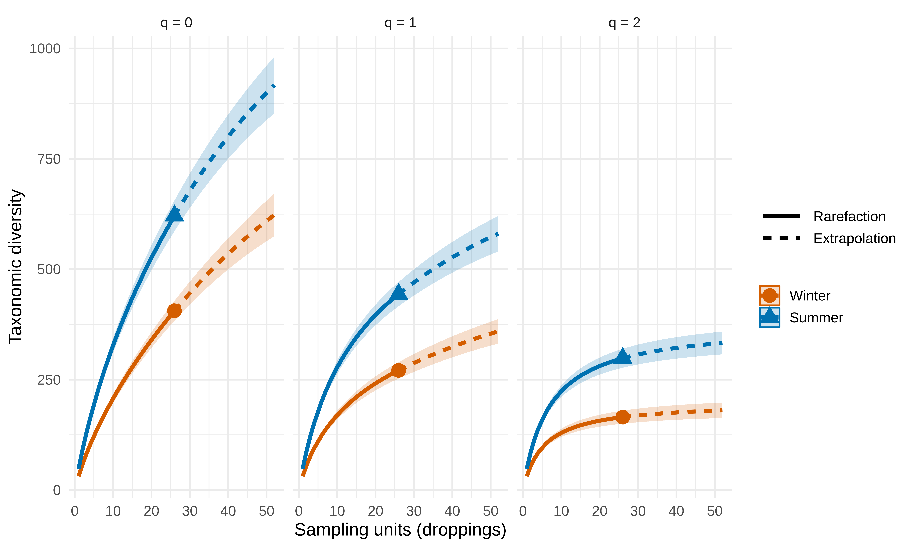

**Figure S7**: iNEXT3D coverage-based rarefaction/extrapolation of taxonomic Hill numbers (q = 0, 1, 2), samples pooled within each Season (incidence data, nboot = 200), after rarefying every sample to 12,615 reads. The curves are drawn for the one rarefaction draw whose summer/winter ratio at q = 0 is closest to the median over 50 draws. Summer exceeds winter at every q.

```{r tab-inext}
#| echo: false
library(knitr)
s8 <- read.csv("tables/H2_iNEXT3D_TD_coverage_rarefied.csv", check.names = FALSE)
kable(data.frame(
  Season = s8$Season, q = s8$Order.q,
  `Estimate` = round(s8$qTD, 1),
  `95% CI` = sprintf("%.1f–%.1f", s8$qTD.LCL, s8$qTD.UCL),
  `Summer/winter` = ifelse(s8$Season == "Summer",
                           sprintf("%.2f (%.2f–%.2f)", s8$ratio_summer_winter_median,
                                   s8$ratio_draw_2.5, s8$ratio_draw_97.5), ""),
  `Draws with separated CIs` = ifelse(s8$Season == "Summer",
                                      sprintf("%.0f%%", 100 * s8$share_draws_CI_separated), ""),
  check.names = FALSE), row.names = FALSE,
  caption = "Table S8. Pooled-season taxonomic Hill diversity at equal sequencing depth and equal sample coverage (iNEXT3D, incidence data; every sample rarefied to 12,615 reads; coverage 0.65; 50 rarefaction draws, 100 bootstraps each). Estimate and CI are medians over draws. 'Summer/winter' is the median ratio of the two estimates with the 2.5–97.5% range across draws. The last column is the share of draws in which the two Seasons' 95% CIs do not overlap.")
```

The depth-controlled estimates in Table S8 are plotted as main-text **Fig. 4A** (Section 10.4). Summer is the richer pooled assemblage at every order, by a factor of 1.42 at q = 0, 1.57 at q = 1 and 1.78 at q = 2.

:::: {.content-visible when-profile="docs"}
**Raw-count and asymptotic versions (superseded as the primary result).** Without rarefying first, the same coverage-standardised comparison gives summer/winter ratios of 1.73, 1.96 and 2.28 (`tables/H2_iNEXT3D_TD_coverage_standardised.csv`), i.e. about a fifth of the raw summer advantage is the depth difference. The asymptotic estimates below were the Table S8 of earlier drafts; they carry the same depth confound and extrapolate to about twice the observed richness (summer 1,708 vs 864 observed; winter 1,046 vs 436), which is the regime in which asymptotic richness is least reliable.

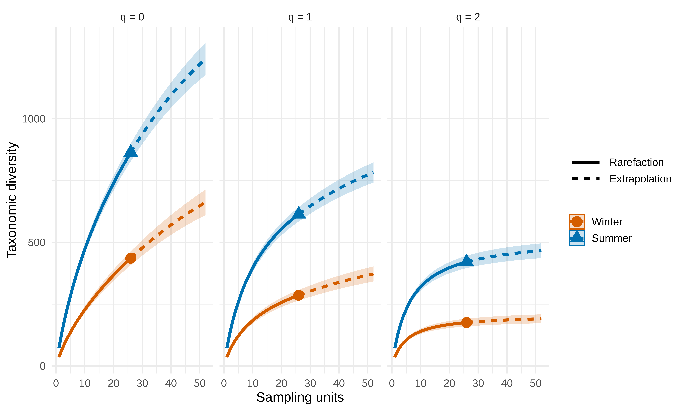

```{r tab-inext-asy}
#| echo: false
library(knitr)
inx <- read.csv("tables/H2_iNEXT3D_TD_asymptotic.csv", check.names = FALSE)
kable(inx, digits = 2,
      caption = "Table S8b. iNEXT3D asymptotic taxonomic-diversity estimates by Season on raw (unrarefied) incidence (Hill q = 0, 1, 2; observed and asymptotic, with s.e. and 95% CI). Not used for inference.")
```
::::

### 5.2 Per-sample Hill diversity

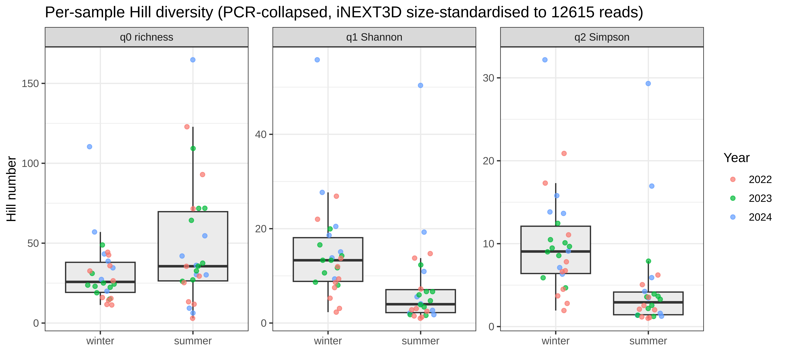

**Figure S8**: Per-sample Hill numbers (PCR-collapsed object, size-standardised with iNEXT3D to the minimum sample depth of 12,615 reads). Winter exceeds summer at q1/q2 (Shannon/Simpson); summer has the higher mean at q0 (richness), but that difference is weak and depends on the model family (Tables S9, S9b).

This is the same quantity as main-text **Fig. 4B** (Section 10.4), which redraws it to the main-figure specification: annotated with the Table S9 contrasts below, and stacked beneath the pooled estimates of Fig. 4A on a shared set of facet columns. Figure S8 is retained here as the plain, unannotated view.

The Season effect is tested on the plotted values themselves: one size-standardised value per dung sample (n = 52), with a gamma GLM (log link) of `q ~ Season + Year`, so the Season coefficient is a summer/winter ratio adjusted for year. Year is a fixed effect (three levels are too few to estimate a variance), and individual bird is not modelled because only three birds were sampled more than once. The Season × Year interaction is tested by F-test and ΔAICc against the additive model.

```{r tab-lmm}
#| echo: false
library(knitr)
s9 <- read.csv("tables/H2_season_effect_per_sample.csv", check.names = FALSE)
pf <- function(p) ifelse(p < 0.001, "< 0.001", sprintf("%.3f", p))
kable(data.frame(
  q = s9$metric, n = s9$n,
  `Mean winter` = round(s9$mean_winter, 1), `Mean summer` = round(s9$mean_summer, 1),
  `Summer/winter (95% CI)` = sprintf("%.2f (%.2f–%.2f)", s9$ratio_summer_winter,
                                     s9$ratio_lwr, s9$ratio_upr),
  `F (Season)` = round(s9$F_season, 2), `p (Season)` = pf(s9$p_season),
  `p (Year)` = pf(s9$p_year), `p (Season × Year)` = pf(s9$p_season_x_year),
  `ΔAICc (interaction)` = round(s9$dAICc_interaction, 1),
  check.names = FALSE), row.names = FALSE,
  caption = "Table S9. Season effect on per-sample Hill diversity (gamma GLM, log link, q ~ Season + Year; n = 52 dung samples, size-standardised to 12,615 reads). The ratio is summer/winter adjusted for year, with a Wald 95% CI; p-values are F-tests. The Season × Year interaction is tested against the additive model; positive ΔAICc means the interaction is not supported.")
```

```{r tab-lmm-family}
#| echo: false
library(knitr)
s9b <- read.csv("tables/H2_season_effect_family_sensitivity.csv", check.names = FALSE)
pf <- function(p) ifelse(p < 0.001, "< 0.001", sprintf("%.3f", p))
kable(data.frame(
  q = s9b$metric,
  Gaussian = pf(s9b$p_gaussian), `Log-normal` = pf(s9b$p_lognormal),
  `Gamma (Table S9)` = pf(s9b$p_gamma), `Wilcoxon (unadjusted)` = pf(s9b$p_wilcoxon),
  `AIC Gaussian` = round(s9b$AIC_gaussian, 1), `AIC log-normal` = round(s9b$AIC_lognormal, 1),
  `AIC gamma` = round(s9b$AIC_gamma, 1),
  check.names = FALSE), row.names = FALSE,
  caption = "Table S9b. Sensitivity of the Season test to the error family (Season p-value, same Season + Year model; Wilcoxon rank-sum without Year). AIC is on the response scale; the log-normal value includes the Jacobian term so it is comparable with the others.")
```

The two abundance-weighted orders are unambiguous: a winter dropping holds about 2.2 times (q = 1) and 2.5 times (q = 2) the effective number of OTUs of a summer one, under every family (p ≤ 0.005) and in every year (no Season × Year interaction). Richness (q = 0) is not: summer's mean is higher (48.3 vs 31.3 OTUs at equal depth), but the difference is significant only under the gamma model (p = 0.026, the AIC-preferred family for q = 0) and not under the Gaussian (p = 0.063), log-normal (p = 0.29) or rank-based (p = 0.11) tests. It is carried by a minority of very rich summer samples (summer median 35.6 vs winter 25.8).

:::: {.content-visible when-profile="docs"}
**Replicate-level model (superseded as Table S9).** Earlier drafts tested Season with linear mixed models on PCR replicates (n = 98, each replicate size-standardised to 10,609 reads) with random intercepts for dung sample and, where estimable, Year and individual bird, dropping terms that went singular. That fitted a different unit and depth from the one plotted, and used a different random-effects structure at q = 0 (Year dropped after singular fits) than at q = 1–2. Retained for reference:

```{r tab-lmm-pcr}
#| echo: false
library(knitr)
lmm <- read.csv("tables/H2_lmm_season_effect.csv", check.names = FALSE)
kable(lmm, digits = 3,
      caption = "Table S9c. Replicate-level mixed-model Season effect (summer minus winter) on per-replicate Hill diversity, with 95% CI and p. Superseded by Table S9.")
```
::::

### 5.3 Why the two metrics disagree: dominance and evenness

The crossover is not an artifact, and it is not a difference of estimator — both levels are iNEXT3D. Pooling a Season's samples rewards the total species list (summer's samples collectively contain more species, so summer wins at every q). Per-sample q1/q2 instead downweight rare taxa and reward *within-sample evenness* — and individual summer samples are far more dominance-skewed than winter ones, so a single summer sample's effective diversity is lower even where its species list is longer.

```{r tab-dominance}
#| echo: false
library(knitr)
dom <- read.csv("tables/report_dominance_summary.csv", check.names = FALSE)
names(dom) <- c("Season", "n", "Mean richness (q0, 12,615 reads)", "Mean top-1 OTU share (%)",
                "Mean Pielou J", "Wilcoxon p (richness)",
                "Wilcoxon p (top-1 share)", "Wilcoxon p (evenness J)")
kable(dom, digits = 3,
      caption = "Table S10. Per-sample richness, top-1-OTU dominance, and Pielou evenness by Season, with Wilcoxon tests (canonical object, 52 samples). Richness is size-standardised to 12,615 reads (the q0 of Figure S8), because summer libraries are about 2.6 times deeper; top-1 share is a proportion and does not depend on depth, and Pielou J agrees with a size-standardised evenness, ln(q1)/ln(q0), at r = 0.995.")
```

Concretely: a summer sample's single most abundant OTU accounts for **56%** of its reads on average (vs **25%** in winter, p \< 0.001), and Pielou evenness is correspondingly much lower (J = 0.38 summer vs 0.72 winter, p \< 0.001). Summer's pooled species list is longer (the long tail iNEXT3D detects across droppings), while within a dropping one or two OTUs dominate the read count — evenness collapses, and q1/q2 track evenness more than richness.

### 5.4 Which OTUs dominate each Season?

```{r tab-top5}
#| echo: false
library(knitr)
top5 <- read.csv("tables/report_top5_otu_by_season.csv", check.names = FALSE)
clean_tax <- function(v) ifelse(is.na(v) | v == "", "—", sub("^[a-z]__", "", v))
top5$Season  <- tools::toTitleCase(top5$Season)
top5$Order   <- clean_tax(top5$Order)
top5$Genus   <- clean_tax(top5$Genus)
top5$Species <- clean_tax(top5$Species)
top5 <- top5[, c("Season", "OTU", "mean_pct_share", "Order", "Genus", "Species")]
names(top5) <- c("Season", "OTU", "Mean % share (within-season)", "Order", "Genus", "Species")
kable(top5, digits = 2,
      caption = "Table S11. Top-5 dominant OTUs per Season by mean within-season read share, with taxonomy.")
```

Summer's dominance is driven by three strongly season-skewed OTUs: **OTU1 (*Thelebolus*)** averages 24.9% of summer reads (15/26 summer samples vs 5/26 winter at 3.2%), **OTU1225 (*Coniochaeta*)** is essentially summer-only (10.1% vs 0.2%), and **OTU636 (*Sporormiella* cf. *intermedia*)** is also summer-skewed (9.0% vs 2.5%). Winter's own top OTU, **OTU1369**, is a "dark taxon" (unclassified below Class, Dothideomycetes), present in 20/26 winter samples but only 3/26 summer, at 11.2% mean winter share.

```{r sec5-build}
#| eval: false
#| echo: !expr knitr::is_html_output()
#| code-fold: true
#| code-summary: "Full code for Section 5 — the source of truth for Figures S7 and S8, Tables S8–S11, and the coprophilous screen behind Table S3"

# ---------------------------------------------------------------------------
# Section 5 (H2): coverage-based iNEXT3D diversity, per-sample and
# per-PCR-replicate Hill numbers, the frequentist mixed model, and the
# dominance / evenness / top-5 / coprophilous analyses.
#
# This chunk is the source of truth for every figure and table in Section 5,
# and for Table S3 in Section 3.2; there is no parallel script. Sections 1-2
# below reproduce 6_diversity_analyses.R Part A (Sections 1-2 plus the
# per-sample Hill block) run against the corrected canonical workspace,
# without the slow parts Section 5 does not need (the Bayesian diet-richness
# mechanism of Section 7.1, and Part B's phylogenetic null models).
# ---------------------------------------------------------------------------
library(phyloseq); library(iNEXT.3D)
# Size-standardised Hill numbers: single source, shared with the fig4-build
# chunk and mirrored verbatim in Scripts/6_diversity_analyses.R.
source("hill_size_helper.R")
library(lme4); library(lmerTest); library(dplyr); library(tidyr); library(ggplot2)

data_dir <- "/home/daniel/Ptarmigan/trimmed/mergedPlates"   # data live outside the repo
tab_dir  <- "tables"; fig_dir <- "figures"                  # relative to this .qmd
load(file.path(data_dir, "eco_analysis.RData"))

grDevices::pdf(NULL)                                        # headless: no X11 fallback
save_png <- function(obj, filename, width, height, dpi = 800) {
  png(file.path(fig_dir, filename), width = width, height = height,
      units = "in", res = dpi)
  print(obj); dev.off()
}
otu_mat_of <- function(ps) {
  m <- as(otu_table(ps), "matrix"); if (taxa_are_rows(ps)) m <- t(m); m
}
# indivID is NA for samples without a confirmed microsatellite match; a unique
# placeholder makes each an unshared singleton random intercept instead of
# silently pooling unrelated unidentified individuals. Same convention as
# indivID_glm in 7_gllvm.R.
add_indivID_glm <- function(md) {
  md$indivID_glm <- droplevels(factor(ifelse(is.na(md$indivID) | md$indivID == "",
                                             paste0("unk_", md$sample), md$indivID)))
  md
}

# ===========================================================================
# Table S8b (secondary) / raw-count curves -- iNEXT3D coverage-based taxonomic Hill diversity
# ===========================================================================
ps  <- alldat$nopool
sd  <- as.data.frame(sample_data(ps))
OTU <- as(otu_table(ps), "matrix"); if (!taxa_are_rows(ps)) OTU <- t(OTU)

# Incidence matrices (species x sampling units), one per Season
inc_by_season_TD <- lapply(split(rownames(sd), sd$Season), function(samps) {
  M <- OTU[, colnames(OTU) %in% samps, drop = FALSE]
  M[M > 0] <- 1L; storage.mode(M) <- "numeric"; M
})

set.seed(1)
out_TD <- iNEXT3D(data = inc_by_season_TD, diversity = "TD", q = c(0, 1, 2),
                  datatype = "incidence_raw", nboot = 500)

labs_map <- c(winter = "Winter", summer = "Summer"); lvl_order <- c("Winter", "Summer")
.relabel <- function(df) {
  if (!("Assemblage" %in% names(df))) return(df)
  df$Assemblage <- factor(labs_map[df$Assemblage], levels = lvl_order); df
}
out_TD$TDInfo   <- .relabel(as.data.frame(out_TD$TDInfo))
out_TD$TDAsyEst <- .relabel(as.data.frame(out_TD$TDAsyEst))
if (!is.null(out_TD$TDiNextEst))
  out_TD$TDiNextEst <- lapply(out_TD$TDiNextEst, function(d) .relabel(as.data.frame(d)))

write.csv(as.data.frame(out_TD$TDAsyEst),
          file.path(tab_dir, "H2_iNEXT3D_TD_asymptotic.csv"), row.names = FALSE)

p_TD <- ggiNEXT3D(out_TD, type = 1, facet.var = "Order.q") +
  labs(x = "Sampling units") + theme_minimal(base_size = 14) +
  theme(plot.title = element_blank(), legend.title = element_blank())
save_png(p_TD, "H2_iNEXT_TD_by_Season.png", width = 10, height = 6)

# Coverage-standardised comparison at the shared minimum coverage, so the two
# Seasons are compared at equal completeness rather than equal sample size.
Cmin <- min(as.data.frame(out_TD$TDInfo)[["SC(T)"]])
est_TD <- estimate3D(inc_by_season_TD, diversity = "TD", q = c(0, 1, 2),
                     datatype = "incidence_raw", base = "coverage",
                     level = Cmin, nboot = 500)
write.csv(est_TD, file.path(tab_dir, "H2_iNEXT3D_TD_coverage_standardised.csv"),
          row.names = FALSE)

# ---- Table S8 (primary) -- the same comparison with sequencing depth held equal
# The incidence matrices above record whether an OTU was DETECTED in a dropping,
# and detection rises with read depth. Summer libraries are ~2.6x deeper than
# winter ones (median 551k vs 210k reads), so on raw counts the pooled summer
# advantage is partly a depth effect. Here every sample is first rarefied to the
# canonical minimum depth (12,615 reads) and the coverage-standardised comparison
# is repeated over NDRAW independent draws, all at ONE common coverage level (the
# lowest sample coverage reached by either Season in any draw, rounded down), so
# the draws are comparable. Reported: the median over draws of the estimate and
# of its bootstrap 95% CI. Asymptotic estimates (above, now secondary) are not
# used for inference: they extrapolate to ~2x the observed richness.
# Placed AFTER the raw-count block so the seeded outputs above are unchanged;
# each draw has its own seed.
NDRAW <- 50
X_sxo <- t(OTU)                                     # samples x OTUs, raw counts
rar_depth_pool <- min(rowSums(X_sxo))
inc_of <- function(M) lapply(split(rownames(sd), sd$Season), function(samps) {
  I <- t((M[samps, , drop = FALSE] > 0) * 1)        # OTUs x sampling units
  storage.mode(I) <- "numeric"; I[rowSums(I) > 0, , drop = FALSE]
})
rar_draws <- lapply(seq_len(NDRAW), function(k) {
  set.seed(20260929 + k); inc_of(vegan::rrarefy(X_sxo, rar_depth_pool))
})
sc_draw  <- vapply(rar_draws, function(L)
  min(DataInfo3D(L, diversity = "TD", datatype = "incidence_raw")[["SC(T)"]]), numeric(1))
C_common <- floor(100 * min(sc_draw)) / 100
est_rar <- do.call(rbind, lapply(seq_len(NDRAW), function(k) {
  set.seed(20260929 + k)
  e <- estimate3D(rar_draws[[k]], diversity = "TD", q = c(0, 1, 2),
                  datatype = "incidence_raw", base = "coverage",
                  level = C_common, nboot = 100)
  e$draw <- k; e
}))
write.csv(est_rar, file.path(tab_dir, "H2_iNEXT3D_TD_coverage_rarefied_draws.csv"),
          row.names = FALSE)
s8 <- aggregate(cbind(qTD, qTD.LCL, qTD.UCL) ~ Assemblage + Order.q, est_rar, median)
s8$SC <- C_common; s8$depth <- rar_depth_pool; s8$n_draws <- NDRAW
s8$Season <- factor(labs_map[s8$Assemblage], levels = lvl_order)
wide <- reshape(est_rar[, c("Assemblage", "Order.q", "qTD", "draw")],
                idvar = c("Order.q", "draw"), timevar = "Assemblage", direction = "wide")
rq <- tapply(wide$qTD.summer / wide$qTD.winter, wide$Order.q,
             quantile, probs = c(0.025, 0.5, 0.975))
s8$ratio_summer_winter_median <- NA_real_
s8$ratio_draw_2.5 <- NA_real_; s8$ratio_draw_97.5 <- NA_real_
for (q in names(rq)) {
  i <- s8$Order.q == as.numeric(q)
  s8[i, c("ratio_draw_2.5", "ratio_summer_winter_median", "ratio_draw_97.5")] <-
    matrix(rq[[q]], nrow = sum(i), ncol = 3, byrow = TRUE)
}
# Share of draws in which the two Seasons' 95% CIs are separated, per order q.
sep <- reshape(est_rar[, c("Assemblage", "Order.q", "qTD.LCL", "qTD.UCL", "draw")],
               idvar = c("Order.q", "draw"), timevar = "Assemblage", direction = "wide")
sep_share <- tapply(sep$qTD.LCL.summer > sep$qTD.UCL.winter, sep$Order.q, mean)
s8$share_draws_CI_separated <- as.numeric(sep_share[as.character(s8$Order.q)])
s8 <- s8[order(s8$Order.q, s8$Season), c("Season", "Order.q", "SC", "depth", "n_draws",
         "qTD", "qTD.LCL", "qTD.UCL", "ratio_summer_winter_median", "ratio_draw_2.5",
         "ratio_draw_97.5", "share_draws_CI_separated")]
write.csv(s8, file.path(tab_dir, "H2_iNEXT3D_TD_coverage_rarefied.csv"), row.names = FALSE)

# Figure S7 companion: rarefaction/extrapolation curves on the ONE draw whose q0
# summer/winter ratio sits closest to the median over draws, so the curves shown
# are representative of the depth-controlled estimates in Table S8.
r0 <- wide[wide$Order.q == 0, ]
k_rep <- r0$draw[which.min(abs(r0$qTD.summer / r0$qTD.winter - rq[["0"]][2]))]
set.seed(20260929 + k_rep)
out_rep <- iNEXT3D(data = rar_draws[[k_rep]], diversity = "TD", q = c(0, 1, 2),
                   datatype = "incidence_raw", nboot = 200)
if (!is.null(out_rep$TDiNextEst))
  out_rep$TDiNextEst <- lapply(out_rep$TDiNextEst, function(d) .relabel(as.data.frame(d)))
p_TD_rar <- ggiNEXT3D(out_rep, type = 1, facet.var = "Order.q") +
  labs(x = "Sampling units (droppings)") + theme_minimal(base_size = 14) +
  theme(plot.title = element_blank(), legend.title = element_blank())
save_png(p_TD_rar, "H2_iNEXT_TD_by_Season_rarefied.png", width = 10, height = 6)

# ===========================================================================
# Table S9c (superseded) -- per-PCR-replicate Hill diversity + frequentist mixed model
# ===========================================================================
# alldat_full[[1]] is one row per PCR replicate and is deliberately NOT
# depth-filtered at the object level (4_data_prep.R uses a pass-through
# threshold, since it is built for read-count-offset models). Hill numbers need
# comparable effort across rows, so the canonical 10,000-read floor is applied
# here at the REPLICATE level, then everything is size-standardised (iNEXT.3D)
# to the minimum retained depth.
PCR_MIN_DEPTH <- 10000
ps_pcr <- prune_samples(sample_sums(alldat_full[[1]]) >= PCR_MIN_DEPTH, alldat_full[[1]])
ps_pcr <- prune_taxa(taxa_sums(ps_pcr) > 0, ps_pcr)

rar_depth_pcr <- min(sample_sums(ps_pcr))
hill_pcr_raw  <- hill_inext_size(ps_pcr, level = rar_depth_pcr, label = "Per-PCR-replicate")

m_pcr  <- otu_mat_of(ps_pcr)
md_pcr <- as.data.frame(sample_data(ps_pcr))
stopifnot(identical(rownames(m_pcr), rownames(md_pcr)))
md_pcr$Season <- factor(md_pcr$Season, levels = c("winter", "summer"))
md_pcr$Year   <- factor(md_pcr$Year)
md_pcr <- add_indivID_glm(md_pcr)
# Groups the (up to) 2 technical replicates of the same dung sample.
md_pcr$pcr_replicate_id <- droplevels(factor(md_pcr$sample))

hill_pcr <- data.frame(
  pcr_row = rownames(m_pcr),
  q0 = hill_pcr_raw$q0,
  q1 = hill_pcr_raw$q1,
  q2 = hill_pcr_raw$q2,
  Season = md_pcr$Season, Year = md_pcr$Year,
  indivID_glm = md_pcr$indivID_glm,
  pcr_replicate_id = md_pcr$pcr_replicate_id, stringsAsFactors = FALSE)
write.csv(hill_pcr, file.path(tab_dir, "H2_hill_per_pcr_replicate.csv"), row.names = FALSE)

hl_pcr <- hill_pcr %>% pivot_longer(c(q0, q1, q2), names_to = "q", values_to = "value")
p_hill_box <- ggplot(hl_pcr, aes(Season, value)) +
  geom_boxplot(outlier.shape = NA, fill = "grey92") +
  geom_jitter(aes(colour = Year), width = 0.15, size = 1.6, alpha = 0.7) +
  facet_wrap(~q, scales = "free_y",
             labeller = as_labeller(c(q0 = "q0 richness", q1 = "q1 Shannon",
                                      q2 = "q2 Simpson"))) +
  labs(title = sprintf("Per-PCR-replicate Hill diversity (iNEXT3D, size-standardised to %d reads)",
                       rar_depth_pcr), y = "Hill number", x = NULL) +
  theme_bw(base_size = 12)
save_png(p_hill_box, "H2_hill_boxplot_Season_pcr.png", width = 10, height = 4.5)

# Fallback ladder if the full random-effects structure is singular: drop
# (1|indivID_glm) first (many NA-individual singleton placeholders), then
# (1|Year), then plain lm(). (1|pcr_replicate_id) is kept as long as possible.
# Whichever structure converged is reported in `re_structure`.
fit_h2_lmm <- function(dat, qcol) {
  ladder <- list(
    "Season + (1|Year) + (1|indivID_glm) + (1|pcr_replicate_id)",
    "Season + (1|Year) + (1|pcr_replicate_id)",
    "Season + (1|pcr_replicate_id)")
  fit <- NULL; re_structure <- NA_character_
  for (rhs in ladder) {
    fit <- tryCatch(lmerTest::lmer(as.formula(paste(qcol, "~", rhs)), data = dat),
                    error = function(e) NULL)
    re_structure <- rhs
    if (!is.null(fit) && !lme4::isSingular(fit)) break
  }
  if (is.null(fit) || lme4::isSingular(fit)) {
    fit <- lm(as.formula(paste(qcol, "~ Season")), data = dat)
    re_structure <- "Season (lm, no random effects)"
  }
  co  <- summary(fit)$coefficients
  est <- co["Seasonsummer", "Estimate"]; se <- co["Seasonsummer", "Std. Error"]
  pv  <- if ("Pr(>|t|)" %in% colnames(co)) co["Seasonsummer", "Pr(>|t|)"]
         else co["Seasonsummer", "Pr(>|z|)"]
  data.frame(metric = qcol, re_structure = re_structure,
             summer_minus_winter = round(est, 3),
             lwr = round(est - 1.96 * se, 3), upr = round(est + 1.96 * se, 3),
             p = round(pv, 4))
}
write.csv(dplyr::bind_rows(lapply(c("q0", "q1", "q2"), function(q) fit_h2_lmm(hill_pcr, q))),
          file.path(tab_dir, "H2_lmm_season_effect.csv"), row.names = FALSE)

# ===========================================================================
# Figure S8 -- per-sample Hill diversity (PCR-collapsed, size-standardised)
# ===========================================================================
# Raw counts (alldat$nopool): iNEXT.3D does the standardisation itself, to the
# same depth alldat.rfy was rarefied to. Deterministic, no seed. This is the
# PER-SAMPLE level (n = 52), deliberately distinct from the PCR-replicate level
# of Table S9c above.
ps_rar_sample <- alldat$nopool
m_rar_sample  <- otu_mat_of(ps_rar_sample)
md_rar_sample <- as.data.frame(sample_data(ps_rar_sample))
stopifnot(identical(rownames(m_rar_sample), rownames(md_rar_sample)))
md_rar_sample$Season <- factor(md_rar_sample$Season, levels = c("winter", "summer"))
md_rar_sample$Year   <- factor(md_rar_sample$Year)
md_rar_sample <- add_indivID_glm(md_rar_sample)

samp_depth      <- min(rowSums(m_rar_sample))
hill_sample_raw <- hill_inext_size(ps_rar_sample, level = samp_depth, label = "Per-sample")

hill_sample <- data.frame(
  sample = rownames(m_rar_sample),
  q0 = hill_sample_raw$q0,
  q1 = hill_sample_raw$q1,
  q2 = hill_sample_raw$q2,
  Season = md_rar_sample$Season, Year = md_rar_sample$Year,
  indivID_glm = md_rar_sample$indivID_glm, stringsAsFactors = FALSE)
write.csv(hill_sample, file.path(tab_dir, "H2_hill_per_sample.csv"), row.names = FALSE)

hl_sample <- hill_sample %>% pivot_longer(c(q0, q1, q2), names_to = "q", values_to = "value")
p_hill_sample_box <- ggplot(hl_sample, aes(Season, value)) +
  geom_boxplot(outlier.shape = NA, fill = "grey92") +
  geom_jitter(aes(colour = Year), width = 0.15, size = 1.6, alpha = 0.7) +
  facet_wrap(~q, scales = "free_y",
             labeller = as_labeller(c(q0 = "q0 richness", q1 = "q1 Shannon",
                                      q2 = "q2 Simpson"))) +
  labs(title = sprintf("Per-sample Hill diversity (PCR-collapsed, iNEXT3D size-standardised to %d reads)",
                       samp_depth), y = "Hill number", x = NULL) +
  theme_bw(base_size = 12)
save_png(p_hill_sample_box, "H2_hill_boxplot_Season.png", width = 10, height = 4.5)

# ===========================================================================
# Table S9 (primary) + S9b -- Season effect on PER-SAMPLE Hill numbers
# ===========================================================================
# The test is fitted on the same unit Figure S8 / Fig. 4B plot: one value per
# dung sample (n = 52), size-standardised above. Year is a FIXED effect (three
# levels is too few to estimate a variance -- the replicate-level fits above went
# singular on it). Individual bird is not modelled: only 3 birds were sampled
# more than once. Primary family: gamma with a log link (Hill numbers are
# positive and right-skewed; exp(coef) is a summer/winter ratio). Season x Year is
# tested by F-test and dAICc against the additive model. Table S9b repeats the
# Season test under other families, as the Paramo revision did, because the q0
# result is the one sensitive to that choice.
aicc <- function(m) { k <- length(coef(m)) + 1L; n <- nobs(m)
  AIC(m) + 2 * k * (k + 1) / (n - k - 1) }
hs <- hill_sample; hs$Season <- factor(hs$Season, levels = c("winter", "summer"))
s9 <- do.call(rbind, lapply(c("q0", "q1", "q2"), function(q) {
  f_add <- as.formula(paste(q, "~ Season + Year"))
  f_int <- as.formula(paste(q, "~ Season * Year"))
  g_add <- glm(f_add, family = Gamma(link = "log"), data = hs)
  g_int <- glm(f_int, family = Gamma(link = "log"), data = hs)
  dr  <- drop1(g_add, test = "F")
  ci  <- exp(confint.default(g_add)["Seasonsummer", ])
  data.frame(metric = q, n = nobs(g_add),
             mean_winter = mean(hs[[q]][hs$Season == "winter"]),
             mean_summer = mean(hs[[q]][hs$Season == "summer"]),
             ratio_summer_winter = exp(coef(g_add)[["Seasonsummer"]]),
             ratio_lwr = ci[[1]], ratio_upr = ci[[2]],
             F_season = dr["Season", "F value"], p_season = dr["Season", "Pr(>F)"],
             p_year = dr["Year", "Pr(>F)"],
             p_season_x_year = anova(g_add, g_int, test = "F")[2, "Pr(>F)"],
             dAICc_interaction = aicc(g_int) - aicc(g_add),
             stringsAsFactors = FALSE)
}))
write.csv(s9, file.path(tab_dir, "H2_season_effect_per_sample.csv"), row.names = FALSE)

s9b <- do.call(rbind, lapply(c("q0", "q1", "q2"), function(q) {
  f  <- as.formula(paste(q, "~ Season + Year"))
  fl <- as.formula(paste("log(", q, ") ~ Season + Year"))
  g  <- glm(f, family = Gamma(link = "log"), data = hs)
  la <- lm(f, data = hs); ll <- lm(fl, data = hs)
  data.frame(metric = q,
             p_gaussian  = drop1(la, test = "F")["Season", "Pr(>F)"],
             p_lognormal = drop1(ll, test = "F")["Season", "Pr(>F)"],
             p_gamma     = drop1(g,  test = "F")["Season", "Pr(>F)"],
             p_wilcoxon  = wilcox.test(as.formula(paste(q, "~ Season")), data = hs)$p.value,
             # AIC on the response scale; the log-normal gets the Jacobian term
             # so it is comparable (the Paramo family screen omitted it).
             AIC_gaussian  = AIC(la),
             AIC_lognormal = AIC(ll) + 2 * sum(log(hs[[q]])),
             AIC_gamma     = AIC(g),
             stringsAsFactors = FALSE)
}))
write.csv(s9b, file.path(tab_dir, "H2_season_effect_family_sensitivity.csv"), row.names = FALSE)

# ===========================================================================
# Table S10 -- dominance and evenness, per sample
# ===========================================================================
ps <- alldat$nopool
otu_mat <- as(otu_table(ps), "matrix")
if (!taxa_are_rows(ps)) otu_mat <- t(otu_mat)      # taxa x samples
sd <- as.data.frame(sample_data(ps))
stopifnot(identical(colnames(otu_mat), rownames(sd)))
rel_mat <- sweep(otu_mat, 2, colSums(otu_mat), "/")

pielou_J <- function(p) { p <- p[p > 0]; (-sum(p * log(p))) / log(length(p)) }

# Richness is the SIZE-STANDARDISED q0 of Figure S8 (12,615 reads), not the raw
# OTU count: summer libraries are ~2.6x deeper, so raw counts compare unequal
# effort. The raw count is kept in the per-sample CSV for reference only.
# Pielou J stays on the raw counts: checked against the size-standardised
# evenness ln(q1)/ln(q0), r = 0.995 across samples and the same seasonal contrast
# (0.41 vs 0.75, Wilcoxon p ~ 1e-7), so depth does not drive it.
hs_i <- match(colnames(otu_mat), hill_sample$sample); stopifnot(!anyNA(hs_i))
dom_df <- data.frame(
  sample = colnames(otu_mat), Season = sd$Season, Year = sd$Year,
  richness  = hill_sample$q0[hs_i],
  richness_observed_raw = colSums(otu_mat > 0),
  top1_prop = apply(rel_mat, 2, max),
  pielou_J  = apply(rel_mat, 2, pielou_J),
  evenness_size_std = log(hill_sample$q1[hs_i]) / log(hill_sample$q0[hs_i]),
  stringsAsFactors = FALSE)

season_summary <- dom_df %>% group_by(Season) %>%
  summarise(n = n(),
            mean_richness      = round(mean(richness), 1),
            mean_top1_prop_pct = round(100 * mean(top1_prop), 1),
            mean_pielou_J      = round(mean(pielou_J), 2), .groups = "drop")

wilcox_rich <- wilcox.test(richness  ~ Season, data = dom_df)
wilcox_top1 <- wilcox.test(top1_prop ~ Season, data = dom_df)
wilcox_J    <- wilcox.test(pielou_J  ~ Season, data = dom_df)

write.csv(dom_df, file.path(tab_dir, "report_dominance_per_sample.csv"), row.names = FALSE)
write.csv(season_summary %>%
            mutate(wilcox_p_richness  = round(wilcox_rich$p.value, 5),
                   wilcox_p_top1_prop = round(wilcox_top1$p.value, 5),
                   wilcox_p_pielou_J  = round(wilcox_J$p.value, 5)),
          file.path(tab_dir, "report_dominance_summary.csv"), row.names = FALSE)

# ===========================================================================
# Table S11 -- top-5 dominant OTUs per Season
# ===========================================================================
tax <- as.data.frame(as(tax_table(ps), "matrix"), stringsAsFactors = FALSE)
seasons <- levels(factor(sd$Season))
top5_df <- dplyr::bind_rows(lapply(seasons, function(s) {
  shares   <- rowMeans(rel_mat[, rownames(sd)[sd$Season == s], drop = FALSE])
  top5_ids <- names(sort(shares, decreasing = TRUE))[1:5]
  data.frame(Season = s, OTU = top5_ids,
             mean_pct_share = round(100 * shares[top5_ids], 2),
             tax[top5_ids, c("Phylum", "Class", "Order", "Family", "Genus", "Species")],
             stringsAsFactors = FALSE)
}))
write.csv(top5_df, file.path(tab_dir, "report_top5_otu_by_season.csv"), row.names = FALSE)

# ===========================================================================
# Table S3 (Section 3.2, E2) -- coprophilous-genus screen
# ===========================================================================
# ONE list, used for both Table S3 and the Season test below. It is the
# standard palynological coprophilous set extended with the four dung-
# associated genera that actually carry the seasonal signal in this dataset:
# Thelebolus, Coniochaeta, Psathyrella and Stropharia (Sections 5.4, 6.2, 8.2).
# Sections 8 and 9 apply a 14-genus variant of this list to the FUNGuild guild
# rule (it omits Sporormia, Psathyrella and Stropharia); see 8_functional_guilds.R.
COPRO_GENERA <- c("Sordaria", "Podospora", "Cercophora", "Chaetomium",
                  "Schizothecium", "Preussia", "Sporormiella", "Delitschia",
                  "Pilobolus", "Ascobolus", "Coprinopsis", "Saccobolus", "Sporormia",
                  "Thelebolus", "Coniochaeta", "Psathyrella", "Stropharia")

# UNITE taxonomy carries rank prefixes ("g__Thelebolus"); strip them or the
# %in% match silently fails. "unidentified" placeholders become NA.
strip_pref <- function(x) {
  x <- ifelse(is.na(x), NA_character_, sub("^[a-z]__", "", x))
  x[x == "" | grepl("unidentified", x, ignore.case = TRUE)] <- NA
  x
}
genus_clean <- strip_pref(tax$Genus)
copro_flag  <- !is.na(genus_clean) & genus_clean %in% COPRO_GENERA
copro_otus  <- rownames(tax)[copro_flag]

w <- sd$Season == "winter"; s <- sd$Season == "summer"
copro_by_otu <- data.frame(
  OTU     = copro_otus,
  Genus   = genus_clean[copro_flag],
  Species = strip_pref(tax$Species[copro_flag]),
  winter_mean_pct = round(100 * rowMeans(rel_mat[copro_otus, w, drop = FALSE]), 3),
  summer_mean_pct = round(100 * rowMeans(rel_mat[copro_otus, s, drop = FALSE]), 3),
  occ_winter = rowSums(rel_mat[copro_otus, w, drop = FALSE] > 0),
  occ_summer = rowSums(rel_mat[copro_otus, s, drop = FALSE] > 0),
  stringsAsFactors = FALSE)
copro_by_otu <- copro_by_otu[order(-(copro_by_otu$winter_mean_pct +
                                     copro_by_otu$summer_mean_pct)), ]
write.csv(copro_by_otu, file.path(tab_dir, "report_coprophilous_by_season_v2.csv"),
          row.names = FALSE)

# Per-sample total coprophilous read share, and the Season test quoted in
# Section 3.2 -- same COPRO_GENERA list as Table S3 above.
copro_df <- data.frame(sample = colnames(rel_mat), Season = sd$Season,
                       copro_pct_share = 100 * colSums(rel_mat[copro_otus, , drop = FALSE]))
print(copro_df %>% group_by(Season) %>%
        summarise(mean_pct = round(mean(copro_pct_share), 2),
                  median_pct = round(median(copro_pct_share), 2), .groups = "drop"))
print(wilcox.test(copro_pct_share ~ Season, data = copro_df))
```

::: {.content-visible when-profile="docs"}
#### Documentation notes — Section 5 {.unnumbered}

This dark, winter-associated OTU is an **E1** dark taxon (Section 3.4) — and, being winter-persistent, a candidate to carry into the deferred H3 plant-covariation analysis downstream — and it revises the original "stable cold-adapted *Thelebolus*–*Sporormiella* core" framing: those recognizable coprophilous genera are part of the summer-inflated, activity-tracking tail, not a season-independent core.
:::

## Section 6: Lineage-specific seasonal responses — GLLVM (H1, OTU-resolved) {.page-break-before}

Sections 4 and 5 establish that the community shifts between seasons (H1) and that summer samples gain a long rare tail while becoming more dominance-skewed (H2). This section resolves H1 to the level of individual OTUs. We fit a generalized linear latent-variable model (GLLVM, negative-binomial) of per-OTU counts as a function of Season (winter as reference), with a library-size offset and random intercepts for individual bird and PCR replicate; the model is fitted on the full-complexity, one-row-per-PCR-replicate object (`Scripts/7_gllvm.R`, objects `models/fit_nb_2.rds` and `models/fit_nb_2_2.rds`). It answers which lineages drive the turnover — each with its own model uncertainty — and, through its latent variables, describes the residual co-occurrence that remains after Season is accounted for.

::: {.content-visible when-profile="docs"}
<!-- SEE NOTE: a real scientific limitation, not a status note — you may want one plain sentence of this to survive into the submitted version -->

::: callout-warning
**Fitted on the pre-depth-fix object.** These fits were built on the full-complexity object as it stood *before* the July depth-filter correction: 57 samples (114 PCR-replicate rows) and 327 filtered OTUs, versus the 52-sample / 278-OTU canonical object used everywhere else in this appendix. The library-size offset, per-OTU abundance weights, and the Poisson baseline in Table S-GLLVMa are all reconstructed from that same pre-fix object so the section is internally consistent. The five extra samples and larger OTU set do not change the direction or rank of any result below, but exact coefficients will move slightly when the models are refitted on the corrected object — treat the numbers as robust in sign and rank, provisional in the last digit.
:::
:::

::: callout-warning
**Read the per-OTU coefficients in this section as signs and ranks, not effect sizes.** Two limitations apply (added 2026-09-29; wording to be finalised). (i) The models were fitted on the pre-depth-filter-correction object (57 samples, 114 replicate rows, 327 OTUs), not the canonical 52-sample object used elsewhere. (ii) Many Season coefficients are not estimable as finite effects: OTUs absent or nearly absent from one season push an unpooled fixed coefficient toward ±∞. 134 of the 327 OTUs are flagged for this (`separation`), and 101 of the 209 OTUs counted as significant are among them (the largest reaching β ≈ 1,295 on the log scale). Among the 193 unflagged OTUs, 106 still have \|β\| \> 10, i.e. implausible fold changes (e¹⁰ ≈ 22,000), including the *Sporormiella* and *Coniochaeta* values quoted below (β ≈ 17). The OTU-level seasonal pattern is carried by HMSC in Section 9, which is fitted on the current data with shrinkage.
:::

### 6.1 Model choice

```{r tab-gllvm-aic}
#| echo: false
library(knitr)
mc <- read.csv("tables/gllvm_model_comparison.csv", stringsAsFactors = FALSE)
mc$logLik <- signif(mc$logLik, 4); mc$AIC <- signif(mc$AIC, 5); mc$dAIC <- signif(mc$dAIC, 4)
kable(mc[, c("model", "logLik", "AIC", "dAIC")],
      col.names = c("Model", "logLik", "AIC", "ΔAIC"),
      caption = "Table S-GLLVMa. GLLVM model comparison on the same 327-OTU / 114-row response matrix. The negative-binomial fits are dramatically better than the Poisson baseline (strong overdispersion), and two latent variables are preferred over one (ΔAIC ≈ 723). fit_nb_2_2 is the reported model.")
```

The negative-binomial family is strongly favoured over Poisson (the Poisson log-likelihood is worse by \~5 orders of magnitude, the signature of severe count overdispersion), and two latent variables outperform one by ΔAIC ≈ 723. We therefore report `fit_nb_2_2` (negative-binomial, two latent variables).

### 6.2 Which OTUs drive the seasonal turnover

For every OTU we extract the Season coefficient (β on the GLLVM log scale; positive = higher in summer) together with the model's own Wald 95% CI, and flag significance at a Benjamini–Hochberg FDR of 5%.

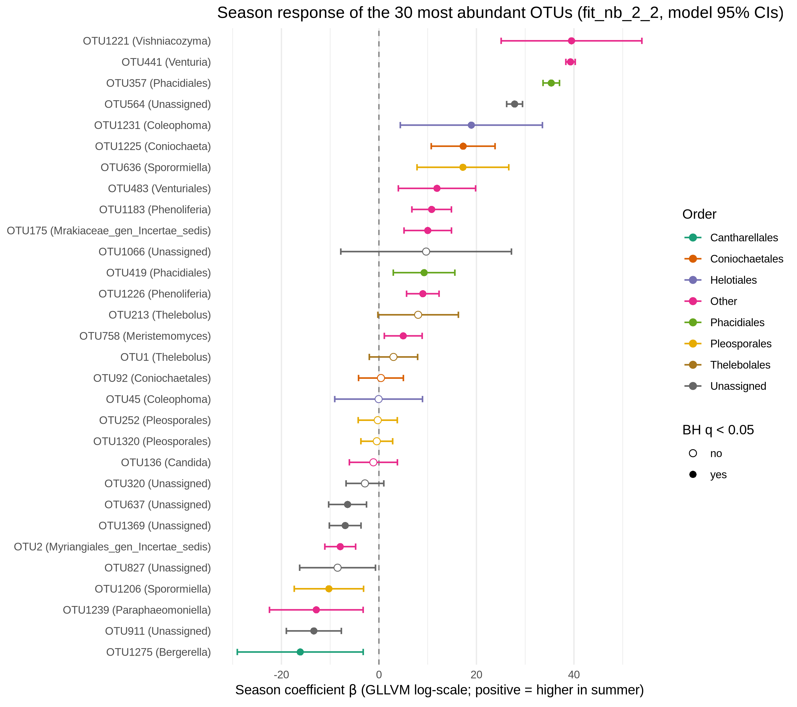

**Figure S-GLLVMa**: Season response of the 30 most abundant OTUs, each with its model 95% CI, coloured by Order; filled points are significant at BH q \< 0.05. Of the 327 modelled OTUs, 209 are significant, and the turnover is strongly asymmetric: 166 OTUs are enriched in summer versus 43 in winter. A further 134 OTUs are near-complete "on/off" seasonal switches (essentially absent in one season); these have real but non-interpretable point estimates (β in the hundreds, or exploding CIs) and are flagged (`separation`) and excluded both from this panel and from Table S-GLLVMb, which reports only well-estimated OTUs; they are retained in the full per-OTU table (`tables/gllvm_perOTU_season_coef.csv`).

```{r tab-gllvm-otu}
#| echo: false
suppressMessages(library(dplyr)); library(knitr)
oc  <- read.csv("tables/gllvm_perOTU_season_coef.csv", stringsAsFactors = FALSE)
well <- oc %>% filter(!separation, sig)
fmt <- function(df) df %>% transmute(OTU = taxon, Genus, Order,
                                     beta = round(beta_season, 2),
                                     `95% CI` = sprintf("[%.1f, %.1f]", ci_lo, ci_hi),
                                     `BH q` = signif(p_adj, 2))
kable(well %>% arrange(desc(beta_season)) %>% slice_head(n = 8) %>% fmt(),
      caption = "Table S-GLLVMb(i). Most strongly summer-enriched well-estimated OTUs (BH q < 0.05).")
kable(well %>% arrange(beta_season) %>% slice_head(n = 8) %>% fmt(),
      caption = "Table S-GLLVMb(ii). Most strongly winter-enriched well-estimated OTUs (BH q < 0.05). Full per-OTU table: tables/gllvm_perOTU_season_coef.csv.")
```

Two results connect directly to the dominance analysis (Section 5.4). The coprophilous taxa that dominate summer read share behave differently under the model: OTU636 (*Sporormiella*, β ≈ 17.2) and OTU1225 (*Coniochaeta*, β ≈ 17.3) are both significantly summer-enriched, but OTU1 (*Thelebolus*, β ≈ 3.0) is not significant (95% CI crosses zero) — its large summer read share is carried by a few samples and high among-individual variance rather than a model-robust per-OTU shift. On the winter side, the dark taxon OTU1369 (class Dothideomycetes) is significantly winter-enriched (β ≈ −6.9): the GLLVM independently corroborates the dominance/E1 finding that winter's persistent OTU is a taxonomically unresolved lineage.

Aggregating to genus gives the broader pattern:


**Figure S-GLLVMc**: Genus-level seasonal response. (A) Heatmap of the abundance-weighted mean β per genus; (B) the same as a point-range plot with bootstrapped 95% CIs. Warm = summer-enriched, cool = winter-enriched.

```{r tab-gllvm-genus}
#| echo: false
suppressMessages(library(dplyr)); library(knitr)
gt <- read.csv("tables/genus_table_season.csv", stringsAsFactors = FALSE)
gt %>% transmute(Order, Genus, n_OTUs,
                 `total reads` = round(total_w_abund),
                 `median beta` = round(median_beta_season, 1),
                 `weighted-mean beta` = round(w_mean_beta_season, 1)) %>%
  arrange(desc(`weighted-mean beta`)) %>%
  kable(caption = "Table S-GLLVMc. Genus-level seasonal responses (β = summer vs winter, GLLVM log scale) for genera passing the abundance/effect-size thresholds. Full detail in models/genus_table_season.csv.")
```

### 6.3 Residual co-occurrence beyond Season

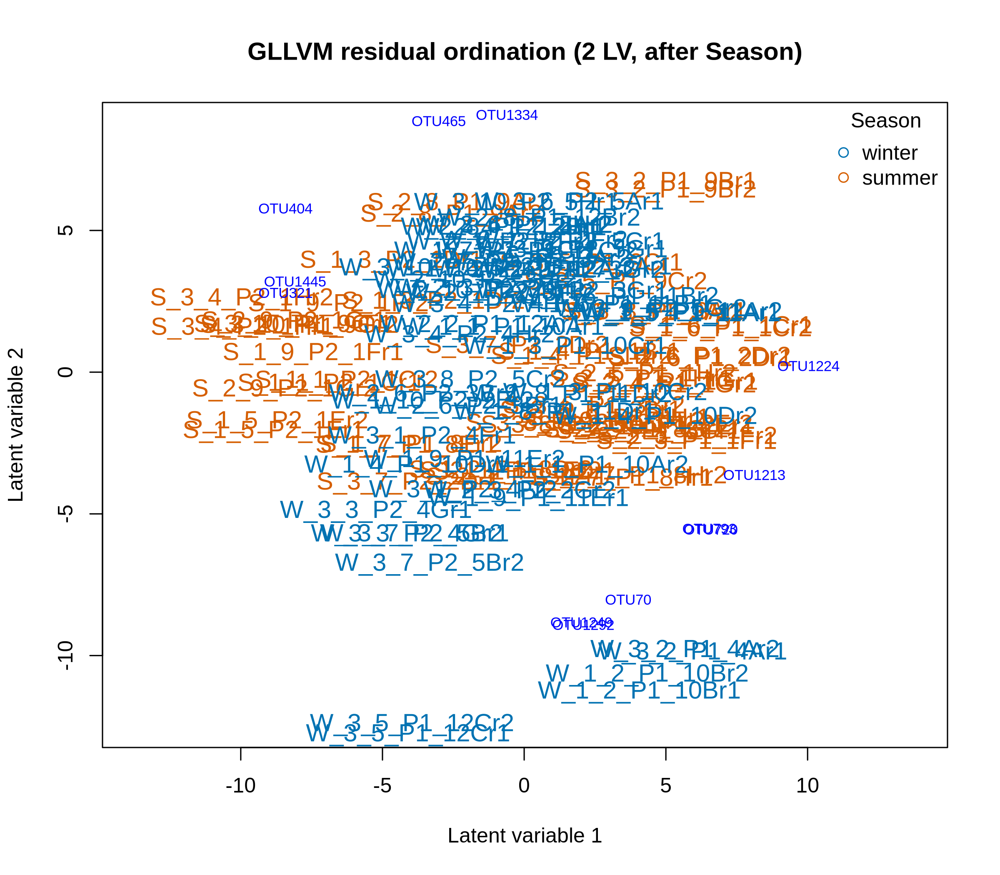

**Figure S-GLLVMb**: Model-based ordination on the two latent variables of `fit_nb_2_2` — the residual OTU co-occurrence structure that remains *after* Season and the random effects are accounted for. Sites are coloured by Season; the eight strongest species loadings are labelled. This is the model-based counterpart to the unconstrained robust-Aitchison PCoA in Section 4.1: because Season is already in the model as a fixed effect, the two seasons overlap substantially here, confirming that Season captures a coherent axis of the community rather than all of its covariation. A small set of winter sites separates along the second latent variable (winter scores are \~3.4× as variable as summer ones on that axis, Fligner–Killeen p = 0.013; seven of the eight most extreme sites are winter). This is specific to that axis and is not a statement about which season is more heterogeneous overall — on the first latent variable summer is the more variable season, and Section 4.2 finds summer significantly the more dispersed in total composition (mean distance to centroid 24.8 versus 13.6, p = 0.002).

::: {.content-visible when-profile="docs"}
#### Documentation notes — Section 6 {.unnumbered}

*Documentation build only; omitted from the submitted appendix. Move any paragraph, callout or table here that belongs in the full record rather than in the supplement.*
:::

## Section 7: Diet-tracking and Bayesian models — H2 and H3 {.page-break-before}

### 7.1 Diet richness and fungal diversity — Bayesian mechanism (H2)

Section 5 established the coarse prediction of H2: summer communities are richer than winter ones, in step with the richer summer diet. Here we test the finer mechanism directly, on the subset of samples for which we have paired plant ITS2 diet data (**n = 27** dung samples): does an individual sample's fungal diversity track the richness of its own dietary plant community? Fungal Hill diversity is modelled as a function of standardised plant (diet) richness, adjusting for Season, in a Bayesian Gamma regression with a log link (brms). H2's mechanism is supported if the plant-richness slope is positive with posterior probability P(slope \> 0) \> 0.95.

The preregistration specified Year and individual bird as random intercepts. At this matched sample size that structure is unidentifiable — the 27 samples come from 24 distinct birds, so an individual random effect cannot be separated from residual variation, and Year spans only three levels — and the random-effects model does not converge. We therefore report two complementary, cleanly-converged fixed-effect models that bracket the estimate: a **Season-adjusted** model (`plant_richness + Season + Year`, Year as a fixed effect) and a more parsimonious **drop-Year** model (`plant_richness + Season`). Both model the raw Hill number with a Gamma likelihood and log link, the same family as the per-sample Season test of Table S9, with a weakly-informative prior on the slope (Normal(0, 1) per standard deviation of plant richness, on the log scale).

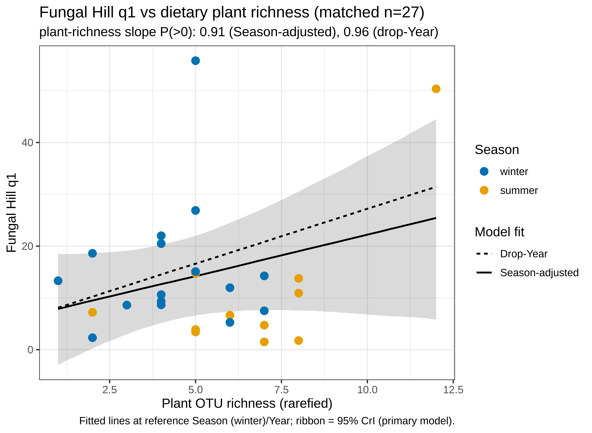

**Figure S9**: Per-sample fungal Hill q1 diversity against rarefied dietary plant richness (n = 27 matched samples), coloured by Season. Both Gamma (log link) model fits are shown — Season-adjusted (solid) and drop-Year (dashed) — with the 95% credible ribbon for the primary Season-adjusted model. Fitted lines are drawn at the reference Season/Year; the quantity of interest is the common positive slope.

```{r tab-h2mech-compare}
#| echo: false
library(knitr)
mc <- read.csv("tables/H2_mechanism_model_comparison.csv", check.names = FALSE)
mc_disp <- data.frame(
  Model       = mc$model,
  Structure   = mc$formula,
  `Slope (median, log scale)` = round(mc$median, 3),
  `95% CrI`   = sprintf("[%.2f, %.2f]", mc$lwr95, mc$upr95),
  `Ratio per SD` = sprintf("%.2f", exp(mc$median)),
  `P(slope>0)`= round(mc$P_gt0, 3),
  Divergences = mc$divergences,
  `Clears 0.95?` = ifelse(mc$supported, "yes", "no"),
  check.names = FALSE)
kable(mc_disp,
      caption = "Table S12. H2-mechanism: the two complementary Bayesian Gamma (log link) models of fungal Hill q1 diversity vs. dietary plant richness. Slopes are on the log scale per standard deviation of plant richness; 'Ratio per SD' = exp(median slope), the multiplicative change in fungal Hill q1. Both converge cleanly (0 divergences, Rhat < 1.01) and place the diet-richness slope positive.")
```

:::: {.content-visible when-profile="docs"}
```{r tab-h2mech-family}
#| echo: false
library(knitr)
fc <- read.csv("tables/H2_mechanism_family_choice.csv", check.names = FALSE)
kable(data.frame(
  Family      = fc$family,
  Model       = fc$model,
  `Slope (median)` = sprintf("%.3f (%s)", fc$median, fc$slope_scale),
  `95% CrI`   = sprintf("[%.2f, %.2f]", fc$lwr95, fc$upr95),
  `P(slope>0)`= round(fc$P_gt0, 3),
  `PPC skewness p` = round(fc$ppc_p_skewness, 3),
  `ΔELPD vs primary (SE)` = sprintf("%.1f (%.1f)", fc$elpd_diff_vs_primary, fc$se_diff),
  check.names = FALSE),
  caption = "Table S12b (documentation build). Family choice for the H2-mechanism model. Until 2026-09 the model was Gaussian on the z-scored Hill number; it fails the posterior-predictive skewness check (Bayesian p ≈ 0) and is outperformed by ≈ 13 ELPD (PSIS-LOO on the raw q1 scale). Gamma and lognormal fit equally well; Gamma was adopted because Table S9 already uses it. Source: 6_diversity_analyses.R Section 3b; pilot comparison of further families in brms_refit/MEMO_brms_refit.md.")
```
::::

Both models place the diet-richness slope firmly positive (medians +0.22 and +0.34 on the log scale, i.e. fungal Hill q1 multiplied by 1.24 and 1.40 per standard deviation of plant richness), with posterior support of **P(slope \> 0) = 0.91** (Season-adjusted) and **0.99** (drop-Year). The drop-Year model clears the preregistered 0.95 threshold; the Season-adjusted model sits just below it. The direction of the effect is therefore consistent, and the weight of posterior evidence favours the predicted positive diet-richness → fungal-diversity relationship.

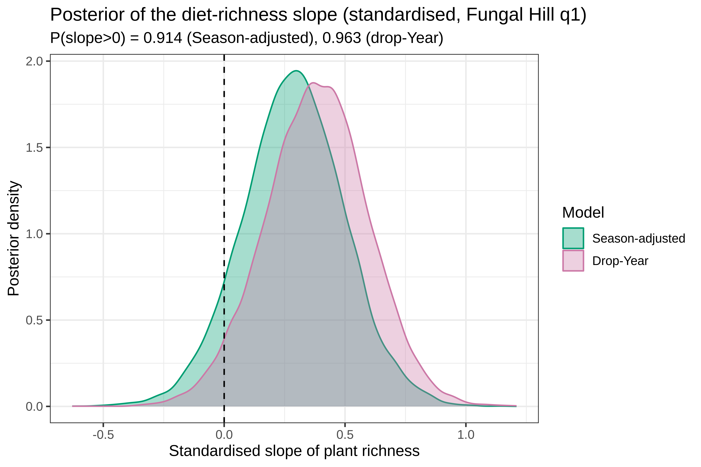

**Figure S10**: Posterior distribution of the diet-richness slope (log scale, per standard deviation of plant richness) for both Gamma models. The mass of both posteriors lies to the right of zero (dashed line).

The signal is consistent across the choice of Hill order: refitting with richness (q0) and Simpson-equivalent (q2) diversity as the outcome gives positive slopes throughout, with P(slope \> 0) between 0.78 and 0.99 (Table S13). No specification reverses the direction.

```{r tab-h2mech-sens}
#| echo: false
library(knitr)
sn <- read.csv("tables/H2_mechanism_sensitivity.csv", check.names = FALSE)
sn_disp <- data.frame(
  `Hill order` = sn$metric,
  Model        = sn$model,
  `Slope (median)` = round(sn$median, 3),
  `95% CrI`    = sprintf("[%.2f, %.2f]", sn$lwr95, sn$upr95),
  `P(slope>0)` = round(sn$P_gt0, 3),
  check.names = FALSE)
kable(sn_disp,
      caption = "Table S13. Sensitivity of the diet-richness slope to Hill order (q0 richness, q1 Shannon, q2 Simpson) under both model structures, each a Gamma (log link) model of the raw Hill number; slopes on the log scale per SD of plant richness. All six estimates are positive.")
```

<!-- DANIEL (exp/brms-refit, 2026-10-01): numbers above are updated to the Gamma models; the interpretive
prose below is untouched and yours to rewrite. Two points from the refit bear on it: (1) "primarily at the
seasonal scale" is backwards — Season is in both models, so the slope IS within-season, and the
between-season contrast runs the other way (2026-09-10 Hill-order memo); (2) under every family tried,
removing S_1_7_P1_8E takes P(slope > 0) to ~0.5 (Table S14 most-influential sample). -->

::: {.content-visible when-profile="docs"}
**Ecological interpretation.** Dietary plant richness is markedly higher in summer than winter, so most of the diet–diversity relationship is expressed through the *seasonal* contrast — which is exactly the diet-driven mechanism H2 proposes: the seasonal diet shift is the dominant axis of variation in propagule supply, and summer's richer plant intake is accompanied by a richer fungal community. Within a single season the diet-richness gradient is short (only a few plant OTUs separate one sample from another), so the per-sample effect is correspondingly modest.

Consistent with a modest, gradient-limited signal at this sample size, the estimate is carried by the samples at the extremes of the diet-richness range: a single leave-one-out omission moves the slope within the ranges in Table S14, and rank (Spearman) correlations within each Season are close to zero — the parametric slope reflects the between-season spread of the gradient more than fine within-season covariation. The honest reading is therefore a **weak, directionally-consistent signal**: fungal diversity does tend to rise with dietary plant richness, primarily at the seasonal scale, but the per-sample effect is not resolved decisively at n = 27 and is a clear target for a larger diet-matched sample.
:::

The honest reading is a directionally-consistent signal: fungal diversity does tend to rise with dietary plant richness, primarily at the seasonal scale, but the per-sample effect is not resolved decisively at n = 27 and is a clear target for a larger diet-matched sample.

```{r tab-h2mech-robust}
#| echo: false
library(knitr)
rb <- read.csv("tables/H2_mechanism_robustness.csv", check.names = FALSE)
names(rb) <- c("Check", "Group", "Quantity", "Value")
kable(rb,
      caption = "Table S14. Robustness of the diet-richness slope: leave-one-out influence (slope of the equivalent frequentist Gamma GLM on the log scale, its range across single-sample omissions, and the most influential sample) and Spearman rank correlations overall and within each Season. The Spearman rows are unadjusted marginal correlations; the leave-one-out rows are Season/Year-adjusted, so the two need not agree in sign.")
```

### 7.2 OTU–plant covariation (H3) - H3 not supported - still working 

Section 7.1 asked whether overall fungal diversity tracks overall diet richness. H3 is finer-grained and taxon-resolved: does each fungal OTU covary with particular diet-plant taxa, and — the preregistered contrast — do recognised coprophilous taxa show the diffuse, non-specific plant associations expected of dung specialists dispersed independently of any host plant, while other taxa may show the tight, single-plant covariation that would flag a likely ingested endophyte passenger? Inference is strictly forward-directional: a tight single-plant association is read as evidence of a likely ingested passenger; a diffuse or absent association is not read as evidence of gut/dung residency.

**Model.** We fit a single hierarchical joint negative-binomial model (brms) to the diet-matched subset. To retain as many matched samples as possible we use the PCR-replicate-level, minimally depth-filtered object (mirroring the GLLVM of Section 6) rather than the collapsed, 10,000-read-filtered object of Sections 4–5; this recovers three additional low-depth winter dung samples that carry paired plant data, raising the matched subset to **n = 30 biological samples (60 PCR-replicate libraries; 19 winter, 11 summer)**. Each fungal OTU count is modelled with a per-replicate log-library-size offset (so shallow libraries are accommodated, not discarded), the six dominant diet-plant genera (rCLR-transformed, standardised) as predictors, Season and Year as population-level covariates, per-OTU varying intercepts and plant slopes (the partial-pooling "joint model"), and a per-OTU biological-sample random effect so the two PCR replicates of a sample are treated as replication rather than independent samples. This substitutes a sample random effect for the preregistered "individual" one (unidentifiable here — nearly every sample is a distinct bird), for the same reason as Section 7.1. Forty-six OTUs present in ≥5 of the 30 samples are modelled. For each OTU we summarise the specificity of its plant coefficients with a Herfindahl–Hirschman index (HHI) of the \|plant slopes\| — ≈1/6 = 0.17 if covariation is spread evenly across all six genera, up to 1 if concentrated on a single plant — and flag a resolved single-plant association when the 90% credible interval of the OTU's strongest plant slope excludes zero. The preregistered contrast compares specificity between FUNGuild-flagged coprophilous OTUs and plant-associated (endophyte/phyllosphere/plant-saprotroph) OTUs. The model converged cleanly (maximum R̂ = 1.004, no divergent transitions).


**Figure S11**: Posterior-median covariation of each modelled fungal OTU (rows, ordered by specificity and grouped by FUNGuild guild class) with each dominant diet-plant genus (columns), on the log (negative-binomial) scale; red = positive, blue = negative. The three recognised coprophilous taxa (*Thelebolus*, *Coniochaeta*, *Sporormiella*) covary *positively* and strongly with *Vaccinium*, whereas most other OTUs covary negatively with it.

```{r tab-h3-spec}
#| echo: false
library(knitr)
si <- read.csv("tables/H3_specificity_index.csv", check.names = FALSE)
si_disp <- head(si, 12)
kable(data.frame(
  OTU            = si_disp$OTU_ID,
  Genus          = ifelse(is.na(si_disp$Genus), "—", si_disp$Genus),
  `Prev. (/30)`  = si_disp$prevalence,
  Specificity    = round(si_disp$specificity_HHI, 2),
  `Top plant`    = si_disp$dominant_plant,
  `Top slope [90% CrI]` = sprintf("%.2f [%.2f, %.2f]", si_disp$dom_slope_med,
                                  si_disp$dom_slope_lwr90, si_disp$dom_slope_upr90),
  Resolved       = ifelse(si_disp$resolved_single_plant, "yes", "—"),
  Guild          = si_disp$guild_group,
  check.names = FALSE),
  caption = "Table S15. The twelve most plant-specific fungal OTUs (of 46 modelled), ranked by the Herfindahl specificity of their plant coefficients. Only OTU1 (Thelebolus) reaches a resolved single-plant association (its Vaccinium slope's 90% CrI excludes zero). Diffuse baseline (six genera) = 0.17.")
```

**Result.** For almost every OTU the plant covariation is too weak to resolve at this sample size: of the 46 OTUs, **only one — OTU1 (*Thelebolus*) — shows a resolved single-plant association** (a strong positive *Vaccinium* slope, median +2.30 on the log scale, 90% CrI \[0.18, 4.62\]). This single tight association runs *opposite* to the preregistered expectation: *Thelebolus* is a recognised coprophilous dung specialist, not a phyllosphere/endophyte passenger. More generally, the three coprophilous taxa are the *most* plant-concentrated OTUs in the dataset, not the least (Figure S12): the coprophilous group has a higher median specificity than the plant-associated group (0.38 vs 0.30) — the reverse of the predicted "coprophilous = more diffuse" pattern. The contrast is not supported in either direction under uncertainty: a one-sided Wilcoxon test of the preregistered direction gives p = 0.72, and propagating the full posterior, P(coprophilous more diffuse) = 0.36. The genus-list sensitivity grouping (coprophilous = *Thelebolus*/*Sporormiella*/*Coniochaeta*) tells the same story (0.51 vs 0.30).

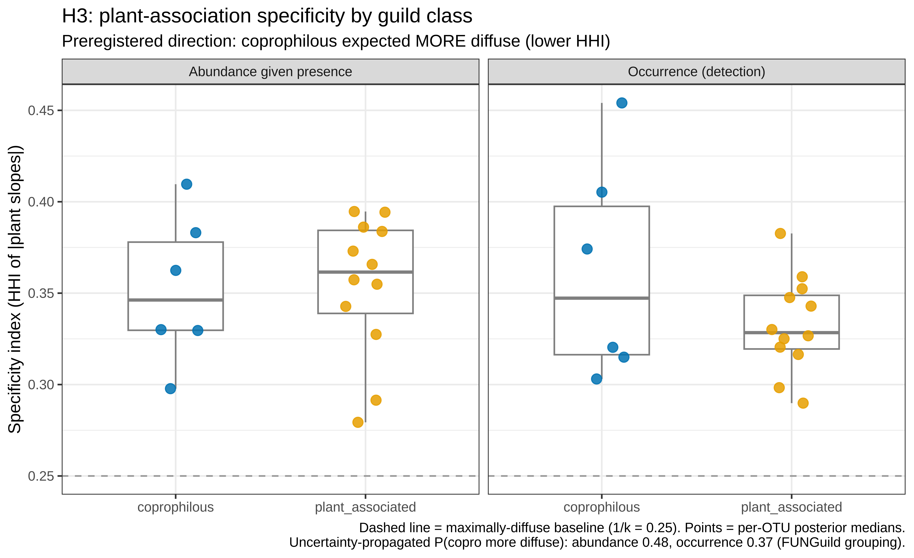

**Figure S12**: Per-OTU plant-association specificity (Herfindahl index) by FUNGuild guild class. Contrary to the preregistered prediction, coprophilous OTUs are if anything *more* plant-concentrated than plant-associated ones. Dashed line = maximally-diffuse baseline (1/6).

```{r tab-h3-contrast}
#| echo: false
library(knitr)
ct <- read.csv("tables/H3_specificity_contrast.csv", check.names = FALSE)
kable(data.frame(
  Grouping                    = ct$grouping,
  `n copro`                   = ct$n_coprophilous,
  `n plant-assoc`             = ct$n_plant_assoc,
  `Copro HHI`                 = round(ct$copro_spec_med, 2),
  `Plant-assoc HHI`           = round(ct$plant_spec_med, 2),
  `Wilcoxon p (copro<plant)`  = round(ct$wilcox_p_copro_lower, 2),
  `P(copro more diffuse)`     = round(ct$P_copro_lower, 2),
  check.names = FALSE),
  caption = "Table S16. Preregistered coprophilous-vs-plant-associated specificity contrast (FUNGuild primary grouping; COPRO_GENERA genus list as sensitivity). Neither grouping supports the predicted 'coprophilous more diffuse' direction. The full per-OTU × plant coefficient table is provided as tables/H3_perOTU_plant_coef.csv (Table S17).")
```

**Interpretation.** H3, as preregistered, is **not supported**: taxonomically recognised coprophilous taxa do *not* show more diffuse plant associations than other taxa — if anything the reverse. The single interpretable plant signal is a *Vaccinium*–*Thelebolus* covariation, and its ecology is the opposite of the "ingested passenger" reading H3 was built to detect: *Thelebolus* is a dung specialist, and *Vaccinium* (with *Empetrum*) is the winter browse of ptarmigan at this site. Because Season is already a covariate this is a within-season-adjusted association, but the residual gradient is short; the most parsimonious reading is that the winter-browse plants and the persistent dung-fungal core co-vary as parallel seasonal signatures of the same samples, not that *Thelebolus* is carried into the gut on *Vaccinium* tissue. This dovetails with Section 6, where *Thelebolus* (OTU1) was the one coprophile *without* a clean seasonal differential-abundance signal, and with the E2 documentation in Section 3.2.

**Limitation.** Even at n = 30 the diet is dominated by a few plant genera (*Betula* near-ubiquitous, then *Vaccinium*/*Empetrum*), so specificity can be assessed over only \~6 genera and the coprophilous group is small (6 OTUs). We therefore report H3 as a directional, exploratory result rather than a decisive test — and, consistent with the forward-directional inference rule, the absence of tight single-plant passenger signatures is **not** evidence that the dung mycobiome is gut-resident. A larger, more diet-even matched sample is the necessary next step.

### 7.3 OTU–plant covariation — GLLVM cross-check (H3)

To check that the H3 verdict of Section 7.2 is not an artefact of one modelling framework, we repeat the analysis with a generalised linear latent-variable model (GLLVM) — the same model-based framework used for the OTU-resolved H1 in Section 6, now with the diet-plant predictors added. Everything about the data is held identical to the Bayesian model: the same PCR-replicate-level matched subset (**n = 30 biological samples, 60 libraries; 46 OTUs present in ≥5 samples**), the same six standardised diet-plant genera (rCLR-transformed), the same per-library log-size offset, and the same specificity index and preregistered coprophilous-vs-plant-associated contrast. Only the estimator differs, which is the point: agreement across two very different fitting machineries is stronger evidence than either alone.

**Model.** Each OTU's counts are modelled with a negative-binomial GLLVM (`gllvm`), with Season and Year as community covariates, a per-OTU (species-specific) *fixed* slope for each plant genus, a biological-sample random row effect (so the two PCR replicates of a sample count as replication, not independent samples), and the log-library-size offset. We fit 0, 1 and 2 residual latent variables and select by AIC; here **num.lv = 0** is preferred — beyond the sample random effect the latent variables capture no further residual co-occurrence (so, unlike Section 6, there is no residual ordination to show). One difference from the Bayesian model is forced by the software: the natural partial-pooling analog (`gllvm`'s `randomX` species-specific *random* slopes) is silently dropped on this dataset, returning no plant-slope parameters at all. We therefore estimate the plant slopes as *fixed* per-OTU coefficients with Wald standard errors — an **unpooled** frequentist estimate that brackets the Bayesian *pooled* one from the other side. Rare on/off OTUs push their fixed coefficients toward ±∞ (near-separation); as in Section 6 these are flagged (16 of 46 OTUs) and excluded from the specificity ranking, contrast and plots, leaving **30 well-estimated OTUs**. Specificity is the same Herfindahl index of the \|plant slopes\|; a *resolved single-plant association* here means the 90 % Wald interval of an OTU's strongest plant slope excludes zero.

::: callout-warning
**Caveat on the per-OTU slopes (added 2026-09-29; wording to be finalised).** Even among the 30 retained OTUs the unpooled slopes are large for a per-SD predictor (median \|slope\| 1.9, 90th percentile 7.0, maximum 15.9 on the log scale), so the count of Wald-resolved associations in this section overstates what is estimable; the Bayesian pooled model of Section 7.2 resolves only 1 of 46. The verdict this section supports is the model-level one — AIC prefers the plant-free model and the coprophilous-versus-plant-associated contrast is not significant — not the individual slopes.
:::

```{r tab-h3g-aic}
#| echo: false
library(knitr)
mc <- read.csv("tables/gllvm_H3_model_comparison.csv", check.names = FALSE)
kable(data.frame(
  Model    = mc$model,
  `num.lv` = mc$num_lv,
  Plants   = ifelse(mc$plants, "yes", "no"),
  logLik   = round(mc$logLik, 1),
  AIC      = round(mc$AIC, 1),
  dAIC     = round(mc$dAIC, 1),
  check.names = FALSE),
  caption = "Table S18. GLLVM H3 model comparison (AIC). Latent variables add nothing beyond the sample random effect (num.lv = 0 preferred among the plant models), and — notably — the null model with no plant predictors is itself AIC-preferred over the plant models (dAIC ≈ 117): the per-OTU plant slopes do not improve fit enough to justify their parameters, an independent echo of the 'too weak to resolve' result of Section 7.2.")
```


**Figure S13**: Per-OTU fixed plant slopes (GLLVM, log scale; red = positive, blue = negative) for the 30 well-estimated OTUs, rows ordered by specificity and grouped by FUNGuild guild class — the frequentist counterpart of Figure S11. As in the Bayesian model, the coprophilous taxa covary *positively* with *Vaccinium* rather than diffusely.

```{r tab-h3g-spec}
#| echo: false
suppressMessages(library(dplyr)); library(knitr)
si <- read.csv("tables/gllvm_H3_specificity_index.csv", check.names = FALSE)
si_disp <- si %>% filter(!separation) %>% head(12)
kable(data.frame(
  OTU            = si_disp$OTU_ID,
  Genus          = ifelse(is.na(si_disp$Genus), "—", si_disp$Genus),
  `Prev. (/30)`  = si_disp$prevalence,
  Specificity    = round(si_disp$specificity_HHI, 2),
  `Top plant`    = si_disp$dominant_plant,
  `Top slope [90% CI]` = sprintf("%.2f [%.2f, %.2f]", si_disp$dom_slope_med,
                                 si_disp$dom_slope_lwr90, si_disp$dom_slope_upr90),
  Resolved       = ifelse(si_disp$resolved_single_plant, "yes", "—"),
  Guild          = si_disp$guild_group,
  check.names = FALSE),
  caption = "Table S19. The twelve most plant-specific well-estimated OTUs under the GLLVM, ranked by Herfindahl specificity. Without the Bayesian model's shrinkage the unpooled Wald intervals resolve many more single-plant slopes; the strongest resolved coprophilous signal is Sporormiella (OTU636) with Vaccinium. Diffuse baseline (six genera) = 0.17.")
```

**Result.** The GLLVM reaches the **same verdict as the Bayesian model — H3 is not supported** — and does so through instructively different intermediate numbers. Because the fixed-slope estimator applies no shrinkage, its Wald intervals resolve **15 of the 30** well-estimated OTUs to a single-plant association (versus 1 of 46 under the pooled Bayesian model). But those resolved associations are spread across guilds rather than concentrated in the non-coprophilous taxa H3 predicts, so they do *not* produce the specificity difference the hypothesis requires. On the preregistered contrast the coprophilous group is **not** resolvably more diffuse than the plant-associated group: median specificity 0.21 (coprophilous) vs 0.24 (plant-associated), one-sided Wilcoxon p = 0.42, and propagating the Wald uncertainty P(coprophilous more diffuse) = 0.64 — straddling the no-difference value of 0.5. The genus-list sensitivity grouping runs the other way (0.25 vs 0.24, p = 0.81). And, as above, AIC prefers the plant-free null model outright. The strongest resolved coprophilous signal is again a *positive Vaccinium* slope — here *Sporormiella* (OTU636, +12.3, 90 % CI \[6.7, 17.8\]), the *Sporormiella* counterpart of the Bayesian model's *Vaccinium*–*Thelebolus* signal — the opposite of the diffuse, passenger-free pattern H3 expects of a dung specialist.

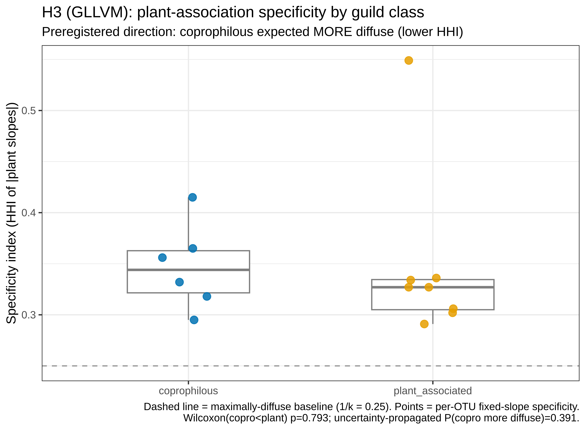

**Figure S14**: Per-OTU GLLVM specificity by FUNGuild guild class (frequentist counterpart of Figure S12). Coprophilous OTUs are not resolvably more diffuse than plant-associated ones. Dashed line = maximally-diffuse baseline (1/6).

```{r tab-h3g-contrast}
#| echo: false
library(knitr)
ct <- read.csv("tables/gllvm_H3_specificity_contrast.csv", check.names = FALSE)
kable(data.frame(
  Grouping                    = ct$grouping,
  `n copro`                   = ct$n_coprophilous,
  `n plant-assoc`             = ct$n_plant_assoc,
  `Copro HHI`                 = round(ct$copro_spec_med, 2),
  `Plant-assoc HHI`           = round(ct$plant_spec_med, 2),
  `Wilcoxon p (copro<plant)`  = round(ct$wilcox_p_copro_lower, 2),
  `P(copro more diffuse)`     = round(ct$P_copro_lower, 2),
  check.names = FALSE),
  caption = "Table S20. GLLVM coprophilous-vs-plant-associated specificity contrast (FUNGuild primary; COPRO_GENERA genus list as sensitivity), the frequentist counterpart of Table S16. Neither grouping supports the predicted 'coprophilous more diffuse' direction. The full per-OTU × plant coefficient table (with Wald z, p and BH-q) is provided as tables/gllvm_H3_perOTU_plant_coef.csv.")
```

**Interpretation.** Two independent frameworks — a partial-pooling Bayesian joint model and an unpooled frequentist GLLVM — give the same answer: recognised coprophilous taxa are **not** more diffuse in their plant associations than other taxa, so H3 as preregistered is not supported, and the one robust piece of ecology (a positive coprophile–*Vaccinium* covariation, *Thelebolus* under one model, *Sporormiella* under the other) is the reverse of the ingested-passenger signature the test was built to detect. The two models disagree only on how many single-plant slopes count as "resolved," and that gap is exactly the expected footprint of shrinkage — the pooled model is conservative, the unpooled one liberal — not an ecological disagreement. Consistent with the forward-directional inference rule, neither the sparse Bayesian resolutions nor the plentiful GLLVM ones are read as evidence about gut residency; the honest reading remains that these winter-browse plants and the persistent dung-fungal core co-vary as parallel seasonal signatures, and that a larger, more diet-even matched sample is needed to test single-taxon passenger transport directly.

::: {.content-visible when-profile="docs"}
#### Documentation notes — Section 7 {.unnumbered}

*Documentation build only; omitted from the submitted appendix. Move any paragraph, callout or table here that belongs in the full record rather than in the supplement.*
:::

## Section 8: Functional guilds — FUNGuild {.page-break-before}

Sections 3–6 characterise the seasonal shift *taxonomically* — which lineages turn over between winter and summer. This section asks what that community **does**: each OTU is assigned to a functional guild, and the guild composition of the dung mycobiome is compared across seasons. It is the descriptive counterpart to Section 9, which puts the same trait → season link inside a joint species distribution model. The two are deliberately built on the **same classification rule** so their results are directly comparable, but they differ in scope: Section 8 works on read shares across **all 1129 OTUs** of the canonical 52-sample object (no prevalence filter, because this is a description of where the reads go), whereas Section 9 models the 226 OTUs that pass its prevalence threshold. All results here are produced by `Scripts/8_functional_guilds.R`.

### 8.1 Guild assignment and the classification rule

Guild annotation uses **FUNGuild** (Nguyen et al. 2016), run through its command-line tool against each OTU's own taxonomy string, so that assignments are made at the finest rank available per OTU (species, genus, family or order) rather than by a single-rank lookup. **693 of the 1129 canonical OTUs (61.4%) receive a guild call** at a usable confidence ranking; the remaining 436 return no assignment — either because no matching taxonomy record exists in the FUNGuild database or because the match carries no ranked guild.

FUNGuild returns compound guild strings rather than a single label — for example `|Dung Saprotroph|-Endophyte-Plant Saprotroph-Undefined Saprotroph`. OTUs are collapsed to a single class by a priority rule (first match wins): dung saprotroph → plant-associated → pathotroph, with anything else falling to *other assigned* or *unassigned* (no FUNGuild call at all). Coprophily takes precedence deliberately: it is the guild the study is about, and it would otherwise be absorbed into a generic saprotroph category. An OTU counts as a dung saprotroph if FUNGuild lists `Dung Saprotroph` **or** its genus is one of fourteen recognised coprophilous genera (the Section 3.2 list, omitting *Sporormia*, *Psathyrella* and *Stropharia*). That difference is immaterial here: *Sporormia* is absent from the dataset, both *Stropharia* OTUs are already assigned by their FUNGuild string, and the two *Psathyrella* OTUs carry 0.04% of reads, so no guild share below changes at the reported precision. This is the identical rule used for the Section 9 guild trait.

```{r tab-guild-crosswalk}
#| echo: false
library(knitr)
cw <- read.csv("tables/guild_scheme_crosswalk.csv", stringsAsFactors = FALSE)
lv <- c("Dung saprotroph", "Plant-associated", "Pathotroph",
        "Other assigned", "Unassigned / dark")
cw <- cw[order(match(cw$guild_display, lv)), ]
kable(data.frame(
  `Guild (Section 8)`      = cw$guild_display,
  `Class (Section 9)`     = cw$guild_class,
  `n OTUs`                 = cw$n_OTUs,
  Note                     = cw$note,
  check.names = FALSE),
  row.names = FALSE,
  caption = "Table S-GUILDa. Crosswalk between the Section 8 display guilds and the Section 9 model trait, with OTU counts (1129 canonical OTUs). The two schemes are the same priority rule; they differ only in that Section 9's `other` class is split here according to whether the OTU carries a FUNGuild annotation at all.")
```

### 8.2 Guild composition shifts sharply between seasons

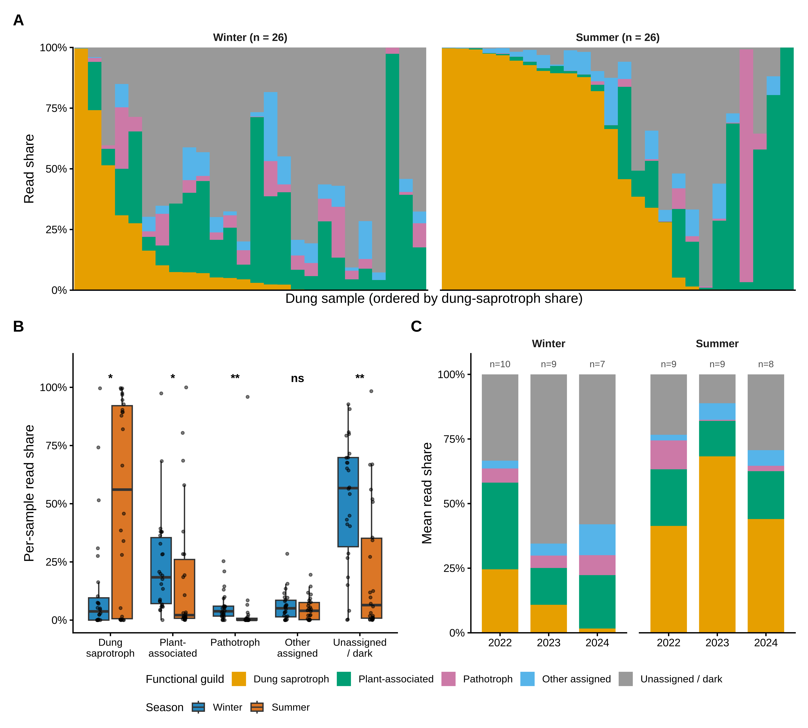

**Figure S-GUILDa**: Functional-guild composition of the dung mycobiome. **(A)** Per-sample guild read share, one stacked bar per dung sample, faceted by season and ordered within each season by dung-saprotroph share. **(B)** Per-sample read share by guild and season; boxes show the median and interquartile range, points are individual samples, and marks give the Benjamini–Hochberg-adjusted Wilcoxon rank-sum result (\* q \< 0.05, \*\* q \< 0.01, ns = not significant). **(C)** Mean guild read share by season and year, showing that the shift recurs in all three years. Colours are the Okabe–Ito colourblind-safe palette throughout.

Panels **(A)** and **(B)** here are the same object, rule and test as main-text **Fig. 1B–C** (Section 10.1) — the same result, not a second analysis. This figure is retained because panel **(C)**, the Season × Year consistency check of Section 8.3, has no main-text counterpart.

The seasonal contrast is large and concerns primarily two of the five guilds. **Dung saprotrophs rise from 13.6% of winter reads to 51.5% in summer**, while the **unassigned/dark fraction falls from 51.1% to 21.0%** — that is, roughly half of a typical winter sample consists of reads that FUNGuild cannot place at all, whereas a typical summer sample is dominated by recognised coprophilous fungi. Equivalently, the proportion of reads landing on a guild-annotated OTU rises from **49% in winter to 79% in summer**.

```{r tab-guild-season}
#| echo: false
library(knitr)
g <- read.csv("tables/guild_season_readshare.csv", stringsAsFactors = FALSE)
pc <- function(x) sprintf("%.1f", 100 * x)
kable(data.frame(
  Guild            = g$Guild,
  `Summer mean %`  = pc(g$mean_summer),
  `Winter mean %`  = pc(g$mean_winter),
  `Summer median %`= pc(g$median_summer),
  `Winter median %`= pc(g$median_winter),
  `Detected (S/W)` = paste0(g$prevalence_summer, "/", g$prevalence_winter),
  `p`              = signif(g$p_value, 2),
  `q (BH)`         = ifelse(is.na(g$q_value), "—", signif(g$q_value, 2)),
  check.names = FALSE),
  row.names = FALSE,
  caption = "Table S-GUILDb. Per-sample guild read shares by season (26 samples per season), with Wilcoxon rank-sum tests and Benjamini–Hochberg adjustment across the five guilds. 'Detected' gives the number of samples in which the guild occurs at all. The final row is a robustness check, not part of the BH family: it restricts the dung-saprotroph guild to OTUs matching a recognised coprophilous genus, discarding those assigned on the FUNGuild string alone.")
```

**The dung-saprotroph result does not depend on how generously that guild is defined.** The rule counts an OTU as coprophilous if FUNGuild lists `Dung Saprotroph` *or* its genus is a recognised coprophilous genus. Restricting it to the genus criterion alone drops 24 of the 37 OTUs (37 across all 1129 canonical OTUs; the 14 dung saprotrophs of the Section 9 model are those of the 37 that pass its ≥ 5-replicate prevalence filter) and still gives **45.7% summer versus 8.5% winter** (p = 0.00094; final row of Table S-GUILDb). The signal is concentrated in a few abundant taxa — OTU1 (*Thelebolus*), OTU636 (*Sporormiella*) and OTU1225 (*Coniochaeta*) are the three largest contributors — which is consistent with the dominance analysis of Section 5.4 and with the differential-abundance results of Section 6, where *Sporormiella* OTU636 and *Coniochaeta* OTU1225 are both significantly summer-elevated.

### 8.3 The guild shift recurs in all three years

```{r tab-guild-year}
#| echo: false
library(knitr)
sy <- read.csv("tables/guild_season_year_readshare.csv", stringsAsFactors = FALSE)
lv <- c("Dung saprotroph", "Plant-associated", "Pathotroph",
        "Other assigned", "Unassigned / dark")
cells <- c("Winter 2022","Winter 2023","Winter 2024","Summer 2022","Summer 2023","Summer 2024")
sy$cell <- factor(paste(sy$Season, sy$Year), levels = cells)
mat <- tapply(sy$mean_share, list(factor(sy$Guild, levels = lv), sy$cell),
              function(z) z[1])
kable(cbind(Guild = lv, as.data.frame(round(100 * mat, 1), check.names = FALSE)),
      row.names = FALSE,
      caption = "Table S-GUILDc. Mean per-sample guild read share (%) by season and year. Cell sizes: winter 10/9/7 and summer 9/9/8 samples for 2022/2023/2024.")
```

Panel C of Figure S-GUILDa and Table S-GUILDc show the same ordering in every year: **the dung-saprotroph share is higher in summer than in winter in 2022, 2023 and 2024** (41.3% vs 24.5%, 68.3% vs 10.9%, and 44.0% vs 1.7% respectively). Within-year tests are significant for 2023 (q = 0.027) and marginal for 2024 (q = 0.053) but not for 2022 (q = 0.74), where two unusually coprophile-rich winter samples raise the winter mean and its variance. The direction is therefore consistent across all three years while the magnitude varies. This is the functional-guild analogue of the H1 result in Section 4.2, and the two agree closely: the compositional Season × Year interaction is significant there (p = 0.011; four of five distance measures, marginal under the fifth, Table S7b), and the per-year breakdown ranks the years in the same order as the guild data — 2023 strongest, 2024 intermediate, 2022 weakest (Table S5b). Given three years and modest per-cell sample sizes, the safe reading is that the seasonal shift is directionally reproducible but of year-varying magnitude, not that it has a constant effect size.

::: {.callout-note when-profile="docs"}
**Interpretation and caveats.**

**What this adds.** The guild layer reproduces the seasonal signal independently of taxonomy and gives it a functional reading: summer dung supports an actively coprophilous community, winter dung does not. Section 9 tests the same link within a joint model and reaches a concordant conclusion — guild predicts seasonal *occurrence*, with dung saprotrophs more likely to occur in summer (posterior support 0.96) — so the descriptive and model-based views agree.

**Relation to the dark taxa (E1).** The winter unassigned share here (51.1%) closely tracks the dark-taxa share reported in Section 3.4 (51.3% of winter reads), but the two are **not the same set**: "unassigned" here means no FUNGuild annotation (436 OTUs), while "dark" in Section 3.4 means no confident genus in the canonical taxonomy (493 OTUs). They share 390 OTUs, and 103 OTUs lack a genus yet still receive a FUNGuild call at family or order level. The definitions coincide in winter but diverge in summer (21.0% unassigned versus 31.2% dark), so the two figures should not be used interchangeably. Section 3.4 establishes that a substantial part of this winter fraction is genuinely novel rather than merely absent from reference databases; the functional consequence is that **winter guild composition is the least well characterised part of this dataset**, and its apparent depletion of coprophiles is partly a statement about annotation coverage.

**Limitations.** (i) Read share is not biomass: PCR and copy-number biases mean these proportions describe sequence abundance, not fungal abundance. (ii) FUNGuild assignments are database-derived and inherit its taxonomic and geographic biases; assignments made at family or order level are necessarily coarser than species-level ones, and confidence rankings (Table S-GUILDb does not stratify by them) are `Probable` for the majority of assigned OTUs. (iii) The compositional constraint discussed above means that a guild's decline in relative terms need not imply any absolute decline. (iv) A guild label describes an ecological capability inferred from relatives, not a verified activity in this substrate.

**Supersedes.** The preliminary guild percentages previously recorded in this section were an interim workspace check that predated the finalized script; they were not reproducible from any committed code. The values above are produced by `Scripts/8_functional_guilds.R` and are reproducible from the staged CSVs in `tables/`.
:::

::: {.content-visible when-profile="docs"}
Section 9's residual `other` class mixes OTUs that *do* carry a FUNGuild call with 46 that have a taxonomic genus but **no** guild annotation at all; the latter carry roughly a tenth of winter reads. That conflation is harmless for a model trait but misleading in a read-share figure, so the two are separated here into **Other assigned** and folded into **Unassigned / dark** respectively. Table S-GUILDa reconciles the two schemes.

**Why FUNGuild and not FungalTraits.** Both annotation sources were built and compared. `fungaltraits_otu` (genus-level lookup via the `fungaltraits` package) covers 195 of 1129 OTUs (17%) and is a **strict subset** of the FUNGuild annotation (693 of the 1129 canonical OTUs, 61%) — it contributes no unique coverage. On the 195 OTUs both annotate they agree on the exact `Guild` string only 37% of the time (49% on trophic mode), because collapsing to one record per genus discards the species-level resolution FUNGuild's per-OTU run retains. FUNGuild is therefore used as the sole guild source; FungalTraits is retained only as a coarse sensitivity check, and guild calls are never merged between the two for the same OTU.

**Means and medians tell different parts of this story, and both are reported.** For the plant-associated and pathotroph guilds the seasonal *means* are nearly identical (18.0% vs 23.4%, and 4.7% vs 5.8%) while the *medians* differ several-fold (2.1% vs 18.4%, and 0.1% vs 3.8%). The rank-based tests follow the medians and are significant for both. The reason is compositional rather than ecological: because dung saprotrophs occupy so much of a typical summer sample, every other guild is compressed toward zero in most summer samples, while a small number of summer samples in which coprophiles are absent carry large plant-associated or pathotroph fractions and pull the summer means back up. These guilds are better described as **relatively displaced in summer** than as absolute winter specialists — a limitation inherent to read shares, which are constrained to sum to one.
:::

## Section 9: Joint species distribution model — HMSC (H1 synthesis) {.page-break-before}

Sections 4–6 treat the seasonal signal one lens at a time: community dissimilarity (H1), per-sample diversity (H2), and per-OTU differential abundance (GLLVM). This section brings them into a single hierarchical model. We fit a joint species distribution model (HMSC — Hierarchical Modelling of Species Communities; `Scripts/10_hmsc.R`) that simultaneously (i) partitions each OTU's variance among Season, Year, and the nested sampling structure; (ii) asks whether an OTU's functional guild predicts how it responds to Season (the trait → environment link); (iii) recovers each OTU's seasonal niche for a like-for-like cross-check against the Section-6 GLLVM; (iv) estimates the residual co-occurrence left once Season, Year and traits are accounted for; and (v) tests for phylogenetic signal in seasonal niches. It is the model-based synthesis of the H1 story, fitted directly on the corrected canonical data (unlike the Section-6 GLLVM, which predates the depth-filter fix).

### 9.1 Model, design, and what is (and isn't) trustworthy

<!-- CLAUDE DRAFT 2026-09-29 (model revision): rewrite freely -->
The models use the one-row-per-PCR-replicate object (`alldat_full$nopool`; 109 replicate rows from 55 biological dung samples), retaining the **226 OTUs present in ≥ 5 replicates** — the same prevalence rule used for the GLLVM/H3 analyses. Fixed effects are **Season** (winter as reference) **+ Year**; the species trait is the five-level functional **guild** class derived from FUNGuild (dung saprotroph, plant-associated, pathotroph, dark/unassigned, other — assigned by the priority rule in `Scripts/10_hmsc.R`, counts below). Three models are fitted:

- **Headline — CLR abundance, replicates averaged.** Each PCR replicate is CLR-transformed (the compositional normalisation that stands in for a library-size offset), and the two replicates of a dropping are then averaged, giving one row per dropping (55 rows). The random level is the **biological sample** (the dropping), with two latent factors. This model carries the abundance results of this section and both panels of Figure 3.
- **Complement — CLR abundance, replicate level.** The same CLR response with both replicates kept as rows (109 rows), and **two random levels**: biological sample (two latent factors) and **PCR replicate** (one latent factor).
- **Robustness — presence/absence (probit)**, replicate level, with biological sample and PCR replicate as random levels.

Both CLR models scale each OTU's response to unit variance before fitting and cap the number of latent factors; the reason for the cap, and for the choice of headline, is given below Table S-HMSCb.

```{r tab-hmsc-guild}
#| echo: false
library(knitr)
og <- read.csv("tables/hmsc_otu_guild.csv", stringsAsFactors = FALSE)
gt <- as.data.frame(table(factor(og$guild_class,
        levels = c("dung_saprotroph","plant_associated","pathotroph","dark_unassigned","other"))))
kable(data.frame(`Guild group` = gt$Var1, `n OTUs` = gt$Freq, check.names = FALSE),
      caption = "Table S-HMSCa. Functional-guild composition of the 226 modelled OTUs. FUNGuild returns a compound guild string per OTU; these are resolved to one class by the hierarchical priority rule in `Scripts/10_hmsc.R`, shared verbatim with Section 8. Dark/unassigned and 'other' together dominate the count — the modest coprophilous set (14 OTUs) nonetheless carries the strongest seasonal signal (Sections 9.3–9.4).")
```

An **individual-bird** random level was deliberately **not** included. Microsatellite genotyping succeeded for only a handful of repeat birds, so a bird level (with unidentified droppings entered as singletons) would have \~51 units against 55 biological samples — effectively one-to-one with the sample level, confounding the two sets of latent factors. In the three-level version this stopped the CLR community-level parameters from converging and made the variance partition unstable, so the bird level was dropped, leaving sample + PCR (mirroring the GLLVM's `(1 | Sample_ID_field)`). Dropping it was not by itself sufficient; see the note below Table S-HMSCb. Each model was fitted with four chains (1000 samples, thinning 50, 25,000 transient iterations).

```{r tab-hmsc-conv}
#| echo: false
library(knitr)
cv <- read.csv("tables/hmsc_convergence_psrf.csv", stringsAsFactors = FALSE)
lab <- c(clr = "CLR abundance, replicates averaged (headline)",
         clr_rep = "CLR abundance, replicate level (complement)",
         pa = "Probit occurrence, replicate level", clr_phylo = "CLR + phylogeny")
kable(data.frame(
  Model = lab[cv$model], Rows = cv$n_rows,
  `Beta PSRF median / max` = sprintf("%.3f / %.3f", cv$beta_psrf_med, cv$beta_psrf_max),
  `Beta % < 1.1` = cv$beta_pct_below_1.1,
  `Season Beta % < 1.1` = cv$season_pct_below_1.1,
  `Gamma PSRF median / max` = sprintf("%.3f / %.3f", cv$gamma_psrf_med, cv$gamma_psrf_max),
  `Chain range, guild means` = cv$guild_mean_chain_range_max,
  `Chain range, variance partition` = cv$vp_chain_range_max,
  check.names = FALSE),
  row.names = FALSE,
  caption = "Table S-HMSCb. Convergence of the three HMSC models. PSRF is the Gelman–Rubin potential scale reduction factor (1 = the four chains agree). The two chain-range columns compare the chains directly on the quantities the figures report: the largest difference between chains in any guild's mean Season Beta (standardised units), and in any community-mean variance component (proportion).")
```

```{r tab-hmsc-v1}
#| echo: false
library(knitr)
v1 <- read.csv("tables/hmsc_v1_chain_disagreement.csv", check.names = FALSE)
kable(v1, row.names = FALSE,
      col.names = c("Quantity", "Chain 1", "Chain 2", "Chain 3", "Chain 4", "PSRF"),
      caption = "Table S-HMSCb2. The superseded CLR model (replicate level, uncapped latent factors: 7 at the sample level, 5 at the PCR level), fitted 2026-07-20. Each of its four chains converged to a different answer for the quantities the previous version of Figure 3 reported; pooling them produced the previously quoted values (e.g. dung-saprotroph mean +0.39, Season 11%).")
```

<!-- CLAUDE DRAFT 2026-09-29 (why the headline model wins): rewrite freely -->
::: callout-note
**Why the replicate-averaged model is the headline.** An earlier version of this section used a single CLR model at the replicate level with an uncapped number of latent factors (seven at the sample level, five at the PCR level). Its four chains converged to four different answers (Table S-HMSCb2): the *Thelebolus* Season coefficient was 0.36, 3.03, 0.69 and −0.03 in the four chains, and the Season share of variance between 5% and 28%. The PSRF understated the problem because each chain mixed well within its own solution. The cause is structural. Season is constant within a dropping, so enough sample-level latent factors can reproduce the Season contrast themselves, and each chain divided the seasonal signal differently between the Season coefficients and the latent factors. Longer chains do not cure this; capping the number of latent factors does, and both CLR models reported here are capped.

With the cap, both CLR models converge on the Season effects (Table S-HMSCb). They differ in how they treat the two PCR replicates of each dropping. The replicate-level model estimates PCR replicate as its own random level, but the split of variance between dropping and replicate rests on only 54 replicate pairs and is weakly identified: in an earlier independent fit with the identical specification, its chains settled in two different splits (dropping/PCR 0.52/0.14 in two chains, 0.43/0.27 in the other two), whereas in the fit reported here the chains agree (Table S-HMSCc3). The replicate-level model also counts the two replicates as partly independent observations, which narrows its credible intervals (median width 0.84 of the headline model's; Table S-HMSCc4). Averaging the replicates removes both issues by construction — one row per dropping, no replicate-level split to identify — and its chains agree to within 0.003 on every reported guild mean and variance component.

The two models agree on what the figures report: per-OTU Season coefficients correlate at Pearson r = 0.97 (Spearman ρ = 0.89), and 56 OTUs have a 95% credible interval excluding zero in both (Table S-HMSCc4). The replicate-level model is therefore kept as the complement that carries an explicit PCR-replicate level, and the PCR-replicate variance the headline model averages away is measured directly in Section 9.2 (Table S-HMSCc2).

The **probit (occurrence)** model was not refitted. Its PSRFs are low (Beta median 1.01, 99.6% below 1.1), but compared chain by chain its guild means differ by up to 0.24 on the probit scale — the same qualitative answer in every chain, with looser agreement than the CLR models.
:::

### 9.2 Variance partitioning: a reproducible seasonal axis within large individual heterogeneity

<!-- CLAUDE DRAFT 2026-09-29 (numbers updated to the revised model): rewrite freely -->
For every OTU the headline model decomposes the variance it explains in CLR abundance into contributions from Season, Year, and the biological-sample (dropping) random level. Averaged across OTUs, **Season accounts for 31.5% and Year for 18.5%**, with the remaining 49.9% carried by differences among droppings. These are shares of the variance the model explains, not of total variance, so they are not comparable with a PERMANOVA R².

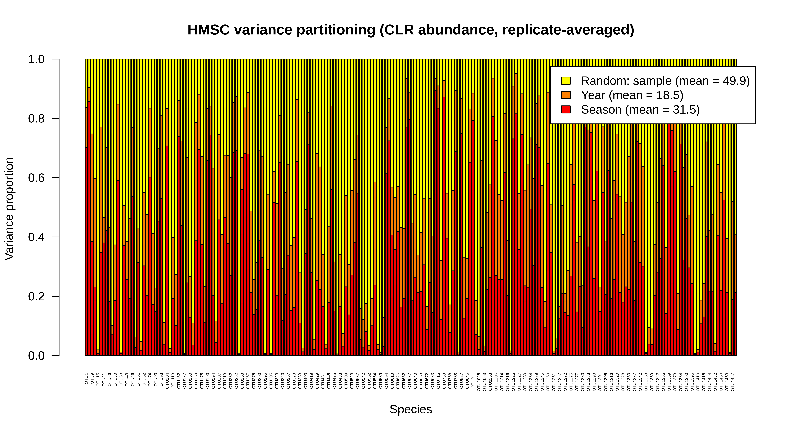

**Figure S-HMSCa**: Per-OTU variance partitioning (CLR abundance, headline model). Each vertical bar is one OTU; colours give the proportion of that OTU's explained variance attributable to Season, Year and the biological-sample random level. Individual-dropping heterogeneity is the single largest component.

```{r tab-hmsc-vp}
#| echo: false
library(knitr)
vp <- read.csv("tables/hmsc_variance_partition.csv", check.names = FALSE)
comp <- c("Season","Year","Random: sample")
cw  <- colMeans(vp[, comp])
byg <- aggregate(vp[, comp], list(Guild = vp$guild), mean)
tabb <- rbind(data.frame(Guild = "all OTUs (community mean)", t(cw), check.names = FALSE), byg)
tabb[, comp] <- round(tabb[, comp] * 100, 1)
pcr <- read.csv("tables/hmsc_pcr_replicate_variance.csv", stringsAsFactors = FALSE)
tabb$pcr <- round(100 * pcr$share_total_mean[match(sub("all OTUs \\(community mean\\)", "all", tabb$Guild), pcr$group)], 1)
kable(tabb, row.names = FALSE,
      col.names = c("Guild group", "Season %", "Year %", "Dropping %", "PCR replicate % (model-free)"),
      caption = "Table S-HMSCc. Mean percentage of per-OTU variance attributed to each component of the headline model, community-wide and by guild; the three model components sum to 100%. The last column is not part of that partition: it is the model-free share of each OTU's total CLR variance that lies between the two PCR replicates of a dropping (Table S-HMSCc2).")
```

```{r tab-hmsc-pcr}
#| echo: false
library(knitr)
pcr <- read.csv("tables/hmsc_pcr_replicate_variance.csv", stringsAsFactors = FALSE)
kable(data.frame(
  Group = pcr$group, `n OTUs` = pcr$n_otu,
  `Share of total variance, mean [95% CI]` = sprintf("%.2f [%.2f, %.2f]", pcr$share_total_mean,
                                                     pcr$boot_CrI2.5, pcr$boot_CrI97.5),
  `Median` = pcr$share_total_median,
  `Share after Season + Year` = pcr$share_resid_mean,
  `Mixed model (lme4)` = pcr$share_lme4_mean,
  `Detected in only one replicate` = pcr$discordance_mean,
  `Share when both replicates detect (median)` = pcr$share_both_median,
  check.names = FALSE),
  row.names = FALSE,
  caption = "Table S-HMSCc2. PCR-replicate variance, estimated outside the model from the 54 droppings with two replicates. For each OTU, replicate variance = mean(d²)/2, where d is the CLR difference between the two replicates; the share divides it by the OTU's total CLR variance and is averaged over OTUs (95% CI: 500 bootstrap resamples of droppings). Two cross-checks divide by the variance left after Season and Year, or take the residual share from a per-OTU mixed model with a dropping random intercept. 'Detected in only one replicate' is the fraction of droppings containing the OTU in which only one replicate detected it; the last column repeats the share using only droppings where both did. Per-OTU values: tables/hmsc_pcr_replicate_variance_perOTU.csv.")
```

```{r tab-hmsc-rep}
#| echo: false
library(knitr)
vc <- read.csv("tables/hmsc_rep_vp_by_chain.csv", check.names = FALSE)
vc[, -1] <- round(100 * vc[, -1], 1)
kable(vc, row.names = FALSE,
      col.names = c("Chain", "Season %", "Year %", "Dropping %", "PCR replicate %"),
      caption = "Table S-HMSCc3. Variance partition of the complementary replicate-level model (both PCR replicates as rows; dropping and PCR replicate as random levels), shown chain by chain.")
rv <- read.csv("tables/hmsc_rep_vs_main.csv")
kable(data.frame(
  `OTUs` = rv$n_otu, `Pearson r` = rv$pearson, `Spearman ρ` = rv$spearman,
  `CrI width, replicate-level / headline (median)` = rv$median_CrI_width_ratio_rep_over_main,
  `95% CrI excl. 0: headline / replicate-level / both` =
    sprintf("%d / %d / %d", rv$resolved95_main, rv$resolved95_rep, rv$resolved95_both),
  check.names = FALSE),
  row.names = FALSE,
  caption = "Table S-HMSCc4. Agreement between the headline and the replicate-level model on each OTU's Season coefficient (CLR units).")
```

<!-- CLAUDE DRAFT 2026-09-29: rewrite freely -->
The ecological reading is two-sided but coherent. The **seasonal axis is real and reproducible**, yet at the level of an individual OTU the largest single component is still *how much dung communities differ from one dropping to the next*. HMSC formalises what the ordination and dominance analyses already suggested: season shifts the community in a consistent direction, on top of large individual-level variability. This decomposition, broken down by guild exactly as in Table S-HMSCc, is Figure 3B of the main text (Section 10.3).

**PCR-replicate variance.** Because the headline model averages the two PCR replicates of each dropping, it has no PCR level to partition. The replicate-to-replicate variance is measured instead, outside the model, from the 54 droppings with two replicates (Table S-HMSCc2). Both replicates come from the same DNA extract, so any difference between them is measurement noise. For each OTU, half the mean squared difference between the two replicates' CLR values estimates the replicate variance; divided by the OTU's total CLR variance and averaged over OTUs, **replicate noise accounts for 32% of CLR variance** (bootstrap 95% CI 28–40%; median over OTUs 25%). The estimate does not depend on the method: dividing instead by the variance left after Season and Year gives 36%, and a per-OTU mixed model with a dropping random intercept gives 34% (per-OTU correlation with the former 0.998). Nor is it driven by unequal sequencing depth: the two replicates differ in depth by a median factor of 1.31, and the size of that difference does not predict how different the replicates look (Spearman ρ = 0.21, p = 0.13, n = 54). It is not spread evenly, however. Coprophilous dung saprotrophs are the most repeatable guild (17%, CI 11–25%) and pathotrophs the least (50%, CI 36–62%).

The replicate noise is almost entirely **detection**, not abundance. Where both replicates detect an OTU, their CLR values agree closely: replicate noise is then a median 3% of variance. But in 46% of the droppings in which an OTU is found, only one of the two replicates detects it — the signature of low-abundance taxa near the detection limit, where PCR and sequencing sampling decide whether a few reads appear. Coprophiles are detected in both replicates more consistently (only one replicate detects them in 32% of cases) and, when both detect them, differ by a median 1% of variance: where *Thelebolus* or *Sporormiella* is present, both replicates see it at similar levels. The complementary replicate-level model, which fits PCR replicate as a random level, gives a comparable picture: 27% of its explained variance at the PCR level, 43% at the dropping level, and a Season share of 17.5% (Table S-HMSCc3). Its Season share is lower than the headline model's because replicate noise, which the headline model averages away, enters its denominator.

### 9.3 Guild predicts seasonal occurrence — the coprophilous summer signature, formalised

The trait → environment matrix (Gamma) asks whether an OTU's guild predicts its seasonal response. Read from the well-converged probit model, it does. Relative to the winter reference, **dung saprotrophs are markedly more likely to occur in summer** (the reference-guild Season effect is positive with posterior support 0.96), and the yeast-rich "other" group shows the same direction (support 0.83); **pathotrophs lean the opposite way**, toward winter (support 0.85 in the negative direction). Plant-associated and dark/unassigned taxa show no clear guild-level seasonal preference.

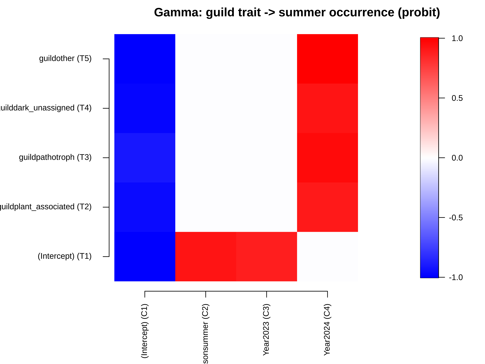

**Figure S-HMSCb**: Trait → environment link (Gamma) from the probit occurrence model. Cells show the posterior support for each guild's response to Season and Year; the dung-saprotroph summer signal and the guild-structured Year (2024) shift are the supported effects. Red = positive (summer / higher), blue = negative.

```{r tab-hmsc-gamma}
#| echo: false
library(knitr)
g <- read.csv("tables/hmsc_probit_gamma_CrI.csv", stringsAsFactors = FALSE)
g <- g[g$covariate == "Seasonsummer", ]
g$trait <- sub("^guild", "", g$trait)
g$trait[g$trait == "(Intercept)"] <- "dung saprotroph (reference)"
kable(data.frame(
  `Guild (trait)` = g$trait,
  `Gamma (summer)` = round(g$mean, 2),
  `95% CrI` = sprintf("[%.2f, %.2f]", g$CrI_2.5, g$CrI_97.5),
  `Support P(>0)` = round(g$support, 2),
  check.names = FALSE),
  row.names = FALSE,
  caption = "Table S-HMSCd. Probit Gamma — guild trait → probability of summer occurrence. The reference row is the dung-saprotroph guild's own Season effect; the other rows are deviations from it. Support is the posterior probability that the coefficient exceeds zero (values near 1 = summer, near 0 = winter).")
```

```{r tab-hmsc-gamma-clr}
#| echo: false
library(knitr)
g <- read.csv("tables/hmsc_gamma_CrI.csv", stringsAsFactors = FALSE)
g <- g[g$covariate == "Seasonsummer", ]
g$trait <- sub("^guild", "", g$trait)
g$trait[g$trait == "(Intercept)"] <- "dung saprotroph (reference)"
kable(data.frame(
  `Guild (trait)` = g$trait,
  `Gamma (summer)` = round(g$mean, 2),
  `95% CrI` = sprintf("[%.2f, %.2f]", g$CrI_2.5, g$CrI_97.5),
  `Support P(>0)` = round(g$support, 3),
  check.names = FALSE),
  row.names = FALSE,
  caption = "Table S-HMSCd2. Abundance Gamma — guild trait → Season effect on CLR abundance, from the headline model, on the standardised scale (each OTU's response scaled to unit variance before fitting). Read as for Table S-HMSCd.")
```

<!-- CLAUDE DRAFT 2026-09-29: rewrite freely -->
On the abundance scale the same link can now be read from the headline model, whose Gamma converges (Table S-HMSCb), and it is sharper (Table S-HMSCd2). The dung-saprotroph guild's own Season effect is positive (+0.31 in standardised units, 95% CrI \[0.07, 0.54\], support 0.994). Plant-associated, pathotroph and dark/unassigned OTUs all respond clearly less summer-ward than dung saprotrophs (differences −0.37, −0.52 and −0.46; support ≤ 0.004), while the "other" group does not differ clearly from them (−0.16, support 0.12).

This is the guild-level counterpart to the taxonomic and dominance results (Sections 3.2, 5.4): the recognised coprophilous fungi — *Sporormiella*, *Thelebolus*, *Coniochaeta* — are not a fixed cold-adapted core but a **summer-occurring dung guild**, consistent with the richer, more fungal-propagule-laden summer diet. HMSC states that pattern as a trait effect estimated across all 226 OTUs at once, rather than genus by genus.

### 9.4 Per-OTU seasonal niches, and agreement with the GLLVM

Extracting each OTU's Season coefficient (Beta) from the headline CLR model recovers the same lineages at the individual level. The **three most strongly summer-shifted OTUs are the coprophilous dung saprotrophs** *Thelebolus* (OTU1), *Sporormiella* (OTU636) and *Coniochaeta* (OTU1225), each with a 95% credible interval well clear of zero — while the **most strongly winter-shifted OTUs are dark/unassigned taxa**, led by OTU1369, the same taxonomically unresolved Dothideomycete that anchors winter dominance in Sections 5.4 and the E1 dark-taxa analysis (Section 3.4).

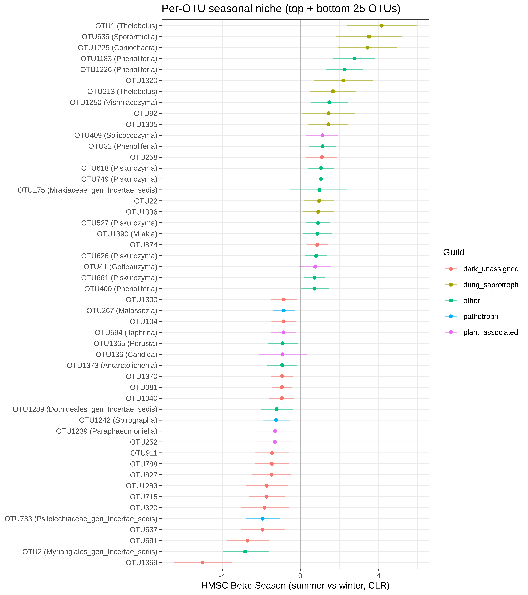

**Figure S-HMSCc**: Per-OTU seasonal niche (HMSC CLR Beta on Season; positive = summer), for the 25 most summer- and 25 most winter-shifted OTUs, coloured by guild, with 95% credible intervals. The summer extreme is dominated by dung saprotrophs (warm) and yeasts; the winter extreme by dark/unassigned taxa. This is the same model and the same quantity as Figure 3A of the main text (Section 10.3), but selected differently and deliberately kept alongside it: here all 226 OTUs are ranked by effect size, so the panel shows the community's extremes regardless of how rare they are, whereas Figure 3A restricts to the 22 OTUs holding at least 1% of modelled read share each and adds a guild-mean block. Rare OTUs with large coefficients therefore appear here and not there.

```{r tab-hmsc-beta}
#| echo: false
suppressMessages(library(dplyr)); library(knitr)
b <- read.csv("tables/hmsc_beta_season.csv", stringsAsFactors = FALSE)
fmt <- function(d) d %>% transmute(
  OTU = OTU_ID, Genus = ifelse(is.na(Genus), "—", Genus), Guild = guild,
  Beta = round(beta_season_mean, 2),
  `95% CrI` = sprintf("[%.2f, %.2f]", beta_season_CrI2.5, beta_season_CrI97.5),
  Support = round(beta_season_support, 2))
kable(b %>% arrange(desc(beta_season_mean)) %>% slice_head(n = 6) %>% fmt(), row.names = FALSE,
      caption = "Table S-HMSCe(i). Most strongly summer-shifted OTUs (HMSC CLR Beta on Season).")
kable(b %>% arrange(beta_season_mean) %>% slice_head(n = 6) %>% fmt(), row.names = FALSE,
      caption = "Table S-HMSCe(ii). Most strongly winter-shifted OTUs. Beta is in CLR units (the model's standardised coefficient multiplied by the OTU's CLR standard deviation). Full table: tables/hmsc_beta_season.csv.")
```

<!-- CLAUDE DRAFT 2026-09-29 (numbers updated to the revised model): rewrite freely -->
The same per-OTU niche can be estimated on the **occurrence** scale, with the probit model. There, 55 of the 226 OTUs have a Season coefficient whose 95% credible interval excludes zero, against 74 in the headline abundance model. The two formulations rank the community's seasonal responses consistently (Spearman ρ = 0.76), and the probit per-OTU estimates aggregate to the guild-level Gamma of Section 9.3 to within 0.04, so nothing here contradicts the results above. What the occurrence scale does change is *which* taxa sit at the summer extreme. In abundance the coprophiles lead outright; in occurrence the shift is community-wide (157 of 226 OTUs point towards summer, median +0.70) and the extreme is occupied by cold-adapted basidiomycete yeasts — *Vishniacozyma*, *Mrakia*, *Piskurozyma*, *Phenoliferia* — with *Sporormiella* (OTU636) the only dung saprotroph in the top 25 and the mean dung-saprotroph rank falling to 125 of 226 (from 59 in abundance). The distinction is ecologically substantive rather than a modelling artefact: coprophilous fungi are what summer dung is largely *made of* in read share, but they are not the taxa that most reliably *appear* in summer. The winter extreme is unchanged and, if anything, more strongly resolved — dark/unassigned taxa and pathotrophs, with OTU1369 the most winter-shifted OTU in the community (β = −2.25, 95% CrI \[−3.53, −1.08\]). Both scales are carried forward, but they are not given equal weight in the main text. Figure 3 in Section 10.3 is built entirely on the abundance formulation — the scale on which the coprophilous shift is the community's largest seasonal effect, and the scale that Figures 1 and 2 also work on — while the occurrence-scale result reported here stays supplementary, alongside Tables S-HMSCe(iii) and S-HMSCe(iv). The abundance-scale table above also remains the one comparable with the GLLVM below.

```{r tab-hmsc-beta-probit}
#| echo: false
suppressMessages(library(dplyr)); library(knitr)
bp <- read.csv("tables/hmsc_probit_beta_season.csv", stringsAsFactors = FALSE)
fmtp <- function(d) d %>% transmute(
  OTU = OTU_ID, Genus = ifelse(is.na(Genus), "—", Genus), Guild = guild,
  Beta = round(beta_season_mean, 2),
  `95% CrI` = sprintf("[%.2f, %.2f]", beta_season_CrI2.5, beta_season_CrI97.5),
  Support = round(beta_season_support, 3))
kable(bp %>% arrange(desc(beta_season_mean)) %>% slice_head(n = 6) %>% fmtp(), row.names = FALSE,
      caption = "Table S-HMSCe(iii). Most strongly summer- and winter-shifted OTUs on the occurrence scale (HMSC probit Beta on Season; positive = more likely to occur in summer). 55 of 226 OTUs have a 95% credible interval excluding zero. Full table: tables/hmsc_probit_beta_season.csv.")
kable(bp %>% arrange(beta_season_mean) %>% slice_head(n = 6) %>% fmtp(), row.names = FALSE,
      caption = "Table S-HMSCe(iv). Most strongly winter-shifted OTUs, occurrence scale. Support is the posterior probability that the coefficient exceeds zero.")
```

Because the GLLVM (Section 6) is an independent model — negative-binomial counts rather than CLR abundance, a different random-effect structure, and fitted on a different OTU snapshot — the two provide a genuine cross-method check. Their per-OTU Season coefficients agree well.

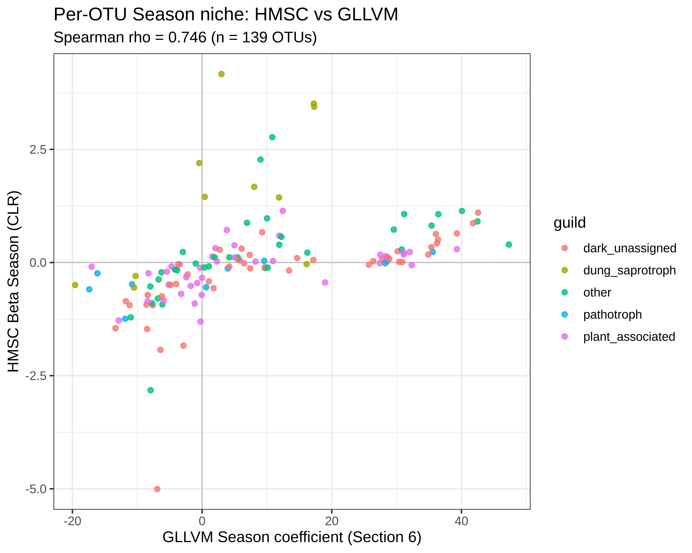

**Figure S-HMSCd**: HMSC (CLR Beta) versus GLLVM Season coefficient, one point per shared OTU (n = 139 after excluding the GLLVM's on/off near-separation OTUs, whose ±10³ coefficients are not comparable), coloured by guild. The two independent joint models rank the OTUs' seasonal responses consistently (**Spearman ρ = 0.75**), a strong convergent-validity result for H1 at OTU resolution.

### 9.5 Residual co-occurrence beyond Season

The biological-sample latent factors capture the co-occurrence structure that remains once Season, Year and guild are accounted for — pairs of OTUs that rise and fall together across droppings for reasons the fixed effects do not explain.


**Figure S-HMSCe**: Residual OTU–OTU association matrix (biological-sample level), showing only associations supported at ≥ 0.95 posterior probability and restricted to OTUs with at least one such association, ordered by hierarchical clustering. Red = positive residual co-occurrence, blue = negative. Blocks of positively associated OTUs indicate sub-communities that track together beyond the seasonal signal — candidate co-dispersed or co-sourced groups for follow-up.

### 9.6 Phylogenetic signal in seasonal niches

::: callout-warning
**Not yet re-run on the revised model (2026-09-29).** The phylogenetic variant below was fitted on the superseded, non-converged CLR structure (Section 9.1). Its ρ and the correlations with the main model in Table S-HMSCf refer to that structure. Re-fitting it on the headline model is pending a decision (`HMSC_RUN_PHYLO=1` in `Scripts/10_hmsc.R`).
:::

Adding the OTU phylogeny to the CLR model estimates rho, the degree to which closely related fungi share environmental niches. The signal is substantial and well-identified.

```{r tab-hmsc-rho}
#| echo: false
library(knitr)
rh <- read.csv("tables/hmsc_rho_phylo.csv", stringsAsFactors = FALSE)
kable(data.frame(
  `ρ (median)` = round(rh$median, 2),
  `95% CrI` = sprintf("[%.2f, %.2f]", rh$CrI_2.5, rh$CrI_97.5),
  `P(ρ>0)` = rh$P_gt0, ESS = rh$ess, PSRF = round(rh$psrf, 2),
  check.names = FALSE),
  row.names = FALSE,
  caption = "Table S-HMSCf. Phylogenetic signal parameter ρ from the phylogeny-augmented CLR model. Adding the phylogeny leaves the per-OTU niches and trait link essentially unchanged (Beta / Gamma correlation with the main model ≈ 0.94 / 0.90), so ρ is a genuine additional signal rather than a re-description of the fixed effects.")
```

With **ρ ≈ 0.72 (95% CrI \[0.60, 0.80\], P(ρ \> 0) = 1)**, seasonal niches are **phylogenetically conserved**: related lineages tend to shift together between winter and summer. This dovetails with the guild result — because guild is itself partly phylogenetically structured, the coprophilous summer signature is echoed as a broader phylogenetic pattern. It is reported as a secondary, exploratory result (the phylogeny-augmented model is a supplementary variant), but it is a clean, non-trivial one.

### 9.7 What the model predicts — and its honest limit

Finally, HMSC quantifies how much of the community it actually explains, in-sample versus out-of-sample (two-fold cross-validation, with folds split by biological sample so PCR replicates never leak across folds).

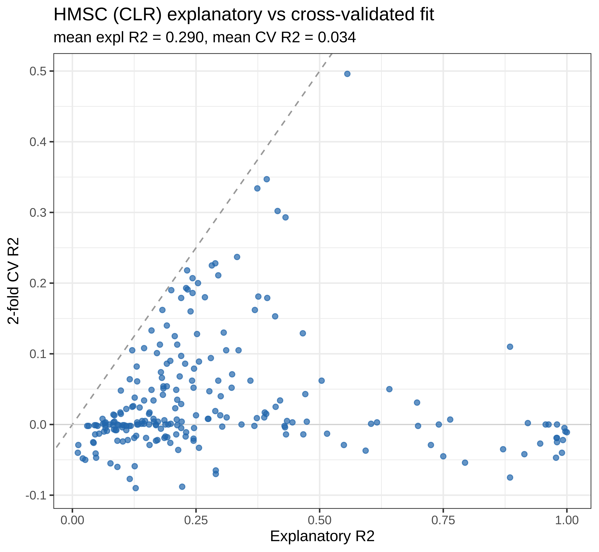

**Figure S-HMSCf**: Explanatory (in-sample) versus two-fold cross-validated per-OTU R² for the CLR model. Points lie far below the 1:1 line: the model fits the observed communities well but does not predict held-out droppings.

```{r tab-hmsc-r2}
#| echo: false
library(knitr)
r2 <- read.csv("tables/hmsc_predictive_R2_summary.csv", stringsAsFactors = FALSE)
lab <- c(clr = "CLR (abundance)", pa = "Probit (occurrence)")
kable(data.frame(
  Model = lab[r2$model],
  `Explanatory R²` = round(r2$mean_expl_R2, 3),
  `2-fold CV R²` = ifelse(is.na(r2$mean_cv_R2), "—", round(r2$mean_cv_R2, 3)),
  check.names = FALSE),
  row.names = FALSE,
  caption = "Table S-HMSCg. Community-mean explanatory vs cross-validated fit. Explanatory R² is moderate; cross-validated R² is near zero.")
```

The explanatory fit is moderate (community-mean R² ≈ 0.29 for the headline abundance model) but **cross-validated R² is near zero** (≈ 0.03) — the model does not predict the fungal community of a dropping it has not seen. Far from undercutting the story, this is the quantitative statement of it: the seasonal and guild effects documented above are **real and directional but small against the dominant, idiosyncratic variation among individual droppings**. A ptarmigan's dung mycobiome is shaped by season in a reproducible way, yet remains largely individual — which is exactly what a transient, diet- and propagule-sourced community should look like, and a useful caution for anyone hoping to read season directly off a single sample.

**In summary**, HMSC does not overturn any earlier result; it unifies them and adds two things the single-lens analyses could not: a variance decomposition that sizes the seasonal signal against individual heterogeneity, and a formal trait- and phylogeny-level account of *why* the seasonal turnover looks the way it does — a summer-occurring coprophilous dung guild, phylogenetically conserved, riding on top of large among-individual variability.

::: {.content-visible when-profile="docs"}
#### Documentation notes — Section 9 {.unnumbered}

*Documentation build only; omitted from the submitted appendix. Move any paragraph, callout or table here that belongs in the full record rather than in the supplement.*
:::

## Section 10: Main-text figures {.page-break-before}

::: {.content-visible when-profile="docs"}
Sections 2–9 document the analyses in full. This section collects the figures that appear in the **main manuscript**, which present a deliberately reduced selection of those results for a general readership. It exists so that every main-text figure has exactly one authoritative definition.

**How this section works.**

-   Each main figure appears **once**, embedded from `figures/main/`, with its **full build code in the collapsible drop-down** beneath it (HTML version).
-   Every figure is written in three formats to the same stem: **`.png` and `.jpg` at 600 dpi** (raster, for whichever a submission system demands) and **`.pdf`** (vector, for print). The appendix embeds the PNG.
-   That code chunk **is the source of truth** for the figure. There is no parallel copy in `Scripts/`; nothing else generates these files.
-   The chunks are `eval: false`, so rendering this appendix never rebuilds a figure. To rebuild one after editing its chunk, run the runner from the `Supplementary/` directory:

``` bash
conda run -n r_env Rscript build_main_figure.R fig1-build
```

-   Each figure carries a one-line **provenance cross-reference** naming the thematic sections its inputs come from.
-   The thematic sections keep their own supplementary version of a plot only where it is genuinely different (a different object, more ranks, unfiltered); where it would be the same object, they cross-reference here instead.

**File-naming rule.** Supplementary figure files begin with `S`; main-text figure files are `Fig<N>_<slug>` and live in `figures/main/`. (One legacy exception is pending: `figures/Fig1_guild_season.png` is the *supplementary* Figure S-GUILDa of Section 8 and is scheduled for renaming.)
:::

### 10.1 Figure 1 — Composition and function of the dung mycobiome

:::: {.content-visible when-profile="docs"}
*Provenance: Fig. 1A uses the genus-level composition of Section 3.1; Fig. 1B–C the guild assignments of Section 8.2. All three panels are computed on the canonical 52-sample object (`alldat$nopool`), and A and B share one sample axis.*
::::

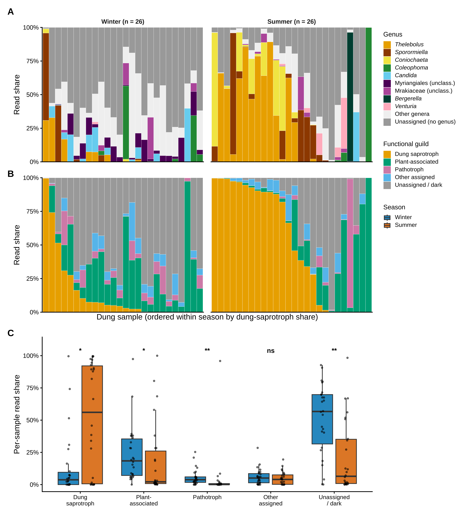

**Figure 1**: Composition and function of the willow ptarmigan dung mycobiome across seasons. **(A)** Per-sample genus-level read share — the nine most abundant genera, all remaining named genera pooled as *Other genera*, and reads on OTUs with no confident genus assignment as *Unassigned*. **(B)** Per-sample functional-guild read share for the **same 52 samples in the same order**, so each column is the same dropping in both panels; samples are ordered within each season by descending dung-saprotroph share. **(C)** Per-sample guild read share by season; boxes show the median and interquartile range, points are individual samples, and marks give the Benjamini–Hochberg-adjusted Wilcoxon rank-sum result across the five guilds (\* q \< 0.05, \*\* q \< 0.01, ns = not significant). *Thelebolus* in (A) and the dung-saprotroph guild in (B) intentionally share one colour — *Thelebolus* is that guild's dominant member — as do the two grey "no assignment" bands.

Read down a column and the two descriptions line up: the summer samples that are almost entirely dung saprotrophs in (B) are the samples dominated end-to-end by *Thelebolus*, *Sporormiella* and *Coniochaeta* in (A), while winter samples are a patchwork of many low-abundance genera sitting under a large unassigned fraction. The seasonal contrast is therefore the same result seen taxonomically and functionally: dung saprotrophs rise from 13.6% of winter reads to 51.5% in summer, and the unassigned fraction falls from 51.1% to 21.0% (panel C; Section 8.2). Panel A also makes the interpretive limit visible — roughly half of a typical winter sample is reads that carry no genus at all, which is the subject of the dark-taxa analysis in Section 3.4.

```{r fig1-build}
#| eval: false
#| echo: !expr knitr::is_html_output()
#| code-fold: true
#| code-summary: "Full build code for Figure 1 — the source of truth for figures/main/Fig1_composition_function.{png,pdf}"

# Figure 1 -- Composition and function of the dung mycobiome.
# Canonical object alldat$nopool (52 samples). Panels A and B share one sample
# axis; panel C tests the guild shares behind panel B.
# Rebuild:  conda run -n r_env Rscript build_main_figure.R fig1-build

suppressPackageStartupMessages({
  library(phyloseq); library(ggplot2); library(patchwork)
})

rdata <- if (file.exists("eco_analysis.RData")) "eco_analysis.RData" else
         "/home/daniel/Ptarmigan/trimmed/mergedPlates/eco_analysis.RData"
load(rdata)
stopifnot(exists("alldat"), exists("funguild_otu"))   # funguild_otu <- 8_functional_guilds.R

out_dir <- "figures/main"
dir.create(out_dir, showWarnings = FALSE, recursive = TRUE)
grDevices::pdf(NULL)                                  # headless: no X11 fallback

# ---- data ------------------------------------------------------------------
ps  <- alldat$nopool                                  # 52 samples, PCR reps summed
m   <- as(otu_table(ps), "matrix"); if (taxa_are_rows(ps)) m <- t(m)   # samples x taxa
rel <- m / rowSums(m)
stopifnot(all(abs(rowSums(rel) - 1) < 1e-10))

md     <- data.frame(as(sample_data(ps), "data.frame"), stringsAsFactors = FALSE)
Season <- factor(c(winter = "Winter", summer = "Summer")[md$Season],
                 levels = c("Winter", "Summer"))
stopifnot(!anyNA(Season), identical(rownames(rel), rownames(m)))

strip_rank <- function(x) sub("^[a-z]__", "", x)      # "g__Sporormiella" -> "Sporormiella"
tax <- data.frame(as(tax_table(ps), "matrix"), stringsAsFactors = FALSE)
gen <- strip_rank(tax$Genus[match(colnames(m), rownames(tax))])
gen <- ifelse(gen %in% c("", "NA"), NA, gen)

# ---- panel A categories: top genera + Other + Unassigned -------------------
N_GENERA  <- 9                                        # see the palette note below
by_genus  <- t(rowsum(t(rel), group = ifelse(is.na(gen), ".unassigned", gen)))
named     <- setdiff(colnames(by_genus), ".unassigned")
top       <- names(sort(colMeans(by_genus[, named, drop = FALSE]),
                        decreasing = TRUE))[seq_len(N_GENERA)]
tidy_gen  <- function(x) sub("_gen_Incertae_sedis", " (unclass.)", x)

GEN_LEVELS <- c(tidy_gen(top), "Other genera", "Unassigned (no genus)")
gen_cat    <- ifelse(is.na(gen), "Unassigned (no genus)",
              ifelse(gen %in% top, tidy_gen(gen), "Other genera"))
gen_share  <- t(rowsum(t(rel), group = gen_cat))[, GEN_LEVELS, drop = FALSE]
stopifnot(all(abs(rowSums(gen_share) - 1) < 1e-10))

# ---- panel B categories: FUNGuild guilds -----------------------------------
# Rule verbatim from 8_functional_guilds.R (itself from 10_hmsc.R), so Figure 1,
# appendix Section 8 and Section 9 classify OTUs identically.
COPRO_GENERA <- c("Sordaria","Podospora","Cercophora","Chaetomium","Schizothecium",
                  "Preussia","Delitschia","Pilobolus","Ascobolus","Saccobolus",
                  "Sporormiella","Coprinopsis","Thelebolus","Coniochaeta")
guild_str <- funguild_otu$Guild[match(colnames(m), funguild_otu$OTU_ID)]
is_copro  <- (!is.na(guild_str) & grepl("Dung Saprotroph", guild_str)) |
             (!is.na(gen)       & gen %in% COPRO_GENERA)
is_plant  <- !is_copro & !is.na(guild_str) &
             grepl("Endophyte|Plant Saprotroph|Plant Pathogen|Epiphyte", guild_str)
is_patho  <- !is_copro & !is_plant & !is.na(guild_str) & grepl("Pathogen|Parasite", guild_str)

GUILD_LEVELS <- c("Dung saprotroph", "Plant-associated", "Pathotroph",
                  "Other assigned", "Unassigned / dark")
guild_cat <- ifelse(is_copro, "Dung saprotroph",
             ifelse(is_plant, "Plant-associated",
             ifelse(is_patho, "Pathotroph",
             ifelse(!is.na(guild_str), "Other assigned", "Unassigned / dark"))))
guild_share <- t(rowsum(t(rel), group = guild_cat))[, GUILD_LEVELS, drop = FALSE]
stopifnot(all(abs(rowSums(guild_share) - 1) < 1e-10))

# ---- shared sample order: descending dung-saprotroph share within season ----
ord <- rownames(rel)[order(Season, -guild_share[, "Dung saprotroph"])]

to_long <- function(mat, levels) data.frame(
  SampleID = factor(rep(rownames(mat), times = ncol(mat)), levels = ord),
  Season   = rep(Season, times = ncol(mat)),
  Category = factor(rep(colnames(mat), each = nrow(mat)), levels = levels),
  share    = as.vector(mat), stringsAsFactors = FALSE)
genL <- to_long(gen_share, GEN_LEVELS); guiL <- to_long(guild_share, GUILD_LEVELS)
stopifnot(identical(levels(genL$SampleID), levels(guiL$SampleID)))

# ---- palettes --------------------------------------------------------------
# Guilds and Season keep the repo's Okabe-Ito assignments (8_functional_guilds.R).
# The genus scale is a separate colourblind-checked set, validated on ALL pairs
# (worst CVD dE 7.4, worst normal-vision dE 15.6) -- which is why nine genera and
# not more: a tenth hue pushes the normal-vision floor below the readable
# threshold. The thin white segment borders supply the secondary encoding that a
# CVD dE in the 6-8 band requires. Thelebolus deliberately reuses the
# dung-saprotroph orange -- it IS panel B's dominant dung saprotroph -- and grey
# #999999 likewise carries "no assignment" in both panels.
genus_cols <- setNames(
  c("#E69F00", "#8C3800", "#F0E442", "#228833", "#66CCEE",
    "#4B0055", "#AA4499", "#003D30", "#FFAABB", "#EEEEEE", "#999999"), GEN_LEVELS)
guild_cols <- c("Dung saprotroph" = "#E69F00", "Plant-associated" = "#009E73",
                "Pathotroph" = "#CC79A7", "Other assigned" = "#56B4E9",
                "Unassigned / dark" = "#999999")
season_cols <- c(Winter = "#0072B2", Summer = "#D55E00")

italicise <- function(x) ifelse(grepl("unclass\\.|^Other |^Unassigned", x), x,
                                paste0("*", x, "*"))
base_theme <- theme_classic(base_size = 12) +
  theme(strip.background = element_blank(),
        strip.text       = element_text(face = "bold"),
        plot.tag         = element_text(face = "bold", size = 14),
        panel.spacing    = unit(0.8, "lines"),
        legend.key.size  = unit(0.42, "cm"),
        legend.title     = element_text(size = 10),
        legend.text      = ggtext::element_markdown(size = 9))
n_lab <- setNames(paste0(levels(Season), " (n = ", table(Season), ")"), levels(Season))

stacked <- function(dat, cols, title, labels = names(cols)) {
  ggplot(dat, aes(SampleID, share, fill = Category)) +
    geom_col(width = 1, colour = "white", linewidth = 0.12,
             position = position_stack(reverse = TRUE)) +
    facet_grid(~ Season, scales = "free_x", space = "free_x",
               labeller = labeller(Season = n_lab)) +
    scale_fill_manual(values = cols, labels = labels, name = title) +
    scale_y_continuous(labels = scales::percent, expand = c(0, 0)) +
    base_theme +
    theme(axis.text.x = element_blank(), axis.ticks.x = element_blank())
}

# ---- panels A and B --------------------------------------------------------
pA <- stacked(genL, genus_cols, "Genus", italicise(GEN_LEVELS)) +
  labs(x = NULL, y = "Read share") +
  guides(fill = guide_legend(ncol = 1, order = 1))
# B repeats A's sample axis exactly, so its facet strips are dropped as redundant.
pB <- stacked(guiL, guild_cols, "Functional guild") +
  labs(x = "Dung sample (ordered within season by dung-saprotroph share)",
       y = "Read share") +
  guides(fill = guide_legend(ncol = 1, order = 2)) +
  theme(strip.text = element_blank())

# ---- panel C: guild read share by season, BH-adjusted Wilcoxon -------------
season_stats <- do.call(rbind, lapply(GUILD_LEVELS, function(g) {
  wt <- suppressWarnings(wilcox.test(guild_share[Season == "Summer", g],
                                     guild_share[Season == "Winter", g]))
  data.frame(Guild = g, p_value = wt$p.value, stringsAsFactors = FALSE)
}))
season_stats$q_value <- p.adjust(season_stats$p_value, method = "BH")
sig_lab <- function(q) ifelse(q < 0.001, "***", ifelse(q < 0.01, "**",
                       ifelse(q < 0.05, "*", "ns")))
ann <- data.frame(Category = factor(GUILD_LEVELS, levels = GUILD_LEVELS),
                  y = 1.04, lab = sig_lab(season_stats$q_value))
wrap_lab <- setNames(c("Dung\nsaprotroph", "Plant-\nassociated", "Pathotroph",
                       "Other\nassigned", "Unassigned\n/ dark"), GUILD_LEVELS)

pC <- ggplot(guiL, aes(Category, share, fill = Season)) +
  geom_boxplot(outlier.shape = NA, width = 0.65, alpha = 0.85,
               position = position_dodge(width = 0.75)) +
  geom_point(position = position_jitterdodge(jitter.width = 0.12, dodge.width = 0.75,
                                             seed = 1),
             size = 0.9, alpha = 0.5, show.legend = FALSE) +
  geom_text(data = ann, aes(Category, y, label = lab), inherit.aes = FALSE,
            size = 3.6, fontface = "bold") +
  scale_fill_manual(values = season_cols, name = "Season") +
  scale_x_discrete(labels = wrap_lab) +
  scale_y_continuous(labels = scales::percent, limits = c(0, 1.09),
                     breaks = seq(0, 1, 0.25)) +
  labs(x = NULL, y = "Per-sample read share") +
  base_theme +
  theme(axis.text.x = element_text(size = 9)) +
  guides(fill = guide_legend(ncol = 1, order = 3))

# ---- assemble and write ----------------------------------------------------
fig1 <- (pA / pB / pC) +
  plot_layout(heights = c(1, 1, 1.15), guides = "collect") +
  plot_annotation(tag_levels = "A") &
  theme(legend.position = "right", legend.justification = "top")

# Every main figure is written three ways: PNG and JPG (600 dpi raster, for
# submission systems that demand one or the other) and PDF (vector, for print).
save_fig <- function(stem, obj, width, height, res = 600) {
  one <- function(open_dev) { open_dev(); on.exit(grDevices::dev.off()); print(obj) }
  one(function() grDevices::png(paste0(stem, ".png"), width = width, height = height,
                                units = "in", res = res))
  one(function() grDevices::jpeg(paste0(stem, ".jpg"), width = width, height = height,
                                 units = "in", res = res, quality = 95))
  pdf_dev <- if (capabilities("cairo")) grDevices::cairo_pdf else grDevices::pdf
  one(function() pdf_dev(paste0(stem, ".pdf"), width = width, height = height))
}
save_fig(file.path(out_dir, "Fig1_composition_function"), fig1, 10, 11)

cat(sprintf("Top %d genera (mean per-sample read share, %%):\n", N_GENERA))
print(round(100 * colMeans(gen_share), 2))
cat("\nGuild read share by season (mean %) and BH q:\n")
print(data.frame(Guild  = GUILD_LEVELS,
                 summer = round(100 * colMeans(guild_share[Season == "Summer", ]), 1),
                 winter = round(100 * colMeans(guild_share[Season == "Winter", ]), 1),
                 q      = signif(season_stats$q_value, 3)), row.names = FALSE)
```

### 10.2 Figure 2 — Seasonal turnover and its year-to-year variation (H1)

:::: {.content-visible when-profile="docs"}
*Provenance: Fig. 2A is the ordination of Section 4.1; Fig. 2B the distance-to-Season-centroid model of Section 4.3. Test statistics are read from the committed `tables/report_permanova.csv` and `tables/report_centroid_lm.csv`, so the figure cannot drift from Section 4.*
::::

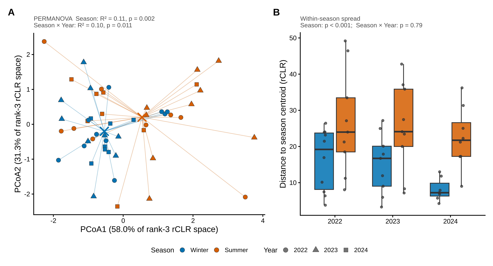

**Figure 2**: Winter and summer dung mycobiomes differ in composition, and the size of that difference varies among years. **(A)** Unconstrained principal coordinates analysis of robust Aitchison distances among the 52 canonical samples, coloured by season and shaped by year. Thin lines join each sample to its season centroid (×). The axis percentages are shares of the rank-3 reconstruction from which `vegan` computes robust Aitchison distances, not of the full community variation, and the axis titles name that denominator accordingly; under a full-rank Aitchison distance (CLR after a pseudocount) the same two axes take **13.7% and 9.5%**, which is the closer approximation to the variance actually explained (Appendix Section 4.1). **(B)** Distance of each sample to its own season centroid in robust-CLR space, split by season and year; boxes show the median and interquartile range and points are individual samples. Subtitles give the PERMANOVA terms (A) and the ANOVA terms of the `distance ~ Season × Year` model of within-season spread (B).

Winter and summer communities separate along the first ordination axis: Season explains 11% of compositional variance (PERMANOVA p = 0.002; Table S5). The seasonal contrast is not, however, demonstrably of constant size — the Season × Year interaction is significant (R² = 0.10, p = 0.011), as it is under three of the four alternative distances, though only marginal under the zeros-retained robust CLR (p = 0.061; Table S7b). The per-year tests make the shift much the largest in 2023 (R² = 0.14–0.24, p ≤ 0.009 under every distance), with smaller contrasts in 2024 (R² = 0.09–0.14) and 2022 (R² = 0.07–0.10), each significant under three of the five distances (Tables S5b, S7c). What survives every distance measure is the *ordering* of the three years rather than the size of the gap between them: under the rank-3 robust Aitchison distance of panel A the 2022 contrast alone collapses to R² = 0.02 (p = 0.789), an artefact of the truncated distance rather than a year without a seasonal shift (Section 4.2, caveat iii). Panel B shows that this is a difference in *where* the seasons sit rather than in how tightly each clusters: summer samples are consistently further from their own centroid than winter samples in every year (Season p \< 0.001), with no Season × Year interaction in that spread (p = 0.79). Two caveats belong with this figure and are treated in Section 4.2: summer samples are significantly more dispersed than winter ones, so part of the PERMANOVA R² reflects spread rather than location alone (Anderson 2001), and the axis percentages are shares of a rank-3 completion of the robust CLR matrix — panel A plots two of only three available dimensions, which is why its axis titles name that space rather than reporting a bare percentage (Section 4.1).

```{r fig2-build}
#| eval: false
#| echo: !expr knitr::is_html_output()
#| code-fold: true
#| code-summary: "Full build code for Figure 2 — the source of truth for figures/main/Fig2_seasonal_turnover.{png,jpg,pdf}"

# Figure 2 -- Seasonal turnover and its year-to-year variation (H1).
# Both panels reuse the Section 4 analysis verbatim (its build chunk in §4):
# panel A the unconstrained robust-Aitchison PCoA, panel B the distance-to-
# Season-centroid in rCLR space. Test statistics are READ from the committed
# tables/ CSVs so the figure and Section 4 can never drift apart.
# Rebuild:  conda run -n r_env Rscript build_main_figure.R fig2-build

suppressPackageStartupMessages({
  library(phyloseq); library(vegan); library(ggplot2); library(patchwork)
})

rdata <- if (file.exists("eco_analysis.RData")) "eco_analysis.RData" else
         "/home/daniel/Ptarmigan/trimmed/mergedPlates/eco_analysis.RData"
load(rdata)
tab_dir <- if (dir.exists("tables")) "tables" else
           "/home/daniel/Ptarmigan/Scripts_server/Supplementary/tables"
out_dir <- "figures/main"
dir.create(out_dir, showWarnings = FALSE, recursive = TRUE)
grDevices::pdf(NULL)                                  # headless: no X11 fallback

season_cols <- c(Winter = "#0072B2", Summer = "#D55E00")   # repo standard
# Fillable shapes (21/24/22, not 16/17/15) so BOTH panels map Season to `fill`
# and the two panels can share one Season key.
year_shapes <- c(`2022` = 21, `2023` = 24, `2024` = 22)
base_theme  <- theme_classic(base_size = 12) +
  theme(plot.tag        = element_text(face = "bold", size = 14),
        plot.subtitle   = element_text(size = 9, colour = "grey30"),
        legend.key.size = unit(0.42, "cm"),
        legend.title    = element_text(size = 10),
        legend.text     = element_text(size = 9))

# ---- data ------------------------------------------------------------------
ps      <- alldat$nopool                              # canonical, 52 samples
otu_mat <- as(otu_table(ps), "matrix"); if (taxa_are_rows(ps)) otu_mat <- t(otu_mat)
meta    <- data.frame(sample_data(ps), stringsAsFactors = FALSE, check.names = FALSE)
stopifnot(identical(rownames(otu_mat), rownames(meta)))
Season  <- factor(c(winter = "Winter", summer = "Summer")[meta$Season],
                  levels = c("Winter", "Summer"))
Year    <- factor(meta$Year)
stopifnot(!anyNA(Season), !anyNA(Year))

# ---- panel A: unconstrained PCoA on robust Aitchison distances -------------
d_ait <- vegdist(otu_mat, method = "robust.aitchison")
attr(d_ait, "Labels") <- rownames(otu_mat)   # vegdist drops Labels for robust.aitchison
ord   <- capscale(d_ait ~ 1)
# Defensive only: this distance yields exactly 3 positive eigenvalues and no
# negative ones, because vegan's rclr completes the matrix at rank 3 (Section 4.1).
eig   <- pmax(ord$CA$eig, 0)
ax1p  <- round(100 * eig[1] / sum(eig), 1); ax2p <- round(100 * eig[2] / sum(eig), 1)

sc <- as.data.frame(scores(ord, display = "sites", choices = 1:2, scaling = 1))
colnames(sc)[1:2] <- c("Axis1", "Axis2")
sc$Season <- Season[match(rownames(sc), rownames(meta))]
sc$Year   <- Year[match(rownames(sc), rownames(meta))]
cent <- aggregate(cbind(Axis1, Axis2) ~ Season, data = sc, FUN = mean)
names(cent) <- c("Season", "cX", "cY")
sc <- merge(sc, cent, by = "Season")

perm <- read.csv(file.path(tab_dir, "report_permanova.csv"), check.names = FALSE)
pr   <- perm[perm$term == "Season", ]
pi   <- perm[perm$term == "Season:Year", ]
by_y <- read.csv(file.path(tab_dir, "report_permanova_by_year.csv"), check.names = FALSE)

pA <- ggplot(sc, aes(Axis1, Axis2)) +
  geom_segment(aes(xend = cX, yend = cY, colour = Season),
               alpha = 0.4, linewidth = 0.3, show.legend = FALSE) +
  geom_point(aes(fill = Season, shape = Year), size = 2.8,
             colour = "grey25", stroke = 0.3) +
  geom_point(data = cent, aes(cX, cY, colour = Season), inherit.aes = FALSE,
             size = 4.5, shape = 4, stroke = 1.4, show.legend = FALSE) +
  scale_fill_manual(values = season_cols) +
  scale_colour_manual(values = season_cols, guide = "none") +
  scale_shape_manual(values = year_shapes) +
  coord_equal() +
  # See Section 4.1: these are shares of the rank-3 rCLR reconstruction, so the
  # denominator is named in the axis title rather than left to the caption.
  labs(x = sprintf("PCoA1 (%.1f%% of rank-3 rCLR space)", ax1p),
       y = sprintf("PCoA2 (%.1f%% of rank-3 rCLR space)", ax2p),
       subtitle = sprintf("PERMANOVA  Season: R² = %.2f, p = %.3f\nSeason × Year: R² = %.2f, p = %.3f",
                          pr$R2, pr$`Pr(>F)`, pi$R2, pi$`Pr(>F)`)) +
  base_theme +
  guides(fill  = guide_legend(order = 1, override.aes = list(shape = 21, size = 3)),
         shape = guide_legend(order = 2, override.aes = list(fill = "grey45", size = 3)))

# ---- panel B: distance to Season centroid, by Season x Year ----------------
rclr <- decostand(otu_mat, "rclr", MARGIN = 1)
dimnames(rclr) <- dimnames(otu_mat)          # vegan's rclr path drops dimnames
centroids <- rowsum(rclr, group = meta$Season) / as.vector(table(meta$Season))
euclid <- function(x, y) sqrt(sum((x - y)^2))
dcent <- data.frame(
  Season = Season, Year = Year,
  dist   = vapply(seq_len(nrow(rclr)),
                  function(k) euclid(rclr[k, ], centroids[meta$Season[k], ]), numeric(1)))

lmres <- read.csv(file.path(tab_dir, "report_centroid_lm.csv"), check.names = FALSE)
pfmt  <- function(p) if (p < 0.001) "p < 0.001" else sprintf("p = %.2f", p)
p_sea <- lmres$`Pr(>F)`[lmres$term == "Season"]
p_int <- lmres$`Pr(>F)`[lmres$term == "Season:Year"]

pB <- ggplot(dcent, aes(Year, dist, fill = Season)) +
  geom_boxplot(outlier.shape = NA, width = 0.65, alpha = 0.85,
               position = position_dodge(width = 0.75)) +
  geom_point(position = position_jitterdodge(jitter.width = 0.15, dodge.width = 0.75,
                                             seed = 1),
             size = 1.3, alpha = 0.7, colour = "grey20") +
  scale_fill_manual(values = season_cols) +
  labs(x = NULL, y = "Distance to season centroid (rCLR)",
       subtitle = sprintf("Within-season spread\nSeason: %s;  Season × Year: %s",
                          pfmt(p_sea), pfmt(p_int))) +
  base_theme +
  # Panel A already carries the Season key; a second one would not merge with it
  # (different key glyph) and would just be printed twice.
  guides(fill = "none")

# ---- assemble and write ----------------------------------------------------
fig2 <- (pA | pB) +
  plot_layout(widths = c(1.25, 1), guides = "collect") +
  plot_annotation(tag_levels = "A") &
  theme(legend.position = "bottom", legend.box = "horizontal")

# Every main figure is written three ways: PNG and JPG (600 dpi raster, for
# submission systems that demand one or the other) and PDF (vector, for print).
save_fig <- function(stem, obj, width, height, res = 600) {
  one <- function(open_dev) { open_dev(); on.exit(grDevices::dev.off()); print(obj) }
  one(function() grDevices::png(paste0(stem, ".png"), width = width, height = height,
                                units = "in", res = res))
  one(function() grDevices::jpeg(paste0(stem, ".jpg"), width = width, height = height,
                                 units = "in", res = res, quality = 95))
  pdf_dev <- if (capabilities("cairo")) grDevices::cairo_pdf else grDevices::pdf
  one(function() pdf_dev(paste0(stem, ".pdf"), width = width, height = height))
}
save_fig(file.path(out_dir, "Fig2_seasonal_turnover"), fig2, 10, 5.4)

cat(sprintf("PCoA axes: %.1f%% / %.1f%%\n", ax1p, ax2p))
cat(sprintf("PERMANOVA Season R2 = %.3f, p = %.3f\n", pr$R2, pr$`Pr(>F)`))
cat("Mean distance to season centroid:\n")
print(round(tapply(dcent$dist, list(dcent$Season, dcent$Year), mean), 1))
```

### 10.3 Figure 3 — A reproducible seasonal axis inside large among-individual variation (HMSC synthesis)

:::: {.content-visible when-profile="docs"}
*Provenance: both panels of Fig. 3 come from the same abundance (CLR) HMSC model of Section 9. Fig. 3A is the per-OTU seasonal niche of Section 9.4 (Tables S-HMSCe(i) and S-HMSCe(ii)), restricted to the 22 OTUs that each hold at least 1% of modelled read share and augmented with a guild-mean block; Figure S-HMSCc is the same quantity for all 226 OTUs ranked by effect size rather than by abundance. Fig. 3B is the variance partition of Section 9.2 (Table S-HMSCc); its right-hand column is the model-free PCR-replicate share of Table S-HMSCc2 (`tables/hmsc_pcr_replicate_variance.csv`). The read shares behind the selection rule come from `tables/dark_taxa_SH_matching.csv` (Section 3.4), which is also the source of the finest-rank labels for OTUs with no genus. Both panels read committed `tables/*.csv` written by `10_hmsc.R` and `9_dark_taxa_SH_matching.R`, so the figure cannot drift from Sections 9 and 3.4.*
::::

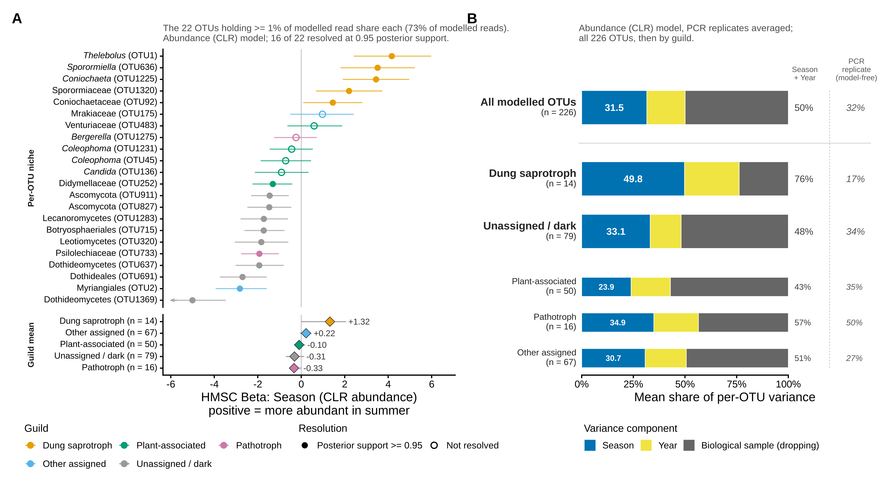

<!-- CLAUDE DRAFT 2026-09-29 (caption rewritten for the revised model): rewrite freely -->
**Figure 3**: A joint species distribution model places the seasonal axis at OTU level and sizes it against the variation among individual droppings. Both panels come from one abundance (CLR) HMSC model fitted to 226 OTUs in 55 droppings, with each dropping's two PCR replicates averaged, Season and Year as fixed effects, and the dropping as random level (Section 9.1). **(A)** Per-OTU Season coefficient in CLR units — positive = higher relative abundance in summer — for the 22 OTUs that each account for at least 1% of modelled-OTU read share, 73% of all modelled reads between them, ordered by coefficient and coloured by functional guild, with 95% credible intervals. One interval, OTU1369's, extends beyond the axis and is clipped at −6 with an arrowhead (it reaches −6.48). Filled points are the 16 resolved at HMSC's 0.95 posterior-support convention; community-wide, 74 of 226 OTUs have a 95% credible interval excluding zero. The lower block gives each guild's arithmetic mean of the per-OTU posterior means (diamond) with their interquartile range, taken over all OTUs in that guild rather than only the 22 plotted; it is a descriptive summary of the points above, not a credible interval. The model's own guild-level estimate is the trait-level Gamma (Section 9.3, Table S-HMSCd2). The four MCMC chains agree on every plotted estimate (Beta PSRF ≤ 1.01; Table S-HMSCb). **(B)** Mean share of per-OTU explained variance attributed to Season, Year and the dropping, for all 226 OTUs and then within each guild (Table S-HMSCc). The italic right-hand column is not part of that partition. It is the share of each OTU's total CLR variance that lies between the two PCR replicates of a dropping, measured outside the model (Table S-HMSCc2), and it mostly reflects rare taxa detected by one replicate but not the other. The three highlighted rows are drawn larger because they are the groups this study is about. The five guild classes are the model's trait and differ slightly from the display split used in Figure 1: 46 OTUs carrying a genus but no FUNGuild call sit in "Other assigned" here and in "Unassigned / dark" there (`tables/guild_scheme_crosswalk.csv`, Section 8.1).

Panel A makes the seasonal signal concrete at the level of individual lineages, and it does so among the taxa that actually constitute the community: the 22 OTUs plotted are every OTU holding at least 1% of modelled read share, and they carry 73% of the modelled reads between them. <!-- CLAUDE DRAFT 2026-09-29 (numbers and claims updated to the revised model): rewrite freely -->
Read from the top, the panel is the study's taxonomic result in one column. The summer end is an unbroken block of coprophilous dung saprotrophs — *Thelebolus* (OTU1, β = +4.17), *Sporormiella* (OTU636, +3.52), *Coniochaeta* (OTU1225, +3.44) and two further Sporormiaceae and Coniochaetaceae lineages — every one of them resolved. The winter end is a block dominated by dark, taxonomically unresolved taxa, ending at OTU1369 (−5.00), the unclassified Dothideomycete that dominates winter read share in Figure 5. Plant-associated taxa straddle zero between them. The guild means below make the same statement over all 226 OTUs rather than the 22 shown. Dung saprotrophs (+1.32) have by far the most summer-shifted mean; dark/unassigned taxa (−0.31) and pathotrophs (−0.33) lean winter; and the yeast-rich "other" group is weakly positive (+0.22). The model's trait-level estimate agrees: the dung-saprotroph guild's Season effect is positive with posterior support 0.994, and dark/unassigned, pathotroph and plant-associated OTUs respond clearly less summer-ward (Section 9.3). Panel B sizes these effects. Season accounts for 31.5% of the variance the model explains and Year for 18.5%, while half (49.9%) sits among droppings — one dropping to the next. The Season share is largest for dung saprotrophs (49.8%): coprophiles are the taxa whose abundance season determines most. Measured separately, a further 32% of total CLR variance is replicate-to-replicate noise within a dropping, most of it whether rare taxa are detected at all; coprophiles are the most repeatable guild (17%). Taken together the panels state the central quantitative claim in one place: seasonal turnover is real, directional and consistent across methods, yet it sits beside large idiosyncrasy among individual droppings — which is why the model explains the samples it has seen (R² ≈ 0.29) but predicts held-out droppings far less well (cross-validated R² ≈ 0.03; Section 9.7).

```{r fig3-build}
#| eval: false
#| echo: !expr knitr::is_html_output()
#| code-fold: true
#| code-summary: "Full build code for Figure 3 — the source of truth for figures/main/Fig3_hmsc_synthesis.{png,jpg,pdf}"

# Figure 3 -- HMSC synthesis: per-OTU seasonal niche + variance partition.
# Every number is READ from committed tables/ CSVs; no model is loaded or
# refitted here (the fits are ~200 MB each and the figure needs only their
# posterior summaries).
#   A  tables/hmsc_beta_season.csv         (per-OTU Season Beta, CLR abundance)
#      tables/dark_taxa_SH_matching.csv    (per-OTU read share + full lineage)
#   B  tables/hmsc_variance_partition.csv  (per-OTU variance components, CLR)
#      tables/hmsc_pcr_replicate_variance.csv (model-free PCR-replicate share)
#      tables/hmsc_convergence_psrf.csv    (quoted in the caption, checked here)
#
# BOTH panels are the headline ABUNDANCE (CLR) model: CLR averaged over each
# dropping's two PCR replicates, one row per dropping, biological sample as the
# random level (Section 9.1; revised 2026-09-29 -- the previous uncapped
# replicate-level model did not converge). The occurrence (probit) model is a
# supplementary robustness check (Section 9.4, Tables S-HMSCe(iii)/(iv)) and is
# deliberately NOT mixed into this figure: on the occurrence scale the whole
# community shifts summer-ward (157/226 OTUs positive), which ranks rare taxa at
# the extremes and puts "other assigned" ahead of dung saprotrophs -- a richness
# result already carried by Figure 4.
# Rebuild:  conda run -n r_env Rscript build_main_figure.R fig3-build

suppressPackageStartupMessages({
  library(ggplot2); library(patchwork); library(ggtext)
})

tab_dir <- if (dir.exists("tables")) "tables" else
           "/home/daniel/Ptarmigan/Scripts_server/Supplementary/tables"
out_dir <- "figures/main"
dir.create(out_dir, showWarnings = FALSE, recursive = TRUE)
grDevices::pdf(NULL)                                 # headless: no X11 fallback

# ---- shared style ----------------------------------------------------------
# Guild colours are Figure 1's, so a guild is the same colour in every main
# figure. The model's five-level trait is NOT identical to Figure 1's display
# split (46 OTUs move between "Other assigned" and "Unassigned / dark"); the
# caption says so and tables/guild_scheme_crosswalk.csv reconciles them.
GUILD_LEVELS <- c("Dung saprotroph", "Plant-associated", "Pathotroph",
                  "Other assigned", "Unassigned / dark")
guild_cols <- c("Dung saprotroph" = "#E69F00", "Plant-associated" = "#009E73",
                "Pathotroph" = "#CC79A7", "Other assigned" = "#56B4E9",
                "Unassigned / dark" = "#999999")
guild_map <- c(dung_saprotroph = "Dung saprotroph", plant_associated = "Plant-associated",
               pathotroph = "Pathotroph", other = "Other assigned",
               dark_unassigned = "Unassigned / dark")
# Variance components deliberately share NO colour with the guild scale, and
# split fixed (coloured) from random (grey): the visual point of panel B is how
# little of the bar is coloured.
# The headline model averages PCR replicates, so it has NO PCR random level;
# PCR-replicate variance is drawn as a separate, model-free column (panel B).
VP_LEVELS <- c("Season", "Year", "Random: sample")   # CSV column names
# Displayed names: the CSV's terse "Random: sample" is fine in a supplementary
# table but a main-text key has to say what the level actually is.
vp_display <- c("Season" = "Season", "Year" = "Year",
                "Random: sample" = "Biological sample (dropping)")
vp_cols <- c("Season" = "#0072B2", "Year" = "#F0E442",
             "Biological sample (dropping)" = "#666666")

base_theme <- theme_classic(base_size = 12) +
  theme(strip.background = element_blank(),
        strip.text.y     = element_text(face = "bold", size = 8.5, angle = 0),
        plot.tag         = element_text(face = "bold", size = 14),
        plot.subtitle    = element_text(size = 9, colour = "grey30"),
        panel.spacing    = unit(0.5, "lines"),
        legend.key.size  = unit(0.42, "cm"),
        legend.title     = element_text(size = 10),
        legend.text      = element_text(size = 9))

# All in-plot text is ASCII: save_fig() falls back to grDevices::pdf when cairo
# is unavailable, and that device silently substitutes a dot for a Unicode glyph.
# (The markdown asterisks below are ggtext italics markup, and are ASCII.)

strip_rank <- function(x) sub("^[a-z]__", "", x)

# ============================================================================
# Panel A -- per-OTU seasonal niche (CLR abundance), plus guild means
# ============================================================================
b <- read.csv(file.path(tab_dir, "hmsc_beta_season.csv"), stringsAsFactors = FALSE)
stopifnot(nrow(b) == 226L, !anyNA(b$beta_season_mean), !anyNA(b$beta_season_CrI2.5),
          !anyNA(b$beta_season_support), setequal(b$guild, names(guild_map)))
b$Guild <- factor(unname(guild_map[b$guild]), levels = GUILD_LEVELS)

# Read share AND full lineage both come from the E1 per-OTU table (Section 3.4),
# the one committed file carrying a complete Kingdom..Species lineage together
# with per-season mean read shares for every OTU in the study. Using it here is
# what lets an OTU with no genus be labelled by its finest resolved rank
# ("Dothideomycetes (OTU1369)") instead of a bare, unreadable ID.
sh <- read.csv(file.path(tab_dir, "dark_taxa_SH_matching.csv"), stringsAsFactors = FALSE)
stopifnot(nrow(sh) == 1129L, all(b$OTU_ID %in% sh$OTU_ID), !any(duplicated(sh$OTU_ID)))
si <- match(b$OTU_ID, sh$OTU_ID)
# Guard: the Beta table's own Genus column must agree with the lineage source,
# or the labels would be describing different OTUs than the estimates.
stopifnot(all(is.na(b$Genus) == is.na(sh$Genus[si])),
          all(strip_rank(sh$Genus[si]) == b$Genus, na.rm = TRUE))

# winter_mean_share and summer_mean_share are each a mean over that season's
# samples, so their unweighted average is the OTU's mean share of a dropping.
# Renormalising over the 226 MODELLED OTUs (not all 1129) is what makes "1% of
# read share" a statement about the community the model actually sees.
b$share <- (sh$winter_mean_share[si] + sh$summer_mean_share[si]) / 2
stopifnot(!anyNA(b$share), all(b$share >= 0), sum(b$share) > 0)
b$rel <- b$share / sum(b$share)

# Selection rule: a stated threshold rather than an arbitrary top-N, so the
# panel's membership is reproducible and cannot be read as cherry-picked. It
# also ties Figure 3 to Figure 1, which is likewise read-share weighted.
SHARE_MIN <- 0.01
sel <- b[b$rel >= SHARE_MIN, ]
sel <- sel[order(-sel$beta_season_mean), ]
sel_cov <- sum(sel$rel)
stopifnot(nrow(sel) == 22L, sel_cov > 0.70, sel_cov < 0.76)

# Row labels: finest resolved rank, genus italicised via ggtext. Incertae sedis
# placeholders are not genera and are shown at the rank they actually resolve to.
RANKS <- c("Genus", "Family", "Order", "Class", "Phylum")
label_one <- function(i, otu) {
  v  <- strip_rank(unlist(sh[i, RANKS], use.names = FALSE))
  ok <- which(!is.na(v) & nzchar(v))
  if (!length(ok)) return(paste0("Fungi (", otu, ")"))
  k <- ok[1]
  nm <- sub("_(gen|fam|ord|cls)_Incertae_sedis$", "", v[k])
  if (k == 1L && !grepl("Incertae", v[k], fixed = TRUE)) nm <- paste0("*", nm, "*")
  paste0(nm, " (", otu, ")")
}
sel$lab <- vapply(seq_len(nrow(sel)),
                  function(j) label_one(match(sel$OTU_ID[j], sh$OTU_ID), sel$OTU_ID[j]),
                  character(1))
stopifnot(!any(duplicated(sel$lab)))

# Resolution marker: HMSC's own convention -- one-sided posterior support of
# 0.95, i.e. a 90% two-sided interval. The caption also reports how many OTUs
# community-wide have a 95% CrI excluding zero, so the weaker criterion is not
# passed off as the stronger.
SUPP <- 0.95
sel$resolved <- factor(
  ifelse(sel$beta_season_support >= SUPP | sel$beta_season_support <= 1 - SUPP,
         "Posterior support >= 0.95", "Not resolved"),
  levels = c("Posterior support >= 0.95", "Not resolved"))
n_res <- sum(sel$resolved == "Posterior support >= 0.95")

# Guild means over ALL OTUs of that guild (not just the 22 plotted), with the
# IQR of the same per-OTU estimates as a spread -- a summary of the points
# above, NOT a credible interval, which is why it is drawn as a plain segment.
gm <- do.call(rbind, lapply(GUILD_LEVELS, function(g) {
  v <- b$beta_season_mean[b$Guild == g]
  data.frame(Guild = factor(g, levels = GUILD_LEVELS), n = length(v),
             mean = mean(v), q25 = quantile(v, 0.25), q75 = quantile(v, 0.75),
             stringsAsFactors = FALSE)
}))
gm$lab <- sprintf("%s (n = %d)", as.character(gm$Guild), gm$n)

# Drift guard against the committed per-OTU table itself -- guild sizes and
# guild means -- which is what the panel actually draws. (These are means of
# per-OTU posterior means in CLR units, NOT the trait-level Gamma, which is on
# the standardised scale and reported in Section 9.3.)
N_EXP  <- c("Dung saprotroph" = 14L, "Plant-associated" = 50L, "Pathotroph" = 16L,
            "Other assigned" = 67L, "Unassigned / dark" = 79L)
GM_EXP <- c("Dung saprotroph" = 1.320, "Plant-associated" = -0.095, "Pathotroph" = -0.332,
            "Other assigned" = 0.223, "Unassigned / dark" = -0.312)
gm_n <- setNames(gm$n, as.character(gm$Guild))
gm_m <- setNames(gm$mean, as.character(gm$Guild))
stopifnot(sum(N_EXP) == 226L, all(gm_n[names(N_EXP)] == N_EXP),
          max(abs(gm_m[names(GM_EXP)] - GM_EXP)) < 0.01,
          as.character(gm$Guild[which.max(gm$mean)]) == "Dung saprotroph")

# One plot, two blocks: facet_grid with free space gives the guild block a
# height proportional to its 5 rows and keeps ONE shared x axis and one tag.
BLOCKS <- c("Per-OTU niche", "Guild mean")   # short: the lower block is only 5 rows tall
otu_df <- data.frame(lab = sel$lab, Guild = sel$Guild, resolved = sel$resolved,
                     est = sel$beta_season_mean,
                     lo = sel$beta_season_CrI2.5, hi = sel$beta_season_CrI97.5,
                     block = factor(BLOCKS[1], levels = BLOCKS))
gm_df  <- data.frame(lab = gm$lab, Guild = gm$Guild, est = gm$mean,
                     lo = gm$q25, hi = gm$q75,
                     block = factor(BLOCKS[2], levels = BLOCKS))
lvl <- c(gm_df$lab[order(gm_df$est)], otu_df$lab[order(otu_df$est)])
otu_df$lab <- factor(otu_df$lab, levels = lvl)
gm_df$lab  <- factor(gm_df$lab,  levels = lvl)

# Convergence is checked here but PRINTED IN THE CAPTION, not on the panel: a
# diagnostic belongs in the caption rather than on the face of a main-text
# figure. The guard refuses to draw the figure from a fit that does not meet
# the Section 9.1 criteria (every Beta PSRF < 1.1; chains agree on the guild
# means and the variance partition to within 0.05).
conv <- read.csv(file.path(tab_dir, "hmsc_convergence_psrf.csv"), stringsAsFactors = FALSE)
cclr <- conv[conv$model == "clr", ]
stopifnot(nrow(cclr) == 1L, cclr$beta_psrf_max < 1.1, cclr$beta_pct_below_1.1 == 100,
          cclr$guild_mean_chain_range_max < 0.05, cclr$vp_chain_range_max < 0.05)
n_ci <- sum(b$beta_season_CrI2.5 > 0 | b$beta_season_CrI97.5 < 0)
stopifnot(n_ci == 74L)

# OTU1369's credible interval reaches below -6; drawn in full it would widen
# the axis for one row. Intervals are therefore clipped at +/- 6 and the
# clipped end carries an arrowhead, so nothing is hidden: the reader sees that
# the interval continues, and the caption says how far.
XCLIP <- 6
otu_df$lo_c <- pmax(otu_df$lo, -XCLIP)
otu_df$hi_c <- pmin(otu_df$hi,  XCLIP)
otu_df$lo_clip <- otu_df$lo < -XCLIP
otu_df$hi_clip <- otu_df$hi >  XCLIP
n_clip <- sum(otu_df$lo_clip | otu_df$hi_clip)
# Nothing may be clipped so hard that its point estimate leaves the panel.
stopifnot(all(abs(otu_df$est) < XCLIP), all(abs(gm_df$est) < XCLIP),
          all(abs(c(gm_df$lo, gm_df$hi)) < XCLIP))
arr <- grid::arrow(length = unit(0.055, "in"), type = "open", angle = 22)

pA <- ggplot(otu_df, aes(est, lab, colour = Guild)) +
  geom_vline(xintercept = 0, linewidth = 0.3, colour = "grey70") +
  # geom_segment rather than geom_errorbarh: the latter is deprecated in
  # ggplot2 4.0 and its replacement's argument names differ between versions.
  geom_segment(aes(x = lo_c, xend = hi_c, y = lab, yend = lab), linewidth = 0.45, alpha = 0.75) +
  # Arrowheads drawn as short overlays at the clipped ends rather than as an
  # arrow on the main segment, so an interval clipped at BOTH ends still gets
  # two heads and an unclipped one gets none.
  geom_segment(data = otu_df[otu_df$hi_clip, ],
               aes(x = XCLIP - 0.30, xend = XCLIP, y = lab, yend = lab),
               linewidth = 0.45, alpha = 0.75, arrow = arr) +
  geom_segment(data = otu_df[otu_df$lo_clip, ],
               aes(x = -XCLIP + 0.30, xend = -XCLIP, y = lab, yend = lab),
               linewidth = 0.45, alpha = 0.75, arrow = arr) +
  geom_point(aes(shape = resolved), size = 2.3, stroke = 0.8) +
  # guild block: IQR segment behind, mean diamond on top, value printed
  geom_segment(data = gm_df, aes(x = lo, xend = hi, y = lab, yend = lab),
               inherit.aes = FALSE, colour = "grey65", linewidth = 0.5) +
  geom_point(data = gm_df, aes(est, lab, fill = Guild), inherit.aes = FALSE,
             shape = 23, size = 3.2, colour = "grey20", stroke = 0.4) +
  # Value printed to the RIGHT of the IQR, not above the diamond: the five guild
  # means sit within 0.6 of each other, so a label above one row lands on the next.
  geom_text(data = gm_df, aes(hi, lab, label = sprintf("%+.2f", est)), inherit.aes = FALSE,
            hjust = 0, nudge_x = 0.10, size = 2.9, colour = "grey20") +
  facet_grid(rows = vars(block), scales = "free_y", space = "free_y", switch = "y") +
  scale_colour_manual(values = guild_cols, name = "Guild", drop = FALSE) +
  scale_fill_manual(values = guild_cols, guide = "none", drop = FALSE) +
  scale_shape_manual(values = c("Posterior support >= 0.95" = 16, "Not resolved" = 1),
                     name = NULL, drop = FALSE) +
  scale_x_continuous(breaks = seq(-6, 6, 2), expand = expansion(mult = c(0.03, 0.09))) +
  coord_cartesian(xlim = c(-XCLIP, XCLIP)) +
  labs(x = "HMSC Beta: Season (CLR abundance, positive = more abundant in summer)", y = NULL,
       subtitle = sprintf(paste0("The %d OTUs holding >= %.0f%% of modelled read share each (%.0f%% of modelled reads).\n",
                                 "Abundance (CLR) model; %d of %d resolved at 0.95 posterior support."),
                          nrow(sel), 100 * SHARE_MIN, 100 * sel_cov, n_res, nrow(sel))) +
  base_theme +
  theme(axis.text.y = element_markdown(size = 8.5),
        strip.placement = "outside",
        strip.text.y.left = element_text(angle = 90, face = "bold", size = 8)) +
  guides(colour = guide_legend(order = 1, override.aes = list(shape = 16, size = 2.6)),
         shape  = guide_legend(order = 2))

# ============================================================================
# Panel B -- variance partition (CLR), community-wide and by guild
# ============================================================================
vp <- read.csv(file.path(tab_dir, "hmsc_variance_partition.csv"), check.names = FALSE)
# Components are stored rounded to 4 dp, so a row sums to 1 only to within the
# rounding error of three values -- hence 1e-3 rather than machine tolerance.
stopifnot(nrow(vp) == 226L, setequal(vp$OTU_ID, b$OTU_ID),
          all(VP_LEVELS %in% names(vp)),
          max(abs(rowSums(vp[, VP_LEVELS]) - 1)) < 1e-3)
vp$Guild <- factor(unname(guild_map[vp$guild]), levels = GUILD_LEVELS)

# Row order and emphasis are EDITORIAL, not statistical: the community row and
# the two guilds this study is about are drawn larger and grouped at the top so
# the panel states its point before the reader parses six bars. The caption says
# this explicitly, because pathotrophs -- de-emphasised here -- actually carry
# the largest Season share of any guild.
ROW_ORDER <- c("All modelled OTUs", "Dung saprotroph", "Unassigned / dark",
               "Plant-associated", "Pathotroph", "Other assigned")
EMPH <- c(TRUE, TRUE, TRUE, FALSE, FALSE, FALSE)

grp_mean <- function(d, label) data.frame(
  grp = label, n = nrow(d), t(colMeans(d[, VP_LEVELS])), check.names = FALSE)
vpm <- rbind(grp_mean(vp, ROW_ORDER[1]),
             do.call(rbind, lapply(ROW_ORDER[-1],
                                   function(g) grp_mean(vp[vp$Guild == g, ], g))))
stopifnot(identical(vpm$grp, ROW_ORDER), vpm$n[1] == 226L, sum(vpm$n[-1]) == 226L)
# Drift guard: the community means are quoted in Section 9.2, Table S-HMSCc and
# the caption.
VP_EXP <- c(Season = 31.53, Year = 18.55, `Random: sample` = 49.93)
stopifnot(max(abs(100 * unlist(vpm[1, VP_LEVELS], use.names = FALSE) -
                  VP_EXP[VP_LEVELS])) < 0.05)

# PCR-replicate share, MODEL-FREE (Section 9.2, Table S-HMSCc2): replicate-to-
# replicate variance of CLR within a dropping as a share of that OTU's total
# CLR variance, averaged over OTUs. It is NOT a fourth component of the bar:
# the bar partitions the model's explained variance, this is a share of TOTAL
# variance, so it is drawn as a separate column and the caption says so.
pcr <- read.csv(file.path(tab_dir, "hmsc_pcr_replicate_variance.csv"), stringsAsFactors = FALSE)
pcr_lab <- c(all = "All modelled OTUs", guild_map)
stopifnot(setequal(pcr$group, names(pcr_lab)))
vpm$pcr_share <- pcr$share_total_mean[match(vpm$grp, unname(pcr_lab[pcr$group]))]
stopifnot(!anyNA(vpm$pcr_share), abs(vpm$pcr_share[1] - 0.324) < 0.001)

# Manual geometry on a CONTINUOUS y axis. A discrete axis spaces rows evenly
# whatever width the bars are given, so it cannot produce "larger and grouped at
# the top"; here each row carries its own height and its own gap below it.
H_EMPH <- 0.82; H_MIN <- 0.46
GAP    <- c(0.90, 0.45, 0.70, 0.40, 0.40, 0.00)   # space BELOW each row
vpm$h   <- ifelse(EMPH, H_EMPH, H_MIN)
vpm$emph <- EMPH
edge <- 0
ctr  <- numeric(nrow(vpm))
for (i in seq_len(nrow(vpm))) {
  ctr[i] <- edge - vpm$h[i] / 2
  edge   <- edge - vpm$h[i] - GAP[i]
}
vpm$ctr <- ctr
sep_y <- ctr[1] - vpm$h[1] / 2 - GAP[1] / 2       # rule under the community row

# Stacking done by hand (cumsum), not position_stack: the label layers below
# plot a different set of rows than the bars, and position_stack re-stacks
# whatever data it is handed, so the two would silently drift apart.
rect <- do.call(rbind, lapply(seq_len(nrow(vpm)), function(i) {
  v <- 100 * unlist(vpm[i, VP_LEVELS], use.names = FALSE)
  data.frame(comp = factor(unname(vp_display[VP_LEVELS]),
                           levels = unname(vp_display[VP_LEVELS])),
             xmin = cumsum(c(0, head(v, -1))), xmax = cumsum(v),
             ymin = vpm$ctr[i] - vpm$h[i] / 2, ymax = vpm$ctr[i] + vpm$h[i] / 2)
}))

# Season is the one segment whose exact value the reader needs; print it inside.
slab <- data.frame(x = 100 * vpm$Season / 2, y = vpm$ctr,
                   txt = sprintf("%.1f", 100 * vpm$Season),
                   sz  = ifelse(EMPH, 3.3, 2.7))
tot  <- data.frame(x = 103, y = vpm$ctr,
                   txt = sprintf("%.0f%%", 100 * (vpm$Season + vpm$Year)),
                   sz  = ifelse(EMPH, 3.2, 2.8))
X_PCR <- 121                                          # model-free column, right of a divider
pcrt <- data.frame(x = X_PCR, y = vpm$ctr,
                   txt = sprintf("%.0f%%", 100 * vpm$pcr_share),
                   sz  = ifelse(EMPH, 3.2, 2.8))
y_top <- vpm$ctr[1] + vpm$h[1] / 2
hdr  <- data.frame(x = c(106, X_PCR + 3.5), y = y_top + 0.25,   # centred over each column
                   txt = c("Season\n+ Year", "PCR rep.\n(model-free)"))
ylab <- ifelse(vpm$emph,
               sprintf("<span style='font-size:10.5pt'>**%s**</span><br>(n = %d)", vpm$grp, vpm$n),
               sprintf("<span style='font-size:8.5pt'>%s</span><br>(n = %d)", vpm$grp, vpm$n))

pB <- ggplot(rect) +
  geom_rect(aes(xmin = xmin, xmax = xmax, ymin = ymin, ymax = ymax, fill = comp),
            colour = "white", linewidth = 0.25) +
  geom_hline(yintercept = sep_y, colour = "grey80", linewidth = 0.3) +
  geom_text(data = slab, aes(x, y, label = txt, size = sz), inherit.aes = FALSE,
            colour = "white", fontface = "bold") +
  geom_text(data = tot, aes(x, y, label = txt, size = sz), inherit.aes = FALSE,
            hjust = 0, colour = "grey25") +
  # model-free column: divider + italic values, visibly not part of the bar
  annotate("segment", x = 116, xend = 116, y = min(vpm$ctr - vpm$h / 2), yend = y_top,
           colour = "grey75", linewidth = 0.3, linetype = "22") +
  geom_text(data = pcrt, aes(x, y, label = txt, size = sz), inherit.aes = FALSE,
            hjust = 0, colour = "grey35", fontface = "italic") +
  geom_text(data = hdr, aes(x, y, label = txt), inherit.aes = FALSE,
            hjust = 0.5, vjust = 0, size = 2.6, colour = "grey35", lineheight = 0.9) +
  scale_size_identity() +
  scale_fill_manual(values = vp_cols, name = "Variance component") +
  scale_x_continuous(breaks = seq(0, 100, 25), limits = c(0, 136),
                     expand = expansion(mult = c(0.01, 0)),
                     labels = function(x) paste0(x, "%")) +
  scale_y_continuous(breaks = vpm$ctr, labels = ylab, expand = expansion(add = c(0.18, 0.75))) +
  labs(x = "Mean share of per-OTU variance", y = NULL,
       subtitle = "Abundance (CLR) model, PCR replicates averaged;\nall 226 OTUs, then by guild.") +
  base_theme +
  theme(axis.text.y = element_markdown(size = 8.5, lineheight = 1.1, colour = "grey15"),
        axis.line.y = element_blank(), axis.ticks.y = element_blank()) +
  # cap the x axis line at the bar's 0-100% range so the text columns to its
  # right do not read as part of the scale
  guides(fill = guide_legend(nrow = 1), x = guide_axis(cap = "both"))

# ---- assemble and write ----------------------------------------------------
fig3 <- (pA | pB) +
  plot_layout(widths = c(1.25, 1), guides = "collect") +
  plot_annotation(tag_levels = "A") &
  # VERIFIED the hard way: the three collected key blocks (guild, support,
  # variance component) do NOT fit side by side at 11 in -- legend.box =
  # "horizontal" overflows the device and is silently clipped, with no warning.
  # They are stacked instead, and each is forced onto a single row so the block
  # costs three text lines rather than four.
  theme(legend.position = "bottom", legend.box = "vertical",
        legend.box.just = "left", legend.margin = margin(t = 0, b = 0),
        legend.box.spacing = unit(0.25, "cm"))

# Every main figure is written three ways: PNG and JPG (600 dpi raster, for
# submission systems that demand one or the other) and PDF (vector, for print).
save_fig <- function(stem, obj, width, height, res = 600) {
  one <- function(open_dev) { open_dev(); on.exit(grDevices::dev.off()); print(obj) }
  one(function() grDevices::png(paste0(stem, ".png"), width = width, height = height,
                                units = "in", res = res))
  one(function() grDevices::jpeg(paste0(stem, ".jpg"), width = width, height = height,
                                 units = "in", res = res, quality = 95))
  pdf_dev <- if (capabilities("cairo")) grDevices::cairo_pdf else grDevices::pdf
  one(function() pdf_dev(paste0(stem, ".pdf"), width = width, height = height))
}
save_fig(file.path(out_dir, "Fig3_hmsc_synthesis"), fig3, 11.5, 6.4)

# ---- console summary -------------------------------------------------------
cat(sprintf("Panel A: %d OTUs at >= %.0f%% modelled read share each = %.1f%% of modelled reads.\n",
            nrow(sel), 100 * SHARE_MIN, 100 * sel_cov))
cat(sprintf("Resolved: %d of %d at 0.95 posterior support (%d at the winter end); %d of %d OTUs community-wide have a 95%% CrI excluding 0.\n",
            n_res, nrow(sel), sum(sel$resolved == "Posterior support >= 0.95" &
                                  sel$beta_season_mean < 0), n_ci, nrow(b)))
cat(sprintf("CLR convergence (caption): Beta median PSRF %.2f, %.0f%% of parameters < 1.1.\n",
            cclr$beta_psrf_med, cclr$beta_pct_below_1.1))
cat(sprintf("Credible intervals clipped at +/-%.1f (arrowed): %d of %d.\n",
            XCLIP, n_clip, nrow(otu_df)))
cat("\nPanel A rows, summer end first:\n")
print(data.frame(OTU = sel$OTU_ID, label = gsub("\\*", "", sel$lab),
                 guild = as.character(sel$Guild),
                 beta = round(sel$beta_season_mean, 2),
                 support = sel$beta_season_support,
                 read_pct = round(100 * sel$rel, 2)), row.names = FALSE)
cat("\nGuild means over all 226 OTUs:\n")
print(data.frame(guild = as.character(gm$Guild), n = gm$n,
                 mean_beta = round(gm$mean, 3),
                 IQR = sprintf("[%.2f, %.2f]", gm$q25, gm$q75)), row.names = FALSE)
cat("\nVariance partition (mean % per OTU):\n")
print(data.frame(group = sprintf("%s (n = %d)", vpm$grp, vpm$n),
                 round(100 * vpm[, VP_LEVELS], 1), check.names = FALSE),
      row.names = FALSE)
```

### 10.4 Figure 4 — Richness rises, evenness collapses (H2)

:::: {.content-visible when-profile="docs"}
*Provenance: Fig. 4A is the coverage-based pooled-season iNEXT3D analysis of Section 5.1 (Table S8); Fig. 4B the size-standardised per-sample iNEXT3D Hill numbers of Section 5.2 (Figure S8), annotated with the per-sample gamma-GLM contrasts of Table S9; Fig. 4C the dominance and evenness metrics of Section 5.3 (Table S10); Fig. 4D the top-5 dominant OTUs of Section 5.4 (Table S11), coloured by the guild rule of Section 8.1. Panels B–D are computed on the canonical 52-sample object (`alldat$nopool`); panel B standardises it to 12,615 reads through the shared `hill_size_helper.R`, the same single source Section 5.2 uses. Panel A's estimates and every test statistic are read from the committed `tables/` CSVs, so the figure cannot drift from Section 5.*
::::

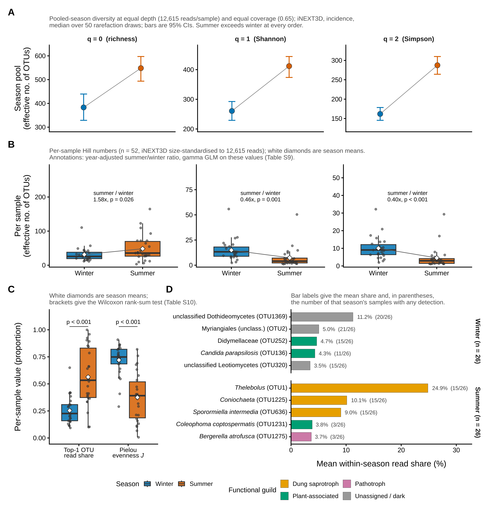

**Figure 4**: The summer dung mycobiome is the richer assemblage when droppings are pooled, yet each individual dropping is far less even. **(A)** Taxonomic diversity of each season's pooled sample set at Hill orders q = 0, 1 and 2, at equal sequencing depth (every sample rarefied to 12,615 reads) and equal sample coverage (0.65) (iNEXT3D, incidence data); points are the median estimate over 50 rarefaction draws, bars the median 95% confidence interval, and the grey segment joins the two seasons within an order. Summer exceeds winter at every order (Table S8). **(B)** Per-sample Hill numbers for the same 52 samples, size-standardised with iNEXT3D to a common depth of 12,615 reads, drawn in the same three columns against the same season axis so that the two rows can be read against one another; boxes show the median and interquartile range, points are individual samples, white diamonds are season means, and the grey segment joins those means. The slope that rises in all three columns of (A) rises only at q = 0 here and falls at q = 1 and q = 2 — that reversal is the crossover. Annotations give the year-adjusted summer/winter ratio and its p-value from a gamma GLM fitted to the plotted per-sample values (Table S9); the q = 0 contrast depends on the model family (p = 0.026–0.29; Table S9b), the q = 1 and q = 2 contrasts do not. Both rows scale y freely within each column, because the three Hill orders differ by an order of magnitude. **(C)** The mechanism: per-sample top-1-OTU read share and Pielou evenness *J*, both on a 0–1 scale, with symbols as in (B) and brackets giving the Wilcoxon rank-sum result (Table S10). **(D)** The identity of the dominants — the five OTUs with the highest mean within-season read share in each season, coloured by functional guild under the rule of Section 8.1. Bar labels give that mean share and, in parentheses, the number of the season's 26 samples in which the OTU was detected at all. Taxa are named at the finest confidently assigned rank, so an OTU with no genus appears under its family, or as *unclassified* plus its order or class. *Candida parapsilosis* is coloured plant-associated because its compound FUNGuild string contains `Epiphyte`; the rule is applied unchanged rather than special-cased, so that Figures 1 and 4 and Sections 8–9 classify every OTU identically.

Panels A and B put the same question to two scales and get opposite answers, and that disagreement is the result rather than a problem with it. Pooled across a season and with sequencing depth held equal, summer is the richer assemblage at every Hill order — 548 against winter's 383 OTUs at q = 0, and the gap widens under abundance weighting (412 vs 261 at q = 1; 287 vs 162 at q = 2). Within a single dropping the ordering reverses as soon as abundance enters: winter droppings are significantly more diverse at q = 1 (14.9 vs 7.4 effective OTUs; summer/winter 0.46, p = 0.001) and q = 2 (10.1 vs 4.6; 0.40, p < 0.001), whereas at q = 0 summer's higher mean (48.3 vs 31.3) is a weak, family-dependent difference carried by a few very rich summer samples (Tables S9, S9b). Panel C locates the reversal in dominance rather than in the species lists: an average summer sample gives 56% of its reads to a single OTU against 25% in winter, and Pielou evenness falls from 0.72 to 0.38 (both p \< 0.001). Summer droppings are far more top-heavy, which is precisely what depresses q = 1 and q = 2 even where a dropping's species list is as long as, or longer than, a winter one. Panel D names the taxa responsible, and they are the ones a coprophilous account predicts: *Thelebolus*, *Coniochaeta* and *Sporormiella intermedia* together take 44% of summer reads and are all dung saprotrophs, whereas winter's leading OTUs are mostly unclassified below class and carry no guild call at all — among them OTU1369, an unclassified Dothideomycete that is winter's most abundant OTU and is present in 20 of 26 winter samples, and which is taken up as a dark taxon in Section 3.4. Two caveats travel with the figure. The per-sample richness contrast in (B) is not robust to the choice of model family (Table S9b), so the crossover is firm at q = 1 and q = 2 and in the pooled estimates of (A), but not as a per-dropping richness gain. And the shares in (D) are seasonal averages, not universals — *Thelebolus* reaches its 24.9% mean while being detected in only 15 of the 26 summer droppings.

```{r fig4-build}
#| eval: false
#| echo: !expr knitr::is_html_output()
#| code-fold: true
#| code-summary: "Full build code for Figure 4 — the source of truth for figures/main/Fig4_richness_evenness_crossover.{png,jpg,pdf}"

# Figure 4 -- Richness rises, evenness collapses (H2).
# Panels A and B share one grammar (Season on x, diversity on y, faceted by Hill
# order) and one set of facet strips, so the crossover is a single visual event:
# the same three columns, with the Winter->Summer slope flipping between rows.
# C then gives the mechanism (dominance) and D the identity of the dominants.
# Per-sample quantities are recomputed from the canonical objects (Fig. 1
# precedent) via the shared hill_size_helper.R; every pooled estimate and test
# statistic is READ from a committed tables/ CSV (Fig. 2 precedent), with guards
# asserting the two agree.
# Rebuild:  conda run -n r_env Rscript build_main_figure.R fig4-build

suppressPackageStartupMessages({
  library(phyloseq); library(ggplot2); library(patchwork); library(iNEXT.3D)
})
# Size-standardised Hill numbers: the SAME single source the sec5-build chunk
# uses, so Figure 4 panel B and Section 5.2 cannot drift apart.
source("hill_size_helper.R")

rdata <- if (file.exists("eco_analysis.RData")) "eco_analysis.RData" else
         "/home/daniel/Ptarmigan/trimmed/mergedPlates/eco_analysis.RData"
load(rdata)
stopifnot(exists("alldat"), exists("alldat.rfy"), exists("alldat_full"),
          exists("funguild_otu"))                 # funguild_otu <- 8_functional_guilds.R
tab_dir <- if (dir.exists("tables")) "tables" else
           "/home/daniel/Ptarmigan/Scripts_server/Supplementary/tables"
out_dir <- "figures/main"
dir.create(out_dir, showWarnings = FALSE, recursive = TRUE)
grDevices::pdf(NULL)                                 # headless: no X11 fallback

# ---- shared style ----------------------------------------------------------
# Season and guild palettes are the repo standard (8_functional_guilds.R), so one
# colour means one thing across Fig. 1, Fig. 2 and Fig. 4.
season_cols  <- c(Winter = "#0072B2", Summer = "#D55E00")
guild_cols   <- c("Dung saprotroph" = "#E69F00", "Plant-associated" = "#009E73",
                  "Pathotroph" = "#CC79A7", "Other assigned" = "#56B4E9",
                  "Unassigned / dark" = "#999999")
GUILD_LEVELS <- names(guild_cols)

# The one facet vocabulary shared by panels A and B. A carries the strips; B
# repeats the columns beneath it and blanks them, exactly as Fig. 1B does.
Q_LEVELS <- c("q = 0  (richness)", "q = 1  (Shannon)", "q = 2  (Simpson)")

base_theme <- theme_classic(base_size = 12) +
  theme(strip.background = element_blank(),
        strip.text       = element_text(face = "bold"),
        plot.tag         = element_text(face = "bold", size = 14),
        plot.subtitle    = element_text(size = 9, colour = "grey30"),
        panel.spacing    = unit(0.8, "lines"),
        legend.key.size  = unit(0.42, "cm"),
        legend.title     = element_text(size = 10),
        legend.text      = element_text(size = 9))

# All in-plot text is ASCII. save_fig() falls back to grDevices::pdf when cairo
# is unavailable, and that device silently substitutes a dot for a Unicode minus
# or delta -- a corrupted PDF that would not fail the build.
pfmt <- function(p) ifelse(is.na(p), "p = NA",
                    ifelse(p < 0.001, "p < 0.001", sprintf("p = %.3f", p)))
to_season <- function(x) factor(c(winter = "Winter", summer = "Summer")[as.character(x)],
                                levels = c("Winter", "Summer"))

# ============================================================================
# Panel A -- season-pool diversity (Section 5.1, Table S8)
# ============================================================================
# Read, never recomputed: 50 rarefaction draws x 100 bootstraps are expensive
# and the estimates are already committed. Pooling samples within a Season asks
# about the Season's whole species pool. These are the DEPTH-CONTROLLED,
# coverage-standardised estimates of Table S8 (every sample rarefied to 12,615
# reads, common coverage), not asymptotic ones: asymptotic richness extrapolates
# to ~2x observed here, and raw incidence carries summer's ~2.6x depth advantage.
asy <- read.csv(file.path(tab_dir, "H2_iNEXT3D_TD_coverage_rarefied.csv"), check.names = FALSE)
stopifnot(setequal(asy$Season, c("Summer", "Winter")), setequal(asy$Order.q, 0:2))
asy$q      <- factor(Q_LEVELS[asy$Order.q + 1], levels = Q_LEVELS)
asy$Season <- factor(asy$Season, levels = c("Winter", "Summer"))
asy$TD_asy <- asy$qTD                                 # plotted estimate (name kept for the ggplot below)
sc_level   <- unique(asy$SC); stopifnot(length(sc_level) == 1L)

pick  <- function(sea) { d <- asy[asy$Season == sea, ]
                         d[match(Q_LEVELS, as.character(d$q)), ] }
A_sum <- pick("Summer"); A_win <- pick("Winter")
# The panel's whole claim in one line: summer above winter at every order, with
# 95% CIs that do not overlap. If that ever stops being true, the build stops.
stopifnot(all(A_sum$qTD.LCL > A_win$qTD.UCL))

pA <- ggplot(asy, aes(Season, TD_asy)) +
  geom_line(aes(group = 1), colour = "grey55", linewidth = 0.4) +
  geom_errorbar(aes(ymin = qTD.LCL, ymax = qTD.UCL, colour = Season),
                width = 0.12, linewidth = 0.6, show.legend = FALSE) +
  geom_point(aes(fill = Season), shape = 21, size = 3.4,
             colour = "grey25", stroke = 0.4, show.legend = FALSE) +
  facet_wrap(~ q, nrow = 1, scales = "free_y") +
  scale_fill_manual(values = season_cols) +
  scale_colour_manual(values = season_cols) +
  scale_y_continuous(expand = expansion(mult = c(0.18, 0.18))) +
  labs(x = NULL, y = "Season pool\n(effective no. of OTUs)",
       subtitle = sprintf("Pooled-season diversity at equal depth (12,615 reads/sample) and equal coverage (%.2f); iNEXT3D, incidence,\nmedian over 50 rarefaction draws; bars are 95%% CIs. Summer exceeds winter at every order.", sc_level)) +
  base_theme +
  # A's x axis is identical to B's directly below, so only B prints it.
  theme(axis.text.x = element_blank(), axis.ticks.x = element_blank()) +
  guides(fill = "none", colour = "none")

# ============================================================================
# Panel B -- per-sample diversity (Section 5.2, Fig. S9 + Table S9)
# ============================================================================
# Raw counts: iNEXT.3D size-standardises internally to rfy_depth, the same depth
# alldat.rfy is rarefied to. Deterministic (an analytic expectation, not one
# rarefaction draw), so no seed is involved; the guard makes that testable.
ps_rfy <- alldat$nopool
m_rfy  <- as(otu_table(ps_rfy), "matrix")
if (taxa_are_rows(ps_rfy)) m_rfy <- t(m_rfy)         # sites x species
rfy_depth <- min(rowSums(m_rfy))
stopifnot(nsamples(ps_rfy) == 52L,
          rfy_depth == unique(rowSums(otu_mat_of(alldat.rfy$nopool))))

md_rfy <- data.frame(as(sample_data(ps_rfy), "data.frame"), stringsAsFactors = FALSE)
stopifnot(identical(rownames(m_rfy), rownames(md_rfy)))
season_rfy <- to_season(md_rfy$Season); stopifnot(!anyNA(season_rfy))

hill_raw <- hill_inext_size(ps_rfy, level = rfy_depth, label = "Figure 4B")
stopifnot(identical(hill_raw$row, rownames(m_rfy)))
hill <- data.frame(Season = season_rfy,
                   q0 = hill_raw$q0, q1 = hill_raw$q1, q2 = hill_raw$q2)
hill_long <- data.frame(
  Season = rep(hill$Season, times = 3),
  q      = factor(rep(Q_LEVELS, each = nrow(hill)), levels = Q_LEVELS),
  value  = c(hill$q0, hill$q1, hill$q2))

# The annotated contrast is Table S9: a gamma GLM (log link, q ~ Season + Year)
# fitted to exactly the per-sample values plotted here (n = 52), so the figure
# and its test are on the same unit. Guards: the CSV's season means must equal
# the recomputed ones, and the model ratio must agree in direction with them.
lmm <- read.csv(file.path(tab_dir, "H2_season_effect_per_sample.csv"), check.names = FALSE)
stopifnot(setequal(lmm$metric, c("q0", "q1", "q2")), all(lmm$n == nrow(hill)))
lmm <- lmm[match(c("q0", "q1", "q2"), lmm$metric), ]
obs_diff <- vapply(c("q0", "q1", "q2"), function(q)
  mean(hill[[q]][hill$Season == "Summer"]) - mean(hill[[q]][hill$Season == "Winter"]),
  numeric(1))
stopifnot(max(abs(lmm$mean_summer - lmm$mean_winter - obs_diff)) < 1e-8,
          all(sign(obs_diff) == sign(log(lmm$ratio_summer_winter))))

# Boxes show medians, but Section 5.3's text quotes MEANS -- so the means are
# drawn, and the segment joining them is what makes the slope flip legible
# against panel A directly above.
meanB <- aggregate(value ~ q + Season, hill_long, mean)
y_top <- as.numeric(tapply(hill_long$value, hill_long$q, max)[Q_LEVELS])
ann_B <- data.frame(q     = factor(Q_LEVELS, levels = Q_LEVELS),
                    value = y_top * 1.32,
                    lab   = sprintf("summer / winter\n%.2fx, %s",
                                    lmm$ratio_summer_winter, pfmt(lmm$p_season)))

# seed = on the jitter: save_fig() prints the object once per device, and an
# unseeded jitter would place the points differently in the PNG, the JPG and the
# PDF -- three subtly different figures from one build.
pB <- ggplot(hill_long, aes(Season, value)) +
  geom_boxplot(aes(fill = Season), outlier.shape = NA, width = 0.6, alpha = 0.85) +
  geom_point(position = position_jitter(width = 0.14, height = 0, seed = 1),
             size = 1.1, alpha = 0.55, colour = "grey20") +
  geom_line(data = meanB, aes(group = 1), colour = "grey35", linewidth = 0.4) +
  geom_point(data = meanB, shape = 23, size = 2.4, stroke = 0.5,
             fill = "white", colour = "grey15") +
  geom_text(data = ann_B, aes(x = 1.5, label = lab), inherit.aes = TRUE,
            size = 2.9, lineheight = 0.95, vjust = 1) +
  facet_wrap(~ q, nrow = 1, scales = "free_y") +
  scale_fill_manual(values = season_cols) +
  # Linear, not log: a Hill number is an effective number of OTUs and is meant to
  # be read off the axis. free_y absorbs the 164-vs-32 range difference instead.
  scale_y_continuous(expand = expansion(mult = c(0.04, 0.36))) +
  labs(x = NULL, y = "Per sample\n(effective no. of OTUs)",
       subtitle = sprintf("Per-sample Hill numbers (n = %d, iNEXT3D size-standardised to %s reads); white diamonds are season means.\nAnnotations: year-adjusted summer/winter ratio, gamma GLM on these values (Table S9).",
                          nrow(hill), format(rfy_depth, big.mark = ","))) +
  base_theme +
  # B repeats A's facet columns exactly, so its strips are dropped as redundant.
  theme(strip.text = element_blank()) +
  guides(fill = guide_legend(order = 1))

# ============================================================================
# Panel C -- dominance and evenness, the mechanism (Section 5.3, Table S10)
# ============================================================================
ps  <- alldat$nopool                                 # canonical, raw counts
m   <- as(otu_table(ps), "matrix")
if (!taxa_are_rows(ps)) m <- t(m)                    # taxa x samples, as 5.3 uses
rel <- sweep(m, 2, colSums(m), "/")
stopifnot(all(abs(colSums(rel) - 1) < 1e-10))
md  <- data.frame(as(sample_data(ps), "data.frame"), stringsAsFactors = FALSE)
stopifnot(identical(colnames(rel), rownames(md)),
          setequal(colnames(rel), rownames(m_rfy)))  # B and C/D are the same 52 birds
season_c <- to_season(md$Season)

pielou_J <- function(p) { p <- p[p > 0]; -sum(p * log(p)) / log(length(p)) }
dom <- data.frame(Season    = season_c,
                  top1_prop = apply(rel, 2, max),
                  pielou_J  = apply(rel, 2, pielou_J))

# Drift guard: the recomputed means must reproduce committed Table S10 exactly at
# the precision the CSV stores (1 dp for the percentage, 2 dp for J).
dom_csv <- read.csv(file.path(tab_dir, "report_dominance_summary.csv"), check.names = FALSE)
dom_csv <- dom_csv[match(c("winter", "summer"), dom_csv$Season), ]
obs_top1 <- tapply(dom$top1_prop, dom$Season, mean)
obs_J    <- tapply(dom$pielou_J,  dom$Season, mean)
stopifnot(max(abs(round(100 * as.numeric(obs_top1[c("Winter","Summer")]), 1) -
                  dom_csv$mean_top1_prop_pct)) < 1e-8,
          max(abs(round(as.numeric(obs_J[c("Winter","Summer")]), 2) -
                  dom_csv$mean_pielou_J)) < 1e-8)
p_top1 <- unique(dom_csv$wilcox_p_top1_prop); p_J <- unique(dom_csv$wilcox_p_pielou_J)
stopifnot(length(p_top1) == 1L, length(p_J) == 1L)

# Both metrics live on 0-1, so one shared axis works and the mechanism reads as a
# single picture: the seasons swap sides between the two metric groups.
# <br> not \n: these labels are rendered by element_markdown, which honours HTML
# breaks. Wrapped because the two names collide at this panel's width.
M_LEVELS <- c("Top-1 OTU<br>read share", "Pielou<br>evenness *J*")
dom_long <- data.frame(
  Season = rep(dom$Season, times = 2),
  Metric = factor(rep(M_LEVELS, each = nrow(dom)), levels = M_LEVELS),
  value  = c(dom$top1_prop, dom$pielou_J))
meanC <- aggregate(value ~ Metric + Season, dom_long, mean)
brk   <- data.frame(Metric = factor(M_LEVELS, levels = M_LEVELS),
                    lab    = pfmt(c(p_top1, p_J)),
                    xmid   = seq_along(M_LEVELS))
brk$xmin <- brk$xmid - 0.19; brk$xmax <- brk$xmid + 0.19  # dodge(0.75) box centres

pC <- ggplot(dom_long, aes(Metric, value, fill = Season)) +
  geom_boxplot(outlier.shape = NA, width = 0.65, alpha = 0.85,
               position = position_dodge(width = 0.75)) +
  geom_point(position = position_jitterdodge(jitter.width = 0.12, dodge.width = 0.75,
                                             seed = 1),
             size = 1.1, alpha = 0.55, colour = "grey20", show.legend = FALSE) +
  geom_point(data = meanC, aes(group = Season), inherit.aes = TRUE,
             position = position_dodge(width = 0.75), shape = 23, size = 2.3,
             stroke = 0.5, fill = "white", colour = "grey15", show.legend = FALSE) +
  geom_segment(data = brk, aes(x = xmin, xend = xmax, y = 1.03, yend = 1.03),
               inherit.aes = FALSE, linewidth = 0.3) +
  geom_text(data = brk, aes(x = xmid, y = 1.055, label = lab), inherit.aes = FALSE,
            size = 3, vjust = 0) +
  scale_fill_manual(values = season_cols) +
  scale_y_continuous(limits = c(0, 1.13), breaks = seq(0, 1, 0.25)) +
  labs(x = NULL, y = "Per-sample value (proportion)",
       subtitle = "White diamonds are season means;\nbrackets give the Wilcoxon rank-sum test (Table S10).") +
  base_theme +
  # The x labels carry markdown (*J*); without element_markdown the asterisks
  # print literally, and this theme() must come after base_theme to win.
  theme(axis.text.x = ggtext::element_markdown(size = 9)) +
  guides(fill = "none")

# ============================================================================
# Panel D -- who the dominants are (Section 5.4, Table S11), by guild
# ============================================================================
top5 <- do.call(rbind, lapply(levels(season_c), function(s) {
  cols   <- colnames(rel)[season_c == s]
  shares <- rowMeans(rel[, cols, drop = FALSE])      # mean WITHIN-season share
  ids    <- names(sort(shares, decreasing = TRUE))[1:5]
  data.frame(Season = s, OTU = ids, share = 100 * shares[ids],
             n_detect = rowSums(rel[ids, cols, drop = FALSE] > 0),
             n_season = length(cols), stringsAsFactors = FALSE, row.names = NULL)
}))
top5$Season <- factor(top5$Season, levels = c("Winter", "Summer"))

# Drift guard: same OTUs, same order, same shares as committed Table S11.
t5_csv <- read.csv(file.path(tab_dir, "report_top5_otu_by_season.csv"),
                   stringsAsFactors = FALSE)
t5_csv$Season <- to_season(t5_csv$Season)
t5_csv <- t5_csv[order(t5_csv$Season, -t5_csv$mean_pct_share), ]
chk    <- top5[order(top5$Season, -top5$share), ]
stopifnot(identical(paste(chk$Season, chk$OTU), paste(t5_csv$Season, t5_csv$OTU)),
          max(abs(round(chk$share, 2) - t5_csv$mean_pct_share)) < 1e-8)

# UNITE taxonomy carries rank prefixes ("g__Thelebolus") and, at species level, a
# trailing hypothesis index ("intermedia 1"). Labels fall back down the ranks
# until something is assigned: a family name stands alone unambiguously, an order
# or class does not and is prefixed "unclassified". Markdown asterisks italicise
# real Latin names only -- never a rank name, never an Incertae sedis placeholder.
tax <- data.frame(as(tax_table(ps), "matrix"), stringsAsFactors = FALSE)
strip_rank <- function(x) sub("^[a-z]__", "", x)
clean_rank <- function(x) { x <- strip_rank(x)
  x[is.na(x) | x == "" | x == "NA" | grepl("unidentified", x, ignore.case = TRUE)] <- NA_character_
  x }
otu_label <- function(otu) {
  rk <- lapply(c("Genus", "Species", "Family", "Order", "Class"),
               function(r) clean_rank(tax[otu, r]))
  names(rk) <- c("Genus", "Species", "Family", "Order", "Class")
  incertae <- function(x) !is.na(x) && grepl("Incertae_sedis", x)
  nm <-
    if (!is.na(rk$Genus) && !incertae(rk$Genus)) {
      if (!is.na(rk$Species))
        paste0("*", rk$Genus, " ", sub("[ _]+[0-9]+$", "", rk$Species), "*")
      else paste0("*", rk$Genus, "*")
    } else if (incertae(rk$Genus))                      sub("_gen_Incertae_sedis", " (unclass.)", rk$Genus)
      else if (!is.na(rk$Family) && !incertae(rk$Family)) rk$Family
      else if (!is.na(rk$Order))                        paste("unclassified", rk$Order)
      else if (!is.na(rk$Class))                        paste("unclassified", rk$Class)
      else                                              "unclassified fungus"
  paste0(nm, " (", otu, ")")
}
top5$label <- unname(vapply(top5$OTU, otu_label, character(1)))
stopifnot(!anyDuplicated(top5$label))

# Guild rule VERBATIM from the Fig. 1 chunk (itself from 8_functional_guilds.R),
# including its genus cleaning, so Fig. 1, Fig. 4, Section 8 and Section 9 all
# classify an OTU identically. One consequence is visible here: FUNGuild returns
# a compound string for Candida parapsilosis containing "Epiphyte", so the
# priority rule lands OTU136 in Plant-associated. That is an artifact of compound
# FUNGuild strings, not a claim about the taxon -- but the rule is applied
# unchanged rather than special-cased, because cross-section consistency is worth
# more than one prettier label.
COPRO_GENERA <- c("Sordaria","Podospora","Cercophora","Chaetomium","Schizothecium",
                  "Preussia","Delitschia","Pilobolus","Ascobolus","Saccobolus",
                  "Sporormiella","Coprinopsis","Thelebolus","Coniochaeta")
gen       <- strip_rank(tax$Genus[match(top5$OTU, rownames(tax))])
gen       <- ifelse(gen %in% c("", "NA"), NA, gen)
guild_str <- funguild_otu$Guild[match(top5$OTU, funguild_otu$OTU_ID)]
is_copro  <- (!is.na(guild_str) & grepl("Dung Saprotroph", guild_str)) |
             (!is.na(gen)       & gen %in% COPRO_GENERA)
is_plant  <- !is_copro & !is.na(guild_str) &
             grepl("Endophyte|Plant Saprotroph|Plant Pathogen|Epiphyte", guild_str)
is_patho  <- !is_copro & !is_plant & !is.na(guild_str) & grepl("Pathogen|Parasite", guild_str)
top5$Guild <- factor(
  ifelse(is_copro, "Dung saprotroph",
  ifelse(is_plant, "Plant-associated",
  ifelse(is_patho, "Pathotroph",
  ifelse(!is.na(guild_str), "Other assigned", "Unassigned / dark")))),
  levels = GUILD_LEVELS)

# The two seasons' top-5 sets are disjoint, so one global factor ordered
# (Season, share) gives each facet its own descending bars under free_y.
top5 <- top5[order(top5$Season, top5$share), ]
top5$label <- factor(top5$label, levels = top5$label)
n_lab <- setNames(sprintf("%s (n = %d)", levels(season_c), as.integer(table(season_c))),
                  levels(season_c))

pD <- ggplot(top5, aes(share, label, fill = Guild)) +
  geom_col(width = 0.72, colour = "grey30", linewidth = 0.15) +
  geom_text(aes(label = sprintf("%.1f%%  (%d/%d)", share, n_detect, n_season)),
            hjust = -0.12, size = 2.8, colour = "grey25") +
  facet_grid(Season ~ ., scales = "free_y", space = "free_y",
             labeller = labeller(Season = n_lab)) +
  # drop = TRUE: "Other assigned" has no member among these ten OTUs and a key
  # with no bar is noise; the level ORDER stays the repo-canonical one.
  scale_fill_manual(values = guild_cols, name = "Functional guild", drop = TRUE) +
  scale_x_continuous(expand = expansion(mult = c(0, 0.32))) +
  labs(x = "Mean within-season read share (%)", y = NULL,
       subtitle = "Bar labels give the mean share and, in parentheses,\nthe number of that season's samples with any detection.") +
  base_theme +
  theme(axis.text.y = ggtext::element_markdown(size = 9)) +
  guides(fill = guide_legend(order = 2, nrow = 2))

# ---- assemble and write ----------------------------------------------------
# An explicit design grid, not nested `/` and `|`: patchwork FLATTENS a chain of
# `/`, so (pA / pB) / (pC | pD) silently becomes a three-row layout and errors.
# The grid also guarantees what panel A and B depend on -- one shared column
# geometry, so their facet columns line up and the slope flip reads vertically.
# D gets five of the eight columns because its taxon labels are up to 38 chars.
design <- "
AAAAAAAA
BBBBBBBB
CCCDDDDD
"
fig4 <- pA + pB + pC + pD +
  plot_layout(design = design, heights = c(1, 1.18, 1.55), guides = "collect") +
  plot_annotation(tag_levels = "A") &
  theme(legend.position = "bottom", legend.box = "horizontal")

# Every main figure is written three ways: PNG and JPG (600 dpi raster, for
# submission systems that demand one or the other) and PDF (vector, for print).
save_fig <- function(stem, obj, width, height, res = 600) {
  one <- function(open_dev) { open_dev(); on.exit(grDevices::dev.off()); print(obj) }
  one(function() grDevices::png(paste0(stem, ".png"), width = width, height = height,
                                units = "in", res = res))
  one(function() grDevices::jpeg(paste0(stem, ".jpg"), width = width, height = height,
                                 units = "in", res = res, quality = 95))
  pdf_dev <- if (capabilities("cairo")) grDevices::cairo_pdf else grDevices::pdf
  one(function() pdf_dev(paste0(stem, ".pdf"), width = width, height = height))
}
save_fig(file.path(out_dir, "Fig4_richness_evenness_crossover"), fig4, 10, 10.4)

# ---- console summary -------------------------------------------------------
cat("Season-pool diversity, depth-controlled and coverage-standardised (Table S8):\n")
print(data.frame(q = Q_LEVELS,
                 summer = sprintf("%.0f [%.0f, %.0f]", A_sum$TD_asy, A_sum$qTD.LCL, A_sum$qTD.UCL),
                 winter = sprintf("%.0f [%.0f, %.0f]", A_win$TD_asy, A_win$qTD.LCL, A_win$qTD.UCL)),
      row.names = FALSE)
hill_means <- aggregate(cbind(q0, q1, q2) ~ Season, hill, mean)
hill_means[-1] <- round(hill_means[-1], 2)
cat(sprintf("\nPer-sample Hill means (n = %d, size-standardised to %d reads):\n", nrow(hill), rfy_depth))
print(hill_means, row.names = FALSE)
cat("\nPer-sample gamma GLM, summer/winter ratio (n = 52; Table S9):\n")
print(data.frame(metric = lmm$metric, ratio = round(lmm$ratio_summer_winter, 3),
                 lwr = round(lmm$ratio_lwr, 3), upr = round(lmm$ratio_upr, 3),
                 p = signif(lmm$p_season, 3)), row.names = FALSE)
cat(sprintf("\nTop-1 OTU read share: summer %.1f%% vs winter %.1f%%  (%s)\n",
            100 * obs_top1[["Summer"]], 100 * obs_top1[["Winter"]], pfmt(p_top1)))
cat(sprintf("Pielou evenness J   : summer %.2f  vs winter %.2f   (%s)\n",
            obs_J[["Summer"]], obs_J[["Winter"]], pfmt(p_J)))
cat("\nTop-5 OTUs per season (mean within-season read share):\n")
print(data.frame(Season = chk$Season, OTU = chk$OTU, share_pct = round(chk$share, 2),
                 detected = sprintf("%d/%d", chk$n_detect, chk$n_season),
                 guild = as.character(top5$Guild[match(chk$OTU, top5$OTU)])),
      row.names = FALSE)
```

### 10.5 Figure 5 — Dark, largely novel lineages dominate winter dung (E1)

:::: {.content-visible when-profile="docs"}
*Provenance: all three panels come from Section 3.4. Fig. 5A is the main-text version of Figure S-E1b, with the last two placement categories merged; Fig. 5B is built from `tables/E1_SH_readshare_by_sample.csv`, written by `9_dark_taxa_SH_matching.R` Section 4b; Fig. 5C plots Table S-E1b. Every value is read from the committed `tables/` CSVs written by `9_dark_taxa_SH_matching.R` — nothing is recomputed from sequence data, because the Species Hypothesis assignment is an external pipeline step (a containerised run of the TU-NHM `sh_matching` workflow against the UNITE reference). The best-hit similarity histogram that was Fig. 5A in an earlier version is now supplementary only (Figure S-E1a).*
::::

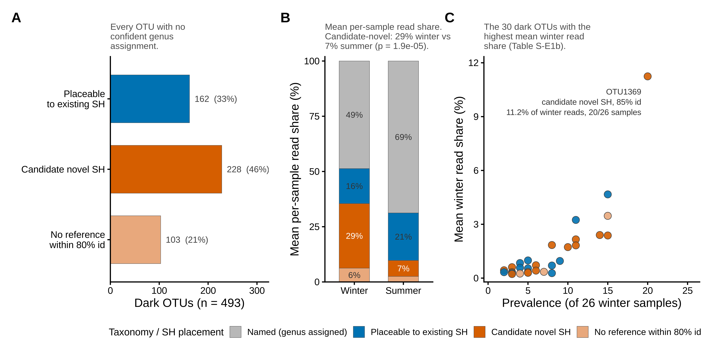

**Figure 5**: Winter dung is dominated by fungal lineages that carry no confident genus, and most of that fraction is not merely unnamed but absent from the reference database. **(A)** UNITE Species Hypothesis placement of all 493 dark OTUs — those the naïve-Bayes classifier leaves without a confident genus. The second and third categories are the same kind of outcome: neither falls inside an existing named Species Hypothesis, and they differ only in whether the sequence has any UNITE relative at all. "Candidate novel SH" has one (median best hit 92.0% identity across these 228 OTUs) and so inherits a partial lineage from its neighbours; "no reference within 80% id" has none, and additionally absorbs 13 OTUs that the pipeline filtered before the matching step. Together they are 331 of the 493 dark OTUs (67%). **(B)** Mean per-sample read share of the same categories, by season, with the named fraction added to reach 100% of reads (52 droppings, 26 per season; segments below 5% are unlabelled). This is the read-weighted counterpart to (A): counting OTUs says nothing about how much of a dropping they are. Candidate-novel lineages hold 29% of winter reads against 7% of summer reads (Wilcoxon *p* = 1.9 × 10⁻⁵), and the dark fraction as a whole is 51% of winter against 31% of summer reads. **(C)** The 30 dark OTUs with the highest mean winter read share (Table S-E1b), plotted as prevalence — the number of the 26 winter samples with any detection — against that mean share, coloured as in (A). OTU1369 is labelled: it is winter's single most abundant OTU at 11.2% of winter reads and is present in 20 of 26 winter droppings, yet its best UNITE hit is only 85% similar, so it forms a candidate new Species Hypothesis rather than matching anything named.

Roughly half of a typical winter dropping is reads that the canonical taxonomy cannot name (Section 3.4), and that single label covers two different problems. A little over a third of dark OTUs are near-identical to a UNITE reference and are dark only because `minBoot = 80` declines to commit to a genus at that bootstrap — a cost of conservatism, and one that Species Hypothesis matching largely recovers (of the 390 dark OTUs with a best hit at all, 37% sit at ≥ 99% identity; Figure S-E1a). But a comparable fraction of them (38%) sits below 95% identity, where no threshold adjustment would help, and panel A shows where that leads: 228 of the 493 dark OTUs (46%) form candidate new Species Hypotheses rather than matching an existing one, and a further 103 (21%) have no UNITE reference within 80% identity at all. Two thirds of the unnamed community is therefore unnamed because the reference lacks it, not because the classifier was cautious. Panel B supplies the weight behind that count, and it is strongly seasonal: candidate-novel lineages account for 29% of winter reads but only 7% of summer reads, so winter dung is not merely more dark than summer dung, it is dark in a different way — dominated by lineages with no named counterpart rather than by unnamed relatives of known ones. Panel C locates that signal in individual taxa: the dark OTUs carrying real winter read share are predominantly candidate-novel, and the most extreme of them, OTU1369, is simultaneously the most abundant and among the most prevalent OTUs in winter dung while being only 85% similar to its nearest named relative. One caveat travels with the figure throughout. "Candidate novel" is a statement about the reference database rather than a taxonomic claim: these are unimprinted clusters awaiting public sequence deposition and PlutoF registration (Section 3.4), so none of them yet carries a permanent identifier.

```{r fig5-build}
#| eval: false
#| echo: !expr knitr::is_html_output()
#| code-fold: true
#| code-summary: "Full build code for Figure 5 — the source of truth for figures/main/Fig5_dark_taxa_SH.{png,jpg,pdf}"

# Figure 5 -- Winter dung is dominated by unclassified, largely candidate-novel
# lineages (E1). Every quantity here is READ from committed tables/ CSVs written
# by 9_dark_taxa_SH_matching.R; nothing is recomputed from sequence data, because
# the SH assignment itself is the expensive external step (a Singularity run of
# the TU-NHM sh_matching pipeline against the UNITE reference, ~90 min).
#   A  tables/E1_SH_assignment_summary.csv     (the 493 dark OTUs' placement)
#   B  tables/E1_SH_readshare_by_sample.csv    (script 9 Section 4b, 52 samples)
#   C  tables/E1_winter_dominant_dark_taxa_SH.csv (top 30 by winter read share)
# tables/dark_taxa_SH_matching.csv is the per-OTU table all three are derived
# from; it is read here purely as a drift guard on A and C.
# Rebuild:  conda run -n r_env Rscript build_main_figure.R fig5-build

suppressPackageStartupMessages({
  library(ggplot2); library(patchwork)
})

tab_dir <- if (dir.exists("tables")) "tables" else
           "/home/daniel/Ptarmigan/Scripts_server/Supplementary/tables"
out_dir <- "figures/main"
dir.create(out_dir, showWarnings = FALSE, recursive = TRUE)
grDevices::pdf(NULL)                                 # headless: no X11 fallback

# ---- shared style ----------------------------------------------------------
# ONE colour dimension across all three panels, so every coloured mark in the
# figure means exactly one thing. Panels A and C show dark OTUs only and use the
# last three levels; panel B adds the named fraction to reach 100% of reads.
#
# "Candidate novel SH" and "No reference within 80% id" are the SAME kind of
# outcome -- neither falls inside an existing named SH -- and differ only in
# whether the sequence has any UNITE relative at all. The palette says so: the
# third level is a lightness tint of the second rather than an unrelated hue.
# (Lightness contrast survives every form of colour-vision deficiency, so the
# pair stays separable while still reading as one family.)
STRAT_LEVELS <- c("Named (genus assigned)", "Placeable to existing SH",
                  "Candidate novel SH", "No reference within 80% id")
strat_cols <- c("Named (genus assigned)"     = "#B8B8B8",   # not a dark OTU
                "Placeable to existing SH"   = "#0072B2",   # resolved
                "Candidate novel SH"         = "#D55E00",   # the novel signal
                "No reference within 80% id" = "#E8A87C")   # novel, no relative
SH_LEVELS <- STRAT_LEVELS[-1]                        # the dark-OTU categories

base_theme <- theme_classic(base_size = 12) +
  theme(strip.background = element_blank(),
        strip.text       = element_text(face = "bold"),
        plot.tag         = element_text(face = "bold", size = 14),
        plot.subtitle    = element_text(size = 9, colour = "grey30"),
        panel.spacing    = unit(0.8, "lines"),
        legend.key.size  = unit(0.42, "cm"),
        legend.title     = element_text(size = 10),
        legend.text      = element_text(size = 9))

# One scale object reused by all three panels: patchwork can only collect guides
# that are identical, so `limits` (not the data) fixes the key order everywhere.
fill_scale <- scale_fill_manual(values = strat_cols, name = "Taxonomy / SH placement",
                                limits = STRAT_LEVELS, drop = FALSE)

# All in-plot text is ASCII: save_fig() falls back to grDevices::pdf when cairo is
# unavailable, and that device silently substitutes a dot for a Unicode glyph.
# no_SH_match and excluded_nonITS collapse into one displayed category -- see the
# caption; Section 3.4 keeps them separate.
sh_class_map <- c(placeable_existing_SH = "Placeable to existing SH",
                  novel_new_SH          = "Candidate novel SH",
                  no_SH_match           = "No reference within 80% id",
                  excluded_nonITS       = "No reference within 80% id")

# ============================================================================
# Panel A -- where the 493 dark OTUs land
# ============================================================================
sh <- read.csv(file.path(tab_dir, "dark_taxa_SH_matching.csv"), stringsAsFactors = FALSE)
stopifnot(is.logical(sh$is_dark), !anyNA(sh$is_dark), nrow(sh) == 1129L,
          all(sh$SH_class %in% names(sh_class_map)))

asum <- read.csv(file.path(tab_dir, "E1_SH_assignment_summary.csv"), check.names = FALSE)
stopifnot(nrow(asum) == 1L)

# Tabulated from the per-OTU table rather than read off the summary's four
# fields, because two of those fields now collapse into one displayed bar.
dark_cat <- factor(unname(sh_class_map[sh$SH_class[sh$is_dark]]), levels = SH_LEVELS)
bdf <- data.frame(cat = factor(SH_LEVELS, levels = SH_LEVELS),
                  n   = as.integer(table(dark_cat)[SH_LEVELS]))
# Drift guard: the committed summary must still agree with the per-OTU table,
# both in total and in the merge that produces the third bar.
stopifnot(asum$n_dark == sum(sh$is_dark), sum(bdf$n) == asum$n_dark,
          sum(asum$placeable_existing_SH, asum$novel_new_SH,
              asum$no_SH_match, asum$excluded_nonITS) == asum$n_dark,
          bdf$n[3] == asum$no_SH_match + asum$excluded_nonITS)
bdf$pct <- 100 * bdf$n / asum$n_dark
bdf$cat <- factor(bdf$cat, levels = rev(SH_LEVELS))   # first category at the top

pA <- ggplot(bdf, aes(n, cat, fill = cat)) +
  geom_col(width = 0.68, colour = "grey30", linewidth = 0.15) +
  geom_text(aes(label = sprintf("%d  (%.0f%%)", n, pct)), hjust = -0.12,
            size = 3.1, colour = "grey25") +
  fill_scale +
  scale_x_continuous(expand = expansion(mult = c(0, 0.42))) +
  scale_y_discrete(labels = function(x) sub(" (to existing SH|within 80% id)",
                                            "\n\\1", x)) +
  labs(x = sprintf("Dark OTUs (n = %d)", asum$n_dark), y = NULL,
       subtitle = "Every OTU with no\nconfident genus\nassignment.") +
  base_theme +
  guides(fill = "none")

# ============================================================================
# Panel B -- how much of a dropping each stratum accounts for, by season
# ============================================================================
# Panel A counts OTUs, which says nothing about how much of the community they
# are; this panel is the read-weighted view and the one that carries the
# figure's claim. Written per sample by 9_dark_taxa_SH_matching.R Section 4b, so
# the mean and the test below come from the same committed file.
rs <- read.csv(file.path(tab_dir, "E1_SH_readshare_by_sample.csv"),
               stringsAsFactors = FALSE)
rs_map <- c("Named"                   = "Named (genus assigned)",
            "Dark: placeable"         = "Placeable to existing SH",
            "Dark: candidate novel"   = "Candidate novel SH",
            "Dark: no reference <80%" = "No reference within 80% id")
stopifnot(all(rs$stratum %in% names(rs_map)), all(rs$Season %in% c("winter", "summer")))
rs$cat <- factor(unname(rs_map[rs$stratum]), levels = STRAT_LEVELS)
# Compositional guard: the four strata must exhaust each sample's reads.
stopifnot(abs(tapply(rs$read_share, rs$sample, sum) - 1) < 1e-6,
          length(unique(rs$sample)) == 52L)

# Season is capitalised for display only; winter first because the figure's
# subject is the winter community.
rs$Season <- factor(sub("^(.)", "\\U\\1", rs$Season, perl = TRUE),
                    levels = c("Winter", "Summer"))
bar <- aggregate(read_share ~ Season + cat, data = rs, FUN = mean)
bar$pct <- 100 * bar$read_share
bar <- bar[order(bar$Season, bar$cat), ]
# Label positions are computed here rather than left to position_stack. The text
# layer plots a SUBSET (segments too thin to hold a label), and position_stack
# re-stacks whatever data it is given -- so the two layers would silently drift
# apart in any season where a segment is dropped. geom_col stacks the first
# factor level on top, hence the descending cumulative.
bar$ymid <- unlist(lapply(split(bar$pct, bar$Season), function(v)
  (sum(v) - cumsum(c(0, head(v, -1)))) - v / 2))
# Drift guard: these means must reproduce the per-OTU table's season columns,
# which are computed independently (script 9 Section 4, not 4b).
chk <- vapply(split(seq_len(nrow(sh)), factor(
                ifelse(sh$is_dark, unname(sh_class_map[sh$SH_class]),
                       "Named (genus assigned)"), levels = STRAT_LEVELS)),
              function(i) sum(sh$winter_mean_share[i]), numeric(1))
win <- setNames(bar$read_share[bar$Season == "Winter"],
                as.character(bar$cat[bar$Season == "Winter"]))
stopifnot(max(abs(chk[STRAT_LEVELS] - win[STRAT_LEVELS])) < 1e-6)

nov <- rs[rs$cat == "Candidate novel SH", ]
nov_p <- wilcox.test(read_share ~ Season, data = nov)$p.value
nov_m <- tapply(100 * nov$read_share, nov$Season, mean)

pB <- ggplot(bar, aes(Season, pct, fill = cat)) +
  geom_col(width = 0.62, colour = "grey30", linewidth = 0.15) +
  # Labelled inside the segment it belongs to; segments under 5% have no room,
  # and the axis already places them.
  geom_text(data = bar[bar$pct >= 5, ],
            aes(y = ymid, label = sprintf("%.0f%%", pct),
                colour = cat == "Candidate novel SH"),
            size = 3.0, show.legend = FALSE) +
  scale_colour_manual(values = c(`TRUE` = "white", `FALSE` = "grey20")) +
  fill_scale +
  # coord_cartesian, not scale limits: position_stack sums to 1 and the scale is
  # applied AFTER stacking, so a limit of exactly 100 drops the top segment on a
  # floating-point overshoot (ggplot2 4.0 warns "Removed 1 row").
  scale_y_continuous(breaks = seq(0, 100, 25), expand = expansion(mult = c(0, 0.02))) +
  coord_cartesian(ylim = c(0, 100)) +
  labs(x = NULL, y = "Mean per-sample read share (%)",
       subtitle = sprintf("Mean per-sample read share.\nCandidate-novel: %.0f%% winter vs\n%.0f%% summer (p = %s).",
                          nov_m[["Winter"]], nov_m[["Summer"]],
                          format(signif(nov_p, 2), scientific = TRUE))) +
  base_theme +
  # The figure's one legend lives here: panel B is the only one that carries all
  # four levels, and its geom_col draws square keys, which read correctly for
  # both the bars here and the points in C. A and C suppress theirs.
  guides(fill = guide_legend(order = 1, nrow = 1))

# ============================================================================
# Panel C -- the winter-abundant dark OTUs
# ============================================================================
# The committed top-30-by-winter-read-share table, so the panel's membership is a
# published definition rather than a threshold invented for the figure.
wd <- read.csv(file.path(tab_dir, "E1_winter_dominant_dark_taxa_SH.csv"),
               stringsAsFactors = FALSE)
stopifnot(nrow(wd) == 30L, all(wd$winter_n == 26L), all(wd$OTU_ID %in% sh$OTU_ID))
wd$cat <- factor(unname(sh_class_map[wd$SH_class]), levels = SH_LEVELS)
wd$share_pct <- 100 * wd$winter_mean_share
# Drift guard: this table must be the top 30 of the per-OTU table it came from.
top30 <- sh$OTU_ID[sh$is_dark][order(-sh$winter_mean_share[sh$is_dark])][1:30]
stopifnot(setequal(wd$OTU_ID, top30))

lab <- wd[wd$OTU_ID == "OTU1369", ]
stopifnot(nrow(lab) == 1L, lab$winter_occ == 20L)     # agrees with Fig. 4D
lab$txt <- sprintf("OTU1369\ncandidate novel SH, %.0f%% id\n%.1f%% of winter reads, %d/%d samples",
                   lab$similarity_percentage, lab$share_pct, lab$winter_occ, lab$winter_n)

pC <- ggplot(wd, aes(winter_occ, share_pct, fill = cat)) +
  geom_point(shape = 21, size = 3.2, colour = "grey25", stroke = 0.4, alpha = 0.9) +
  # Hung below-left of the marker rather than centred on it, so the point stays
  # visibly a data point instead of reading as punctuation inside the text.
  geom_text(data = lab, aes(label = txt), inherit.aes = FALSE,
            x = lab$winter_occ - 0.8, y = lab$share_pct - 0.7, hjust = 1, vjust = 1,
            size = 2.9, lineheight = 1.05, colour = "grey20") +
  fill_scale +
  scale_x_continuous(limits = c(0, 26), breaks = seq(0, 25, 5),
                     expand = expansion(mult = c(0.02, 0.02))) +
  scale_y_continuous(expand = expansion(mult = c(0.04, 0.10))) +
  labs(x = sprintf("Prevalence (of %d winter samples)", wd$winter_n[1]),
       y = "Mean winter read share (%)",
       subtitle = "The 30 dark OTUs with the\nhighest mean winter read\nshare (Table S-E1b).") +
  base_theme +
  guides(fill = "none")

# ---- assemble and write ----------------------------------------------------
# Explicit widths rather than nested `/` and `|`: patchwork FLATTENS a chain of
# `/`, so a mixed layout can silently become extra rows.
fig5 <- pA + pB + pC +
  plot_layout(nrow = 1, widths = c(1.1, 0.75, 1.5), guides = "collect") +
  plot_annotation(tag_levels = "A") &
  theme(legend.position = "bottom", legend.box = "horizontal")

# Every main figure is written three ways: PNG and JPG (600 dpi raster, for
# submission systems that demand one or the other) and PDF (vector, for print).
save_fig <- function(stem, obj, width, height, res = 600) {
  one <- function(open_dev) { open_dev(); on.exit(grDevices::dev.off()); print(obj) }
  one(function() grDevices::png(paste0(stem, ".png"), width = width, height = height,
                                units = "in", res = res))
  one(function() grDevices::jpeg(paste0(stem, ".jpg"), width = width, height = height,
                                 units = "in", res = res, quality = 95))
  pdf_dev <- if (capabilities("cairo")) grDevices::cairo_pdf else grDevices::pdf
  one(function() pdf_dev(paste0(stem, ".pdf"), width = width, height = height))
}
save_fig(file.path(out_dir, "Fig5_dark_taxa_SH"), fig5, 10, 5.0)

# ---- console summary -------------------------------------------------------
cat(sprintf("Dark OTUs (n = %d) by SH placement:\n", asum$n_dark))
print(data.frame(placement = SH_LEVELS,
                 n = bdf$n[match(SH_LEVELS, as.character(bdf$cat))],
                 pct = round(bdf$pct[match(SH_LEVELS, as.character(bdf$cat))], 1)),
      row.names = FALSE)
cat("\nMean per-sample read share (%), by season:\n")
print(round(100 * xtabs(read_share ~ cat + Season, data = bar), 2))
cat(sprintf("\nCandidate-novel read share: winter %.1f%% vs summer %.1f%%, Wilcoxon p = %.3g\n",
            nov_m[["Winter"]], nov_m[["Summer"]], nov_p))
cat("\nTop 10 winter-abundant dark OTUs:\n")
o <- order(-wd$share_pct)[1:10]
print(data.frame(OTU = wd$OTU_ID[o], class = sub("^c__", "", wd$Class[o]),
                 winter_pct = round(wd$share_pct[o], 2),
                 prevalence = sprintf("%d/%d", wd$winter_occ[o], wd$winter_n[o]),
                 id = wd$similarity_percentage[o],
                 placement = as.character(wd$cat[o])), row.names = FALSE)
```

::: {.content-visible when-profile="docs"}
#### Documentation notes — Section 10 {.unnumbered}

*Documentation build only; omitted from the submitted appendix. Move any paragraph, callout or table here that belongs in the full record rather than in the supplement.*
:::

------------------------------------------------------------------------

::: {.content-visible when-profile="docs"}
<!-- project status; not part of the submitted appendix -->

::: {.callout-note appearance="minimal"}
Sections 2–5 were regenerated end-to-end from the corrected canonical dataset (`4_data_prep.R`), which fixed a depth-filter bug in a previously saved workspace (three sub-10,000-read samples had been retained and rarefaction depth had silently collapsed to 2,975 reads). All finalized figures and tables use the corrected 52-sample canonical object (`alldat$nopool`), except the Section 3 taxonomic barplots, which use script 5's 57-sample unfiltered PCR-collapsed object as noted. Sections 6, 7.1–7.3, 9 (functional guilds), 10 (HMSC) and 11 (main-text figures) are integrated;
:::
:::
